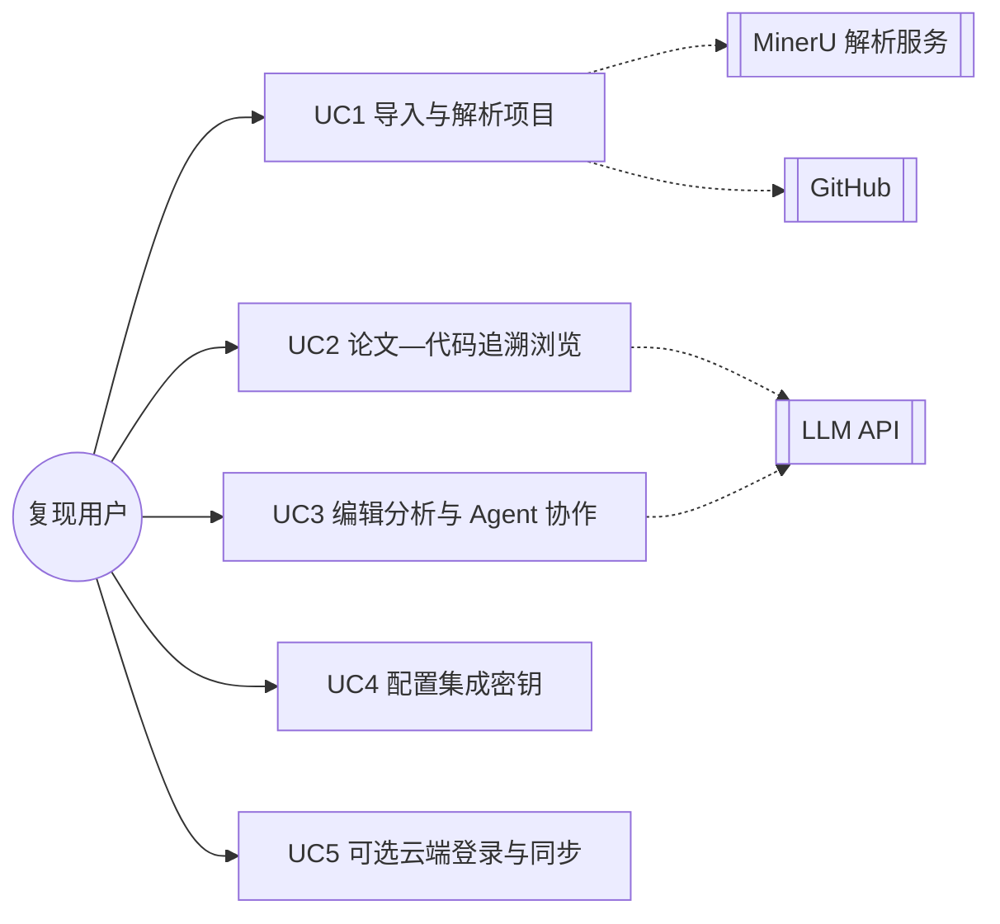
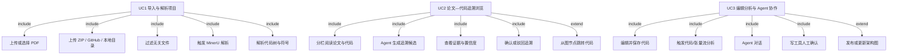
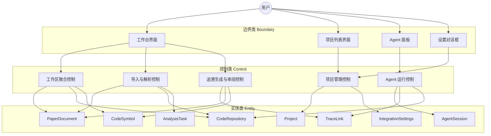
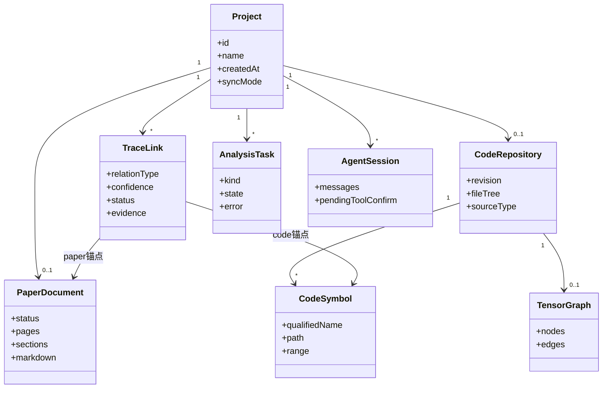
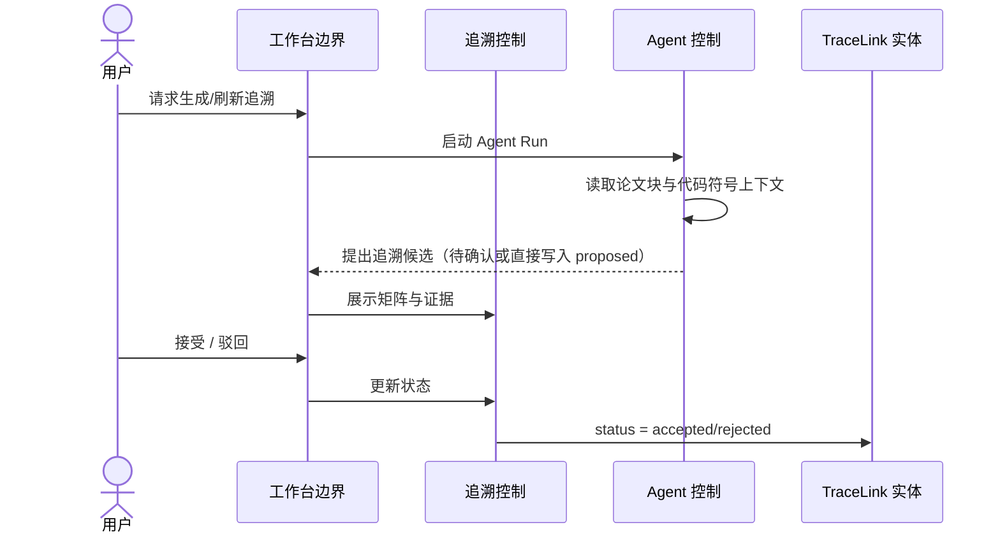
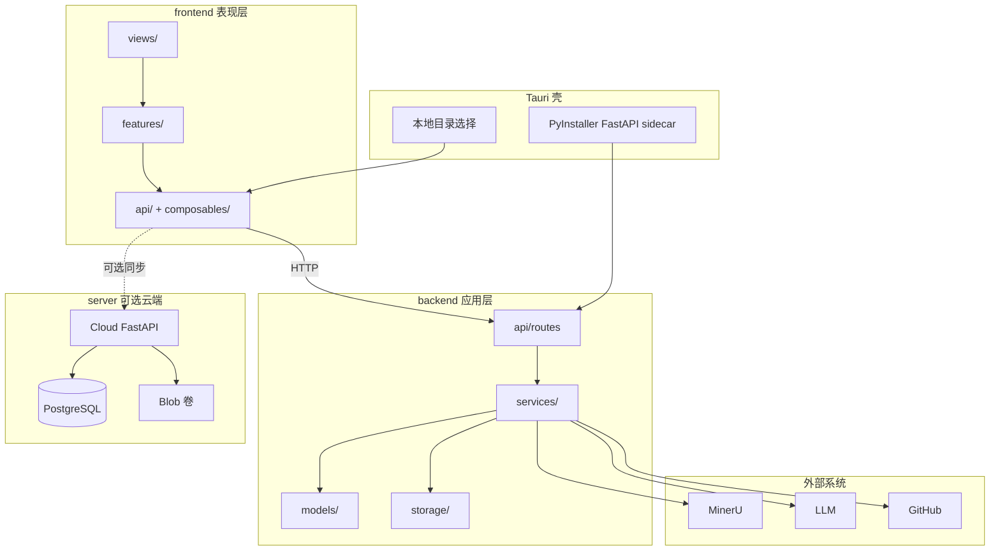
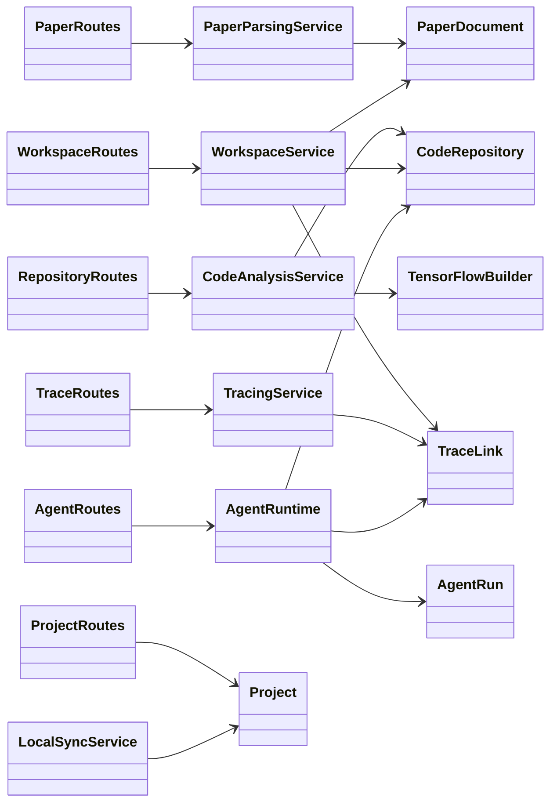
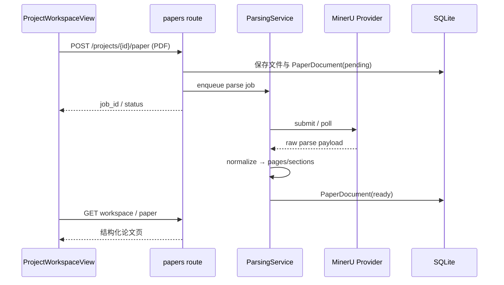
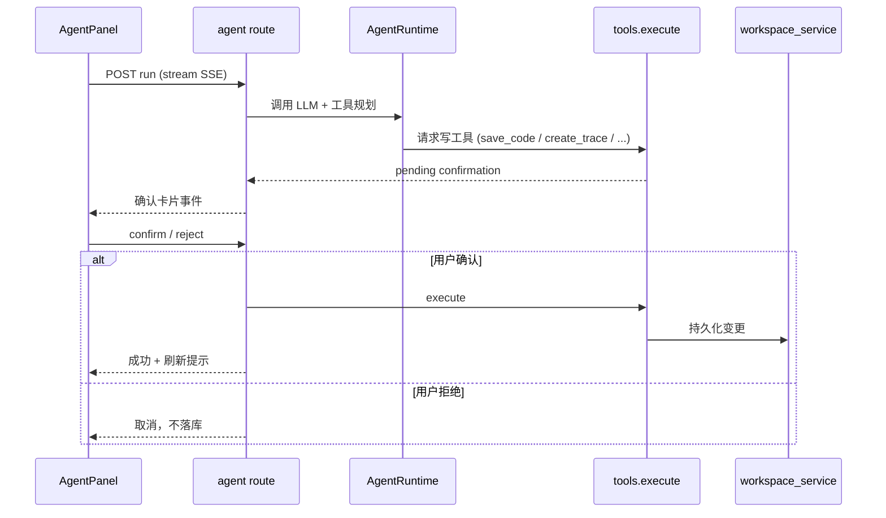
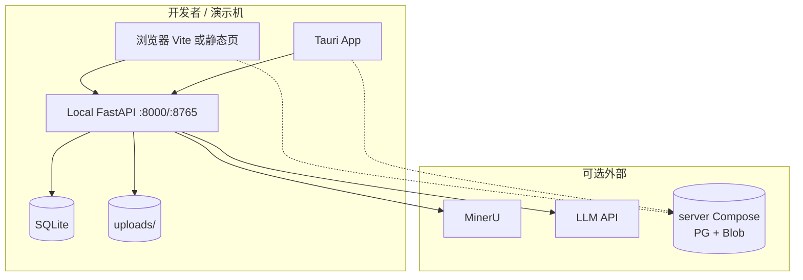

# TraceLab 技术原型 UML 模型

## 1. 用例模型（用例视图 / Use-Case View）

**视图说明：** 用例视图描述系统对外提供的业务能力与参与者交互边界，对应本迭代三条典型用例及支撑用例。

### 1.1 参与者与用例总图

### 1.2 用例关系（包含 / 扩展）

### 1.3 关键用例简述

| 用例 | 目标 | 前置 | 后置 |
|---|---|---|---|
| UC1 | 获得可浏览的论文结构与代码工作区 | 已创建项目 | PaperDocument / CodeRepository 可查 |
| UC2 | 得到可定位、可审阅的追溯候选 | 论文与代码已导入 | TraceLink 进入 proposed/accepted/rejected |
| UC3 | 在受控条件下修改代码并刷新分析/图 | 工作区可打开文件 | 新 revision；图/追溯可更新 |
| UC4 | 配置 MinerU / Agent API | 本地应用可写设置库 | 后续解析/Agent 可用 |
| UC5 | （可选）登录后按项目同步 | 用户主动启用 | sync_mode 变更；本地仍可离线 |

---

## 2. 分析模型（分析视图 / Analysis Model）

**视图说明：** 分析模型用边界—控制—实体（BCE / 健壮性风格）表达问题域对象与职责，不绑定具体框架类名。

### 2.1 健壮性分析（导入—追溯—Agent 主路径）

### 2.2 分析类图（核心领域）

### 2.3 分析层时序（用例 2 摘要）

---

## 3. 设计模型

### 3.1 分层包图（逻辑 / 开发视图）

### 3.2 设计类图

### 3.3 设计时序图：PDF 上传与 MinerU 解析（用例 1）

### 3.4 设计时序图：Agent 写操作确认（用例 3）

### 3.5 部署 / 运行视图

