# TraceLab UML 模型（对照当前实现）

**版本：2.0**  
**日期：2026-07-31**  
**说明：** 用例 / 分析 / 设计模型与仓库源码一致；云端只含账号与同步，不含分析。

---

## 1. 用例模型（Use-Case View）

### 1.1 参与者与用例总图

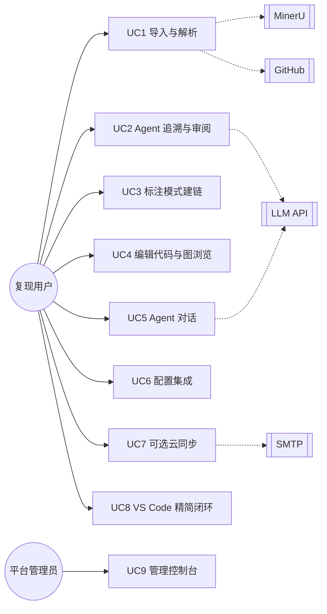

### 1.2 用例关系

```mermaid
flowchart TB
  UC1[UC1 导入与解析]
  UC1 -->|include| UC1a[上传 PDF]
  UC1 -->|include| UC1b[ZIP / GitHub 导入]
  UC1 -->|include| UC1c[MinerU 异步解析]
  UC1 -->|include| UC1d[AST 分析与张量图]

  UC2[UC2 Agent 追溯与审阅]
  UC2 -->|include| UC2a[协调器触发分析任务]
  UC2 -->|include| UC2b[四阶段取证发布]
  UC2 -->|include| UC2c[证据校验落库]
  UC2 -->|include| UC2d[双向高亮与矩阵审阅]
  UC2 -->|extend| UC2e[深度思考置信度]
  UC2 -->|extend| UC2f[RAG 加速定位]

  UC3[UC3 标注模式]
  UC3 -->|include| UC3a[选论文并可切换]
  UC3 -->|include| UC3b[选代码并可切换]
  UC3 -->|include| UC3c[填表创建 TraceLink]

  UC5[UC5 Agent 对话]
  UC5 -->|include| UC5a[SSE Run]
  UC5 -->|include| UC5b[写工具人工确认]
```

### 1.3 关键用例简述

| 用例 | 目标 | 前置 | 后置 |
|---|---|---|---|
| UC1 | 论文结构与代码工作区可用 | 已建项目 | PaperDocument / CodeRepository 可查 |
| UC2 | 得到可审阅的 Agent 追溯 | 论文+代码就绪；建议已配 Provider | TraceLink proposed/accepted/rejected；无 Provider 则等待 |
| UC3 | 手工追加一条关系 | 标注模式开启 | 新 TraceLink（manual） |
| UC4 | 编辑代码、浏览图 | 仓库已分析 | revision 递增；旧追溯可 stale |
| UC5 | 对话协助理解/修改 | Provider 可用 | Run 审计；写操作经确认 |
| UC6 | 配置 MinerU / LLM / RAG | 应用可写设置库 | 后续解析/Agent/检索可用 |
| UC7 | 登录后按项目同步 | 用户主动启用 | sync_mode 变更；分析仍在本地 |
| UC8 | 在 VS Code 内完成精简闭环 | 已装扩展 | `.tracelab/` 产物 |
| UC9 | 运维账号与配额 | 管理员账号 | 审计日志；不读项目正文 |

---

## 2. 分析模型（Analysis Model）

### 2.1 健壮性分析（导入 → 追溯 → 审阅）

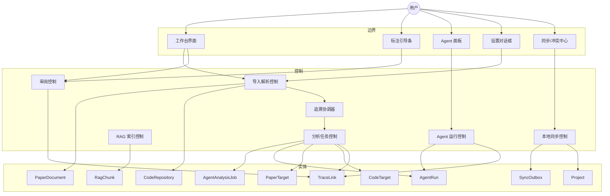

### 2.2 分析类图（核心领域）

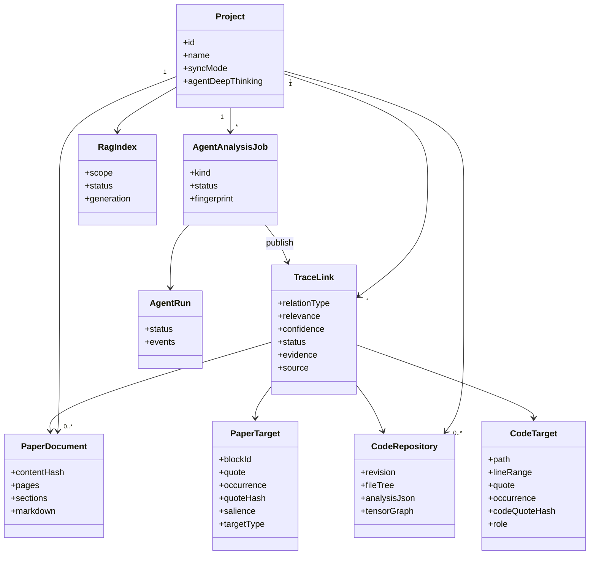

### 2.3 分析时序：Agent 追溯发布

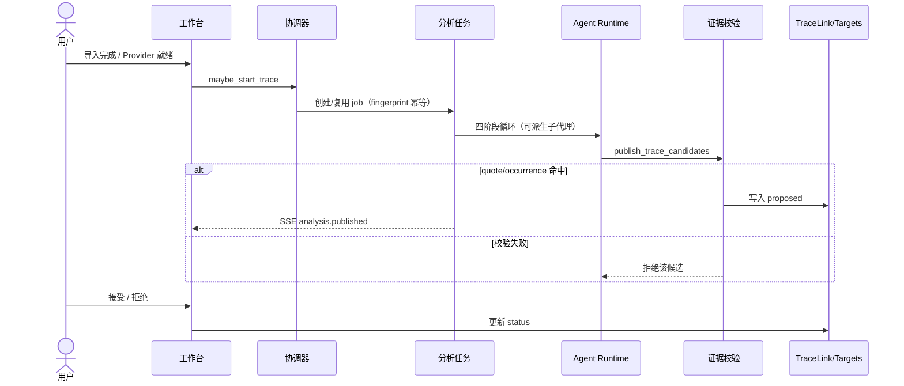

---

## 3. 设计模型

### 3.1 分层包图

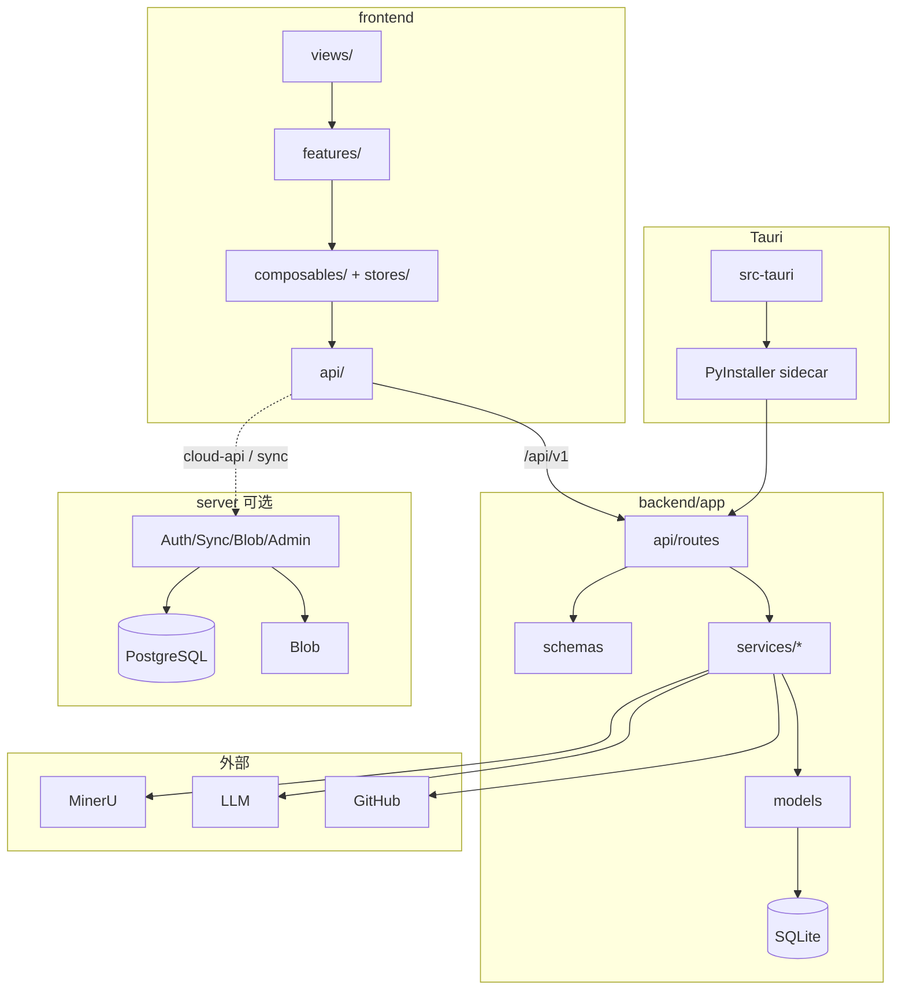

### 3.2 设计类图（后端核心服务）

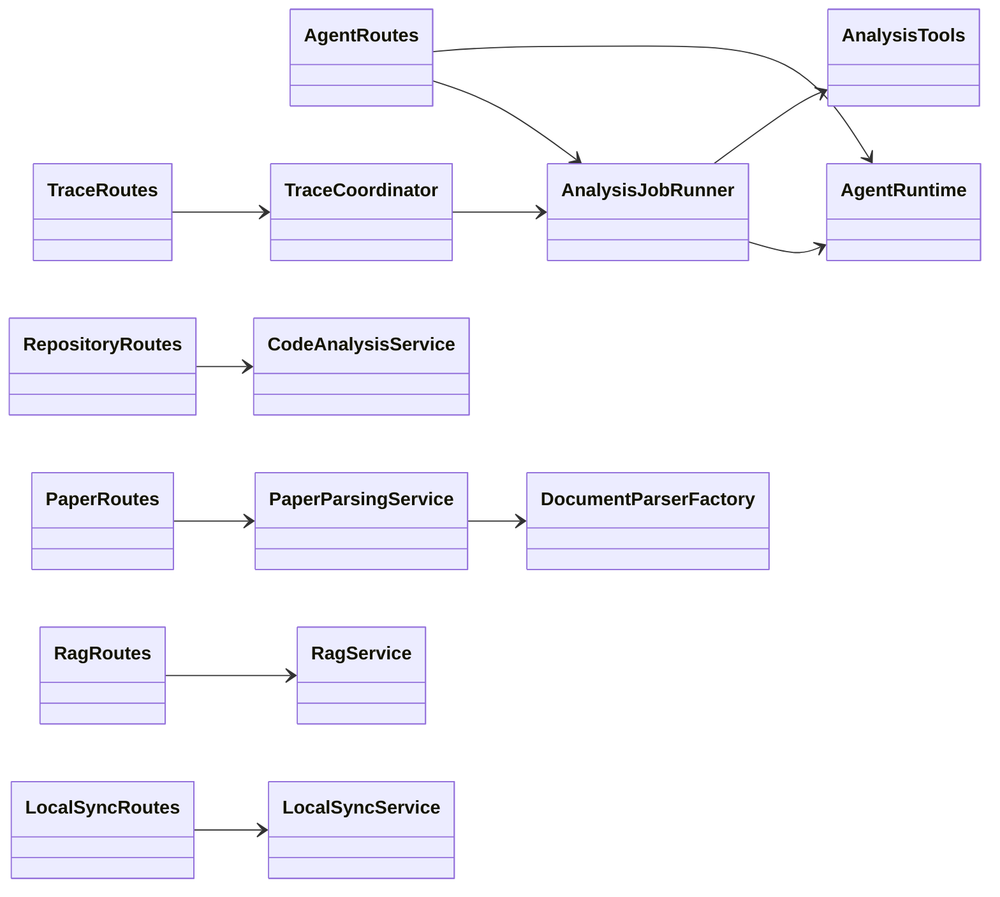

### 3.3 设计时序：PDF 解析

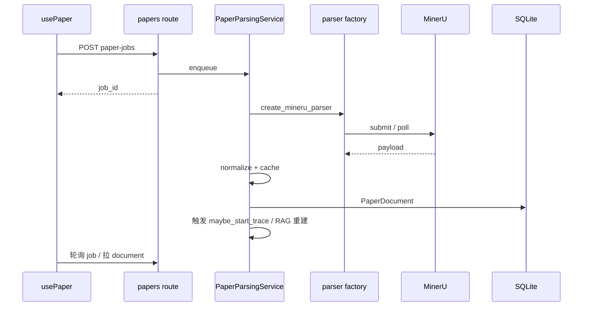

### 3.4 设计时序：Agent 写工具确认

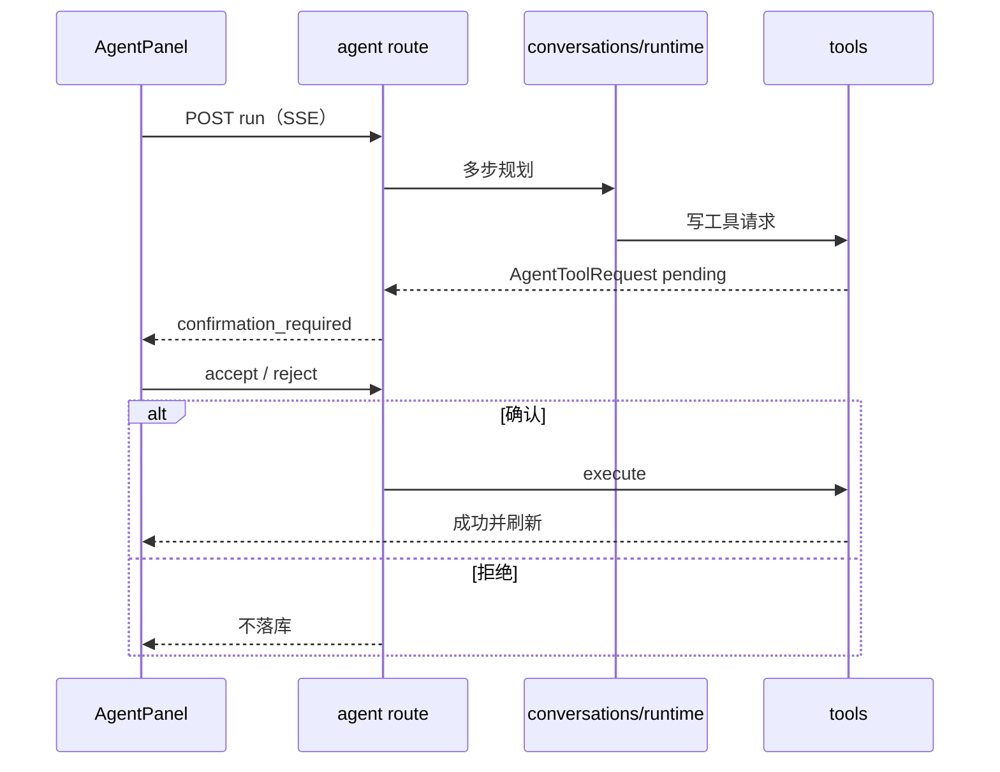

### 3.5 部署 / 运行视图

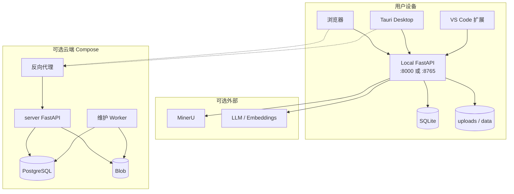

**边界硬约束：** `Worker` / `CloudAPI` 不做 MinerU、AST、LLM、Agent；这些只发生在 `LocalAPI`（或扩展捆绑运行时）。

---

## 4. 状态机摘录

### 4.1 TraceLink 状态

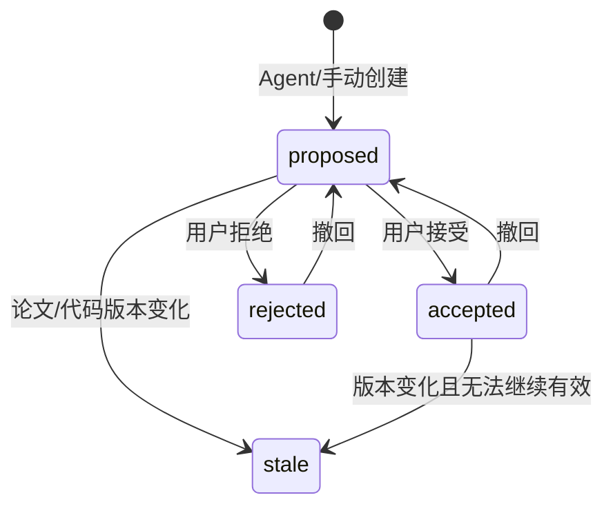

### 4.2 标注模式步骤

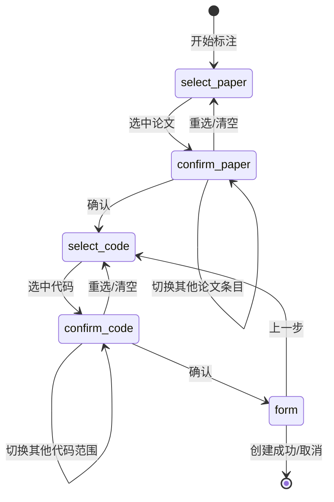

---

## 5. 与源码映射（便于验收抽查）

| 模型元素 | 主要源码 |
|---|---|
| 用例 UC2 | `services/tracing/coordinator.py`、`services/agent/analysis_jobs.py` |
| 证据校验 | `services/agent/analysis_tools.py` |
| 子代理 | `services/agent/subagents.py` |
| 标注模式 | `frontend/src/stores/annotation.ts`、`AnnotationGuide.vue` |
| RAG | `services/rag/*`、`routes/rag.py` |
| 云同步 | `server/tracelab_server/*`、`services/local_sync.py` |
| Desktop | `frontend/src-tauri`、`scripts/build-backend-sidecar.mjs` |
