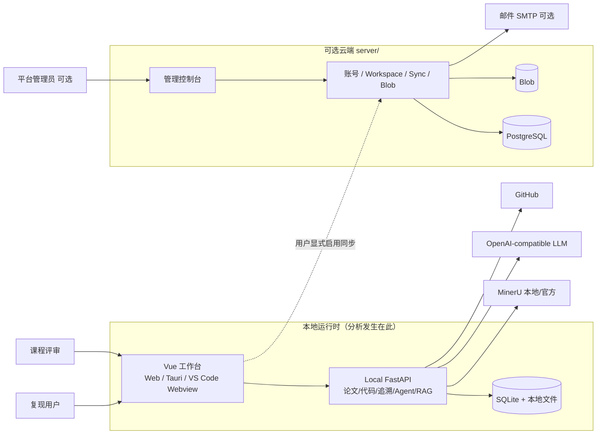

# TraceLab：面向深度学习论文复现的论文—代码双向追溯工作台

**前景文档**  
**版本：2.0（按当前实现修订）**  
**日期：2026/07/31**  
**单位：SJTU · 15 组**  
**状态：最终发布对照稿**

---

## 修订历史记录

| 日期 | 版本 | 说明 | 作者 |
|---|---:|---|---|
| 2026/07/06 | 1.0 | 根据项目申报与旧版 Vision 模板完成初稿 | 项目组 |
| 2026/07/09 | 1.1 | 按课程简化模板重整结构 | 项目组 |
| 2026/07/31 | 2.0 | 按仓库当前实现全面修订：双运行壳、Agent 追溯主路径、标注模式、RAG、可选云同步、VS Code 扩展；纠正「关键词降级」「云端跑分析」等过时表述 | 项目组 |

---

## 目录

1. 简介  
2. 定位  
3. 涉众和用户说明  
4. 产品概述  
5. 产品特性  
6. 约束  
7. 质量属性  
8. 优先级  
9. 其他产品需求  
10. 文档需求  

---

# 1. 简介

### 1.1 目的

本文档定义 **TraceLab** 的高层次需求与产品特性：要解决的问题、目标用户、核心价值、主要功能、约束与质量属性。读者包括项目组成员、课程教师/助教、潜在用户，以及架构、测试与验收文档的编写者。

本文不展开算法细节或数据库字段，作为功能建模与系统设计的共同依据。**能力描述以仓库当前实现为准**，未完成项单独标明。

### 1.2 范围

TraceLab 是**本地优先**的论文—代码双向追溯工作台，提供三种使用入口：

1. **Web**：浏览器 + 本地 FastAPI；  
2. **Desktop**：Tauri 2 壳 + 打包后端 sidecar（同一套 Vue 前端）；  
3. **VS Code 扩展**：工作区 `.tracelab/` 存储的精简闭环（解析 / 分析 / Agent 追溯 / 矩阵 / 张量图）。

核心闭环：

1. 创建项目，导入论文 PDF 与代码（ZIP / GitHub）。  
2. MinerU 结构化解析论文；本地 AST 分析 Python/PyTorch 仓库并生成张量流/架构图。  
3. 条件就绪后，Agent 自动（或手动）生成带双侧精确证据的追溯候选。  
4. 用户在分栏工作台中双向悬停/跳转、审阅（接受/拒绝）、或用标注模式手工建链。  
5. 可选：配置 OpenAI-compatible LLM、RAG、云账号同步；Desktop 额外提供终端与 Python LSP。

**明确不做或未完成：**

- 不执行用户仓库代码做动态张量验证（无沙箱运行时）。  
- 不以关键词/静态规则在无 LLM 时伪造追溯结果。  
- 云端服务器**不**运行 MinerU、代码分析、LLM 或 Agent。  
- 复现报告**文件导出**尚未完成（仅有汇总读接口）。  
- 多语言深度语义分析、完整多租户 SaaS 非目标。

### 1.3 定义、首字母缩写词和缩略语

| 术语 | 定义 |
|---|---|
| TraceLab | 本产品：论文—代码双向追溯工作台。 |
| 论文—代码追溯 | 在论文片段（公式、算法、方法句等）与代码片段之间建立可跳转、可解释、可审阅的关联。 |
| PaperTarget / CodeTarget | 片段级锚点：精确 quote、出现次数（occurrence）、内容 hash。 |
| TraceLink | 一条原子追溯边，连接一个论文目标与一个代码目标，含 relevance、confidence、证据与状态。 |
| Agent 追溯 | 由分析任务驱动的多阶段取证：侦察 → 代码制图 → 区域取证 → 归并发布；本地校验后落库。 |
| 标注模式 | 用户引导式手工建链：选论文 → 确认 → 选代码 → 填关系信息。 |
| RAG | 论文/代码/已复核追溯的语义检索加速层；排序只导航，不能代替读原文发结论。 |
| 本地优先 | 默认数据在本机 SQLite 与文件；云同步须用户显式启用。 |
| Sidecar | Desktop 内随应用打包的 FastAPI 后端进程。 |

### 1.4 参考资料

1. 仓库 `README.md`、`docs/architecture.md`、`docs/contracts/*.md`  
2. `docs/trace/agent-bidirectional-tracing-architecture.md`  
3. `docs/cloud-sync-architecture.md`、`server/README.md`  
4. `FinalRelease/测试与缺陷修复计划_TraceLab.md`  
5. 课程 Vision 简化模板  

---

# 2. 定位

### 2.1 商机

论文复现需要同时读 PDF、逛仓库、对齐公式与实现。现有工具割裂：PDF 阅读器不管代码，IDE 不懂论文，通用大模型难沉淀可审阅的项目级关系。TraceLab 把导入、解析、取证、审阅放进同一工作台，并把「猜」和「证」分开。

### 2.2 问题说明

| 项目 | 说明 |
|---|---|
| 问题是 | 论文与开源代码之间缺少可视化、可解释、可审阅、可版本失效的双向追溯。 |
| 影响 | 复现学生、科研人员、算法工程师、课程审阅者。 |
| 后果 | 手工搜索成本高，易漏实现、误解形状/损失，过程难沉淀。 |
| 成功方案 | 本地工作台 + Agent 证据化追溯 + 人工审阅/标注 + 可选云同步；失败时明确提示，不造假结果。 |

### 2.3 产品定位说明

| 项目 | 说明 |
|---|---|
| 针对于 | 需要复现、理解或改造深度学习论文代码的用户。 |
| 该产品 | TraceLab：本地优先的论文—代码双向追溯工作台。 |
| 属于 | 面向论文复现的智能阅读与代码分析平台。 |
| 功能 | 论文解析、代码分析、Agent 追溯、双向高亮、审阅、标注、RAG、张量流、可选云同步、Desktop/VS Code 入口。 |
| 不同于 | 纯 PDF 阅读器、普通 IDE、仅聊天的大模型工具、关键词检索脚本。 |
| 我们的产品 | 以复现任务为中心，强制双侧证据与本地校验，人做最终决策。 |

---

# 3. 涉众和用户说明

### 3.1 涉众和用户概要

| 名称 | 说明 | 角色 |
|---|---|---|
| 项目组成员 | 设计、实现、测试、演示、文档 | 交付与维护 |
| 课程教师 / 助教 | 过程指导与验收 | 评价标准与评分 |
| 复现用户 | 导入论文/代码，审阅追溯，使用 Agent | 核心终端用户 |
| 评审用户 | 查看演示与结果 | 审阅者 |
| 平台管理员（可选云） | 用户/配额/审计；默认不读项目正文 | 运维 |
| GitHub | 代码导入来源 | 外部系统 |
| MinerU | 论文 PDF 结构化解析 | 外部/本地服务 |
| OpenAI-compatible LLM | Agent 与可选远程嵌入 | 可选外部服务 |

### 3.2 备选方案和竞争

| 方案 | 局限 | TraceLab 差异 |
|---|---|---|
| 普通 IDE / VS Code | 不懂论文结构与公式锚点 | 跨模态追溯；扩展提供精简闭环 |
| PDF 阅读器 / GitHub 网页 | 无统一数据模型与审阅状态 | 项目级关系图 + 状态机 |
| 通用大模型聊天 | 难绑定精确行号/块，难沉淀 | 工具取证 + 服务端 quote 校验 + 人工确认写操作 |
| 关键词 / 静态重叠脚本 | 同名误报、换名漏报 | Agent 语义判断；无 Provider 不造假 |

---

# 4. 产品概述

用户创建项目后导入 PDF 与代码。本地完成后台解析与分析；配置 Agent Provider 后，协调器自动启动追溯任务，分批发布 `proposed` 关系。工作台左侧论文、右侧代码、底部矩阵/张量流：悬停双向高亮，可接受/拒绝，也可用标注模式手工建链。可选登录云端，按项目启用同步；分析始终在本机。

### Context Diagram

### 主要接口关系

| 外部对象 | 交互 | 形式 |
|---|---|---|
| 复现用户 | 项目、导入、审阅、标注、Agent、设置 | Web / Desktop / VS Code |
| GitHub | 导入公开仓库 ZIP | HTTPS |
| MinerU | PDF 解析任务 | HTTP（本地或官方） |
| LLM | Agent Run / 可选 embeddings | OpenAI-compatible API |
| 云端 server | 账号、同步、Blob | HTTPS；可选 |
| 本地存储 | 元数据与上传物 | SQLite + 文件系统 |

---

# 5. 产品特性

### 5.1 项目与双运行壳

创建/管理多个复现项目。同一前端可运行于浏览器（Vite 代理本地 API）或 Tauri Desktop（sidecar）。Desktop 提供本机终端（PTY）与 basedpyright LSP。

### 5.2 论文导入与结构化解析

上传 PDF；MinerU（本地服务或官方 API）异步解析，规范化为章节、段落、页、Markdown 与资源；内容哈希缓存。

### 5.3 代码导入与静态分析

ZIP 安全解压（路径/大小/symlink 限制）或 GitHub 导入；Python AST 提取符号、import、调用与 PyTorch 结构；生成文件树与分析快照；大仓库后台任务。

### 5.4 张量流与架构图

基于静态分析生成可交互架构/张量语义图，支持下钻与跳转代码。与追溯 Agent 解耦：图失败不阻断追溯。

### 5.5 Agent 驱动的论文—代码双向追溯（核心）

- 论文与代码就绪且 Provider 可用时，协调器自动创建分析任务。  
- 四阶段：论文侦察 → 代码制图 → 区域取证（可并行子代理）→ 归并发布。  
- 发布前本地校验双侧 quote / occurrence / hash；失败则丢弃候选。  
- 持久化为 PaperTarget—TraceLink—CodeTarget；正向与反向共享同一事实。  
- 无 Provider：**等待**，不写入关键词伪装结果。

### 5.6 双向浏览与审阅

常驻高亮 `proposed` / `accepted`；悬停对侧定位；矩阵批量接受/拒绝/撤回；版本变化标记 `stale`；重跑默认不覆盖人工决策。

### 5.7 手动标注模式

引导式三步：选论文（确认前可切换）→ 选代码（确认前可切换）→ 填写关系类型、置信度与描述并创建。

### 5.8 匹配分数与深度思考

默认三分：`salience`（目标重要性）、`relevance`（实现相关度）、`confidence`（把握）。项目可开启深度思考：六维加权 + 减分项由服务端计算 confidence。

### 5.9 Agent 对话与写操作确认

多轮 Run、SSE 进度、Skill/MCP 能力注册。保存代码、创建/更新追溯等写工具须人工确认。

### 5.10 RAG 语义检索

论文块 / 代码符号 / 已复核追溯三域索引；默认本地离线嵌入，可切远程；仅加速定位，Agent 仍须精读原文。

### 5.11 集成设置

应用内配置 Agent API、MinerU、RAG；密钥不回传前端。

### 5.12 可选云端账号与同步

独立 `server/`：注册登录、Workspace、按项目启用同步、Blob、维护 Worker、管理控制台。项目默认 `local_only`。云端**不做**解析/分析/Agent。

### 5.13 VS Code 扩展

VSIX 捆绑无头运行时；侧栏工作流与底栏矩阵/张量图；密钥用 SecretStorage。能力为桌面工作台的精简子集。

### 5.14 已知缺口

| 特性 | 状态 |
|---|---|
| 复现报告文件导出 | 未完成（有 summary 读接口） |
| 冲突/魔改影响完整算法 | 部分（有面板与 Agent conflict 任务入口） |
| 动态运行张量验证 | 不做 |
| 关键词静态追溯写入 | 已退役 |

---

# 6. 约束

1. **课程周期**：优先可演示的证据化追溯闭环。  
2. **技术栈**：Vue 3 + TS + Vite + Element Plus + CodeMirror 6；FastAPI + SQLModel；Tauri 2；可选 PostgreSQL 云端。  
3. **语言范围**：深度分析以 Python/PyTorch 为主。  
4. **PDF 质量**：依赖 MinerU；公式/图提取不稳定时标 unresolved，不强行关联。  
5. **LLM 依赖**：未配置时本地分析仍可用，追溯不造假。  
6. **安全**：项目隔离存储；写操作确认；ZIP 路径防护；密钥 SecretStr。  
7. **隐私**：远程 LLM 会外发所选片段；设置中明示；云同步须用户确认。  
8. **部署**：本地演示为主；云端 Compose 可选。

---

# 7. 质量属性

| 属性 | 要求 |
|---|---|
| 易用性 | 导入流程清晰；引导式标注；状态与错误可理解 |
| 可理解性 | 展示理由、相关度、置信度与双侧证据 |
| 性能 | 常规浏览秒级；Agent/大模型耗时单独展示 |
| 可靠性 | 解析/Agent 失败有原因；进程重启可恢复任务 |
| 可维护性 | 领域契约拆分；接口层与服务层分离 |
| 可扩展性 | 解析器/嵌入/LLM/MCP 可替换；Skill 可扩展 |
| 安全性 | 确认门禁、路径沙箱、密钥不回传、云端 RBAC |
| 兼容性 | Chrome / Edge / Firefox；macOS Desktop；VS Code 1.85+ |
| 可审阅性 | 关系状态、审阅事件、Run 审计可追溯 |

---

# 8. 优先级（对照当前交付）

| 优先级 | 特性 | 当前状态 |
|---|---|---|
| P0 | 项目管理、论文解析、代码分析、分栏工作台 | 已交付 |
| P0 | Agent 证据化追溯 + 审阅状态机 | 已交付 |
| P0 | Desktop 打包运行 | 已交付 |
| P1 | 标注模式、双向高亮、分数三分/深度思考 | 已交付 |
| P1 | RAG、集成设置、写操作确认 | 已交付 |
| P1 | 可选云同步 | 已交付（部署可选） |
| P1 | 报告文件导出 | **未完成** |
| P2 | VS Code 扩展 | 已交付精简版 |
| P2 | 冲突分析完善 | 部分 |
| P3 | 动态运行验证、多语言深度分析、生产级多租户 | 不做或远期 |

---

# 9. 其他产品需求

### 9.1 标准与接口

- 本地与云端 REST + OpenAPI；Agent/分析进度用 SSE。  
- 领域契约见 `docs/contracts/*.md`。  

### 9.2 系统需求（实现栈）

| 类别 | 技术 |
|---|---|
| 前端 | Vue 3、TypeScript、Vite、Pinia、Element Plus、CodeMirror 6、Axios |
| Desktop | Tauri 2、PyInstaller sidecar、xterm + PTY、basedpyright LSP |
| 本地后端 | Python 3.11+、FastAPI、SQLModel、SQLite、Alembic |
| 论文 | MinerU 本地 / 官方 API |
| 代码 | 自研 AST 分析与安全归档 |
| 智能 | OpenAI-compatible Chat；AgentSkills / MCP；RAG（local hashing / remote / LanceDB 等按配置） |
| 云端 | 独立 FastAPI + PostgreSQL + Blob + Worker + 管理台（Compose） |

### 9.3 环境需求

1. Web 开发：本机起 backend + frontend。  
2. Desktop：构建后用户无需自装 Python/Node。  
3. Agent：需用户自备 API Key。  
4. 云同步：需部署 `server/` 并配置域名与 SMTP（演示可跳过）。  

---

# 10. 文档需求

1. **README**：启动、配置、演示闭环。  
2. **架构与契约**：`docs/architecture.md`、`docs/contracts/*`。  
3. **FinalRelease**：本 Vision、软件架构、UML、测试报告与缺陷清单。  
4. **联机提示**：设置页说明密钥与远程调用；标注引导条说明当前步骤；无 Provider 时明确等待原因。  

---

**文档结束**
