# TraceLab 论文代码双向追溯工作台

# 软件架构文档

**版本：2.3**

**日期：2026/07/20**

**单位：15组**

---

## 修订历史记录

| 日期 | 版本 | 说明 | 作者 |
|---|---:|---|---|
| 2026/07/17 | 1.0 | 初版多视图架构文档 | 15组 |
| 2026/07/17 | 2.0 | 修订为最终完整架构：纳入账号体系、云端服务、本地—云端同步与多租户模型 | 15组 |
| 2026/07/17 | 2.1 | 补充可选登录、未登录本地存储、登录后按项目/数据类型自选同步范围 | 15组 |
| 2026/07/17 | 2.2 | 补充代码云端存储：基线引用 + 内容寻址文件树 + 稀疏变更 overlay | 15组 |
| 2026/07/20 | 2.3 | 说明可选视图的取舍，并调整部分表述 | 15组 |

---

## 目录

1. [简介](#1-简介)
2. [用例视图](#2-用例视图)
3. [逻辑视图](#3-逻辑视图)
4. [部署视图](#4-部署视图)
5. [进程视图](#5-进程视图)
6. [实现视图](#6-实现视图)
7. [技术视图](#7-技术视图)
8. [数据视图](#8-数据视图)
9. [算法视图](#9-算法视图)
10. [性能视图](#10-性能视图)
11. [可靠性视图](#11-可靠性视图)
12. [安全性视图](#12-安全性视图)
13. [易用性视图](#13-易用性视图)
14. [可维护性视图](#14-可维护性视图)

---

# 1. 简介

## 1.1 目的

本文档说明 TraceLab 的软件架构，包括账号与云端服务、本地工作台、多设备同步、论文解析、代码分析、追溯审阅和 Agent 辅助等功能的模块划分、部署方式、数据组织、主要流程与质量属性设计。

文档以项目计划完成时的系统为范围。当前仓库已经实现本地工作台、论文解析、代码分析、追溯与 Agent 等主要功能；账号登录、云端 API、按项目同步和平台管理仍在设计阶段，本文同时给出这些模块的边界与接口。

账号与同步遵循以下产品约束：

- **登录可选**：用户不注册、不登录也能直接使用软件；历史项目、解析结果、追溯关系、Agent 对话和张量流图等数据保存在本地 SQLite，不依赖云端。
- **按项目同步**：登录后由用户勾选需要上云的项目；未勾选的项目保持 `local_only`，不会自动上传。
- **按数据类型同步**：每个已启用同步的项目可以继续选择同步范围，包括论文解析结果、追溯结果、Agent 对话、张量流图和 Agent 记忆等；未勾选的数据仍保留在本地。
- **退出不删除本地数据**：用户退出登录后仍可使用本地项目，再次登录时可以重新选择同步内容。

本文档的主要读者包括：

- 项目组成员：详细设计、编码实现、迭代拆分；
- 课程教师 / 助教：架构评审与验收；
- 后续开发者 / 大模型代码生成工具：生成 Cloud API、Local API、Sync Client、Auth 模块的上位约束。

## 1.2 架构总览

TraceLab 采用 **本地优先 + 账号可选 + 按项目自选同步 + 多租户 Workspace** 的混合架构：

**图 1：TraceLab 系统总体架构图**

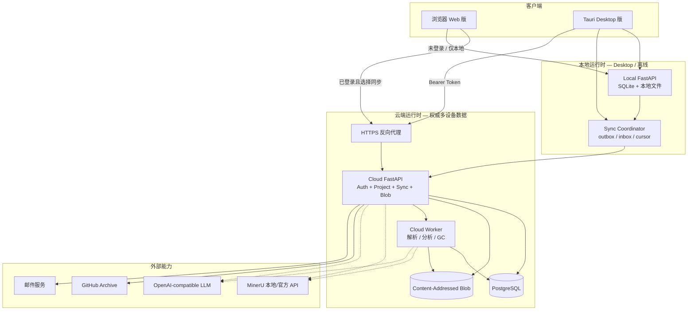
```mermaid
flowchart TB
  subgraph Clients[客户端]
    Browser[浏览器 Web 版]
    Desktop[Tauri Desktop 版]
  end

  subgraph LocalRuntime[本地运行时 — Desktop / 离线]
    LocalAPI[Local FastAPI\nSQLite + 本地文件]
    SyncCoord[Sync Coordinator\noutbox / inbox / cursor]
  end

  subgraph CloudRuntime[云端运行时 — 权威多设备数据]
    Proxy[HTTPS 反向代理]
    CloudAPI[Cloud FastAPI\nAuth + Project + Sync + Blob]
    Worker[Cloud Worker\n解析 / 分析 / GC]
    PG[(PostgreSQL)]
    Blob[(Content-Addressed Blob)]
  end

  subgraph External[外部能力]
    MinerU[MinerU 本地/官方 API]
    LLM[OpenAI-compatible LLM]
    GitHub[GitHub Archive]
    SMTP[邮件服务]
  end

  Browser -->|已登录且选择同步| Proxy
  Browser -->|未登录 / 仅本地| LocalAPI
  Desktop --> LocalAPI
  Desktop --> SyncCoord
  Desktop -->|Bearer Token| Proxy
  SyncCoord --> CloudAPI
  Proxy --> CloudAPI
  CloudAPI --> PG
  CloudAPI --> Blob
  CloudAPI --> Worker
  Worker --> PG
  Worker --> Blob
  LocalAPI --> SyncCoord
  CloudAPI -.-> MinerU
  Worker -.-> MinerU
  CloudAPI -.-> LLM
  Worker -.-> LLM
  CloudAPI --> GitHub
  CloudAPI --> SMTP
```

架构设计遵循以下原则：

1. **本地可独立工作**：未登录时，Desktop/Web 本地模式仍可使用；项目历史默认写入本地 SQLite，云端不可用时不影响本地工作。
2. **同步由用户决定**：注册、登录、项目上云和数据类型同步范围都需要用户确认，未获授权的数据不会上传。
3. **按项目和数据类型同步**：只有被勾选的项目进入 push/pull；每个项目通过 `sync_scope` 记录需要同步的数据类型，不直接同步 SQLite 文件。
4. **按 Workspace 授权**：进入云端的数据均通过 `user → workspace_member → workspace` 校验；云端保存已启用同步项目的多设备共享副本。

## 1.3 参考资料

| 编号 | 文档 | 说明 |
|---|---|---|
| R1 | `UIPrototype/TraceLab_vision文档.md` v1.1 | 产品前景与质量属性 |
| R2 | `docs/architecture.md` | 当前实现与源码映射 |
| R3 | `docs/cloud-sync-architecture.md` | 云端账号与同步详细设计 |
| R4 | `docs/api-contract.md` 及 `docs/contracts/*.md` | REST 契约 |
| R5 | `docs/plan.md` | 迭代与 Cloud Phase C0–C5 |
| R6 | 课程《软件架构文档》模板 | 本文档分节结构 |
| R7 | 选课系统参考 `sadoc_v1.htm`、`coursereg_archdesign.oom` | 多视图建模方法 |

## 1.4 实现状态说明

| 架构模块 | 当前实现状态 |
|---|---|
| 本地工作台（论文/代码/追溯/Agent） | 已基本实现 |
| Tauri Desktop + Local API | 已实现 |
| 账号 / Workspace / RBAC | 设计中，待实现 |
| Cloud API + PostgreSQL + Blob | 设计中，待实现 |
| Sync Coordinator + push/pull | 设计中，待实现 |
| Cloud Worker | 设计中，待实现 |
| 平台管理员 | 设计中，待实现 |

## 1.5 视图选取说明

原始模板中的部署、进程、实现、数据、算法、性能、可靠性、安全性和易用性视图均与本项目有关，因此予以保留；可维护性视图不单独展开，理由见第 14 节。

---

# 2. 用例视图

## 2.1 参与者

**图 2：TraceLab System Context Diagram**

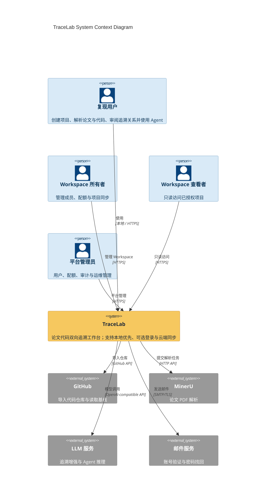
```mermaid
C4Context
  title TraceLab System Context Diagram

  Person(user, "复现用户", "创建项目、解析论文与代码、审阅追溯关系并使用 Agent")
  Person(owner, "Workspace 所有者", "管理成员、配额与项目同步")
  Person(viewer, "Workspace 查看者", "只读访问已授权项目")
  Person(admin, "平台管理员", "用户、配额、审计与运维管理")

  System(tracelab, "TraceLab", "论文代码双向追溯工作台；支持本地优先、可选登录与云端同步")

  System_Ext(github, "GitHub", "导入代码仓库与读取基线")
  System_Ext(mineru, "MinerU", "论文 PDF 解析")
  System_Ext(llm, "LLM 服务", "追溯增强与 Agent 推理")
  System_Ext(smtp, "邮件服务", "账号验证与密码找回")

  Rel(user, tracelab, "使用", "本地 / HTTPS")
  Rel(owner, tracelab, "管理 Workspace", "HTTPS")
  Rel(viewer, tracelab, "只读访问", "HTTPS")
  Rel(admin, tracelab, "平台管理", "HTTPS")
  Rel(tracelab, github, "导入仓库", "GitHub API")
  Rel(tracelab, mineru, "提交解析任务", "HTTP API")
  Rel(tracelab, llm, "模型调用", "OpenAI-compatible API")
  Rel(tracelab, smtp, "发送邮件", "SMTP/TLS")

  UpdateElementStyle(tracelab, $bgColor="#F6C85F", $fontColor="#1F2937", $borderColor="#B7791F")
  UpdateElementStyle(user, $bgColor="#D9EAF7", $fontColor="#123B5D", $borderColor="#3978A8")
  UpdateElementStyle(owner, $bgColor="#D9EAF7", $fontColor="#123B5D", $borderColor="#3978A8")
  UpdateElementStyle(viewer, $bgColor="#D9EAF7", $fontColor="#123B5D", $borderColor="#3978A8")
  UpdateElementStyle(admin, $bgColor="#D9EAF7", $fontColor="#123B5D", $borderColor="#3978A8")
```

| 参与者 | 说明 |
|---|---|
| 复现用户 | **可选**注册登录；未登录时仅使用本地 SQLite；登录后可选择同步哪些项目及哪些数据类型 |
| Workspace 所有者 | 管理成员、配额、删除 workspace、启用/暂停项目云端同步 |
| Workspace 查看者 | 只读访问已授权项目 |
| 平台管理员 | 用户启停、配额、审计、运维；**默认不可读项目正文** |
| Desktop 客户端 | 本地工作台 + 可选云端同步 |
| 浏览器客户端 | 直连 Cloud API 的 SaaS 形态 |

## 2.2 主要用例

## 2.3 关键用例说明

### UC-A0：未登录本地使用

| 项目 | 说明 |
|---|---|
| 目标 | 在不注册、不登录账号的情况下完整使用 TraceLab 本地工作台 |
| 参与者 | 复现用户、Local API |
| 前置条件 | 无 |
| 后置条件 | 所有项目与历史数据写入本地 SQLite 与本地文件系统；`sync_mode=local_only` |
| 关键元素 | Local API、SQLite、`uploads/` |
| 场景 | 用户启动软件 → 直接进入项目列表 → 创建项目、上传论文/代码、解析、追溯、Agent 对话、查看张量流图 → **全部仅存本地**，不上传云端 |

### UC-A2：登录 / 刷新 / 退出

| 项目 | 说明 |
|---|---|
| 目标 | 在用户**主动选择**登录时，安全地建立、续期与撤销云端会话 |
| 参与者 | 复现用户、Cloud API、SMTP |
| 前置条件 | 用户已注册（登录时）；**不登录不影响本地功能** |
| 后置条件 | 签发短期 access token；refresh token 旋转并哈希存库；进入「同步项目选择」流程 |
| 关键元素 | `auth/service.py`、`auth/tokens.py`、`auth_session`、`device` |
| 场景 | 用户点击「登录」→ 邮箱密码验证 → 创建设备会话 → **弹出同步向导** → 用户勾选要同步的项目与数据类型 → 仅对勾选内容执行 bootstrap push |

### UC-P2：登录后选择要同步的项目

| 项目 | 说明 |
|---|---|
| 目标 | 让用户自行决定哪些本地项目纳入云端，而非默认全量上云 |
| 参与者 | 复现用户、Sync Coordinator、Cloud API |
| 前置条件 | 用户已登录；本地存在若干 `local_only` 项目 |
| 后置条件 | 被勾选项目的 `sync_mode=cloud_enabled` 并分配 `public_id`；未勾选项目保持本地 |
| 关键元素 | `sync_service.py`、`project.sync_mode`、同步向导 UI |
| 场景 | 登录成功或进入「云端同步设置」→ 展示本地项目列表（含摘要：论文/代码/追溯/Agent 记录数）→ 用户勾选项目 → 确认后开始 bootstrap push |

### UC-P2b：选择项目同步范围（数据类型）

| 项目 | 说明 |
|---|---|
| 目标 | 对每个已选同步项目，细粒度选择要上云的数据类型 |
| 参与者 | 复现用户 |
| 前置条件 | 项目已被勾选进入云端同步 |
| 后置条件 | 写入 `project.sync_scope`；Sync Coordinator 仅 push 被勾选类型 |
| 可选项 | 见下表 |

**项目级 `sync_scope` 可选项：**

| 同步项 | 包含内容 | 默认建议 |
|---|---|---|
| `user_profile` | 用户昵称、头像、偏好设置、默认 workspace | 登录同步向导中默认勾选 |
| `paper_parsing` | 论文 PDF blob、解析结果（章节/段落/页码/Markdown） | 按项目勾选 |
| `code_analysis` | 代码基线引用 / 文件树 manifest、符号、**稀疏变更文件**、分析 JSON（见 §8.6） | 按项目勾选 |
| `trace_links` | 追溯候选、accepted/rejected 决策、证据 | 按项目勾选 |
| `tensor_flow` | 张量流图、架构图、布局快照 | 按项目勾选 |
| `agent_conversations` | Agent 会话、消息、Run、Run Event | 按项目勾选 |
| `agent_memory` | 项目级与全局 Agent 记忆条目 | 独立勾选，默认关闭 |

未勾选的类型**继续保留在本地**，不会被 push；后续用户可在项目设置中增删同步范围。

### UC-P3：上传并解析论文 PDF（云端路径）

| 项目 | 说明 |
|---|---|
| 目标 | 将 PDF 转为结构化论文索引，并在云端/本地均可浏览 |
| 参与者 | 复现用户、Cloud API、Worker、MinerU |
| 场景 | 上传 PDF → blob 去重存储 → sync push 元数据 → Worker 领取解析任务 → MinerU 解析 → 规范化 → 写入 PaperDocument → 其他设备 pull 获取 |

### UC-S1/S2：Push / Pull 同步

| 项目 | 说明 |
|---|---|
| 目标 | 在本地 SQLite 与云端 PostgreSQL 之间，**仅同步用户授权的项目与数据类型** |
| 约束 | **不同步 SQLite 文件**；通过 `sync_event` 与版本号同步；遵守 `project.sync_scope` |
| 按 scope 同步 | 见 UC-P2b：`paper_parsing`、`trace_links`、`agent_conversations`、`tensor_flow`、`agent_memory` 等 |
| 代码同步形态 | **禁止**以「整仓 ZIP 版本链」或「不可直接读的纯 diff 链」作为云端主形态；采用 **基线引用 + 内容寻址文件树 + 稀疏 overlay**（§8.6、§9.7） |
| 用户级同步 | `user_profile`：昵称、偏好等基本信息；与项目选择独立勾选 |
| 可重算 | analysis JSON、张量流布局可在 pull 后按需重算；Git 基线可在其他设备按 `remote+commit` 再拉取 |
| 不同步 | API Key、UI 布局、临时 job 文件、未勾选项目的任何数据；默认忽略权重/数据集/venv/`.git` 对象库 |

### UC-S4：冲突人工裁决

| 项目 | 说明 |
|---|---|
| 目标 | 避免静默覆盖用户决策 |
| 策略 | 项目元数据：`base_version` 不一致返回 409；TraceLink：`accepted/rejected` 冲突需人工确认；文件：保留两个不可变版本供选择 |

## 2.4 主要业务流程（含账号与云端）

**图 3：TraceLab 主要业务流程图**

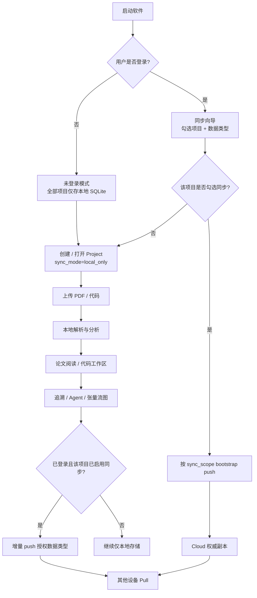
```mermaid
flowchart TD
  Start[启动软件] --> LoginQ{用户是否登录?}
  LoginQ -->|否| LocalOnly[未登录模式\n全部项目仅存本地 SQLite]
  LoginQ -->|是| SyncWizard[同步向导\n勾选项目 + 数据类型]
  LocalOnly --> C[创建 / 打开 Project\nsync_mode=local_only]
  SyncWizard --> D{该项目是否勾选同步?}
  D -->|否| C
  D -->|是| F[按 sync_scope bootstrap push]
  F --> G[Cloud 权威副本]
  C --> H[上传 PDF / 代码]
  H --> J[本地解析与分析]
  J --> L[论文阅读 / 代码工作区]
  L --> N[追溯 / Agent / 张量流图]
  N --> O{已登录且该项目已启用同步?}
  O -->|是| Push[增量 push 授权数据类型]
  O -->|否| StayLocal[继续仅本地存储]
  Push --> T[其他设备 Pull]
  G --> T
```

---

# 3. 逻辑视图

TraceLab 的逻辑结构由本地和云端两个运行时、共享领域模型及同步协调层组成。

## 3.1 顶层逻辑分解

**图 4：TraceLab 逻辑视图（UML 包图）**


```mermaid
flowchart TB
  subgraph Presentation["<<layer>> 表现层"]
    Views["<<package>> views / features<br/>项目、论文、代码、追溯、Agent"]
    Stores["<<package>> Pinia stores<br/>auth / project / sync"]
  end

  subgraph Application["<<layer>> 应用层"]
    LocalApp["<<application>> Local API<br/>本地用例编排"]
    CloudApp["<<application>> Cloud API<br/>云端用例编排与授权"]
    SyncApp["<<application>> Sync Coordinator<br/>outbox / inbox / cursor"]
  end

  subgraph Services["<<layer>> 服务层"]
    IdentitySvc["<<service>> Auth / Workspace Service<br/>register · login · authorize · manageMember"]
    ProjectSvc["<<service>> Project Service<br/>createProject · updateProject · deleteProject"]
    PaperSvc["<<service>> Paper Parsing Service<br/>submitParse · getParseResult"]
    CodeSvc["<<service>> Code Analysis Service<br/>importRepository · analyzeRepository · editFile"]
    TraceSvc["<<service>> Tracing / Tensor Flow Service<br/>suggestTrace · updateStatus · buildGraph"]
    AgentSvc["<<service>> Agent Service<br/>startRun · streamEvents · confirmAction"]
    SyncSvc["<<service>> Sync Service<br/>push · pull · resolveConflict"]
    BlobSvc["<<service>> Blob Store Service<br/>putBlob · getBlob · verifyHash"]
  end

  subgraph Data["<<layer>> 数据层"]
    LocalRepo["<<repository>> Local Repository"]
    CloudRepo["<<repository>> Cloud Repository"]
    LocalDB[(SQLite)]
    CloudDB[(PostgreSQL)]
    LocalFiles[(Local uploads)]
    CloudBlob[(Content-Addressed Blob)]
    JobQueue[(job / outbox)]
  end

  subgraph External[外部系统]
    GitHub[GitHub]
    MinerU[MinerU]
    LLM[LLM 服务]
    SMTP[邮件服务]
  end

  Views -.->|调用应用接口| LocalApp
  Views -.->|调用应用接口| CloudApp
  Stores -.->|状态与凭据| LocalApp
  Stores -.->|状态与凭据| CloudApp
  Stores -.->|同步配置| SyncApp

  LocalApp -.->|IProject / IPaper / ICode / ITrace / IAgent| ProjectSvc
  LocalApp -.-> PaperSvc
  LocalApp -.-> CodeSvc
  LocalApp -.-> TraceSvc
  LocalApp -.-> AgentSvc
  CloudApp -.->|IAuth / IWorkspace| IdentitySvc
  CloudApp -.-> ProjectSvc
  CloudApp -.-> SyncSvc
  SyncApp -.->|ISync| SyncSvc

  IdentitySvc -.-> CloudRepo
  ProjectSvc -.-> LocalRepo
  ProjectSvc -.-> CloudRepo
  PaperSvc -.-> LocalRepo
  PaperSvc -.-> CloudRepo
  CodeSvc -.-> LocalRepo
  CodeSvc -.-> CloudRepo
  TraceSvc -.-> LocalRepo
  TraceSvc -.-> CloudRepo
  AgentSvc -.-> LocalRepo
  AgentSvc -.-> CloudRepo
  SyncSvc -.-> LocalRepo
  SyncSvc -.-> CloudRepo
  SyncSvc -.-> BlobSvc
  BlobSvc -.-> LocalFiles
  BlobSvc -.-> CloudBlob
  LocalRepo --> LocalDB
  CloudRepo --> CloudDB
  CloudRepo --> JobQueue

  CodeSvc -.->|GitHub API| GitHub
  PaperSvc -.->|解析接口| MinerU
  TraceSvc -.->|模型接口| LLM
  AgentSvc -.->|模型接口| LLM
  IdentitySvc -.->|SMTP/TLS| SMTP

  classDef presentation fill:#D9EAF7,stroke:#3978A8,color:#123B5D;
  classDef application fill:#E8E0F4,stroke:#7656A8,color:#2F2450;
  classDef service fill:#FFF4C2,stroke:#B7791F,color:#4A3410;
  classDef data fill:#DDF2E1,stroke:#3D8B52,color:#174A27;
  class Views,Stores presentation;
  class LocalApp,CloudApp,SyncApp application;
  class IdentitySvc,ProjectSvc,PaperSvc,CodeSvc,TraceSvc,AgentSvc,SyncSvc,BlobSvc service;
  class LocalRepo,CloudRepo,LocalDB,CloudDB,LocalFiles,CloudBlob,JobQueue data;
```

## 3.2 Cloud 与 Local 职责划分

| 能力 | Local API | Cloud API | 说明 |
|---|---|---|---|
| 用户注册登录 | — | ✓ | **可选**；未登录时全部走 Local API |
| 项目 CRUD | ✓ | ✓（已选同步项） | 未登录/未勾选同步的项目**仅 Local**；Cloud 仅存用户授权副本 |
| 论文/代码上传 | ✓ | ✓（按 scope） | Local 始终写本地；Cloud 仅当项目 `cloud_enabled` 且 scope 含对应类型 |
| 代码编辑 | ✓ | 间接 | 编辑优先在 Local；scope 含 `code_analysis` 时仅 push **变更文件 blob + manifest**，非整仓 ZIP |
| 追溯审阅 | ✓ | ✓（按 scope） | scope 含 `trace_links` 时同步用户决策 |
| Agent | ✓ | ✓（按 scope） | scope 含 `agent_conversations` / `agent_memory` 时同步；密钥仅本地 |
| 张量流/流程图 | ✓ | ✓（按 scope） | scope 含 `tensor_flow` 时同步布局与图数据 |
| 解析/分析任务 | ✓ 线程池 | ✓ Worker | 大任务 Cloud Worker 集中执行 |
| Workspace 权限 | — | ✓ | Cloud 统一 RBAC |
| 离线 / 未登录 | ✓ | — | 未登录或离线时完整本地能力，历史项目均在 SQLite |

## 3.3 后端逻辑包（规划）

**图 5：TraceLab 后端包依赖图（UML 包图）**

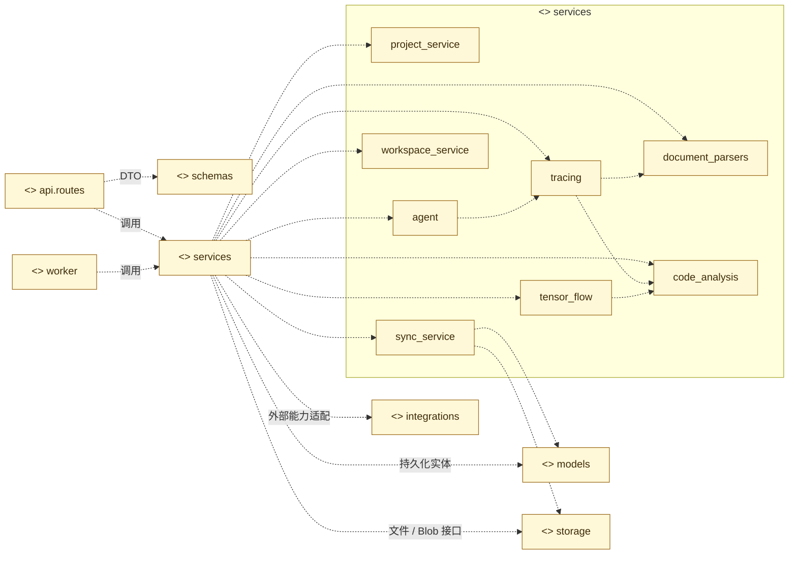
```mermaid
flowchart LR
  API["<<package>> api.routes"]
  Schemas["<<package>> schemas"]
  Services["<<package>> services"]
  Models["<<package>> models"]
  Storage["<<package>> storage"]
  Integrations["<<package>> integrations"]
  Worker["<<package>> worker"]

  subgraph ServicePackages["<<package>> services"]
    Project[project_service]
    Paper[document_parsers]
    Code[code_analysis]
    Tracing[tracing]
    Tensor[tensor_flow]
    Agent[agent]
    Sync[sync_service]
    Workspace[workspace_service]
  end

  API -.->|DTO| Schemas
  API -.->|调用| Services
  Worker -.->|调用| Services
  Services -.->|持久化实体| Models
  Services -.->|文件 / Blob 接口| Storage
  Services -.->|外部能力适配| Integrations
  Services -.-> Project
  Services -.-> Paper
  Services -.-> Code
  Services -.-> Tracing
  Services -.-> Tensor
  Services -.-> Agent
  Services -.-> Sync
  Services -.-> Workspace
  Tracing -.-> Code
  Tracing -.-> Paper
  Tensor -.-> Code
  Agent -.-> Tracing
  Sync -.-> Storage
  Sync -.-> Models

  classDef package fill:#FFF8D8,stroke:#9C6B1B,color:#3D2C0A;
  class API,Schemas,Services,Models,Storage,Integrations,Worker,Project,Paper,Code,Tracing,Tensor,Agent,Sync,Workspace package;
```

## 3.4 前端逻辑包（规划）

| 模块 | 职责 |
|---|---|
| `stores/auth.ts` | 登录态、access token、当前用户与 workspace |
| `services/sync-client.ts` | outbox 队列、pull cursor、冲突处理 |
| `api/auth-api.ts` | 注册、登录、刷新、设备管理 |
| `api/sync-api.ts` | push/pull/bootstrap/blob |
| `api/localHttp` vs `api/cloudHttp` | 双基址 HTTP 客户端 |
| `views/LoginView.vue` | 登录注册（**可选入口**，不阻断本地使用） |
| `views/SyncWizardView.vue` | 登录后选择同步项目与 `sync_scope` 数据类型 |
| `views/ProjectWorkspaceView.vue` | 主工作台 |
| `features/settings` | 集成配置、同步开关、设备列表 |

## 3.5 领域对象关系（含账号与同步）

---

# 4. 部署视图

## 4.1 总体部署拓扑

**图 6：TraceLab 总体部署视图（UML 部署图）**

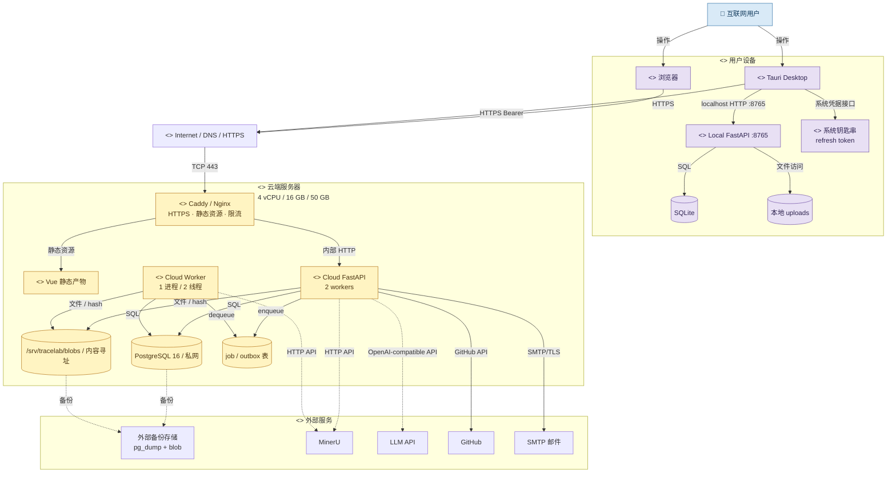
```mermaid
flowchart TB
  InternetUser["👤 互联网用户"]

  subgraph UserDevice["<<device>> 用户设备"]
    Browser["<<executionEnvironment>> 浏览器"]
    Tauri["<<executionEnvironment>> Tauri Desktop"]
    LocalAPI["<<artifact>> Local FastAPI :8765"]
    SQLite[(SQLite)]
    LocalDir[(本地 uploads)]
    Keychain["<<device>> 系统钥匙串<br/>refresh token"]
  end

  Network["<<network>> Internet / DNS / HTTPS"]

  subgraph CloudNode["<<device>> 云端服务器<br/>4 vCPU / 16 GB / 50 GB"]
    Proxy["<<executionEnvironment>> Caddy / Nginx<br/>HTTPS · 静态资源 · 限流"]
    WebDist["<<artifact>> Vue 静态产物"]
    CloudAPI["<<artifact>> Cloud FastAPI<br/>2 workers"]
    Worker["<<artifact>> Cloud Worker<br/>1 进程 / 2 线程"]
    PG[(PostgreSQL 16 / 私网)]
    BlobDir[(/srv/tracelab/blobs / 内容寻址)]
    JobTable[(job / outbox 表)]
  end

  subgraph External["<<external>> 外部服务"]
    Backup[外部备份存储\npg_dump + blob]
    MinerU[MinerU]
    LLM[LLM API]
    GitHub[GitHub]
    SMTP[SMTP 邮件]
  end

  InternetUser -->|操作| Browser
  InternetUser -->|操作| Tauri
  Tauri -->|localhost HTTP :8765| LocalAPI
  Tauri -->|系统凭据接口| Keychain
  LocalAPI -->|SQL| SQLite
  LocalAPI -->|文件访问| LocalDir
  Browser -->|HTTPS| Network
  Tauri -->|HTTPS Bearer| Network
  Network -->|TCP 443| Proxy
  Proxy -->|静态资源| WebDist
  Proxy -->|内部 HTTP| CloudAPI
  CloudAPI -->|SQL| PG
  CloudAPI -->|文件 / hash| BlobDir
  CloudAPI -->|enqueue| JobTable
  Worker -->|SQL| PG
  Worker -->|文件 / hash| BlobDir
  Worker -->|dequeue| JobTable
  CloudAPI -.->|HTTP API| MinerU
  Worker -.->|HTTP API| MinerU
  CloudAPI -.->|OpenAI-compatible API| LLM
  CloudAPI -->|SMTP/TLS| SMTP
  CloudAPI -->|GitHub API| GitHub
  PG -.->|备份| Backup
  BlobDir -.->|备份| Backup

  classDef user fill:#D9EAF7,stroke:#3978A8,color:#123B5D;
  classDef device fill:#E8E0F4,stroke:#7656A8,color:#2F2450;
  classDef cloud fill:#FFF4C2,stroke:#B7791F,color:#4A3410;
  class InternetUser user;
  class Browser,Tauri,LocalAPI,SQLite,LocalDir,Keychain device;
  class Proxy,WebDist,CloudAPI,Worker,PG,BlobDir,JobTable cloud;
```

## 4.2 三种运行模式

| 模式 | 客户端 | API 目标 | 数据存储 | 适用场景 |
|---|---|---|---|---|
| **Web 云端模式** | 浏览器 | Cloud API | PostgreSQL + Blob | 多设备、协作、课程 SaaS 演示 |
| **Desktop 混合模式** | Tauri | Local API + Cloud API | SQLite 本地 + 云端同步 | 离线编辑、本地性能、可选上云 |
| **Web 本地开发模式** | 浏览器 + Vite | Local API (:8000) | SQLite | 开发调试，无账号 |

## 4.3 云端节点内部部署

推荐使用 **Docker Compose 单节点** 部署 MVP：

| 容器/进程 | 端口 | 职责 |
|---|---|---|
| Caddy/Nginx | 443/80 | HTTPS、静态文件、请求体限制、登录限流 |
| Cloud FastAPI | 内部 8000 | Auth、Sync、Project、Blob 元数据 |
| Cloud Worker | — | 论文解析、代码分析、blob GC、事件压缩 |
| PostgreSQL | 私网 5432 | 账号、workspace、项目、同步事件、任务 |
| Blob 目录 | 挂载卷 | 不可变 PDF、**文件级代码 blob**、manifest |

MVP 阶段暂不引入 Kubernetes、Redis、MinIO 和独立认证中心。任务队列使用 PostgreSQL `job/outbox` 表，blob 使用本地 content-addressed 目录。

## 4.4 本地 Desktop 节点

| 组件 | 说明 |
|---|---|
| Tauri WebView | 承载 Vue 前端 |
| PyInstaller Sidecar | 本地 FastAPI，端口 `8765` |
| SQLite | 本地 `workbench.db` |
| Sync Coordinator | 后台线程，网络可用时 push/pull |
| 系统钥匙串 | 保存 Cloud refresh token |

## 4.5 资源与容量规划

| 区域 | 上限 | 内容 |
|---|---:|---|
| PostgreSQL + WAL | 8 GB | 账号、元数据、同步事件、**code_tree_manifest** |
| 用户 Blob | 25 GB | PDF、**按文件去重的代码 blob**、manifest、稀疏 overlay |
| 临时缓存 | 4 GB | MinerU 临时文件、解压目录、**按需物化工作区** |
| 系统与镜像 | 8 GB | OS、Docker |
| 余量 | 4 GB | 故障恢复缓冲 |

初始配额建议：每账号 5 GB、单项目 2 GB、单 PDF 100 MB、单次导入 ZIP 500 MB（导入后拆为文件级 blob，**不以整包 ZIP 长期占配额**）。

---

# 5. 进程视图

## 5.1 全局进程结构

**图 7：TraceLab 进程视图（UML 类图）**

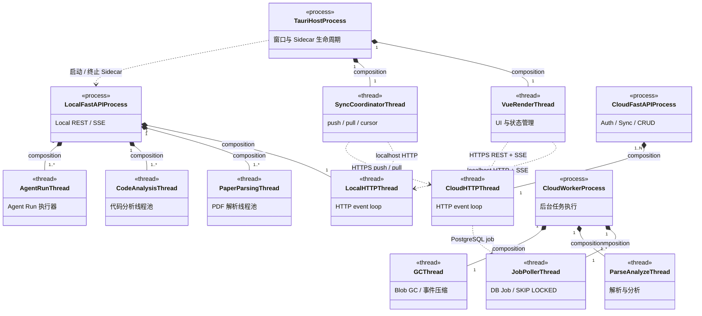
```mermaid
classDiagram
  class TauriHostProcess {
    <<process>>
    窗口与 Sidecar 生命周期
  }
  class VueRenderThread {
    <<thread>>
    UI 与状态管理
  }
  class SyncCoordinatorThread {
    <<thread>>
    push / pull / cursor
  }
  class LocalFastAPIProcess {
    <<process>>
    Local REST / SSE
  }
  class LocalHTTPThread {
    <<thread>>
    HTTP event loop
  }
  class PaperParsingThread {
    <<thread>>
    PDF 解析线程池
  }
  class CodeAnalysisThread {
    <<thread>>
    代码分析线程池
  }
  class AgentRunThread {
    <<thread>>
    Agent Run 执行器
  }
  class CloudFastAPIProcess {
    <<process>>
    Auth / Sync / CRUD
  }
  class CloudHTTPThread {
    <<thread>>
    HTTP event loop
  }
  class CloudWorkerProcess {
    <<process>>
    后台任务执行
  }
  class JobPollerThread {
    <<thread>>
    DB Job / SKIP LOCKED
  }
  class ParseAnalyzeThread {
    <<thread>>
    解析与分析
  }
  class GCThread {
    <<thread>>
    Blob GC / 事件压缩
  }

  TauriHostProcess "1" *-- "1" VueRenderThread : composition
  TauriHostProcess "1" *-- "1" SyncCoordinatorThread : composition
  LocalFastAPIProcess "1" *-- "1" LocalHTTPThread : composition
  LocalFastAPIProcess "1" *-- "1..*" PaperParsingThread : composition
  LocalFastAPIProcess "1" *-- "1..*" CodeAnalysisThread : composition
  LocalFastAPIProcess "1" *-- "1..*" AgentRunThread : composition
  CloudFastAPIProcess "1..N" *-- "1" CloudHTTPThread : composition
  CloudWorkerProcess "1" *-- "1" JobPollerThread : composition
  CloudWorkerProcess "1" *-- "1..*" ParseAnalyzeThread : composition
  CloudWorkerProcess "1" *-- "1" GCThread : composition

  TauriHostProcess ..> LocalFastAPIProcess : 启动 / 终止 Sidecar
  VueRenderThread ..> LocalHTTPThread : localhost HTTP + SSE
  VueRenderThread ..> CloudHTTPThread : HTTPS REST + SSE
  SyncCoordinatorThread ..> LocalHTTPThread : localhost HTTP
  SyncCoordinatorThread ..> CloudHTTPThread : HTTPS push / pull
  CloudHTTPThread ..> JobPollerThread : PostgreSQL job
```

## 5.2 进程交互模式

| 交互 | 模式 | 说明 |
|---|---|---|
| 前端 ↔ Local API | HTTP REST + SSE | 本地工作台实时操作 |
| 前端 ↔ Cloud API | HTTPS REST + SSE | 登录、同步、云端 CRUD |
| Sync Coordinator ↔ Cloud | HTTPS push/pull | Bearer access token |
| Cloud API ↔ Worker | DB Job 表 | 同事务或 enqueue |
| Worker ↔ MinerU/LLM | HTTP | 重任务与外部 AI |
| Cloud API ↔ SMTP | SMTP/TLS | 验证邮件、找回密码 |
| 浏览器 Auth | HttpOnly Cookie + 内存 access | refresh 旋转 |
| Desktop Auth | Keychain + 内存 access | 禁止 localStorage 存 token |

## 5.3 启动与恢复

**Local API lifespan：**

1. 初始化 SQLite 与迁移；
2. 恢复本地分析任务与 Agent Run；
3. 启动 Sync Coordinator 后台循环（若已登录）。

**Cloud API lifespan：**

1. 初始化 PostgreSQL 与 Alembic；
2. 加载限流与 CORS 配置；
3. 标记中断的 Worker 任务为可重试。

**Cloud Worker：**

1. 轮询 `job` 表，`FOR UPDATE SKIP LOCKED` 领取任务；
2. 解析/分析完成后写入派生结果并追加 `sync_event`；
3. 失败任务按退避策略重试。

---

# 6. 实现视图

## 6.1 仓库与交付物

**图 8：TraceLab 实现视图（UML 构件图）**

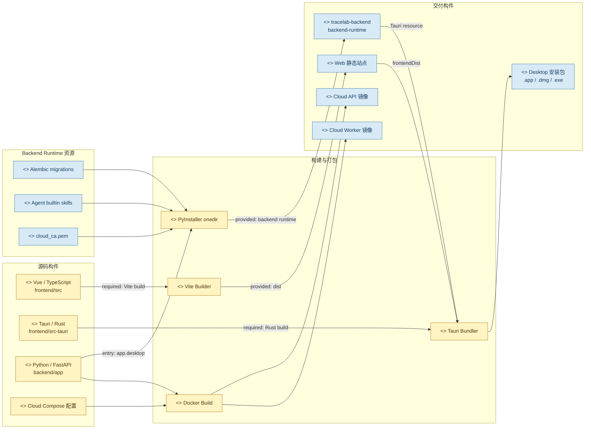
```mermaid
flowchart LR
  subgraph Source[源码构件]
    FE["<<component>> Vue / TypeScript<br/>frontend/src"]
    Tauri["<<component>> Tauri / Rust<br/>frontend/src-tauri"]
    BE["<<component>> Python / FastAPI<br/>backend/app"]
    CloudCompose["<<component>> Cloud Compose 配置"]
  end

  subgraph Resources[Backend Runtime 资源]
    Migrations["<<artifact>> Alembic migrations"]
    Skills["<<artifact>> Agent builtin skills"]
    CA["<<artifact>> cloud_ca.pem"]
  end

  subgraph Build[构建与打包]
    Vite["<<component>> Vite Builder"]
    PyInstaller["<<component>> PyInstaller onedir"]
    TauriBundler["<<component>> Tauri Bundler"]
    DockerBuild["<<component>> Docker Build"]
  end

  subgraph Artifacts[交付构件]
    WebStatic["<<artifact>> Web 静态站点"]
    BackendRuntime["<<artifact>> tracelab-backend<br/>backend-runtime"]
    DesktopInstaller["<<artifact>> Desktop 安装包<br/>.app / .dmg / .exe"]
    CloudImage["<<artifact>> Cloud API 镜像"]
    WorkerImage["<<artifact>> Cloud Worker 镜像"]
  end

  FE -->|required: Vite build| Vite
  Vite -->|provided: dist| WebStatic
  BE -->|entry: app.desktop| PyInstaller
  Migrations --> PyInstaller
  Skills --> PyInstaller
  CA --> PyInstaller
  PyInstaller -->|provided: backend runtime| BackendRuntime
  Tauri -->|required: Rust build| TauriBundler
  WebStatic -->|frontendDist| TauriBundler
  BackendRuntime -->|Tauri resource| TauriBundler
  TauriBundler --> DesktopInstaller
  BE --> DockerBuild
  CloudCompose --> DockerBuild
  DockerBuild --> CloudImage
  DockerBuild --> WorkerImage

  classDef component fill:#FFF4C2,stroke:#B7791F,color:#4A3410;
  classDef artifact fill:#D9EAF7,stroke:#3978A8,color:#123B5D;
  class FE,Tauri,BE,CloudCompose,Vite,PyInstaller,TauriBundler,DockerBuild component;
  class Migrations,Skills,CA,WebStatic,BackendRuntime,DesktopInstaller,CloudImage,WorkerImage artifact;
```

## 6.2 规划新增的源码结构

在现有 `backend/app/` 基础上计划新增：

```text
backend/app/
├── auth/                      # 账号与令牌
│   ├── password.py            # Argon2id
│   ├── tokens.py              # JWT access + refresh rotation
│   ├── dependencies.py        # get_current_user / require_role
│   └── service.py             # register / login / logout / reset
├── api/routes/
│   ├── auth.py                # /auth/*
│   ├── sync.py                # /sync/* /blobs/*
│   ├── admin.py               # /admin/*
│   ├── projects.py            # current_user + workspace 授权
│   ├── papers.py
│   ├── repositories.py
│   ├── traces.py
│   ├── agent.py
│   └── workspace.py
├── schemas/
│   ├── auth.py / sync.py      # 账号与同步 DTO
│   └── ...                    # 领域 DTO
├── services/
│   ├── sync_service.py        # push / pull / bootstrap / 冲突
│   ├── project_service.py
│   ├── document_parsers/
│   ├── code_analysis/
│   ├── tracing/
│   ├── tensor_flow/
│   ├── agent/
│   └── workspace_service.py
├── storage/
│   ├── file_store.py          # LocalFileStore
│   └── blob_store.py          # quarantine / hash / GC
├── models/entities.py         # user / workspace / sync / blob 实体
└── worker/
    └── main.py                # Cloud Worker 入口
frontend/src/
├── stores/auth.ts          # 新增
├── services/sync-client.ts # 新增
├── api/auth-api.ts         # 新增
├── api/sync-api.ts         # 新增
├── views/LoginView.vue     # 新增
deploy/
├── docker-compose.cloud.yml
├── Caddyfile
└── backup/                 # pg_dump + blob 脚本
```

## 6.3 运行模式与入口

| 入口 | 命令/产物 | 作用 |
|---|---|---|
| Local API | `uvicorn app.main:app` / sidecar | 本地工作台 |
| Cloud API | `uvicorn app.cloud_main:app` | 云端服务 |
| Cloud Worker | `python -m app.worker.main` | 后台任务 |
| Web 前端 | `frontend/dist` | 浏览器访问 |
| Desktop | Tauri `.app/.exe` | 本地 + 可选同步 |

---

# 7. 技术视图

## 7.1 技术栈

| 层次 | 技术 | 说明 |
|---|---|---|
| 前端 | Vue 3 + TypeScript + Vite + Pinia | 统一 UI |
| UI 组件 | Element Plus | 表单、表格、上传 |
| 编辑器 | CodeMirror 6 | 代码浏览/编辑 |
| Desktop | Tauri 2 + Rust | 本地 sidecar 与钥匙串 |
| 后端 | Python 3.11+ / FastAPI | Local API 与 Cloud API 共用领域层 |
| ORM | SQLModel / SQLAlchemy | 实体与 DTO |
| 本地 DB | SQLite | Desktop / 离线 |
| 云端 DB | PostgreSQL 16 | 权威元数据与同步事件 |
| 迁移 | Alembic | 版本化 schema |
| 密码哈希 | Argon2id | 账号安全 |
| 令牌 | JWT access + 旋转 refresh | 15 min / 30 day |
| 文件存储 | Local FS + Content-Addressed Blob | 双存储后端 |
| 反向代理 | Caddy / Nginx | HTTPS、限流、静态文件 |
| 邮件 | SMTP（SendGrid 等） | 验证与找回密码 |
| 论文解析 | MinerU 本地 / 官方 API | 可插拔 |
| LLM | OpenAI-compatible API | 追溯增强与 Agent |
| 容器 | Docker Compose | 云端 MVP 部署 |
| 测试 | pytest + Playwright（可选） | 后端与 E2E |

## 7.2 接口分区

| 前缀 | 运行时 | 示例 |
|---|---|---|
| `/api/v1/auth/*` | Cloud | 注册、登录、刷新、设备 |
| `/api/v1/workspaces/*` | Cloud | 租户与成员 |
| `/api/v1/sync/*` | Cloud | push、pull、bootstrap |
| `/api/v1/blobs/*` | Cloud | 上传、下载、去重 |
| `/api/v1/admin/*` | Cloud | 平台管理 |
| `/api/v1/projects/*` 等领域 | Local + Cloud | 项目、论文、代码、追溯、Agent |

---

# 8. 数据视图

## 8.1 概念 ER 图

**图 9：TraceLab 领域对象类图**

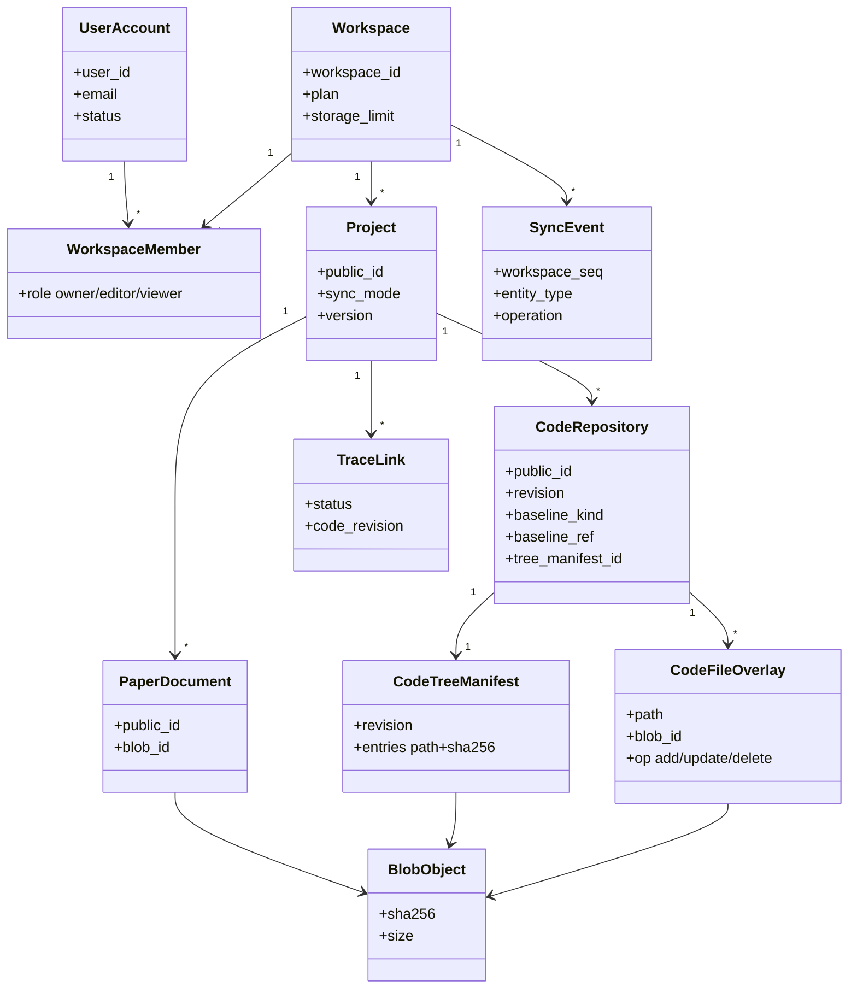
```mermaid
classDiagram
  class UserAccount {
    +user_id
    +email
    +status
  }
  class Workspace {
    +workspace_id
    +plan
    +storage_limit
  }
  class WorkspaceMember {
    +role owner/editor/viewer
  }
  class Project {
    +public_id
    +sync_mode
    +version
  }
  class PaperDocument {
    +public_id
    +blob_id
  }
  class CodeRepository {
    +public_id
    +revision
    +baseline_kind
    +baseline_ref
    +tree_manifest_id
  }
  class CodeTreeManifest {
    +revision
    +entries path+sha256
  }
  class CodeFileOverlay {
    +path
    +blob_id
    +op add/update/delete
  }
  class TraceLink {
    +status
    +code_revision
  }
  class SyncEvent {
    +workspace_seq
    +entity_type
    +operation
  }
  class BlobObject {
    +sha256
    +size
  }

  UserAccount "1" --> "*" WorkspaceMember
  Workspace "1" --> "*" WorkspaceMember
  Workspace "1" --> "*" Project
  Project "1" --> "*" PaperDocument
  Project "1" --> "*" CodeRepository
  Project "1" --> "*" TraceLink
  CodeRepository "1" --> "1" CodeTreeManifest
  CodeRepository "1" --> "*" CodeFileOverlay
  Workspace "1" --> "*" SyncEvent
  PaperDocument --> BlobObject
  CodeTreeManifest --> BlobObject
  CodeFileOverlay --> BlobObject
```

**图 10：TraceLab 数据视图（实体关系图 ERD）**

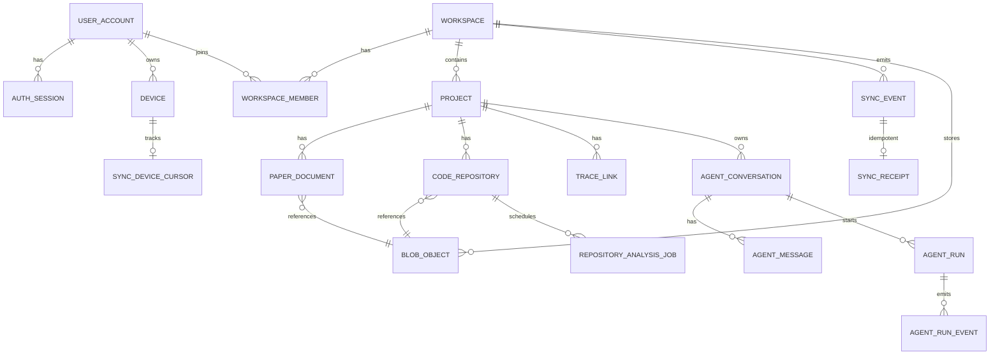
```mermaid
erDiagram
  USER_ACCOUNT ||--o{ AUTH_SESSION : has
  USER_ACCOUNT ||--o{ DEVICE : owns
  USER_ACCOUNT ||--o{ WORKSPACE_MEMBER : joins
  WORKSPACE ||--o{ WORKSPACE_MEMBER : has
  WORKSPACE ||--o{ PROJECT : contains
  WORKSPACE ||--o{ SYNC_EVENT : emits
  WORKSPACE ||--o{ BLOB_OBJECT : stores
  PROJECT ||--o{ PAPER_DOCUMENT : has
  PROJECT ||--o{ CODE_REPOSITORY : has
  PROJECT ||--o{ TRACE_LINK : has
  PROJECT ||--o{ AGENT_CONVERSATION : owns
  PAPER_DOCUMENT }o--|| BLOB_OBJECT : references
  CODE_REPOSITORY }o--|| BLOB_OBJECT : references
  CODE_REPOSITORY ||--o{ REPOSITORY_ANALYSIS_JOB : schedules
  AGENT_CONVERSATION ||--o{ AGENT_MESSAGE : has
  AGENT_CONVERSATION ||--o{ AGENT_RUN : starts
  AGENT_RUN ||--o{ AGENT_RUN_EVENT : emits
  SYNC_EVENT ||--o| SYNC_RECEIPT : idempotent
  DEVICE ||--o| SYNC_DEVICE_CURSOR : tracks
```

## 8.2 账号与租户实体

| 实体 | 关键字段 | 说明 |
|---|---|---|
| `user_account` | email、password_hash、status、email_verified_at | 用户身份 |
| `auth_session` | refresh_token_hash、device_id、expires_at、revoked_at | 旋转 refresh |
| `device` | platform、client_version、last_seen_at | 设备管理与同步来源 |
| `workspace` | plan、storage_limit_bytes | 多租户边界 |
| `workspace_member` | role: owner/editor/viewer | RBAC |
| `email_token` | purpose、token_hash、expires_at | 验证/找回密码 |
| `audit_log` | action、target、metadata_json | 安全审计 |

## 8.3 项目与同步实体

| 实体 | 关键字段 | 说明 |
|---|---|---|
| `project` | public_id、workspace_id、sync_mode、**sync_scope_json**、version、deleted_at | 同步模式与**按类型同步范围** |
| `sync_event` | workspace_seq、entity_type、operation、payload_json | 变更日志 |
| `sync_receipt` | client_operation_id | push 幂等 |
| `sync_device_cursor` | last_pulled_seq | 设备同步进度 |
| `entity_tombstone` | deleted_version、expires_at | 删除传播 |
| `blob_object` | sha256、size、mime、ref_count | 内容寻址文件 |
| `code_repository` | baseline_kind、baseline_ref、tree_manifest_id、revision | 代码仓元数据；**不**以整仓 ZIP 为云端权威 |
| `code_tree_manifest` | revision、entries_json（path→sha256）或独立 entry 表 | 当前工作区文件树清单（小对象） |
| `code_file_overlay` | path、blob_id、op、base_revision | 相对基线的稀疏变更；仅变更文件占 blob |

### sync_mode 取值

| 值 | 含义 |
|---|---|
| `local_only` | 默认；仅本地，不上云 |
| `cloud_enabled` | 启用 push/pull |
| `cloud_paused` | 保留云端副本，暂停上传 |
| `cloud_detached` | 解除绑定，云端进入清理宽限期 |

### sync_scope 取值（JSON 字段，与 UC-P2b 对齐）

| 键 | 含义 | 未勾选时 |
|---|---|---|
| `user_profile` | 用户昵称、头像、偏好（**用户级**，向导中单独勾选） | 仅本地 profile 缓存 |
| `paper_parsing` | PDF blob + 解析结构化结果 | 解析结果仅存 SQLite |
| `code_analysis` | 基线引用 / 文件树 manifest、稀疏变更文件、符号、分析 JSON | 代码数据不上云 |
| `trace_links` | 追溯候选与用户 accepted/rejected 决策 | 追溯关系不上云 |
| `tensor_flow` | 张量流图、架构图、布局 | 流程图不上云 |
| `agent_conversations` | Agent 会话、消息、Run、Event | 对话历史不上云 |
| `agent_memory` | 项目级 / 全局 Agent 记忆 | 记忆不上云 |

Sync Coordinator 在 push/pull 前读取 `sync_scope_json`，**跳过未授权 entity_type**；本地 SQLite 仍保留完整数据。

## 8.4 存储布局

**云端 Blob：**

```text
/srv/tracelab/blobs/
├── sha256/aa/bb/<hash>          # 单文件内容（PDF、单源文件、小包）
├── manifests/<manifest-id>.json # code_tree_manifest：path → sha256
├── quarantine/                  # 上传校验前，短 TTL
└── materialize-cache/           # 可选：按需物化的工作区缓存（短 TTL / LRU）
```

**本地 Desktop：**

```text
<app-data>/
├── data/workbench.db
├── uploads/<project_id>/...     # 本地完整工作区（始终权威于未同步场景）
├── sync/outbox/*.json
├── sync/cursors/*.json
└── data/paper-jobs/...
```

**代码云端不存什么：** 不以「整仓 ZIP × 版本数」作为主存储；不以「必须串行 apply 的纯 diff 链」作为可读主形态。本地导入用的 ZIP 仅作一次性导入源，上传后拆成文件级 blob + manifest。

## 8.5 数据设计原则

1. **API 使用 public_id（UUID）**，本地整数 id 不暴露给云端客户端。
2. **源数据与派生数据分离**：PDF、代码文件内容、用户编辑、追溯决策是源数据；analysis JSON / 张量布局可重算。
3. **同步事件只存小 payload**，大文件通过 blob_id 引用。
4. **不同步 SQLite 文件**，只同步领域对象与版本事件。
5. **代码按文件内容寻址，按树清单定版本**：多版本共享未改文件的 blob；热路径按 path 取 sha256 再取 blob，**无需重放历史 patch**。
6. **基线可外置**：Git 源优先只存 `remote + commit`；其它设备可再 clone，云端只必存用户改动的文件。

## 8.6 代码云端存储策略（基线 + CAS 树 + 稀疏 Overlay）

在 4 vCPU / 16 GB / 50 GB（用户 Blob 约 25 GB）约束下，代码上云采用下列分层模型，兼顾**打开速度**与**磁盘占用**：

**图 11：TraceLab 代码云端存储结构图**

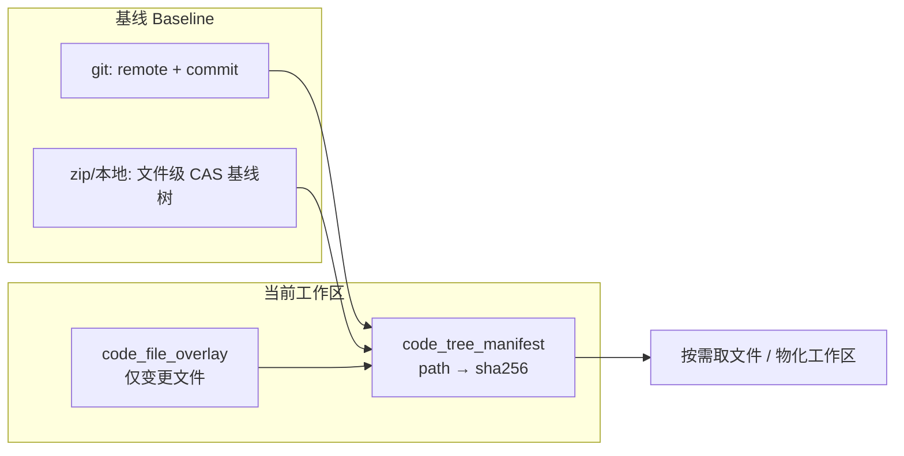
```mermaid
flowchart LR
  subgraph Baseline[基线 Baseline]
    GitRef[git: remote + commit]
    CasTree[zip/本地: 文件级 CAS 基线树]
  end
  subgraph Working[当前工作区]
    Manifest[code_tree_manifest\npath → sha256]
    Overlay[code_file_overlay\n仅变更文件]
  end
  GitRef --> Manifest
  CasTree --> Manifest
  Overlay --> Manifest
  Manifest --> Open[按需取文件 / 物化工作区]
```

### 8.6.1 基线（Baseline）

| 导入来源 | `baseline_kind` | 云端存什么 | 其它设备如何还原基线 |
|---|---|---|---|
| GitHub / 可 clone 的 git | `git_ref` | `remote_url` + `commit_sha`（可选浅克隆镜像作加速缓存） | `git fetch` 到该 commit |
| 纯 ZIP / 本地目录 | `cas_tree` | 过滤后的**文件级**内容寻址树 + 基线 manifest | 按基线 manifest 拉取文件 blob |

### 8.6.2 稀疏变更（Overlay）

- 相对基线，**仅上传变更过的文件**（`add` / `update` / `delete`）。
- 文件体进入 content-addressed `blob_object`；跨版本、跨项目相同内容自动去重。
- 每次保存/同步推进 `revision`，并写入新的 `code_tree_manifest`（清单体积小；文件体靠 hash 共享）。
- **不**把「unified diff 文本链」作为云端权威；若需展示 diff，由两份文件内容现算。

### 8.6.3 默认同步子集与忽略规则

勾选 `code_analysis` 时，建议默认同步：

| 必同步 | 可选 / 默认同步 | 默认不同步（ignore） |
|---|---|---|
| `baseline_ref`、当前 `tree_manifest`、用户改过的文件 blob | 符号索引、analysis JSON（可重算） | 模型权重、数据集、`venv`/`.venv`、`node_modules`、`.git/objects`、大于阈值的二进制 |

Web 云端模式打开文件时：**按 path 取 blob（按需）**；全仓物化仅在分析任务或显式「下载完整工作区」时进行，并写入 `materialize-cache`（LRU），避免每次 unzip 整仓占用临时盘（约 4 GB）。

### 8.6.4 方案取舍

| 方案 | 为何不作为主形态 |
|---|---|
| 整仓 ZIP 全量版本链 | 单项目 2 GB / 总 Blob 25 GB 下版本膨胀快；相同文件无法跨版本去重 |
| 纯 diff 链 | 打开/Pull 需重放，吃 CPU 与临时盘；ZIP 源无稳定 commit 时语义脆弱 |
| 基线 + CAS 树 + 稀疏 Overlay | 随机读文件近似 O(1)；空间接近「只存变更」；可靠性接近「有完整树」 |

---

# 9. 算法视图

## 9.1 账号登录与 Token 旋转

**图 12：TraceLab 账号登录与 Token 旋转时序图**

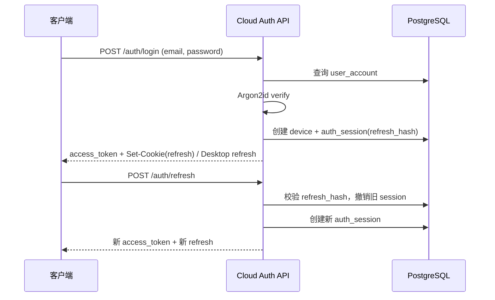
```mermaid
sequenceDiagram
  participant UI as 客户端
  participant API as Cloud Auth API
  participant DB as PostgreSQL

  UI->>API: POST /auth/login (email, password)
  API->>DB: 查询 user_account
  API->>API: Argon2id verify
  API->>DB: 创建 device + auth_session(refresh_hash)
  API-->>UI: access_token + Set-Cookie(refresh) / Desktop refresh
  UI->>API: POST /auth/refresh
  API->>DB: 校验 refresh_hash，撤销旧 session
  API->>DB: 创建新 auth_session
  API-->>UI: 新 access_token + 新 refresh
```

**规则：** refresh token 仅保存哈希；检测到复用时撤销整个设备会话。

**登录后同步向导（与 UC-P2 / UC-P2b 对应）：** 登录成功不意味着自动上云。客户端展示本地项目列表与用户级选项（`user_profile`），用户勾选要同步的项目及每项目的 `sync_scope` 后，Sync Coordinator 才执行 bootstrap push；未勾选项目保持 `local_only`，历史数据不离开本地。

**图 13：TraceLab 登录后同步向导时序图**

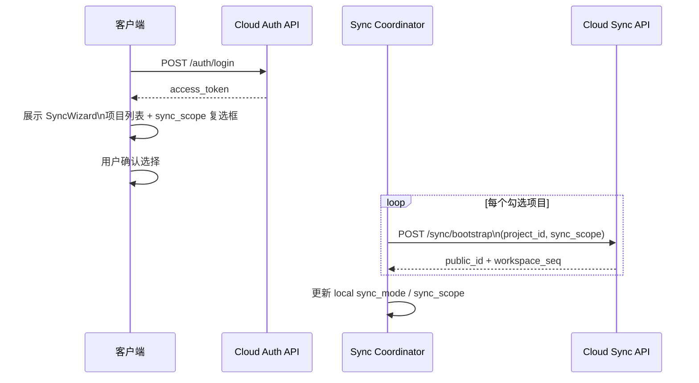
```mermaid
sequenceDiagram
  participant UI as 客户端
  participant Auth as Cloud Auth API
  participant Sync as Sync Coordinator
  participant Cloud as Cloud Sync API

  UI->>Auth: POST /auth/login
  Auth-->>UI: access_token
  UI->>UI: 展示 SyncWizard\n项目列表 + sync_scope 复选框
  UI->>UI: 用户确认选择
  loop 每个勾选项目
    Sync->>Cloud: POST /sync/bootstrap\n(project_id, sync_scope)
    Cloud-->>Sync: public_id + workspace_seq
  end
  Sync->>Sync: 更新 local sync_mode / sync_scope
```

## 9.2 大文件 Blob 上传与 Sync Push

**图 14：TraceLab Blob 上传与同步 Push 时序图**

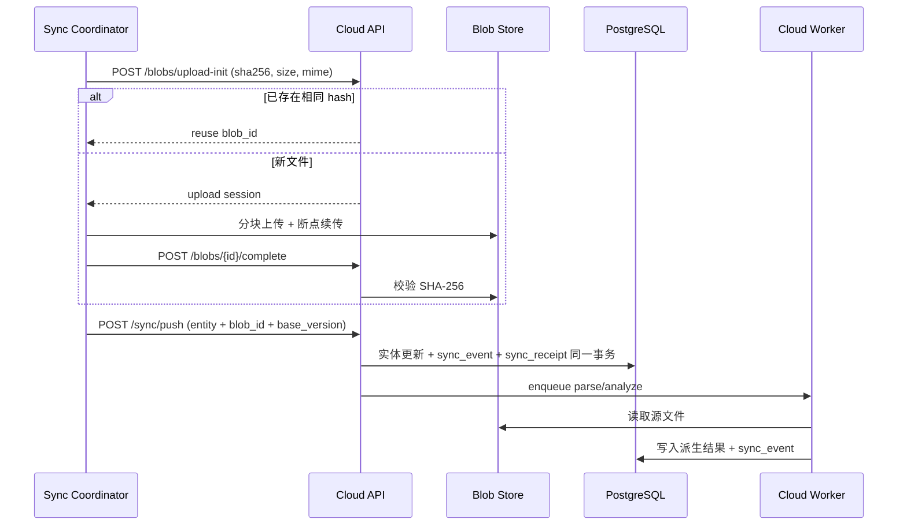
```mermaid
sequenceDiagram
  participant Client as Sync Coordinator
  participant API as Cloud API
  participant Blob as Blob Store
  participant DB as PostgreSQL
  participant Worker as Cloud Worker

  Client->>API: POST /blobs/upload-init (sha256, size, mime)
  alt 已存在相同 hash
    API-->>Client: reuse blob_id
  else 新文件
    API-->>Client: upload session
    Client->>Blob: 分块上传 + 断点续传
    Client->>API: POST /blobs/{id}/complete
    API->>Blob: 校验 SHA-256
  end
  Client->>API: POST /sync/push (entity + blob_id + base_version)
  API->>DB: 实体更新 + sync_event + sync_receipt 同一事务
  API->>Worker: enqueue parse/analyze
  Worker->>Blob: 读取源文件
  Worker->>DB: 写入派生结果 + sync_event
```

## 9.3 Sync Pull 与冲突处理

**图 15：TraceLab Sync Pull 与冲突处理活动图**

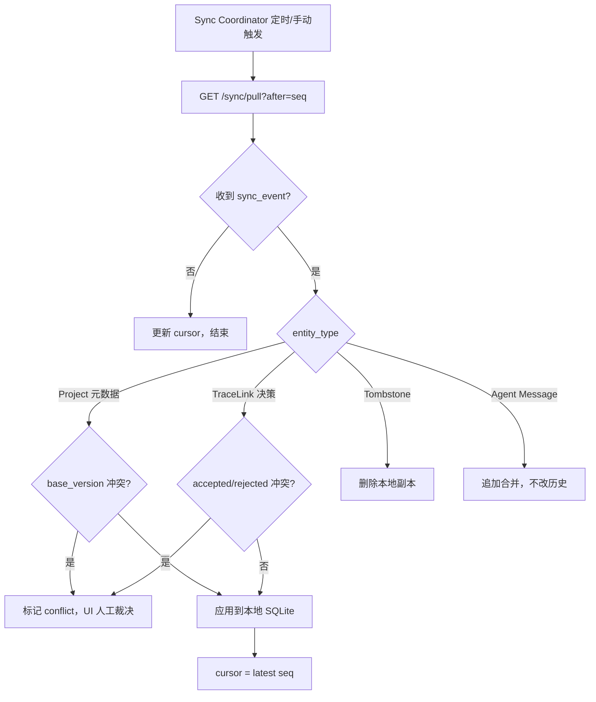
```mermaid
flowchart TD
  A[Sync Coordinator 定时/手动触发] --> B[GET /sync/pull?after=seq]
  B --> C{收到 sync_event?}
  C -->|否| D[更新 cursor，结束]
  C -->|是| E{entity_type}
  E -->|Project 元数据| F{base_version 冲突?}
  F -->|是| G[标记 conflict，UI 人工裁决]
  F -->|否| H[应用到本地 SQLite]
  E -->|TraceLink 决策| I{accepted/rejected 冲突?}
  I -->|是| G
  I -->|否| H
  E -->|Tombstone| J[删除本地副本]
  E -->|Agent Message| K[追加合并，不改历史]
  H --> L[cursor = latest seq]
```

## 9.4 论文解析（Local / Cloud Worker 共用）

**图 16：TraceLab 论文解析时序图**

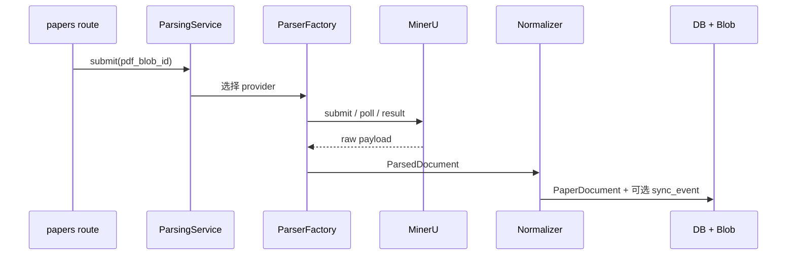
```mermaid
sequenceDiagram
  participant API as papers route
  participant Job as ParsingService
  participant Factory as ParserFactory
  participant MinerU as MinerU
  participant Norm as Normalizer
  participant Store as DB + Blob

  API->>Job: submit(pdf_blob_id)
  Job->>Factory: 选择 provider
  Factory->>MinerU: submit / poll / result
  MinerU-->>Factory: raw payload
  Factory->>Norm: ParsedDocument
  Norm->>Store: PaperDocument + 可选 sync_event
```

## 9.5 代码分析与追溯（与 v1 一致，跨 Local/Cloud）

- **代码分析：** 安全 ZIP → ignore 过滤 → 大小分流 → Python AST → 张量流布局；
- **追溯：** 静态 token 重叠基线 → 可选 LLM 增强 → fingerprint 去重 → TraceLink；
- **revision 绑定：** 代码编辑 → revision++ → 旧 TraceLink 标记 stale。

## 9.6 Agent 写操作确认（跨设备一致）

写工具（保存代码、更新追溯、触发重分析）在 Local 或 Cloud 均进入 `AgentToolRequest` 确认队列；确认结果作为 sync 源数据 push 到其他设备。

## 9.7 代码上云：基线解析、稀疏 Push 与按需物化

**图 17：TraceLab 代码基线与稀疏 Push 时序图**

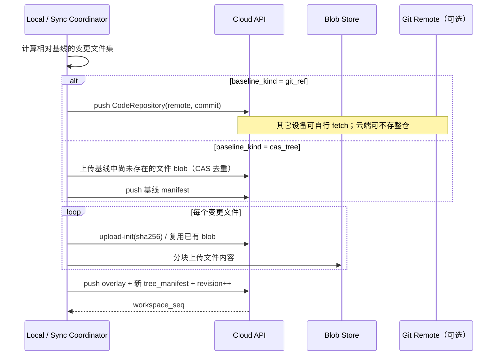
```mermaid
sequenceDiagram
  participant Local as Local / Sync Coordinator
  participant API as Cloud API
  participant Blob as Blob Store
  participant Git as Git Remote（可选）

  Local->>Local: 计算相对基线的变更文件集
  alt baseline_kind = git_ref
    Local->>API: push CodeRepository(remote, commit)
    Note over API,Git: 其它设备可自行 fetch；云端可不存整仓
  else baseline_kind = cas_tree
    Local->>API: 上传基线中尚未存在的文件 blob（CAS 去重）
    Local->>API: push 基线 manifest
  end
  loop 每个变更文件
    Local->>API: upload-init(sha256) / 复用已有 blob
    Local->>Blob: 分块上传文件内容
  end
  Local->>API: push overlay + 新 tree_manifest + revision++
  API-->>Local: workspace_seq
```

**另一台设备打开工作区：**

**图 18：TraceLab 云端代码工作区物化活动图**

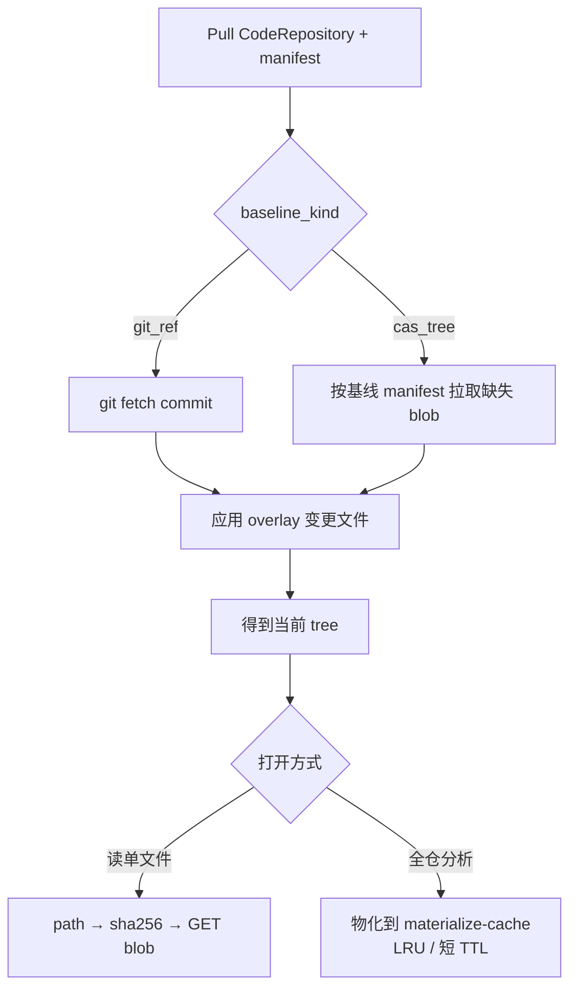
```mermaid
flowchart TD
  A[Pull CodeRepository + manifest] --> B{baseline_kind}
  B -->|git_ref| C[git fetch commit]
  B -->|cas_tree| D[按基线 manifest 拉取缺失 blob]
  C --> E[应用 overlay 变更文件]
  D --> E
  E --> F[得到当前 tree]
  F --> G{打开方式}
  G -->|读单文件| H[path → sha256 → GET blob]
  G -->|全仓分析| I[物化到 materialize-cache\nLRU / 短 TTL]
```

**冲突：** 同一 path 在两设备均有 overlay 且 `base_revision` 不一致 → 409，保留双方 blob 供人工选择（与 UC-S4 文件策略一致）；**不**做静默三路 merge。

**与 §9.5 的关系：** 本地仍可用 ZIP 导入；分析流水线输入变为「已物化目录或按 manifest 流式读文件」，输出的 analysis JSON 可作为可重算派生数据单独同步。

---

# 10. 性能视图

## 10.1 性能目标

| 场景 | 目标 | 策略 |
|---|---|---|
| 登录 / refresh | ≤ 1 s | PostgreSQL 索引 + 限流 |
| 项目列表 / 文件树 | ≤ 3 s | 读模型聚合 + 分页 |
| Sync pull（500 事件） | ≤ 2 s | workspace_seq 索引 |
| Blob 上传 | 取决于带宽 | 分块、断点续传、**按文件** hash 去重 |
| 打开云端单文件 | ≤ 1 s（命中缓存时） | manifest 定位 + 按需 GET blob，**不**全仓 unzip |
| 其它设备还原工作区 | 取决于变更量 | git fetch 基线或拉 CAS 基线树 + 仅 overlay |
| 小仓库分析 | 上传内完成 | inline 阈值 |
| 大仓库分析 | 异步 | Cloud Worker 队列 |
| 论文解析 | 异步 | Worker + MinerU 缓存 |
| Agent 首 token | 流式 | SSE |

## 10.2 云端资源隔离战术

| 战术 | 说明 |
|---|---|
| API/Worker 分进程 | 重分析不拖垮登录与同步 |
| Worker 线程上限 | 2 分析线程，防止 OOM |
| 磁盘水位线 | 80% 告警，90% 暂停新上传 |
| 请求体限制 | 反向代理限制 PDF/ZIP 大小 |
| 登录限流 | IP + email 维度 |

## 10.3 扩展触发条件

当并发用户 > 50、CPU 长期 > 70%、队列等待 > 1 min、blob > 25 GB 时，优先外置 PostgreSQL 与对象存储，再引入 Redis 队列与 API 多副本。

---

# 11. 可靠性视图

## 11.1 可靠性目标

| 目标 | 措施 |
|---|---|
| 离线可用 | Local API 独立运行 |
| 同步可恢复 | outbox + cursor + 幂等 receipt |
| 任务可恢复 | Worker `SKIP LOCKED` + 状态机 |
| 删除可传播 | tombstone 保留 ≥ 30 天 |
| 备份可恢复 | 外部 pg_dump + blob 增量；每月演练 |

## 11.2 故障降级

**图 19：TraceLab 故障降级策略图**

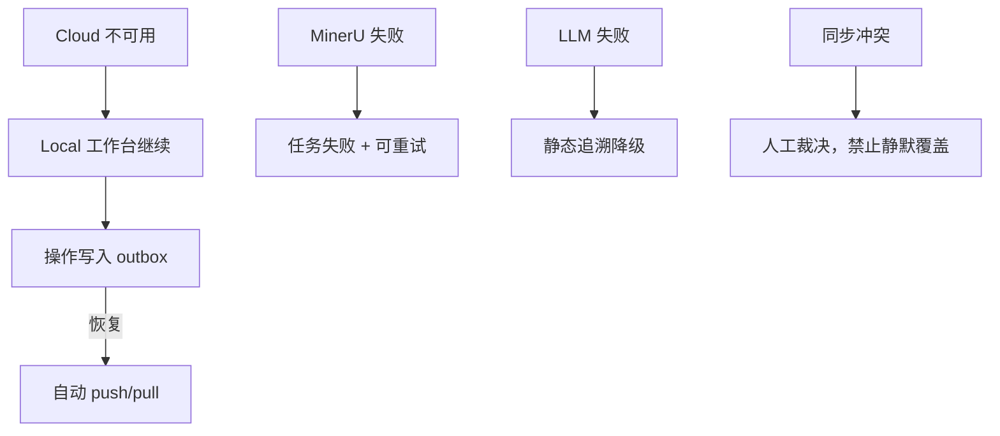
```mermaid
flowchart TB
  CloudDown[Cloud 不可用] --> LocalContinue[Local 工作台继续]
  LocalContinue --> Outbox[操作写入 outbox]
  Outbox -->|恢复| RetrySync[自动 push/pull]
  MinerUFail[MinerU 失败] --> JobFailed[任务失败 + 可重试]
  LLMFail[LLM 失败] --> StaticTrace[静态追溯降级]
  Conflict[同步冲突] --> Manual[人工裁决，禁止静默覆盖]
```

---

# 12. 安全性视图

## 12.1 身份与访问控制

**图 20：TraceLab 身份与访问控制决策图**

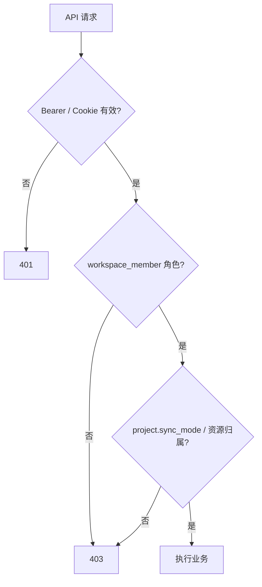
```mermaid
flowchart TD
  Request[API 请求] --> Auth{Bearer / Cookie 有效?}
  Auth -->|否| Reject401[401]
  Auth -->|是| Workspace{workspace_member 角色?}
  Workspace -->|否| Reject403[403]
  Workspace -->|是| Project{project.sync_mode / 资源归属?}
  Project -->|否| Reject403
  Project -->|是| Handler[执行业务]
```

| 控制点 | 策略 |
|---|---|
| 密码 | Argon2id，不明文存储 |
| Token | access 15 min；refresh 旋转 + 哈希存储 |
| 浏览器 | HttpOnly Secure Cookie + CSRF |
| Desktop | Keychain 存 refresh，禁止 localStorage |
| 项目访问 | 必须经 workspace 成员校验，不能仅靠 project id |
| 管理员 | `platform_admin` 角色；默认不可读项目正文 |
| Blob 下载 | 授权校验 + 审计 |
| Agent 写工具 | 人工确认 + 审计 |

## 12.2 文件与同步安全

| 威胁 | 对策 |
|---|---|
| ZIP 路径穿越 | archive 安全校验 |
| 解压炸弹 | 文件数/大小/展开阈值 |
| 恶意 blob | quarantine + MIME/扩展名校验 |
| Token 泄露 | 旋转、设备撤销、logout-all |
| 同步重放 | client_operation_id 幂等 |
| 敏感密钥上云 | API Key 不同步，仅本地或加密配置区 |

## 12.3 网络安全

- 仅开放 443/80；PostgreSQL、blob、Worker 管理口仅 Docker 私网；
- 生产 CORS 限制正式 Web 域名；
- 登录/注册/刷新/blob 下载记录审计摘要，日志脱敏。

---

# 13. 易用性视图

| 目标 | 架构支持 |
|---|---|
| **无需登录即可使用** | 启动即进本地项目列表；注册/登录为可选菜单项 |
| 免配置 Desktop | Tauri 自动启动 Local sidecar |
| **登录后自选同步** | SyncWizard：按项目 + 按数据类型勾选，默认不全量上云 |
| 可选上云 | 项目级 `sync_mode` + `sync_scope`，默认 `local_only` |
| 同步状态可见 | outbox 队列状态、冲突提示、设备列表、各 scope 同步进度 |
| 离线 / 未登录提示 | Cloud 不可用或未登录时本地继续；登录后可补选同步 |
| 双栏审阅 | 论文区 + 代码区 + 追溯面板 |
| 非代码文件防误开 | 前后端双重拦截 |
| 应用内配置 | Agent/MinerU 设置，无需改 .env |
| 冲突可理解 | 本地/云端 diff 对比 UI |

---

# 14. 可维护性视图

本项目不单独绘制可维护性视图，因为模块职责、依赖关系和源码组织已经在逻辑视图与实现视图中说明。
