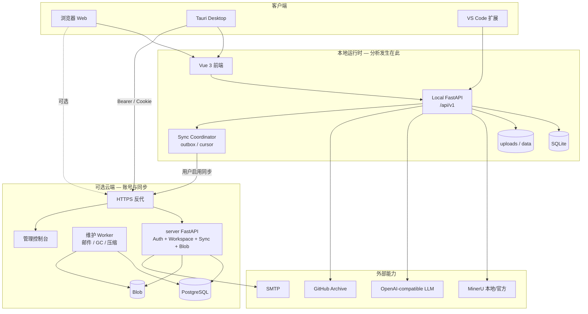
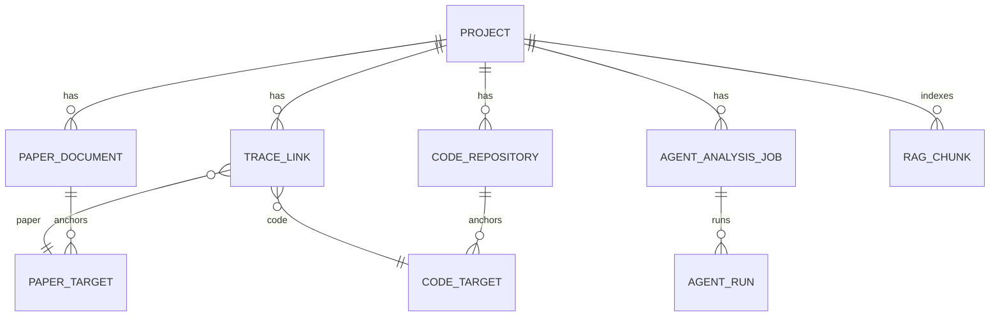

# TraceLab 论文代码双向追溯工作台

# 软件架构文档

**版本：3.0**  
**日期：2026/07/31**  
**单位：15 组**  
**状态：与仓库当前实现对照

---

## 修订历史记录

| 日期 | 版本 | 说明 | 作者 |
|---|---:|---|---|
| 2026/07/17 | 1.0–2.2 | 多视图架构初稿与云端设计纳入 | 15 组 |
| 2026/07/20 | 2.3 | 调整可选视图表述 | 15 组 |
| 2026/07/31 | 3.0 | **按源码重写**：纠正云端「设计中」、Worker 误跑 MinerU/LLM；补齐 Agent 追溯主路径、RAG、标注模式、Desktop LSP/终端、VS Code；同步实现边界与缺口 | 15 组 |

---

## 目录

1. 简介  
2. 用例视图  
3. 逻辑视图  
4. 部署视图  
5. 进程视图  
6. 实现视图  
7. 技术视图  
8. 数据视图  
9. 算法视图  
10. 性能视图  
11. 可靠性视图  
12. 安全性视图  
13. 易用性视图  
14. 可维护性视图  

---

# 1. 简介

## 1.1 目的

本文说明 TraceLab 的软件架构：模块划分、部署方式、数据组织、主要流程与质量属性。范围覆盖：

- 本地工作台 `backend/` + `frontend/`（Web / Tauri Desktop）；  
- 可选账号与同步产品 `server/`；  
- VS Code 扩展与无头核心 `vscode-extension/`、`packages/tracelab_core/`。

**产品约束（实现已遵守）：**

1. **本地可独立工作**：不登录即可完整使用解析、分析、追溯、Agent（需自备 LLM Key）。  
2. **同步由用户决定**：项目默认 `local_only`；显式启用后才进入 outbox。  
3. **分析只在本地**：`server/` 不做 MinerU、AST、LLM、Agent。  
4. **语义由 Agent 判断，事实由本地校验**：无 Provider 时追溯等待，不写入关键词假结果。

## 1.2 架构总览



## 1.3 参考资料

| 编号 | 文档 |
|---|---|
| R1 | `docs/architecture.md`（源码核对权威） |
| R2 | `docs/contracts/*.md` |
| R3 | `docs/trace/agent-bidirectional-tracing-architecture.md` |
| R4 | `docs/cloud-sync-architecture.md`、`server/README.md` |
| R5 | `FinalRelease/Vision文档.md` v2.0 |
| R6 | 课程《软件架构文档》模板 |

## 1.4 实现状态（2026-07-31）

| 架构模块 | 状态 |
|---|---|
| 本地工作台（论文/代码/张量流/审阅） | **已实现** |
| Tauri Desktop + sidecar + 终端 + LSP | **已实现** |
| Agent 双向追溯 + 证据校验 + 子代理 | **已实现** |
| 手动标注模式 | **已实现** |
| RAG 语义检索 | **已实现** |
| 深度思考置信度 | **已实现** |
| 账号 / Workspace / RBAC（server） | **已实现** |
| Cloud API + PostgreSQL + Blob | **已实现** |
| Sync Coordinator + push/pull | **已实现** |
| Cloud 维护 Worker + 管理台 | **已实现** |
| VS Code 扩展精简闭环 | **已实现（子集）** |
| 报告文件导出 | **未完成** |
| 冲突/魔改完整算法 | **部分** |

## 1.5 视图选取说明

部署、进程、实现、数据、算法、性能、可靠性、安全性、易用性、可维护性均与交付相关，按课程模板保留；内容以当前实现为准。

---

# 2. 用例视图

## 2.1 参与者

| 参与者 | 说明 |
|---|---|
| 复现用户 | 可选登录；本地完整使用；可启用云同步 |
| Workspace 所有者/成员 | 云端协作授权（可选） |
| 平台管理员 | 用户/配额/审计；默认不可读项目正文 |
| MinerU / LLM / GitHub | 外部系统 |

详细用例见 `FinalRelease/UML.md`（UC1–UC9）。

## 2.2 本地核心场景（摘要）

1. **未登录本地使用**：创建项目 → 上传 PDF/代码 → 解析与分析 → Agent 追溯 → 审阅/标注。  
2. **Agent 追溯**：协调器在论文 succeeded + 代码 current + Provider 可用时幂等建 job → 四阶段取证 → 校验发布 → SSE 渐进刷新。  
3. **标注模式**：选论文（确认前可切换）→ 选代码 → 填表创建。  
4. **写操作确认**：Agent 对话中的写工具经 `AgentToolRequest` 确认后执行。

## 2.3 云端场景（摘要）

1. 注册/登录/刷新/退出。  
2. 勾选项目与同步范围后 bootstrap push。  
3. 多设备 pull；冲突进冲突中心。  
4. **接收端本机重建派生数据**（再解析/再分析/刷新 RAG），云端不代劳。

---

# 3. 逻辑视图

## 3.1 分层

```text
表现层     frontend views / features / composables / Pinia
接口层     FastAPI routes + Pydantic schemas（按领域拆分）
领域服务   papers / code_analysis / tensor_flow / tracing / agent / rag / local_sync
持久化     SQLModel entities + SQLite；文件 uploads/data
可选云端   server：auth / workspaces / sync / blobs / admin / worker
```

接口层负责校验、存在性检查、DTO 映射；业务在 `services`；契约在 `docs/contracts/*`。

## 3.2 本地核心子系统

| 子系统 | 职责 | 主要路径 |
|---|---|---|
| 论文解析 | MinerU 工厂、规范化、任务缓存 | `services/document_parsers/*` |
| 代码分析 | ZIP 安全、AST、编辑覆盖、后台 job | `services/code_analysis/*` |
| 张量流 | 语义图、架构图、布局 | `services/tensor_flow/*` |
| 追溯协调 | 自动触发、生命周期 stale | `services/tracing/coordinator.py` |
| Agent 运行时 | 会话、Run、SSE、工具、Skill/MCP | `services/agent/*` |
| 分析任务 | architecture / trace / conflict job | `analysis_jobs.py`、`analysis_tools.py`、`subagents.py` |
| RAG | 分块、嵌入、索引、搜索工具 | `services/rag/*` |
| 本地同步 | outbox、payload、导入重建 | `local_sync.py`、`cloud_import.py` |
| 集成设置 | LLM/MinerU/RAG 配置 | `integration_settings.py` |

## 3.3 接口与设计模式（摘要）

| 模式 | 落点 |
|---|---|
| Protocol / 工厂 | `DocumentParser`、MinerU local/official 工厂 |
| 策略 | 嵌入 local/remote；深度思考开/关评分 |
| 适配器 | MinerU payload → `ParsedDocument` |
| 依赖注入 | FastAPI `Depends(get_session)` |
| 事件 / SSE | `AgentRunEvent`、`analysis.published` |
| 单写者发布汇 | 并行子代理 → `TracePublishSink` |
| 确认命令 | 写工具 → pending confirmation |
| 状态机 | TraceLink / AnalysisJob / 标注 step |

## 3.4 前端逻辑结构

`ProjectWorkspaceView` 组合 `usePaper` / `useCode` / `useTrace` / `useTensorFlow` / Agent / 设置；标注由 `stores/annotation.ts` 驱动论文与代码拾取。

---

# 4. 部署视图

## 4.1 Web 开发部署

- Frontend：`pnpm dev` → `127.0.0.1:5173`，`/api` 代理到 `:8000`  
- Backend：`uvicorn app.main:app --port 8000`  
- 可选：`VITE_CLOUD_PROXY_TARGET` → `/cloud-api`

## 4.2 Desktop 部署

- Tauri 启动 sidecar `tracelab-backend`，端口 `8765`，数据目录由壳注入  
- 资源含迁移与 builtin skills  
- 终端与 LSP 仅 Desktop 启用  

## 4.3 云端部署（可选）

`server/compose.yaml`：postgres、migrator、api、worker、proxy。只暴露 80/443。详见 `server/README.md`。

## 4.4 VS Code 扩展

VSIX 捆绑运行时；产物在工作区 `.tracelab/`。

---

# 5. 进程视图

| 进程 / 线程 | 职责 |
|---|---|
| 浏览器 / WebView | UI |
| Local FastAPI | 同步请求 + ThreadPool 后台（解析/分析/Agent job） |
| Sidecar 子进程 | Desktop 后端 |
| PTY 子进程 | Desktop 终端 shell |
| basedpyright | Desktop LSP（经 WS 桥接） |
| Cloud API / Worker | 账号同步与维护（可选） |

**启动恢复（Local lifespan）：** `init_db` → 恢复仓库分析任务 → 恢复未结束 Agent Run。

**交互模式：** REST + SSE（Agent/分析进度）；云端 HTTPS + Bearer/Cookie。

---

# 6. 实现视图

## 6.1 仓库构件

```text
backend/                 本地 FastAPI
frontend/                Vue + Tauri
server/                  独立云端
vscode-extension/        VS Code 扩展
packages/tracelab_core/  扩展无头核心
docs/contracts/          接口契约
FinalRelease/            验收文档与测试证据
```

## 6.2 构建产物

| 产物 | 命令 |
|---|---|
| Web 静态 | `pnpm build` |
| Desktop .app/.dmg | `pnpm desktop:build`（含 sidecar） |
| VSIX | `make extension-build` 等 |
| Cloud 镜像 | `server/compose.yaml` |

## 6.3 API 聚合

`/api/v1`：projects、papers、repositories、traces、agent、workspace、rag、settings、local_sync、cloud_proxy、health。

---

# 7. 技术视图

| 层 | 技术 |
|---|---|
| 前端 | Vue 3、TS、Vite、Pinia、Element Plus、CodeMirror 6、Axios |
| Desktop | Tauri 2、Rust、PyInstaller、xterm、basedpyright |
| 本地后端 | FastAPI、Pydantic v2、SQLModel、SQLite、Alembic |
| 论文 | MinerU |
| 智能 | OpenAI-compatible Chat；AgentSkills；HTTP MCP；RAG |
| 云端 | FastAPI、PostgreSQL、Blob 卷、Argon2id、Compose |
| 质量 | pytest、ruff、vue-tsc、Playwright、GitHub Actions |

配置前缀 `TRACELAB_*`；运行期集成设置优先于 `.env`。

---

# 8. 数据视图

## 8.1 本地核心实体（逻辑）



要点：

- `TraceLink`：`relevance` / `confidence` / `salience`（目标上）分离；`score_basis_json`、`provenance_json`。  
- 目标身份：quote + occurrence + hash（block id 仅导航）。  
- `Project.agent_deep_thinking`：是否启用六维置信度。  
- 同步实体用 public id；派生解析/符号**不同步**，接收端重建。

## 8.2 文件布局（本地）

```text
<app-data>/
  data/workbench.db
  uploads/<project>/paper|code|edits/...
  data/paper-jobs/jobs|cache/...
```

## 8.3 云端数据

PostgreSQL：账号、会话、Workspace、sync_event、收据、tombstone；Blob：内容寻址文件。管理员默认不读正文。

---

# 9. 算法视图

## 9.1 Agent 追溯主路径

```text
协调器检查就绪
  → 冻结 snapshot / fingerprint
  → 侦察论文重点 + 覆盖账本
  → 代码职责地图
  → 区域取证（可 dispatch_trace_subagents）
  → publish_trace_candidates
  → 本地校验 quote/occurrence/hash
  → 写入 PaperTarget / CodeTarget / TraceLink(proposed)
  → SSE 渐进发布 → 用户审阅
```

静态关键词候选**写入路径已退役**（`/suggest` 仅记账）。

## 9.2 置信度

- 默认：模型直接给 `confidence`（与 salience/relevance 三分）。  
- 深度思考：  
  \[
  confidence=\mathrm{clip}_{[0,1]}(\sum w_i d_i+\sum p_j)
  \]  
  六维权重：直接对应 0.20、因果可达 0.25、需求支持 0.20、先例 0.15、验证 0.10、上下文 0.10；另有固定减分项。实现：`compute_trace_confidence`。

## 9.3 RAG

三域分块 + 嵌入（默认本地签名哈希投影，可远程）+ 余弦检索；命中后 Agent 必须精读再发布。

## 9.4 代码分析 / 张量流

Python AST 与规则构图；不依赖 LLM。非 Python 以文件树/编辑为主。

---

# 10. 性能视图

| 场景 | 策略 |
|---|---|
| 小仓库分析 | 请求内联完成 |
| 大仓库 | 后台 job + 进度 |
| 论文解析 | 线程池 + 内容哈希缓存 |
| Agent 追溯 | 步数预算；区域并行有上限；渐进发布降低首屏等待 |
| RAG | 千级分块全扫描可接受；可换向量后端 |
| Desktop | sidecar 与 UI 分进程，避免阻塞窗口 |

大模型耗时不纳入「常规 3 秒」本地浏览指标。

---

# 11. 可靠性视图

- 任务状态机：`queued/running/validating/succeeded/failed/stale` 及协调器 `waiting_*`。  
- 进程重启恢复分析 job 与 Agent Run。  
- 校验失败丢弃候选，不静默入库。  
- Provider/嵌入失败：明确错误码与降级（RAG 回退翻页搜索；追溯等待）。  
- 同步：outbox + cursor + tombstone；乐观锁。  

---

# 12. 安全性视图

| 主题 | 措施 |
|---|---|
| 上传 ZIP | 拒绝 `..`、绝对路径、symlink；限制大小/数量 |
| 代码编辑 | 相对路径白名单、覆盖目录 |
| Agent 工具 | 项目边界、批量表、无任意 shell |
| 写操作 | 人工确认 |
| 密钥 | SecretStr；设置接口不回传明文 |
| 云端 | Argon2id、token 旋转、Workspace RBAC、管理台 CSRF/审计 |
| 隐私 | 远程 LLM 外发明示；默认同步关闭 |

---

# 13. 易用性视图

- 分栏工作台 + 底部矩阵/张量流。  
- 标注引导条三步状态。  
- 双向悬停、点击固定、Esc 取消。  
- SSE 显示可审计进度，不展示思维链。  
- Desktop：终端、LSP 补全跳转。  
- 设置向导式集成配置。  

---

# 14. 可维护性视图

- **契约驱动**：改接口先改 `docs/contracts` 与 schemas。  
- **领域分包**：routes/services 按 papers/repos/traces/agent/rag 切分。  
- **可替换后端**：Parser / Embedder / LLM Provider Protocol。  
- **测试分层**：三子系统覆盖率门禁 + 全量回归 + server 契约测试 + 前端 typecheck。  
- **迁移双路径**：Alembic + SQLite 兼容升级（打包环境）。  

**已知技术债 / 缺口：** 报告文件导出未完成；冲突分析算法未完；`workspace_placeholder` 等兼容层仍在；全库覆盖率不等于子系统 100%。

---

## 附录 A：与旧版 2.3 的关键差异

1. 云端从「设计中」更正为「已实现的可选产品」。  
2. Cloud Worker **不再**描述为执行 MinerU/LLM。  
3. 追溯主路径改为 Agent + 证据校验；删除「无 LLM 用关键词演示」的架构承诺。  
4. 增补 RAG、标注模式、Desktop LSP/终端、VS Code、深度思考评分。  

## 附录 B：相关文档

- `docs/architecture.md`  
- `docs/contracts/traces.md`、`agent.md`、`rag.md`、`cloud-sync.md`  
- `FinalRelease/UML.md`、`Vision文档.md`、`文档符合性检查.md`  
