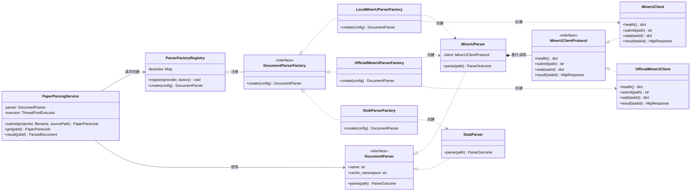
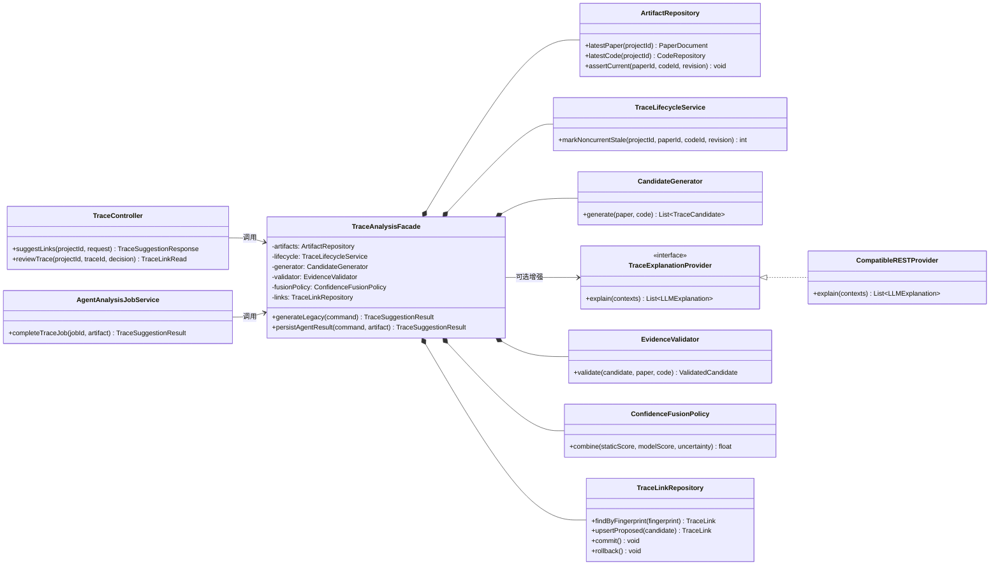
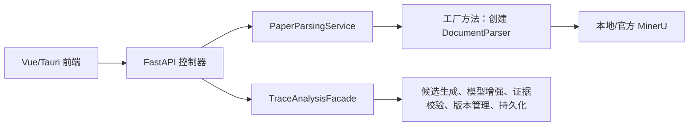

# TraceLab GOF 设计模式详细设计

> 项目：TraceLab 论文代码双向追溯工作台<br>
> 文档版本：1.0<br>
> 日期：2026-07-23<br>
> 设计范围：论文解析子系统、论文—代码追溯子系统

---

## 摘要

TraceLab 是一个面向论文复现和代码审阅的本地优先工作台，核心能力包括论文 PDF 解析、代码仓库分析、张量流建模、论文—代码双向追溯以及 Agent 辅助分析。系统既要接入本地 MinerU 和 MinerU 官方 API 等不同外部服务，又要协调候选生成、LLM/Agent 增强、证据校验、版本管理和结果持久化等复杂流程。

依据课程课件《04_软件架构设计》第 18、20 页对设计模式的定义与分类，本文从课件明确出现的 **工厂模式、Facade（外观）模式、单例模式** 中选择两种最适合 TraceLab 变化点的 GOF 设计模式：

1. **Factory Method（工厂方法）模式**：封装不同论文解析器及其客户端的创建过程，使业务层只依赖统一的 `DocumentParser` 接口。
2. **Facade（外观）模式**：为追溯分析子系统提供统一入口，隐藏候选生成、模型增强、证据校验、版本失效和持久化等内部协作细节。

这两种模式分别解决“对象如何创建”和“复杂子系统如何使用”的问题，可提高 TraceLab 的可扩展性、可测试性和可维护性。

---

## 1. 文档目的与设计依据

### 1.1 文档目的

本文面向课程设计评审和后续编码实现，目标如下：

- 列出两种 GOF 设计模式在 TraceLab 中的具体使用位置；
- 说明采用模式前存在的问题、模式参与者和对象协作方式；
- 使用 UML 类图表达静态结构；
- 给出关键接口、执行流程、异常处理和测试方案；
- 将模式设计映射到当前仓库，区分已有雏形与建议重构内容。

### 1.2 课件依据

课程课件给出的核心观点是：模式是在特定上下文中对重复问题的可复用解决方案；GOF 总结了 23 种常用面向对象设计模式。课件第 20 页明确将 Facade、工厂和单例列为设计模式示例。

本文选择工厂方法和外观模式，理由如下：

| 变化或复杂点 | 设计模式 | 选择理由 |
|---|---|---|
| 本地 MinerU、官方 MinerU、测试解析器的配置、认证和传输方式不同 | 工厂方法 | 将创建逻辑从解析任务服务中分离，新增提供方时不修改业务调用流程 |
| 一次追溯分析需要协调多个子模块，并保持证据、版本和事务规则一致 | 外观 | 对控制器和 Agent 任务暴露少量稳定入口，防止上层直接拼装内部步骤 |

本次不选择单例模式。TraceLab 中的数据库会话、解析器和模型客户端都需要按运行环境替换或隔离；若将它们设计为全局单例，会增加测试污染、并发状态共享和配置热更新的风险。FastAPI 应用生命周期或依赖注入已经能够管理共享资源，无须把单例作为本次核心模式。

### 1.3 系统上下文

TraceLab 采用 Vue 3 前端、FastAPI 后端和 SQLite 本地数据库。与本文相关的两条业务链路为：

1. **论文解析链路**：上传 PDF → 创建异步任务 → 选择解析提供方 → 调用 MinerU → 规范化结果 → 写入缓存和数据库。
2. **追溯链路**：读取论文与代码版本 → 生成或接收候选 → 校验证据 → 计算置信度 → 去重持久化 → 人工接受或拒绝。

---

## 2. 模式一：Factory Method（工厂方法）模式

### 2.1 使用场景

TraceLab 支持以下论文解析实现：

- 本地 `mineru-api`：无远程令牌，使用本地任务提交、轮询和结果下载协议；
- MinerU 官方 API：需要令牌、预签名上传、批次轮询和失败重试；
- `StubParser`：在单元测试中返回确定性数据，不访问外部服务；
- 后续可能增加离线解析器或其他云端 OCR 服务。

这些实现最终都应返回统一的 `ParseOutcome`，业务层不应了解每种客户端的构造参数和认证细节。

### 2.2 模式意图

定义创建 `DocumentParser` 的统一工厂接口，由具体工厂决定实例化哪一种解析器及其依赖的客户端。`PaperParsingService` 只面向抽象工厂和抽象产品编程。

课件中统称“工厂模式”；本文将其具体落实为 GOF **Factory Method**：创建步骤由 `LocalMinerUParserFactory`、`OfficialMinerUParserFactory` 和 `StubParserFactory` 等具体创建者实现。

### 2.3 参与者与项目映射

| GOF 角色 | TraceLab 类/接口 | 职责 |
|---|---|---|
| Product | `DocumentParser` | 规定 `name`、`cache_namespace` 和 `parse(path)` 统一契约 |
| Concrete Product | `MinerUParser`、`StubParser` | 执行实际解析并返回 `ParseOutcome` |
| Creator | `DocumentParserFactory` | 声明 `create(config)` 工厂方法 |
| Concrete Creator | `LocalMinerUParserFactory` | 创建本地 `MinerUClient` 并装配 `MinerUParser` |
| Concrete Creator | `OfficialMinerUParserFactory` | 创建 `OfficialMinerUClient` 并装配 `MinerUParser` |
| Concrete Creator | `StubParserFactory` | 创建测试使用的 `StubParser` |
| 工厂注册表 | `ParserFactoryRegistry` | 按 `mineru_provider` 找到具体工厂；不包含具体客户端构造细节 |
| Client | `PaperParsingService` | 取得抽象解析器并执行异步任务、缓存和结果读取 |

### 2.4 UML 类图



### 2.5 关键接口设计

以下代码为详细设计级伪代码，用于说明职责边界：

```python
class DocumentParserFactory(Protocol):
    def create(self, config: IntegrationConfig) -> DocumentParser:
        ...


class LocalMinerUParserFactory:
    def create(self, config: IntegrationConfig) -> DocumentParser:
        client = MinerUClient(MinerUSettings.from_config(config))
        return MinerUParser(client)


class OfficialMinerUParserFactory:
    def create(self, config: IntegrationConfig) -> DocumentParser:
        client = OfficialMinerUClient(OfficialMinerUSettings.from_config(config))
        return MinerUParser(client)


class ParserFactoryRegistry:
    def create(self, config: IntegrationConfig) -> DocumentParser:
        factory = self.factories.get(config.mineru_provider)
        if factory is None:
            raise UnsupportedParserProvider(config.mineru_provider)
        return factory.create(config)
```

设计约束：

- 工厂负责对象创建和配置转换，不负责提交解析任务；
- 解析器负责把客户端调用编排成统一 `ParseOutcome`；
- 客户端负责特定提供方的 HTTP 协议、认证、超时和重试；
- `normalizer` 负责把不同原始结果转换成稳定的 `ParsedDocument`；
- API 令牌只进入官方客户端配置，不写入日志、缓存键或 API 响应；
- 未识别的 provider 必须显式失败，不能静默回退到其他远程服务。

### 2.6 对象协作流程

1. 用户在设置中选择本地或官方 MinerU。
2. `PaperParsingService` 读取当前 `IntegrationConfig`。
3. `ParserFactoryRegistry` 根据 `mineru_provider` 选择具体工厂。
4. 具体工厂创建客户端配置、客户端和 `MinerUParser`。
5. `PaperParsingService` 将 PDF 交给抽象 `DocumentParser`。
6. 解析器依次调用 `health/submit/wait/result`，再规范化为 `ParseOutcome`。
7. 任务服务使用“文件内容哈希 + 解析器 cache namespace”生成缓存键并保存结果。

### 2.7 异常与扩展设计

| 场景 | 处理方式 |
|---|---|
| provider 值未知 | 工厂注册表抛出 `UnsupportedParserProvider`，任务不启动 |
| 官方模式未配置令牌 | 工厂或客户端在发出请求前失败，错误信息不包含令牌 |
| MinerU 不可用或超时 | 解析器抛出领域异常，任务状态置为 `failed`，不影响项目其他功能 |
| 相同 PDF 和相同解析配置重复提交 | 根据 `cache_namespace` 命中缓存，避免重复解析 |
| 新增其他 OCR 提供方 | 新增 `DocumentParserFactory` 实现并注册，不修改 `PaperParsingService` |
| 单元测试 | 注入 `StubParserFactory` 或直接注入 `StubParser`，无需网络 |

### 2.8 模式效果

**优点：**

- 满足开闭原则：增加解析提供方时扩展工厂，不改任务主流程；
- 满足依赖倒置原则：任务服务依赖 `DocumentParser` 抽象；
- 将令牌、重试和构造参数集中在具体工厂与客户端中；
- 便于测试异常、超时、缓存等分支；
- 避免控制器中出现长 `if/elif` 创建逻辑。

**代价与控制措施：**

- 类数量增加，因此只为真正存在创建差异的 provider 建立具体工厂；
- 工厂注册表可能成为隐式服务定位器，因此只允许在应用组合根注册，业务代码不得随意查询全局对象；
- 解析器和客户端的职责容易混淆，应保持“解析器编排、客户端通信、规范化器转换”的边界。

---

## 3. 模式二：Facade（外观）模式

### 3.1 使用场景

追溯关系是 TraceLab 的核心领域对象。一次“生成追溯候选”并不只是调用模型，而需要处理以下步骤：

- 读取当前论文文档与代码仓库版本；
- 将旧版本的追溯关系标记为 `stale`；
- 生成静态候选，或接收 Agent 分析候选；
- 可选调用 OpenAI-compatible LLM 解释候选；
- 校验论文、代码两侧的引用和原文证据；
- 融合静态分数与模型分数，并应用不确定性惩罚；
- 计算 fingerprint 去重；
- 新建或更新 `proposed` 记录，同时保护已接受/已拒绝的人工决策；
- 在一个事务中提交，并返回统一的降级状态。

如果 API 控制器、Agent 作业和其他调用方分别拼装这些步骤，很容易出现证据校验缺失、版本规则不一致或部分提交。

### 3.2 模式意图

通过 `TraceAnalysisFacade` 为追溯子系统提供少量高层操作。调用方只描述“对哪个项目、哪一版本、采用何种分析来源执行追溯”，由外观对象协调各内部组件。

外观不会取代子系统对象，也不阻止内部高级调用；它负责固化最常见且必须保持一致的业务流程和事务边界。

### 3.3 参与者与项目映射

| GOF 角色 | TraceLab 类/模块 | 职责 |
|---|---|---|
| Facade | `TraceAnalysisFacade` | 提供生成、校验和持久化追溯结果的统一入口 |
| Client | `TraceController` | 将 HTTP 请求转换为命令并调用外观 |
| Client | `AgentAnalysisJobService` | 将 Agent 完成的结构化候选交给外观校验和持久化 |
| Subsystem | `ArtifactRepository` | 读取当前论文、代码及其 revision |
| Subsystem | `TraceLifecycleService` | 代码或论文版本变化时标记旧追溯为 stale |
| Subsystem | `CandidateGenerator` | 生成 legacy 静态候选 |
| Subsystem | `TraceExplanationProvider` | 可选调用 LLM 生成解释和置信度 |
| Subsystem | `EvidenceValidator` | 验证两侧 ref、quote、路径与行号 |
| Subsystem | `ConfidenceFusionPolicy` | 融合静态/模型置信度并处理不确定性 |
| Subsystem | `TraceLinkRepository` | fingerprint 查询、upsert 和事务持久化 |

### 3.4 UML 类图



### 3.5 外观接口设计

```python
@dataclass(frozen=True)
class TraceAnalysisCommand:
    project_id: int
    paper_document_id: int | None
    code_repository_id: int | None
    use_llm: bool


@dataclass(frozen=True)
class TraceSuggestionResult:
    items: list[TraceLinkRead]
    mode: str
    degraded: bool
    degraded_reason: str | None


class TraceAnalysisFacade:
    def generate_legacy(
        self, command: TraceAnalysisCommand
    ) -> TraceSuggestionResult:
        """生成静态候选，可选 LLM 增强，并以事务方式持久化。"""

    def persist_agent_result(
        self, command: TraceAnalysisCommand, artifact: AgentTraceArtifact
    ) -> TraceSuggestionResult:
        """严格校验 Agent 候选后持久化；校验失败时不产生部分结果。"""
```

这里保留 `generate_legacy` 与 `persist_agent_result` 两个明确入口，是因为两条流程的降级规则不同：legacy 流程允许 LLM 不可用时保留静态候选；新的 Agent 分析流程要求证据完备，失败时不能伪装成静态成功。外观统一版本、证据和持久化规则，但不掩盖关键业务语义。

### 3.6 核心执行流程

#### 3.6.1 Legacy 静态/LLM 追溯

1. 外观通过 `ArtifactRepository` 取得指定或最新的论文、代码版本，并验证它们属于当前项目。
2. `TraceLifecycleService` 将非当前 revision 的历史追溯标为 `stale`。
3. `CandidateGenerator` 基于论文段落、代码符号、PyTorch 候选和张量图生成静态候选。
4. 若 `use_llm=true`，外观获得 `TraceExplanationProvider` 并提交受预算限制的上下文。
5. `EvidenceValidator` 检查每个解释是否同时包含 paper/code 两侧证据，且 quote 是当前原文的精确子串。
6. `ConfidenceFusionPolicy` 按规则融合置信度，例如：

   \[
   confidence = clamp(0.6S + 0.4M - P_u,\ 0,\ 1)
   \]

   其中 \(S\) 为静态置信度，\(M\) 为模型置信度，\(P_u\) 为不确定性惩罚。
7. 外观使用论文 ID、代码仓库 ID、revision、论文块 ID、代码符号 ID 和关系类型计算 fingerprint。
8. `TraceLinkRepository` 仅更新 `proposed` 候选，不覆盖 `accepted/rejected` 人工结论。
9. 全部成功后统一提交事务；发生异常时回滚，并返回稳定的错误或降级原因。

#### 3.6.2 Agent 追溯结果持久化

1. `AgentAnalysisJobService` 将完整结构化 artifact 交给外观，而不是直接写数据库。
2. 外观校验 job 对应的论文和代码 revision 仍是当前版本。
3. `EvidenceValidator` 校验所有候选的 block ID、symbol ID、路径、行号和 quote。
4. 任一候选结构非法或引用过期时，整个结果拒绝持久化，避免“部分可信”结果混入审阅列表。
5. 校验通过后按 fingerprint 幂等写入 `source=agent` 的 proposed 关系。
6. 返回统一 `TraceSuggestionResult`，供 API、SSE 事件和审计记录使用。

### 3.7 不变量与事务边界

外观必须保证以下领域不变量：

- 每条自动追溯同时具有论文侧和代码侧证据；
- 证据引用属于命令指定的项目和 artifact 版本；
- 同一 fingerprint 在当前版本下唯一；
- 自动流程只能新建或更新 `proposed`，不能覆盖人工 `accepted/rejected`；
- 版本变化后，旧结果保留用于审计但状态变为 `stale`；
- 无效模型数据绝不持久化；
- 一批候选的校验、upsert 和状态更新处于同一事务，失败时回滚。

### 3.8 模式效果

**优点：**

- 控制器只负责 HTTP 参数和响应，不再了解追溯内部算法；
- API 与 Agent 任务复用同一证据、版本和事务规则；
- 子系统重构不会频繁改变上层接口；
- 集中记录 `mode/degraded/degraded_reason`，便于前端展示与审计；
- 可以通过替换子系统接口独立测试外观的编排逻辑。

**代价与控制措施：**

- 外观可能膨胀成“上帝类”。因此外观只做编排，不实现候选算法、HTTP 调用或数据库细节；
- 过度隐藏可能妨碍高级功能。内部模块仍保留接口，但普通控制器必须优先使用外观；
- 外观成为关键路径，应对每条降级分支、事务回滚和版本竞争编写测试。

---

## 4. 两种模式的协同关系

两种模式位于不同层次，彼此互补：



- 工厂方法控制论文解析对象的创建变化，使系统能稳定地产出统一论文块；
- 外观模式使用这些稳定论文块和代码符号完成追溯分析，控制复杂业务协作；
- 工厂方法降低“接入新服务”的改动范围，外观模式降低“调用复杂服务”的认知成本；
- 两者共同使上层 API 面向稳定抽象，而不是依赖外部提供方或底层算法细节。

---

## 5. 与当前代码的对应关系

### 5.1 已有设计雏形

| 设计内容 | 当前代码位置 | 状态 |
|---|---|---|
| 统一解析器产品接口 | `backend/app/services/document_parsers/base.py` 中的 `DocumentParser` | 已实现 |
| 本地与官方 MinerU 客户端 | `mineru.py`、`mineru_official.py` | 已实现 |
| 具体解析器 | `MinerUParser`、`StubParser` | 已实现 |
| 解析对象创建 | `document_parsers/factory.py` 中的 `create_mineru_parser()` | 已有简单工厂雏形 |
| 解析任务客户端 | `document_parsers/jobs.py` 中的 `PaperParsingService` | 已实现 |
| 追溯高层编排 | `tracing/service.py` 中的 `suggest_and_persist()` | 已承担函数式外观职责 |
| 追溯子系统 | `static_candidates.py`、`context.py`、`provider.py`、`lifecycle.py` | 已实现 |
| API 调用方 | `api/routes/traces.py` | 已实现 |

### 5.2 建议重构

1. 将 `create_mineru_parser()` 的条件分支重构为 `DocumentParserFactory` 及其具体工厂，并在应用组合根完成注册。
2. 保留 `PaperParsingService(parser=...)` 的直接注入能力，使测试可以绕过注册表。
3. 将 `suggest_and_persist()` 提升为可注入依赖的 `TraceAnalysisFacade`，但保持现有 API 响应契约不变。
4. 从外观中继续拆出 `EvidenceValidator`、`ConfidenceFusionPolicy` 和 `TraceLinkRepository`，避免外观直接承担算法与持久化细节。
5. 让 Agent 分析结果和 legacy 建议入口复用同一套版本、证据和 fingerprint 规则。

---

## 6. 测试与验收设计

### 6.1 工厂方法模式测试

| 编号 | 测试内容 | 预期结果 |
|---|---|---|
| F-01 | provider 为 `local` | 创建含 `MinerUClient` 的 `MinerUParser` |
| F-02 | provider 为 `official` 且令牌有效 | 创建含 `OfficialMinerUClient` 的 `MinerUParser` |
| F-03 | provider 未注册 | 抛出明确领域异常，不发出网络请求 |
| F-04 | 注入 `StubParserFactory` | 返回确定性结果，可离线执行测试 |
| F-05 | 相同 PDF、相同 provider 和参数重复解析 | cache key 相同并命中缓存 |
| F-06 | 同一 PDF 切换 provider 或关键参数 | cache namespace 不同，不错误复用结果 |

### 6.2 外观模式测试

| 编号 | 测试内容 | 预期结果 |
|---|---|---|
| A-01 | 静态候选生成成功且不使用 LLM | 返回 `mode=static` 并持久化 proposed 关系 |
| A-02 | LLM 不可用 | legacy 流程降级为静态结果并给出稳定 reason |
| A-03 | 模型证据缺少一侧或 quote 不在原文 | 该解释不持久化，记录证据无效原因 |
| A-04 | 重复执行相同命令 | fingerprint 保证幂等，不产生重复关系 |
| A-05 | 已存在 accepted/rejected 记录 | 自动流程不覆盖人工决策 |
| A-06 | 代码 revision 改变 | 旧追溯标记 stale，新结果绑定新 revision |
| A-07 | 一批 Agent 候选中有一个引用非法 | 整批回滚，不产生部分写入 |
| A-08 | 持久化阶段发生异常 | 事务回滚，返回失败且数据库保持一致 |

### 6.3 验收标准

- API 控制器中不出现具体 MinerU 客户端构造代码；
- 新增解析 provider 时无需修改 `PaperParsingService`；
- 追溯控制器和 Agent 作业不直接组合证据校验、fingerprint 和 upsert 细节；
- 所有自动追溯都可追溯到明确的论文/代码版本与双侧证据；
- 模式相关单元测试、追溯集成测试和工作台端到端主流程均通过。

---

## 7. 结论

本文将课件中出现的两种 GOF 设计模式应用于 TraceLab 的真实变化点：

- **Factory Method** 把本地 MinerU、官方 MinerU 和测试解析器的创建差异封装在具体工厂中，使论文任务服务只依赖统一解析接口；
- **Facade** 把追溯候选生成、模型增强、证据校验、版本生命周期和持久化组织为稳定的高层操作，使 API 与 Agent 调用方遵守一致的领域规则。

两种模式没有改变 TraceLab 的业务功能，而是重新安排了职责和依赖方向。最终效果是：外部服务更容易替换，核心追溯流程更容易理解和测试，新增功能的修改范围更小，同时能够保持版本、证据和人工审阅结果的一致性。

---

## 参考资料

1. 《04_软件架构设计》课程课件，第 18-20 页，模式定义、GOF 设计模式及 Facade/工厂/单例示例。
2. Erich Gamma, Richard Helm, Ralph Johnson, John Vlissides. *Design Patterns: Elements of Reusable Object-Oriented Software*.
3. [README.md](../README.md)，TraceLab 功能、技术栈与演示闭环。
4. [architecture.md](architecture.md)，TraceLab 当前软件架构及源码映射。
5. [papers.md](contracts/papers.md)，论文解析接口、缓存和降级约束。
6. [traces.md](contracts/traces.md)，追溯证据、版本生命周期与降级契约。
