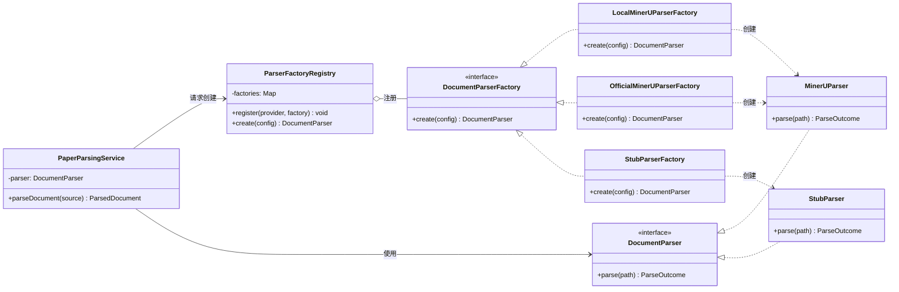
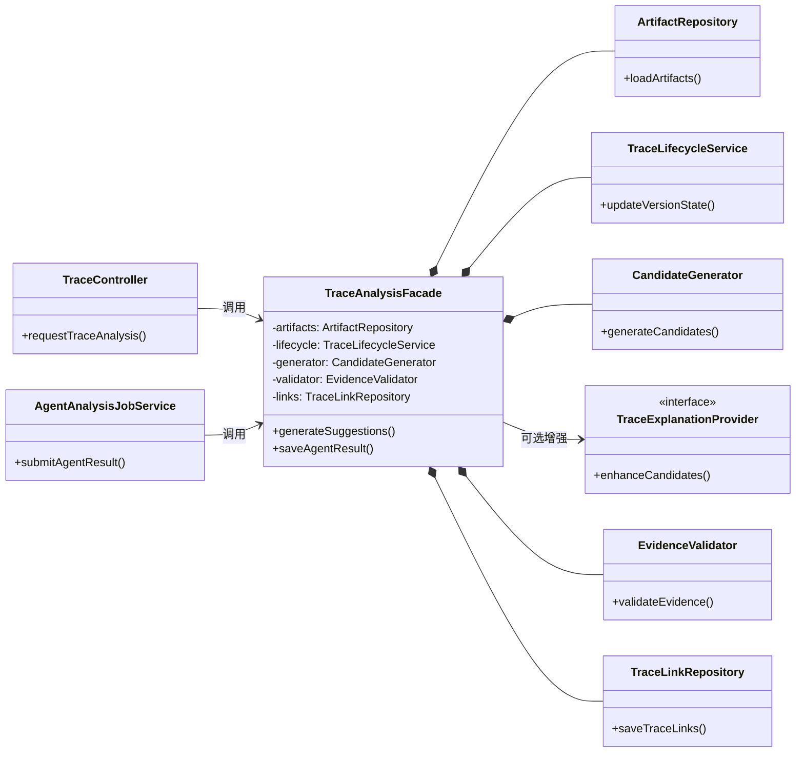
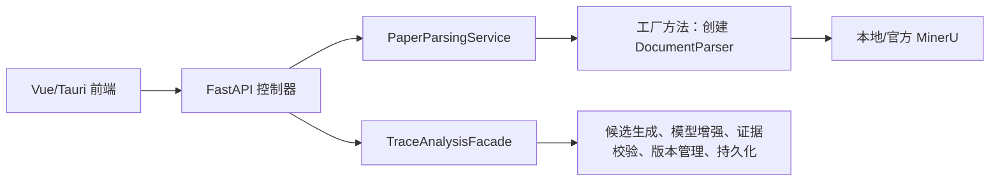

# TraceLab GOF 设计模式详细设计

> 项目：TraceLab 论文代码双向追溯工作台<br>
> 文档版本：1.0<br>
> 日期：2026-07-23<br>
> 设计范围：论文解析子系统、论文—代码追溯子系统

---

## 摘要

TraceLab 是一个面向论文复现和代码审阅的本地优先工作台，核心能力包括论文 PDF 解析、代码仓库分析、张量流建模、论文—代码双向追溯以及 Agent 辅助分析。系统既要接入本地 MinerU 和 MinerU 官方 API 等不同外部服务，又要协调候选生成、LLM/Agent 增强、证据校验、版本管理和结果持久化等复杂流程。

结合 TraceLab 的外部服务接入方式和核心业务流程，本文选择两种最适合系统变化点的 GOF 设计模式：

1. **Factory Method（工厂方法）模式**：封装不同论文解析器及其客户端的创建过程，使业务层只依赖统一的 `DocumentParser` 接口。
2. **Facade（外观）模式**：为追溯分析子系统提供统一入口，隐藏候选生成、模型增强、证据校验、版本失效和持久化等内部协作细节。

这两种模式分别解决“对象如何创建”和“复杂子系统如何使用”的问题，可提高 TraceLab 的可扩展性、可测试性和可维护性。

---

## 1. 文档目的与设计依据

### 1.1 文档目的

本文面向项目设计评审和后续编码实现，目标如下：

- 列出两种 GOF 设计模式在 TraceLab 中的具体使用位置；
- 说明采用模式前存在的问题、模式参与者和对象协作方式；
- 使用 UML 类图表达静态结构；
- 给出关键接口、对象协作流程和模式效果；
- 使设计结构能够与当前系统中的论文解析和追溯功能对应。

### 1.2 模式选择依据

设计模式是在特定上下文中对重复设计问题的可复用解决方案。本文不追求模式数量，而是围绕 TraceLab 中稳定存在的创建变化和子系统协作复杂度选择模式。

本文选择工厂方法和外观模式，理由如下：

| 变化或复杂点 | 设计模式 | 选择理由 |
|---|---|---|
| 本地 MinerU、官方 MinerU、测试解析器的配置、认证和传输方式不同 | 工厂方法 | 将创建逻辑从解析任务服务中分离 新增提供方时不修改业务调用流程 |
| 一次追溯分析需要协调多个子模块，并保持证据、版本和事务规则一致 | 外观 | 对控制器和 Agent 任务暴露少量稳定入口，防止上层直接拼装内部步骤 |

本次不选择单例模式。TraceLab 中的数据库会话、解析器和模型客户端都需要按运行环境替换或隔离；若将它们设计为全局单例，会增加测试污染、并发状态共享和配置热更新的风险。FastAPI 应用生命周期或依赖注入已经能够管理共享资源，无须把单例作为本次核心模式。

### 1.3 系统上下文

TraceLab 采用 Vue 3 前端、FastAPI 后端和 SQLite 本地数据库。与本文相关的两条业务链路为：

1. **论文解析链路**：上传 PDF → 创建异步任务 → 选择解析提供方 → 调用 MinerU → 规范化结果 → 写入缓存和数据库。
2. **追溯链路**：读取论文与代码版本 → 生成或接收候选 → 校验证据 → 计算置信度 → 去重持久化 → 人工接受或拒绝。

---

## 2. 模式一：Factory Method（工厂方法）模式

### 2.1 使用场景

TraceLab 既支持本地 MinerU，也支持 MinerU 官方 API，并使用 `StubParser` 完成不依赖外部服务的测试。不同解析方式具有不同的创建和配置过程，后续还可能增加离线解析器或其他 OCR 服务。

这些实现最终都应返回统一的 `ParseOutcome`，业务层不应了解每种客户端的构造参数和认证细节。

### 2.2 模式意图

定义创建 `DocumentParser` 的统一工厂接口，由具体工厂决定实例化哪一种解析器及其依赖的客户端。`PaperParsingService` 只面向抽象工厂和抽象产品编程。

本文采用 GOF **Factory Method**：创建步骤由 `LocalMinerUParserFactory`、`OfficialMinerUParserFactory` 和 `StubParserFactory` 等具体创建者实现。

### 2.3 参与者与项目映射

| GOF 角色 | TraceLab 类/接口 | 职责 |
|---|---|---|
| Product | `DocumentParser` | 定义统一的论文解析契约 |
| Concrete Product | `MinerUParser`、`StubParser` | 执行实际解析并返回 `ParseOutcome` |
| Creator | `DocumentParserFactory` | 声明 `create(config)` 工厂方法 |
| Concrete Creator | `LocalMinerUParserFactory` | 创建使用本地服务的解析器 |
| Concrete Creator | `OfficialMinerUParserFactory` | 创建使用官方服务的解析器 |
| Concrete Creator | `StubParserFactory` | 创建测试使用的 `StubParser` |
| 工厂注册表 | `ParserFactoryRegistry` | 根据解析方式选择具体工厂 |
| Client | `PaperParsingService` | 取得抽象解析器并发起解析任务 |

### 2.4 UML 类图



### 2.5 关键接口设计

以下伪代码只展示工厂方法的核心结构：

```python
class DocumentParserFactory(Protocol):
    def create(self, config: IntegrationConfig) -> DocumentParser:
        ...


class LocalMinerUParserFactory:
    def create(self, config: IntegrationConfig) -> DocumentParser:
        return MinerUParser(config)


class OfficialMinerUParserFactory:
    def create(self, config: IntegrationConfig) -> DocumentParser:
        return MinerUParser(config)
```

设计约束：

- 工厂只负责选择和创建解析器，不承担论文解析业务；
- 所有具体解析器都遵循 `DocumentParser` 接口并返回统一结果；
- `PaperParsingService` 只依赖抽象产品，不直接创建具体解析器。

### 2.6 对象协作流程

1. 用户在设置中选择本地或官方 MinerU。
2. `ParserFactoryRegistry` 根据配置选择具体工厂。
3. 具体工厂创建相应的 `DocumentParser`。
4. `PaperParsingService` 通过统一接口提交 PDF。
5. 具体解析器完成解析并返回统一结果。

### 2.7 扩展性说明

| 场景 | 处理方式 |
|---|---|
| 新增其他 OCR 提供方 | 新增 `DocumentParserFactory` 实现并注册，不修改 `PaperParsingService` |
| 自动化测试 | 注入 `StubParserFactory`，无需调用外部解析服务 |
| 创建失败 | 由工厂统一报告不支持的解析方式或配置错误 |

### 2.8 模式效果

**优点：**

- 满足开闭原则：增加解析提供方时扩展工厂，不改任务主流程；
- 满足依赖倒置原则：任务服务依赖 `DocumentParser` 抽象；
- 隔离不同解析器的创建差异，便于替换和测试；
- 避免控制器中出现长 `if/elif` 创建逻辑。

**代价与控制措施：**

- 类数量增加，因此只为真正存在创建差异的 provider 建立具体工厂；
- 工厂只处理对象创建，避免混入解析流程和业务规则。

---

## 3. 模式二：Facade（外观）模式

### 3.1 使用场景

追溯关系是 TraceLab 的核心领域对象。一次“生成追溯候选”需要协调论文与代码读取、候选生成、模型增强、证据校验、版本管理和结果保存等多个子模块。

如果 API 控制器、Agent 作业和其他调用方分别拼装这些步骤，很容易出现证据校验缺失、版本规则不一致或部分提交。

### 3.2 模式意图

通过 `TraceAnalysisFacade` 为追溯子系统提供少量高层操作。调用方只描述“对哪个项目、哪一版本、采用何种分析来源执行追溯”，由外观对象协调各内部组件。

外观不会取代子系统对象，也不阻止内部高级调用；它负责固化最常见且必须保持一致的业务流程和事务边界。

### 3.3 参与者与项目映射

| GOF 角色 | TraceLab 类/模块 | 职责 |
|---|---|---|
| Facade | `TraceAnalysisFacade` | 提供生成、校验和持久化追溯结果的统一入口 |
| Client | `TraceController` | 接收请求并调用外观 |
| Client | `AgentAnalysisJobService` | 将 Agent 完成的结构化候选交给外观校验和持久化 |
| Subsystem | `ArtifactRepository` | 读取当前论文和代码 |
| Subsystem | `TraceLifecycleService` | 管理追溯结果的版本状态 |
| Subsystem | `CandidateGenerator` | 生成追溯候选 |
| Subsystem | `TraceExplanationProvider` | 可选调用模型增强候选 |
| Subsystem | `EvidenceValidator` | 校验论文侧和代码侧证据 |
| Subsystem | `TraceLinkRepository` | 保存追溯结果 |

### 3.4 UML 类图



### 3.5 外观接口设计

`TraceAnalysisFacade` 对外提供两个高层操作：

| 操作 | 作用 |
|---|---|
| `generateSuggestions()` | 组织候选生成、可选模型增强、证据校验和结果保存 |
| `saveAgentResult()` | 校验并保存 Agent 生成的追溯结果 |

两个操作共享版本管理、证据校验和持久化规则，但保留各自的业务语义。调用方不需要了解内部子模块的调用顺序。

### 3.6 核心执行流程

1. `TraceController` 或 `AgentAnalysisJobService` 调用外观提供的高层操作。
2. 外观通过 `ArtifactRepository` 取得当前论文和代码。
3. `CandidateGenerator` 生成候选，必要时由 `TraceExplanationProvider` 进行增强。
4. `EvidenceValidator` 校验论文侧和代码侧证据。
5. `TraceLifecycleService` 处理版本变化带来的状态更新。
6. `TraceLinkRepository` 保存结果，外观将统一结果返回调用方。

普通追溯和 Agent 追溯可以采用不同的候选来源，但都通过外观遵守相同的证据、版本和保存规则。

### 3.7 统一业务规则

外观集中保证以下业务规则：

- 每条自动追溯都具有论文侧和代码侧证据；
- 追溯结果与当前论文、代码版本对应；
- 自动分析不覆盖用户已经作出的审阅结论；
- 一次分析中的状态更新和结果保存保持一致。

### 3.8 模式效果

**优点：**

- 控制器只负责 HTTP 参数和响应，不再了解追溯内部算法；
- API 与 Agent 任务复用同一证据、版本和事务规则；
- 子系统重构不会频繁改变上层接口；
- 可以通过替换子系统接口独立测试外观的编排逻辑。

**代价与控制措施：**

- 外观可能膨胀成“上帝类”。因此外观只做编排，不实现候选算法、HTTP 调用或数据库细节；
- 过度隐藏可能妨碍高级功能，因此内部子模块仍保留独立接口。

---

## 4. 两种模式的协同关系

两种模式位于不同层次，彼此互补：



- 工厂方法控制论文解析对象的创建变化，使系统能稳定地产出统一论文块；
- 外观模式使用这些稳定论文块和代码符号完成追溯分析，控制复杂业务协作；
- 工厂方法降低“接入新服务”的改动范围，外观模式降低“调用复杂服务”的认知成本；
- 两者共同使上层 API 面向稳定抽象，而不是依赖外部提供方或底层算法细节。

---


## 5. 结论

本文将两种 GOF 设计模式应用于 TraceLab 的真实变化点：

- **Factory Method** 把本地 MinerU、官方 MinerU 和测试解析器的创建差异封装在具体工厂中，使论文任务服务只依赖统一解析接口；
- **Facade** 把追溯候选生成、模型增强、证据校验、版本生命周期和持久化组织为稳定的高层操作，使 API 与 Agent 调用方遵守一致的领域规则。

两种模式没有改变 TraceLab 的业务功能，而是重新安排了职责和依赖方向。最终效果是：外部服务更容易替换，核心追溯流程更容易理解和测试，新增功能的修改范围更小，同时能够保持版本、证据和人工审阅结果的一致性。
