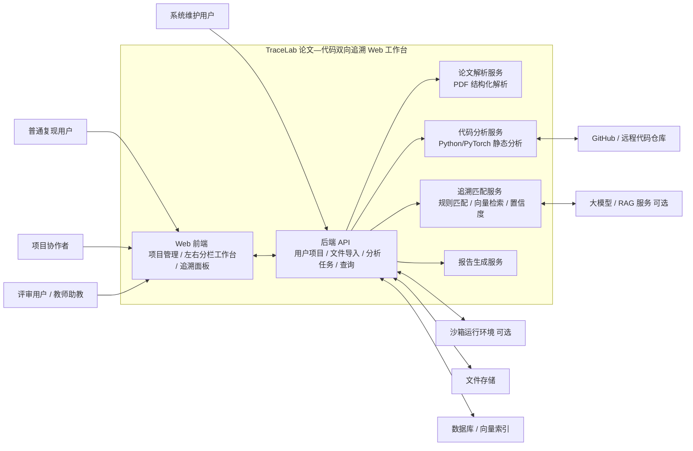

# TraceLab：面向深度学习论文复现的论文—代码双向追溯 Web 工作台

**前景文档**  
**版本：1.1（简化模板版）**  
**日期：2026/07/09**  
**单位：SJTU**  
**状态：小组讨论稿 最终版**

---

## 修订历史记录

| 日期 | 版本 | 说明 | 作者 |
|---|---:|---|---|
| 2026/07/06 | 1.0 | 根据项目申报、第一次迭代计划和旧版 Vision 模板初步完成前景文档 | 项目组 |
| 2026/07/09 | 1.1 | 按课程提供的新简化模板重整结构，压缩第 9、10 章为可选简版，补充 Context Diagram | 项目组 |

---

## 目录

1. [简介](#1-简介)  
   1.1 [目的](#11-目的)  
   1.2 [范围](#12-范围)  
   1.3 [定义、首字母缩写词和缩略语](#13-定义首字母缩写词和缩略语)  
   1.4 [参考资料](#14-参考资料)  
2. [定位](#2-定位)  
   2.1 [商机](#21-商机)  
   2.2 [问题说明](#22-问题说明)  
   2.3 [产品定位说明](#23-产品定位说明)  
3. [涉众和用户说明](#3-涉众和用户说明)  
   3.1 [涉众和用户概要](#31-涉众和用户概要)  
   3.2 [备选方案和竞争](#32-备选方案和竞争)  
4. [产品概述](#4-产品概述)  
5. [产品特性](#5-产品特性)  
6. [约束](#6-约束)  
7. [质量属性](#7-质量属性)  
8. [优先级](#8-优先级)  
9. [其他产品需求（可选，简版保留）](#9-其他产品需求可选简版保留)  
10. [文档需求（可选，简版保留）](#10-文档需求可选简版保留)  

---

# 前景

## 1. 简介

### 1.1 目的

本文档用于收集、分析和定义 **TraceLab：面向深度学习论文复现的论文—代码双向追溯 Web 工作台** 的高层次需求和产品特性，说明项目希望解决的问题、目标用户、核心价值、主要功能、约束条件和质量属性。

本文档面向项目组成员、课程教师、助教、潜在用户以及后续需求分析、用例建模、架构设计、迭代计划和测试验收文档的编写者。它不展开到详细算法实现或数据库字段级设计，而是作为后续功能需求建模和系统设计的共同依据。

### 1.2 范围

TraceLab 第一阶段定位为一个独立的 Web 工作台，主要支持深度学习论文 PDF 与 Python/PyTorch 代码仓库之间的关联分析。用户可以在系统中创建论文复现项目，上传论文 PDF，并绑定 GitHub 仓库或上传本地代码压缩包。系统对论文和代码分别进行结构化解析与静态分析，生成候选论文—代码追溯关系，并通过分栏界面展示论文、代码、匹配理由、置信度和相关上下文。

第一阶段重点完成以下范围：

1. 论文与代码项目导入。
2. 论文 PDF 结构化解析。
3. Python/PyTorch 代码静态分析。
4. 论文—代码候选追溯关系生成。
5. 左右分栏阅读与代码浏览界面。
6. 追溯关系查看、人工确认和修正。
7. 基础复现辅助与一致性提示。
8. 项目分析结果保存与报告导出。

第一阶段不以替代完整 IDE 为目标，不追求通用多语言代码分析，也不强制实现复杂多模态图文代码对齐、动态运行追踪、完整协作工作流和生产级多租户部署。VS Code 插件、大模型深度解释、动态张量验证和代码魔改影响分析作为后续扩展方向保留。

### 1.3 定义、首字母缩写词和缩略语

| 术语 | 定义 |
|---|---|
| TraceLab | 本项目名称，指面向深度学习论文复现的论文—代码双向追溯 Web 工作台。 |
| 论文—代码追溯 | 在论文中的公式、图表、算法流程、模块描述与代码中的类、函数、变量、配置项、张量操作之间建立可跳转、可解释、可保存的关联关系。 |
| Web 工作台 | 通过浏览器访问的项目分析界面，集成论文阅读、代码浏览、追溯展示和复现辅助功能。 |
| PDF 结构化解析 | 从论文 PDF 中提取标题、摘要、章节、段落、公式附近文本、图表标题、算法框等结构化内容。 |
| 代码静态分析 | 在不实际运行代码的情况下，分析代码目录、类、函数、导入关系、模型定义、训练脚本、配置文件和关键变量。 |
| RAG | Retrieval-Augmented Generation，检索增强生成技术，用于结合项目索引和大模型生成解释。 |
| AST | Abstract Syntax Tree，抽象语法树，用于 Python 代码结构分析。 |
| PyTorch Hook / torch.fx | PyTorch 中可用于动态运行追踪、模块调用捕获和张量形状验证的机制。 |
| 候选追溯关系 | 系统根据规则、向量检索或大模型辅助生成的论文片段与代码片段的候选对应关系，需允许用户确认或修正。 |

### 1.4 参考资料

1. 《TraceLab 意向表》，项目类型 B 类，项目名称为“TraceLab：基于代码-论文双向追溯的顶会算法复现与魔改工作台”。
2. 《TraceLab：面向深度学习论文复现的论文—代码双向追溯 Web 工作台 前景文档》，版本 1.0，2026/07/06。
3. 《迭代计划》，第 1 次迭代：需求澄清与核心原型搭建，计划时间 2026/07/06—2026/07/12。
4. 课程提供的新版《Vision 文档模板》，其中第 9 章和第 10 章标注为可选内容。
5. 项目组讨论结论：第一阶段以独立 Web 工作台为主体，预留 VS Code / IDE 插件扩展入口。

---

## 2. 定位

### 2.1 商机

深度学习论文复现和模型改造是高校课程、科研训练、算法竞赛和工程研发中的常见任务。用户在复现论文时，通常需要同时阅读论文 PDF、浏览 GitHub 仓库、理解训练脚本、查找模型定义、分析配置文件，并维护个人笔记。现有工具大多只覆盖其中一部分：PDF 阅读器只解决阅读问题，IDE 只解决代码浏览和调试问题，通用大模型问答工具可以解释片段但难以维护稳定的项目级追溯关系。

本项目的机会在于将“论文阅读”和“代码理解”组织到同一个任务场景中，帮助用户围绕论文复现建立结构化索引、候选追溯关系、匹配解释和可保存的复现记录，从而降低定位实现、理解模型结构、检查张量维度和进行模型魔改的成本。

### 2.2 问题说明

| 项目 | 说明 |
|---|---|
| 问题是 | 深度学习论文与开源代码之间缺少可视化、可解释、可保存、可人工修正的双向追溯关系。 |
| 影响 | 论文复现学生、科研人员、算法工程师、课程项目团队，以及需要审阅复现工作的教师和助教。 |
| 问题的后果 | 用户需要在论文和代码中反复手工搜索，容易遗漏关键实现、误解张量维度、错误修改模型结构，导致复现效率低、代码理解成本高、复现过程难以沉淀和审阅。 |
| 成功的解决方案 | 提供统一的 Web 工作台，支持论文和代码导入、论文结构化解析、代码静态分析、候选追溯关系生成、论文—代码双向跳转、匹配理由展示、人工修正、一致性检查和复现报告生成。 |

### 2.3 产品定位说明

| 项目 | 说明 |
|---|---|
| 针对于 | 需要复现、理解或改造深度学习论文代码的学生、科研人员、算法工程师和课程项目团队。 |
| 谁 | 在论文 PDF、模型结构图、公式、算法描述和开源代码之间建立对应关系时耗费大量时间，并希望降低复现和魔改成本。 |
| 该产品 | TraceLab：论文—代码双向追溯 Web 工作台。 |
| 属于 | 面向论文复现的智能阅读与代码分析平台。 |
| 功能 | 提供论文结构化解析、代码静态分析、论文—代码双向追溯、左右分栏可视化阅读、复现辅助、一致性检查和报告导出。 |
| 不同于 | 单纯的 PDF 阅读器、普通 IDE、GitHub 代码浏览器、Notebook、通用大模型问答工具和手工脚本。 |
| 我们的产品 | 以论文复现任务为中心，将论文片段、代码结构、模型模块、追溯解释、人工修正和项目笔记统一组织起来，并为后续 VS Code / IDE 插件接入保留扩展能力。 |

---

## 3. 涉众和用户说明

### 3.1 涉众和用户概要

| 名称 | 说明 | 角色 |
|---|---|---|
| 项目组成员 | 负责需求分析、技术选型、系统设计、编码实现、测试、演示和文档编写。 | 完成课程大作业交付，保证系统按迭代计划推进。 |
| 课程教师 / 助教 | 负责项目过程指导、文档审阅、系统验收和评分。 | 提出课程约束和评价标准，检查进度、功能完成度和文档质量。 |
| 普通复现用户 | 上传论文 PDF 和代码仓库，查看解析结果、追溯关系和复现报告。 | 核心终端用户，主要对应论文复现学生和科研训练用户。 |
| 项目协作者 | 在同一复现项目中补充笔记、修正追溯关系、评论系统匹配结果。 | 支持小组复现协作和后续审阅流程。 |
| 高级模型改造用户 | 关注模型结构、张量形状、超参数和代码修改影响。 | 推动一致性检查、动态追踪和魔改影响分析等进阶功能。 |
| 评审用户 | 查看项目完成情况、演示数据、主要功能和导出报告。 | 对应课程教师、助教或复现小组中的审阅者。 |
| 系统维护用户 | 管理系统部署、环境配置、用户权限、项目存储、日志和备份。 | 保证 Web 服务、数据库、文件存储和可选模型调用服务稳定运行。 |
| GitHub / 代码仓库服务 | 提供远程代码仓库来源。 | 外部系统，用于导入代码项目。 |
| 大模型 / RAG 服务 | 提供语义解释、追溯理由生成和辅助问答。 | 可选外部服务，用于增强追溯结果可读性。 |
| 沙箱运行环境 | 受限运行用户提供的复现脚本或 mock 输入。 | 可选外部环境，用于动态张量验证和运行追踪。 |

### 3.2 备选方案和竞争

#### 3.2.1 普通 IDE / VS Code

普通 IDE 适合代码编辑、代码跳转、断点调试和项目管理，但无法直接理解论文 PDF 中的公式、图表、算法描述，也不会自动维护论文片段到代码片段的追溯关系。因此，IDE 可以作为代码开发工具，但不能单独解决论文复现中的“论文—代码对齐”问题。TraceLab 不替代 IDE，而是提供面向论文复现的分析工作台，并为后续插件入口保留接口。

#### 3.2.2 PDF 阅读器、GitHub 代码浏览器和 Notebook

PDF 阅读器适合阅读和标注论文，GitHub 代码浏览器适合查看仓库内容，Notebook 适合实验记录和交互式运行，但这些工具之间缺乏统一的数据模型和双向跳转能力。用户仍需通过手工搜索、复制粘贴和个人笔记维护对应关系，复现过程难以沉淀为可审阅的结构化结果。

#### 3.2.3 通用大模型问答工具

通用大模型可以解释论文片段或代码片段，但通常缺少稳定的项目级索引、可视化追溯、人工修正、权限隔离和报告沉淀能力。其回答难以直接绑定到 PDF 页面、论文片段、代码文件和代码行号。TraceLab 将大模型作为可选增强组件，而不是唯一交互入口。

#### 3.2.4 手工脚本与个人笔记

用户可以自行编写 PDF 解析脚本、AST 分析脚本或维护个人笔记，但这种方式复用性差、协作成本高、交付形态不统一。TraceLab 通过 Web 工作台、项目管理、追溯关系保存和报告导出，提高复现过程的可管理性和可审阅性。

---

## 4. 产品概述

TraceLab 是一个独立 Web 应用。用户通过浏览器访问系统，创建论文复现项目，上传论文 PDF，并绑定 GitHub 仓库或上传本地代码压缩包。后端对论文和代码分别进行解析，生成论文侧索引、代码侧索引和候选追溯关系。前端以左右分栏方式展示论文和代码：左侧显示论文 PDF 及高亮片段，右侧显示代码文件树和代码内容，侧边栏展示匹配理由、置信度、相关上下文、一致性检查结果和用户笔记。

系统第一阶段的核心流程如下：

1. 用户创建项目。
2. 用户上传论文 PDF。
3. 用户绑定 GitHub 仓库或上传代码压缩包。
4. 系统执行论文结构化解析。
5. 系统执行 Python/PyTorch 代码静态分析。
6. 系统构建论文侧和代码侧索引。
7. 系统生成候选论文—代码追溯关系。
8. 用户在左右分栏工作台中查看、跳转、确认和修正追溯关系。
9. 系统保存分析结果，并支持后续导出复现报告。

### Context Diagram

### 主要接口关系

| 外部对象 | 与系统的交互 | 接口或数据形式 |
|---|---|---|
| 普通复现用户 | 创建项目、上传论文、导入代码、查看追溯关系、修正结果、导出报告 | 浏览器 Web UI |
| 项目协作者 | 添加笔记、评论追溯关系、确认或修正匹配结果 | 浏览器 Web UI |
| 评审用户 / 教师助教 | 查看演示项目、分析结果和报告 | 浏览器 Web UI / 导出文档 |
| 系统维护用户 | 配置服务、管理存储、查看日志、维护权限 | 管理界面或后端配置文件 |
| GitHub / 代码仓库 | 提供代码仓库地址和项目文件 | Git URL / ZIP 上传 |
| 大模型 / RAG 服务 | 生成追溯解释和辅助问答 | API 调用，可选 |
| 沙箱运行环境 | 运行最小复现脚本，捕获张量形状和模块调用 | 受限 Python 执行环境，可选 |
| 文件存储 | 保存论文、代码包、解析结果和报告文件 | 本地文件系统或对象存储 |
| 数据库 / 向量索引 | 保存项目元数据、片段索引、追溯关系和分析结果 | PostgreSQL / SQLite / Chroma / FAISS 等 |

---

## 5. 产品特性

### 5.1 论文与代码项目导入

系统允许用户创建论文复现项目，上传论文 PDF，并绑定 GitHub 仓库或上传本地代码压缩包。该特性使用户能够将论文和代码组织到同一个项目空间中，为后续解析、匹配和报告生成提供统一入口。

### 5.2 论文结构化解析

系统对论文 PDF 进行结构化解析，提取标题、摘要、章节、段落、页码、公式附近文本、图表标题和算法框等内容，形成论文侧知识索引。该特性帮助用户快速定位论文中的核心模块、公式、图表和实验描述。

### 5.3 代码静态分析

系统对 Python/PyTorch 代码仓库进行静态分析，提取目录结构、核心文件、类、函数、导入关系、模型定义、训练脚本、配置文件、关键变量和 nn.Module 结构候选信息，形成代码侧知识索引。该特性帮助用户从复杂仓库中快速定位模型结构、训练入口和关键实现。

### 5.4 论文—代码双向追溯

系统根据论文中的公式、变量、模型模块、算法描述、图表标题和代码中的类、函数、变量、张量操作或配置项，生成候选论文—代码追溯关系。用户可以从论文片段跳转到相关代码，也可以从代码片段反向定位到论文说明。该特性是系统的核心价值所在。初始实现使用启发式进行双向追溯，准确性较差，后续将引入 llm 辅助解析。

### 5.5 可视化阅读与代码浏览界面

系统提供左右分栏 Web 工作台。左侧显示论文 PDF 和论文片段高亮，右侧显示代码文件树、代码内容和函数定位结果，侧边栏展示追溯关系、匹配理由、置信度和相关上下文。该特性减少用户在 PDF 阅读器、浏览器和 IDE 之间频繁切换的成本。

### 5.6 匹配理由、置信度与人工修正

系统为候选追溯关系展示匹配理由、置信度和相关上下文，并允许用户人工确认、驳回或修正匹配结果。该特性避免系统生成黑盒式链接，使追溯结果可审查、可沉淀、可持续改进。

### 5.7 复现辅助与一致性检查

系统提取论文中的输入输出维度、张量形状、关键超参数、网络层数和损失函数等信息，并与代码实现进行初步比对，提示疑似不一致位置。第一阶段可以先支持规则化、半自动的一致性提示；动态运行追踪和真实张量验证作为进阶能力。

### 5.8 用户项目管理与结果保存

系统支持用户管理多个论文复现项目，保存论文文件、代码仓库信息、解析结果、追溯关系、人工修正记录、笔记和分析状态。该特性使复现过程可以沉淀为结构化数据，便于继续迭代、团队协作和课程验收。

### 5.9 复现报告生成

系统根据论文解析结果、代码分析结果、追溯关系、人工修正记录和一致性检查结果，生成复现分析报告。报告可用于课程提交、团队复盘或后续开发记录。第一阶段可先生成 Markdown 或简单 DOCX/PDF 报告。

### 5.10 进阶扩展能力

系统后续可扩展多模态图文代码对齐、大模型辅助追溯解释、动态运行追踪与张量验证、代码魔改影响分析、团队协作审阅和 VS Code 插件入口。这些能力不作为第一阶段必须完成项，但需要在架构和数据模型上预留扩展空间。

---

## 6. 约束

1. **课程周期约束**：开发周期有限，第一阶段优先完成可演示的核心闭环，不追求完整 IDE、通用多语言分析、复杂多模态对齐和生产级部署。
2. **技术栈约束**：前端建议采用 Vue 3 + TypeScript + Vite；后端建议采用 Python FastAPI；论文解析可调研 PyMuPDF、pdfplumber、GROBID；代码分析可采用 Python ast、tree-sitter 等工具。
3. **代码语言范围约束**：第一阶段主要支持 Python/PyTorch 仓库，不保证 Java、C++、Rust、TensorFlow 等其他语言或框架的完整分析。
4. **PDF 解析质量约束**：论文版面复杂，公式、图表、算法框识别效果可能不稳定。第一阶段应优先提取标题、摘要、章节、段落、页码和附近文本，不一开始追求高精度公式识别。
5. **静态分析能力约束**：复杂仓库的跨文件调用关系和运行时数据流难以完全准确提取。第一阶段聚焦目录结构、Python 文件、类、函数、import、nn.Module、forward 方法和配置文件。
6. **大模型依赖约束**：大模型和向量检索调用成本、速度和稳定性存在不确定性。第一阶段应保证在无大模型条件下仍可通过规则匹配、关键词匹配、人工说明和缓存结果完成演示。
7. **安全约束**：上传论文和代码应按用户或项目隔离存储；如果启用动态运行追踪，必须在沙箱或受限环境中执行，限制网络、文件系统和运行时间。
8. **性能约束**：常规检索、跳转和静态分析结果查看应尽量在 3 秒内返回；大模型调用时间不纳入基础响应时间指标。
9. **部署约束**：课程阶段默认采用本地或局域网部署，不以大规模公网多租户服务为目标。

---

## 7. 质量属性

| 质量属性 | 要求说明 |
|---|---|
| 易用性 | 用户能够在一次清晰的项目创建流程中完成论文和代码导入；主要功能入口清楚，左右分栏界面便于同时阅读论文和代码。 |
| 可理解性 | 追溯关系应展示匹配理由、置信度和相关上下文，避免只给出不可解释的跳转链接。 |
| 性能 | 项目列表、文件树、追溯结果查询、静态分析结果查看等常规操作平均响应时间控制在 3 秒以内，不计入大模型调用时间。 |
| 可靠性 | PDF 解析失败、代码导入失败、大模型调用失败或分析任务失败时，应提供明确错误信息，并允许用户重新上传或重新分析。 |
| 可维护性 | 前端、后端 API、论文解析、代码分析、追溯匹配、数据层和报告生成模块边界清晰，便于小组成员并行开发和后续迭代。 |
| 可扩展性 | 数据模型和接口应预留大模型解释、动态追踪、协作审阅、VS Code 插件入口、多语言分析等扩展能力。 |
| 安全性 | 项目文件隔离存储，用户只能访问有权限的项目；动态运行代码必须采用受限环境，避免任意代码执行风险。 |
| 兼容性 | 前端优先支持 Chrome、Edge、Firefox 等主流浏览器；代码仓库导入遵循常见 Git/GitHub 项目结构。 |
| 可审阅性 | 系统应保存人工修正、追溯确认和报告生成记录，便于课程验收、团队复盘和后续维护。 |

---

## 8. 优先级

| 优先级 | 产品特性 | 说明 |
|---|---|---|
| P0 | 项目创建与管理 | 第一阶段必须完成，作为所有分析结果的组织入口。 |
| P0 | 论文 PDF 上传与基础解析 | 至少提取标题、摘要、章节、段落、页码等结构化信息。 |
| P0 | 代码仓库导入与基础静态分析 | 至少提取文件树、类、函数、import、nn.Module、forward 方法和配置文件。 |
| P0 | 左右分栏工作台骨架 | 展示论文解析结果、代码文件树、代码内容和追溯面板。 |
| P0 | 候选论文—代码追溯关系展示 | 可以先采用关键词、规则或 mock 数据保证演示闭环。 |
| P1 | 匹配理由与置信度展示 | 提高追溯结果可信度，支持用户审查。 |
| P1 | 人工确认与修正追溯关系 | 支持用户修正系统候选结果，保证追溯关系可沉淀。 |
| P1 | 基础一致性检查 | 提示维度、超参数、层数、损失函数等疑似不一致点。 |
| P1 | 报告导出 | 输出复现分析报告，便于课程提交和团队复盘。 |
| P2 | 大模型 / RAG 辅助解释 | 在基础追溯关系上生成自然语言解释。 |
| P2 | 协作评论与审阅 | 支持多人在同一项目中评论、确认或驳回系统匹配结果。 |
| P2 | 动态运行追踪与张量验证 | 在沙箱中运行最小脚本，捕获真实张量形状和模块调用。 |
| P2 | 代码魔改影响分析 | 分析修改模型结构、超参数或损失函数可能影响的论文片段。 |
| P3 | VS Code / IDE 插件入口 | 支持从 IDE 中查询论文对应内容。 |
| P3 | 复杂多模态图文代码对齐 | 支持模型结构图、流程图、表格与代码模块的自动对齐。 |
| P3 | 生产级多租户部署 | 完善权限、配额、审计、运维和高可用能力。 |

---

## 9. 其他产品需求

### 9.1 适用的标准

1. 后端接口采用 RESTful 风格，并通过 OpenAPI / Swagger 文档辅助前后端联调。
2. 前端优先支持 Chrome、Edge、Firefox 等主流浏览器。
3. 代码仓库导入遵循 Git / GitHub 常见项目结构，支持 ZIP 压缩包上传作为降级方式。
4. 报告导出优先支持 Markdown，后续可扩展 DOCX 或 PDF。
5. 动态运行用户代码时，应遵循最小权限原则和沙箱隔离原则。

### 9.2 系统需求

| 类别 | 建议需求 |
|---|---|
| 前端 | Vue 3、TypeScript、Vite、Element Plus、PDF.js、Monaco Editor。 |
| 后端 | Python 3.10+、FastAPI、Uvicorn。 |
| 论文解析 | PyMuPDF、pdfplumber、GROBID 等可选组合。 |
| 代码分析 | Python ast、tree-sitter、规则扫描器。 |
| 数据层 | SQLite / PostgreSQL 保存项目元数据；Chroma / FAISS 等作为可选向量索引。 |
| 文件存储 | 本地文件系统保存论文、代码包、解析结果和报告。 |
| 异步任务 | FastAPI BackgroundTasks、Celery 或简单任务队列。 |
| 部署 | 本地开发环境或 Docker Compose。 |

### 9.3 环境需求

1. 用户通过浏览器访问系统，无需安装完整客户端。
2. 服务器需要具备足够磁盘空间，用于存储论文 PDF、代码压缩包、解析结果、索引和导出报告。
3. 如启用大模型解释功能，需要配置本地模型服务或外部 API Key。
4. 如启用动态运行追踪，需要隔离 Python 执行环境，并限制网络访问、文件系统权限、运行时间和资源占用。
5. 课程阶段可以使用本地或局域网部署，保证演示可用即可。

---

## 10. 文档需求

### 10.1 用户手册

用户手册面向普通复现用户，说明如何注册 / 登录、创建项目、上传论文、绑定代码仓库、查看解析结果、使用论文—代码跳转、修正追溯关系、添加笔记和导出报告。课程阶段可先以 README 和演示说明形式提供。

### 10.2 联机帮助

系统应在关键页面提供简短提示，例如：

1. 项目导入页面说明支持的 PDF、ZIP 和 GitHub URL 格式。
2. 追溯面板说明置信度、匹配理由和相关上下文的含义。
3. 一致性检查页面说明风险等级和疑似问题的解释方式。
4. 报告导出页面说明报告内容和导出格式。

### 10.3 安装指南、配置文件、自述文件

项目需要提供 README.md，说明项目简介、技术栈、目录结构、环境依赖、数据库配置、启动方式、样例数据和已知问题。如果使用 Docker Compose，应提供一键启动说明。后端配置文件应说明数据库连接、文件存储路径、向量索引路径和大模型 API 配置项。
