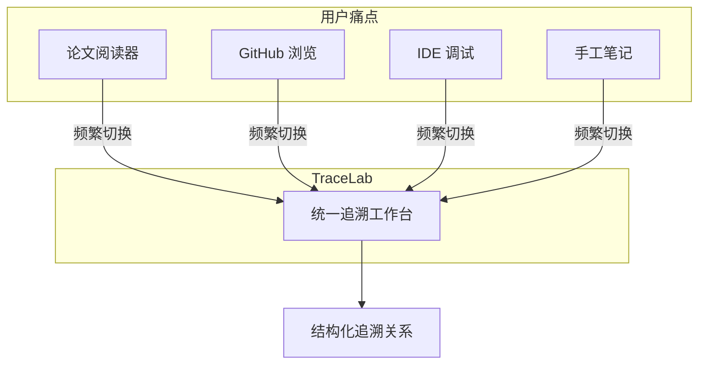
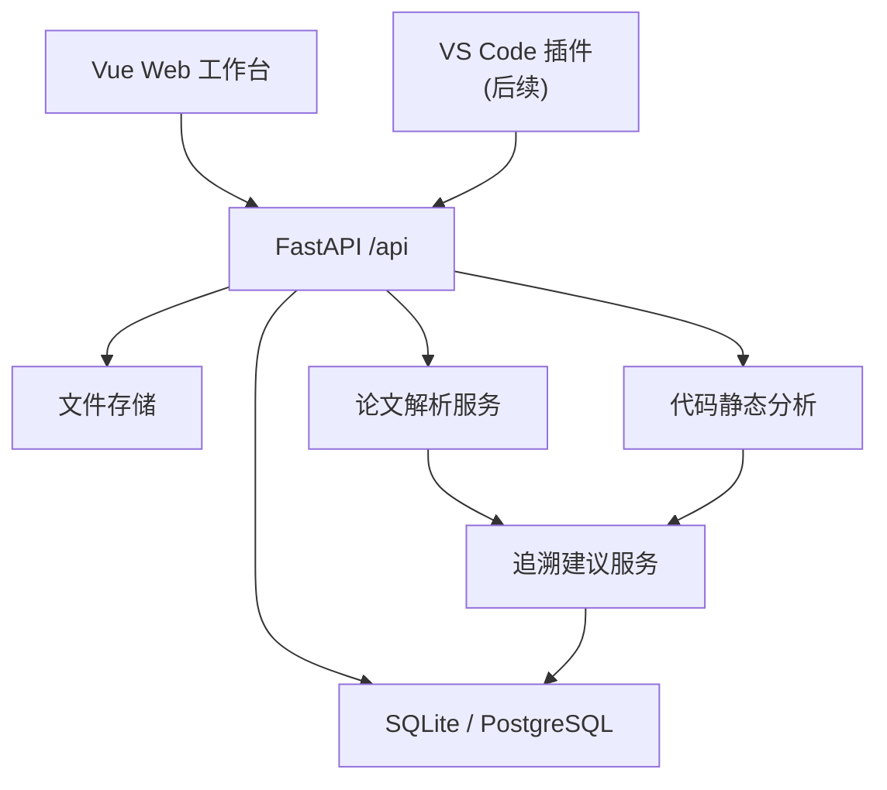
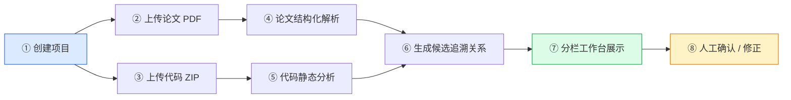
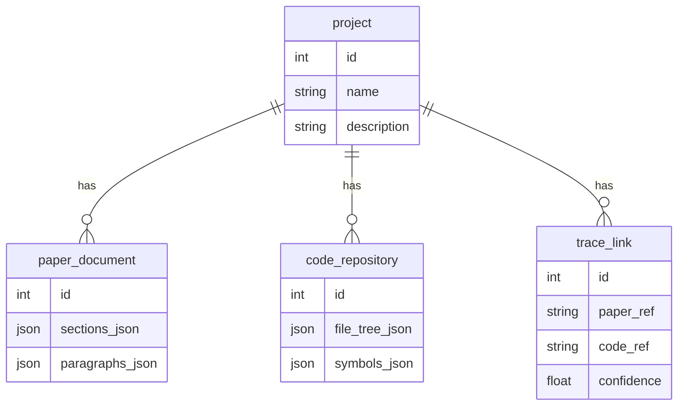
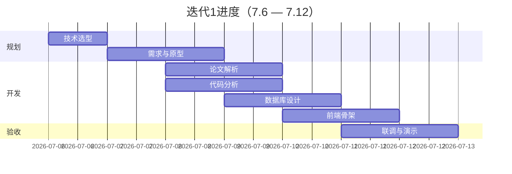

<style>
:root {
  --slidev-theme-primary: #2563eb;
}
.slidev-layout.cover h1 {
  background: linear-gradient(135deg, #1e40af 0%, #3b82f6 50%, #06b6d4 100%);
  -webkit-background-clip: text;
  -webkit-text-fill-color: transparent;
  font-size: 2.4rem;
  line-height: 1.2;
}
.badge {
  display: inline-block;
  padding: 0.15rem 0.6rem;
  border-radius: 9999px;
  font-size: 0.75rem;
  font-weight: 600;
  margin-right: 0.35rem;
}
.badge-blue { background: #dbeafe; color: #1d4ed8; }
.badge-green { background: #dcfce7; color: #15803d; }
.badge-amber { background: #fef3c7; color: #b45309; }
.badge-purple { background: #ede9fe; color: #6d28d9; }
.card {
  background: rgba(255,255,255,0.85);
  border: 1px solid #e2e8f0;
  border-radius: 10px;
  padding: 0.78rem 0.95rem;
  box-shadow: 0 4px 16px rgba(15,23,42,0.06);
}
.slidev-layout {
  --slidev-code-font-size: 10.5px;
}
.slidev-layout h1 {
  margin-bottom: 0.7rem;
}
.slidev-layout h3 {
  margin-top: 0;
  margin-bottom: 0.45rem;
}
.slidev-layout ul,
.slidev-layout ol {
  line-height: 1.42;
}
.slidev-layout table {
  width: 100%;
  font-size: 0.74rem;
  line-height: 1.22;
}
.slidev-layout th,
.slidev-layout td {
  padding: 0.26rem 0.36rem;
}
.compact-table table {
  font-size: 0.68rem;
}
.compact-table th,
.compact-table td {
  padding: 0.2rem 0.28rem;
}
.tech-table table {
  font-size: 0.64rem;
  line-height: 1.12;
}
.tech-table th,
.tech-table td {
  padding: 0.16rem 0.22rem;
}
.tech-list {
  display: grid;
  gap: 0.32rem;
  margin-top: 1.1rem;
  font-size: 0.78rem;
}
.tech-row {
  display: grid;
  grid-template-columns: 4.3rem 1fr;
  gap: 0.55rem;
  align-items: center;
  padding: 0.38rem 0.5rem;
  border: 1px solid #e2e8f0;
  border-radius: 8px;
  background: rgba(248,250,252,0.86);
  line-height: 1.15;
}
.tech-row strong {
  color: #1d4ed8;
}
.scope-grid {
  font-size: 0.67rem;
}
.scope-grid .card {
  padding: 0.42rem 0.58rem;
}
.scope-grid ul {
  line-height: 1.1;
  margin-top: 0.08rem;
}
.scope-grid li {
  margin: 0.03rem 0;
}
.scope-list {
  display: grid;
  gap: 0.22rem;
  margin-top: 0.25rem;
}
.scope-list div {
  padding: 0.18rem 0.32rem;
  border-radius: 6px;
  background: #f8fafc;
  border: 1px solid #e2e8f0;
  line-height: 1.08;
}
.api-grid {
  font-size: 0.64rem;
}
.api-grid .card {
  padding: 0.32rem 0.48rem;
}
.api-grid ul {
  line-height: 1.08;
  margin: 0.12rem 0 0;
}
.command-list {
  display: grid;
  gap: 0.12rem;
  margin-top: 0.18rem;
  font-family: var(--slidev-code-font-family);
  font-size: 0.52rem;
  line-height: 1.08;
}
.command-list div {
  padding: 0.12rem 0.22rem;
  border-radius: 5px;
  background: #f1f5f9;
}
.team-table table {
  font-size: 0.59rem;
  line-height: 1.04;
}
.team-table th,
.team-table td {
  padding: 0.11rem 0.18rem;
}
.team-list {
  display: grid;
  gap: 0.26rem;
  margin-top: 0.7rem;
  font-size: 0.68rem;
}
.team-row {
  display: grid;
  grid-template-columns: 1.8rem 1fr 7rem;
  gap: 0.4rem;
  align-items: center;
  padding: 0.3rem 0.42rem;
  border: 1px solid #e2e8f0;
  border-radius: 7px;
  background: rgba(248,250,252,0.88);
  line-height: 1.08;
}
.team-row span:first-child {
  color: #2563eb;
  font-weight: 700;
}
.api-list {
  display: grid;
  gap: 0.18rem;
  margin-top: 0.35rem;
  font-size: 0.64rem;
}
.api-row {
  display: grid;
  grid-template-columns: 5rem 1fr 9rem;
  gap: 0.45rem;
  align-items: center;
  padding: 0.2rem 0.36rem;
  border: 1px solid #e2e8f0;
  border-radius: 6px;
  background: rgba(248,250,252,0.9);
  line-height: 1.08;
}
.api-row strong {
  color: #1d4ed8;
}
.diagram-box {
  display: grid;
  place-items: center;
  overflow: hidden;
  min-height: 250px;
  max-height: 355px;
  border: 1px solid #e2e8f0;
  border-radius: 10px;
  background: #f8fafc;
  padding: 0.35rem;
}
.diagram-box svg {
  max-width: 100%;
  max-height: 330px;
}
.diagram-box-sm {
  min-height: 220px;
  max-height: 300px;
}
.diagram-box-sm svg {
  max-height: 280px;
}
.code-fit {
  max-height: 390px;
  overflow: hidden;
  font-size: 0.72rem;
}
.code-fit pre {
  margin: 0 !important;
}
.code-fit code {
  line-height: 1.34 !important;
}
.stat-grid {
  display: grid;
  grid-template-columns: repeat(4, 1fr);
  gap: 0.55rem;
}
.stat-item {
  text-align: center;
  padding: 0.45rem 0.55rem;
  border-radius: 10px;
  background: linear-gradient(135deg, #eff6ff, #f0f9ff);
  border: 1px solid #bfdbfe;
}
.stat-num { font-size: 1.25rem; font-weight: 700; color: #1d4ed8; }
.stat-label { font-size: 0.68rem; color: #64748b; margin-top: 0.08rem; }
.ui-wireframe {
  display: grid;
  gap: 0.45rem;
  padding: 0.7rem;
  border: 1px solid #cbd5e1;
  border-radius: 12px;
  background: #f8fafc;
  font-size: 0.72rem;
}
.ui-topbar,
.ui-tracebar {
  display: flex;
  justify-content: space-between;
  padding: 0.42rem 0.55rem;
  border-radius: 8px;
  background: white;
  border: 1px solid #e2e8f0;
}
.ui-main {
  display: grid;
  grid-template-columns: 0.95fr 1.25fr;
  gap: 0.5rem;
}
.ui-pane {
  min-height: 150px;
  padding: 0.55rem;
  border-radius: 8px;
  border: 1px solid #e2e8f0;
  background: white;
}
.ui-code {
  display: grid;
  grid-template-columns: 0.55fr 1fr;
  gap: 0.45rem;
}
.ui-mini {
  margin-top: 0.35rem;
  padding: 0.4rem;
  border-radius: 6px;
  background: #eff6ff;
  color: #1e3a8a;
}
.tiny-note {
  font-size: 0.66rem;
  color: #64748b;
  line-height: 1.35;
}
</style>

# TraceLab

## 面向深度学习论文复现的<br/>论文—代码双向追溯 Web 工作台

<div class="pt-8 text-lg opacity-80">
第 1 次迭代验收演示
</div>

<div class="pt-6 flex justify-center gap-3 text-sm">
  <span class="badge badge-blue">组号 15</span>
  <span class="badge badge-green">SJTU</span>
  <span class="badge badge-amber">2026.07.06 — 07.12</span>
</div>

<div class="abs-br m-6 text-sm opacity-60">
需求澄清与核心原型搭建
</div>

---
layout: center
class: text-center
---

# 我们要解决什么问题？

<div class="grid grid-cols-2 gap-6 mt-8 text-left">

<div class="card" v-click>

### 现状痛点

- 论文 PDF 与代码仓库**割裂**，反复手工搜索
- 公式、模型结构、训练脚本**难以对应**
- 复现笔记分散，**无法沉淀为可审阅的结构化数据**

</div>

<div class="card" v-click>

### TraceLab 价值

- **统一工作台**：论文阅读 + 代码浏览 + 追溯展示
- **双向跳转**：论文片段 ↔ 代码符号，可解释、可修正
- **面向复现**：降低定位实现、理解模型结构的成本

</div>

</div>

---
layout: two-cols
---

# 产品定位

<div class="text-sm opacity-80 mt-2">以论文复现任务为中心的智能分析平台</div>

<v-clicks>

- **目标用户**：复现学生、科研人员、算法工程师
- **核心场景**：深度学习论文 PDF + Python/PyTorch 代码
- **差异化**：不是 PDF 阅读器，不是 IDE，不是通用大模型问答
- **扩展预留**：VS Code 插件通过同一 API 接入

</v-clicks>

::right::

<div class="diagram-box diagram-box-sm mt-4">



</div>

---
layout: default
---

# 系统架构

<div class="grid grid-cols-2 gap-4 mt-2">

<div class="diagram-box">



</div>

<div class="text-sm compact-table">

### 后端分层

| 模块 | 职责 |
|------|------|
| `api/routes` | HTTP 路由与接口模型 |
| `models` | 数据库实体 |
| `services` | 解析器、分析器、追溯 |
| `storage` | 上传文件存储 |
| `db` | 会话与初始化 |

### 核心领域对象

<span class="badge badge-blue">Project</span>
<span class="badge badge-green">PaperDocument</span>
<span class="badge badge-purple">CodeRepository</span>
<span class="badge badge-amber">TraceLink</span>

</div>

</div>

---
layout: two-cols
---

# 技术选型

<div class="tech-list">

<div class="tech-row"><strong>前端</strong><span>Vue 3 · TypeScript · Vite · Element Plus</span></div>
<div class="tech-row"><strong>后端</strong><span>FastAPI · Pydantic v2 · SQLModel</span></div>
<div class="tech-row"><strong>数据库</strong><span>SQLite（开发）→ PostgreSQL（后续）</span></div>
<div class="tech-row"><strong>论文解析</strong><span>pypdf · PyMuPDF · pdfplumber</span></div>
<div class="tech-row"><strong>代码分析</strong><span>Python ast · tree-sitter</span></div>
<div class="tech-row"><strong>接口契约</strong><span>OpenAPI + 手写契约</span></div>

</div>

::right::

<div class="card mt-6">

### 选型原则

<v-clicks>

1. **接口稳定优先** — 前后端并行开发
2. **原型可跑通** — 最小闭环演示
3. **模块可替换** — 解析/追溯算法渐进增强
4. **扩展友好** — 预留插件与 RAG 入口

</v-clicks>

</div>

<div class="mt-4 text-sm opacity-70">
前后端分离 · RESTful API · 本地/局域网部署
</div>

---
layout: default
---

# 迭代 1 目标与范围

<div class="stat-grid mt-2 mb-2">
  <div class="stat-item"><div class="stat-num">8</div><div class="stat-label">计划任务</div></div>
  <div class="stat-item"><div class="stat-num">7</div><div class="stat-label">天周期</div></div>
  <div class="stat-item"><div class="stat-num">4</div><div class="stat-label">人团队</div></div>
  <div class="stat-item"><div class="stat-num">1</div><div class="stat-label">最小闭环</div></div>
</div>

<div class="grid grid-cols-2 gap-4 scope-grid">

<div class="card">

### ✅ 本次实现

<div class="scope-list">
  <div>Web 工作台主体架构 + VS Code 扩展入口</div>
  <div>Vue 3 + FastAPI 前后端工程骨架</div>
  <div>统一接口契约与 OpenAPI 文档</div>
  <div>数据库初版设计</div>
  <div>论文 PDF 解析最小原型</div>
  <div>代码静态分析最小原型</div>
  <div>Web 页面原型</div>
</div>

</div>

<div class="card">

### ⏳ 后续迭代

<div class="scope-list">
  <div>大模型 / RAG 辅助解释</div>
  <div>动态运行追踪与张量验证</div>
  <div>多模态图文代码对齐</div>
  <div>协作审阅与报告导出</div>
  <div>VS Code 插件完善</div>
</div>

</div>

</div>

---
layout: default
---

# 核心流程：最小可演示闭环

<div class="diagram-box diagram-box-sm">



</div>

<div class="grid grid-cols-3 gap-3 mt-4 text-sm">

<div class="card text-center" v-click>
<strong>输入</strong><br/>PDF + Python/PyTorch ZIP
</div>

<div class="card text-center" v-click>
<strong>处理</strong><br/>解析 · 分析 · 匹配
</div>

<div class="card text-center" v-click>
<strong>输出</strong><br/>结构化索引 + 追溯面板
</div>

</div>

---
layout: two-cols
---

# 论文 PDF 解析原型

<div class="mt-2">

### 提取能力

| 字段 | 说明 |
|------|------|
| `title` | 论文标题 |
| `abstract` | 摘要全文 |
| `sections` | 章节层级结构 |
| `paragraphs` | 段落文本 + 页码 |
| `page` | 来源页码定位 |

</div>

<div class="text-xs mt-4 opacity-70">
技术：pypdf 文本提取 · 后续引入 PyMuPDF / GROBID
</div>

::right::

<div class="code-fit">

```json {lines: true}
{
  "title": "Attention Is All You Need",
  "abstract": "The dominant sequence...",
  "sections": [
    { "title": "Introduction", "level": 1 },
    { "title": "Model Architecture", "level": 1 }
  ],
  "paragraphs": [
    {
      "text": "We propose a new...",
      "page": 2,
      "section": "Introduction"
    }
  ]
}
```

</div>

<div class="text-xs mt-2 opacity-70" v-click>
第一版优先标题/摘要/章节/段落/页码，公式图表记录附近文本
</div>

---
layout: two-cols
---

# 代码静态分析原型

<div class="mt-2">

### 分析输出

| 字段 | 说明 |
|------|------|
| `file_tree` | 目录与文件结构 |
| `symbols` | 类、函数定义 |
| `imports` | 模块导入关系 |
| `pytorch_candidates` | nn.Module / forward 候选 |

</div>

<div class="text-xs mt-4 opacity-70">
聚焦 Python · PyTorch 仓库，不强求完整跨文件调用图
</div>

::right::

<div class="code-fit">

```json {lines: true}
{
  "file_tree": ["models/transformer.py", "train.py"],
  "symbols": [
    { "name": "MultiHeadAttention",
      "kind": "class", "file": "models/transformer.py" }
  ],
  "imports": [
    { "module": "torch.nn", "names": ["Module"] }
  ],
  "pytorch_candidates": [
    { "class": "Transformer",
      "has_forward": true }
  ]
}
```

</div>

---
layout: default
---

# Web 工作台界面原型

<div class="grid grid-cols-3 gap-3 mt-2 text-sm">

<div class="card" v-click>

### 📋 项目列表页

- 创建 / 管理复现项目
- 展示分析状态
- 快速进入工作台

</div>

<div class="card" v-click>

### 📤 上传导入区

- 论文 PDF 上传
- 代码 ZIP 上传
- 解析进度反馈

</div>

<div class="card" v-click>

### 🔗 追溯结果面板

- 候选追溯关系列表
- 匹配理由与置信度
- 人工确认 / 修正入口

</div>

</div>

<div class="ui-wireframe mt-4">
  <div class="ui-topbar">
    <strong>TraceLab 工作台</strong>
    <span>项目列表 · 上传状态 · 导出报告</span>
  </div>
  <div class="ui-main">
    <div class="ui-pane">
      <strong>📄 论文阅读区</strong>
      <div class="ui-mini">PDF 页视图 / 章节导航 / 段落锚点</div>
      <div class="ui-mini">只读原文 + 追溯高亮</div>
    </div>
    <div class="ui-pane ui-code">
      <div>
        <strong>文件树</strong>
        <div class="ui-mini">models/resnet.py</div>
        <div class="ui-mini">train.py</div>
      </div>
      <div>
        <strong>代码编辑页</strong>
        <div class="ui-mini">可编辑代码区</div>
        <div class="ui-mini">符号定位 / 反向跳转</div>
      </div>
    </div>
  </div>
  <div class="ui-tracebar">
    <span>🔗 追溯面板：论文段落 ↔ 代码符号</span>
    <span>置信度 · 匹配理由 · 人工确认</span>
  </div>
</div>

<div class="text-xs opacity-70 mt-2">
技术：Element Plus 布局 · PDF 原文预览 · IDE 风格文件树 / 代码编辑区
</div>

---
layout: two-cols
---

# 数据模型设计

<div class="diagram-box mt-2">



</div>

::right::

<div class="card mt-4">

### 设计原则

<v-clicks>

- 结构化内容存 **JSON 字段**，快速迭代解析器
- 对外接口字段 **稳定**，内部结构可渐进规范
- `trace_link` 采用可读引用字符串，后续升级外键

</v-clicks>

</div>

<div class="mt-4 text-sm">

📁 `database/schema.sql` · `database/seed.sql`

</div>

---
layout: default
---

# 接口契约（节选）

<div class="api-list">

<div class="api-row"><strong>GET</strong><code>/api/v1/health</code><span>健康检查</span></div>
<div class="api-row"><strong>GET/POST</strong><code>/api/v1/projects</code><span>项目列表 / 创建</span></div>
<div class="api-row"><strong>POST</strong><code>/api/v1/projects/{id}/paper</code><span>上传论文 PDF</span></div>
<div class="api-row"><strong>POST</strong><code>/api/v1/projects/{id}/code</code><span>上传代码 ZIP</span></div>
<div class="api-row"><strong>GET</strong><code>/api/v1/projects/{id}/workspace</code><span>工作台聚合数据</span></div>
<div class="api-row"><strong>GET/POST</strong><code>/api/v1/projects/{id}/trace-links</code><span>追溯关系查询 / 创建</span></div>

</div>

<div class="grid grid-cols-2 gap-3 mt-2 api-grid">

<div class="card" v-click>

**协作机制**

- FastAPI 自动生成 **OpenAPI** 文档
- 手写契约 `docs/api-contract.md`
- 前端 mock 并行开发

</div>

<div class="card" v-click>

**快速启动**

<div class="command-list">
  <div>api: uvicorn app.main:app --reload</div>
  <div>frontend: pnpm dev</div>
  <div>docs: http://127.0.0.1:8000/docs</div>
</div>

</div>

</div>

---
layout: default
---

# 迭代 1 交付成果

<div class="grid grid-cols-2 gap-3 mt-2 text-sm">

<div v-click>

| 文档交付 | 状态 |
|----------|------|
| 需求细化与模块拆分 | ✅ |
| 技术选型说明 | ✅ |
| Vision 前景文档 v1.1 | ✅ |
| 接口契约文档 | ✅ |
| 架构 / 数据库设计 | ✅ |
| 迭代计划与总结 | ✅ |

</div>

<div v-click>

| 代码交付 | 状态 |
|----------|------|
| Vue 3 前端工程骨架 | ✅ |
| FastAPI 后端工程骨架 | ✅ |
| 论文 PDF 解析原型 | ✅ |
| 代码静态分析原型 | ✅ |
| 追溯建议服务（最小版） | ✅ |
| Web 低保真页面原型 | ✅ |

</div>

</div>

<div class="card mt-4 text-center" v-click>

### 验收标准：打通「创建项目 → 上传论文/代码 → 展示解析结果 → 展示候选追溯关系」最小流程

</div>

---
layout: two-cols
---

# 团队分工与进度

<div class="team-list">

<div class="team-row"><span>1</span><span>项目定位与技术选型</span><span>秦浩翔</span></div>
<div class="team-row"><span>2</span><span>工程骨架搭建</span><span>张朴、钱闵浩</span></div>
<div class="team-row"><span>3</span><span>需求细化与原型设计</span><span>秦浩翔、俞冠廷</span></div>
<div class="team-row"><span>4</span><span>论文 PDF 解析</span><span>俞冠廷</span></div>
<div class="team-row"><span>5</span><span>代码静态分析</span><span>张朴、钱闵浩</span></div>
<div class="team-row"><span>6</span><span>数据库设计</span><span>钱闵浩、秦浩翔</span></div>
<div class="team-row"><span>7</span><span>前端页面骨架</span><span>张朴、俞冠廷</span></div>
<div class="team-row"><span>8</span><span>联调与展示材料</span><span>全体成员</span></div>

</div>

::right::

<div class="card mt-2">

### 时间线

<div class="diagram-box diagram-box-sm">



</div>

</div>

---
layout: default
---

# 风险管控

<div class="text-sm compact-table">

| 优先级 | 风险 | 缓解措施 |
|:------:|------|----------|
| 🔴 1 | 需求范围过大，无法形成闭环 | 本迭代只保证最小闭环；进阶功能延后 |
| 🟠 2 | PDF 版面复杂，解析不稳定 | 先提取基础结构；选规范论文作演示样例 |
| 🟠 3 | PyTorch 静态分析难度高 | 聚焦类/函数/import/nn.Module；规则扫描兜底 |
| 🟡 4 | 并行开发接口不统一 | 尽早定义 JSON 格式；mock 数据支撑前端 |
| 🟡 5 | 大模型调用不确定性 | 关键词/规则匹配为主；LLM 作为可选增强 |

</div>

<div class="card mt-4 text-sm" v-click>

**迭代策略**：以「接口稳定、原型可跑通」为优先 — 解析和追溯算法实现可替换的最小版本，避免阻塞前后端并行开发。

</div>

---
layout: default
---

# 下一迭代展望

<div class="grid grid-cols-3 gap-4 mt-4">

<div class="card" v-click>

### P1 增强

- 匹配理由与置信度优化
- 人工确认 / 修正追溯
- 基础一致性检查
- 复现报告导出

</div>

<div class="card" v-click>

### P2 进阶

- 大模型 / RAG 辅助解释
- 向量检索追溯匹配
- 协作评论与审阅
- 动态张量验证

</div>

<div class="card" v-click>

### P3 扩展

- VS Code 插件入口
- 多模态图文对齐
- 魔改影响分析
- 生产级多租户部署

</div>

</div>

<div class="mt-6 text-center opacity-80" v-click>

架构与数据模型已预留扩展空间，后续迭代可渐进增强

</div>

---
layout: center
class: text-center
---

# 感谢聆听

<div class="text-xl mt-6 opacity-80">
TraceLab — 让论文复现不再「左右为难」
</div>

<div class="mt-10 grid grid-cols-2 gap-6 text-left text-sm max-w-lg mx-auto">

<div class="card">
<strong>演示环境</strong><br/>
后端 http://127.0.0.1:8000<br/>
API 文档 /docs
</div>

<div class="card">
<strong>项目仓库</strong><br/>
Vue 3 + FastAPI 全栈原型<br/>
docs/ · database/ · UIPrototype/
</div>

</div>

<div class="mt-8 text-lg">
Q & A
</div>

<!--
演示备注：
1. 先展示项目列表页 → 创建项目
2. 上传论文 PDF 和代码 ZIP
3. 进入工作台查看左右分栏
4. 展示追溯面板候选关系
5. 打开 /docs 展示 OpenAPI 接口文档
-->
