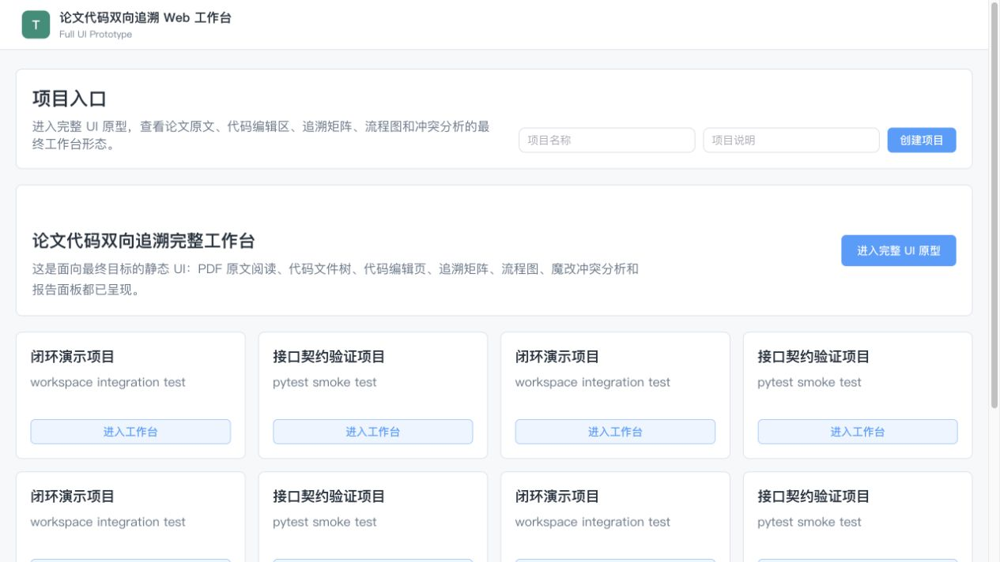
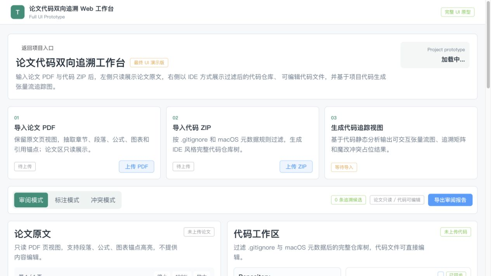
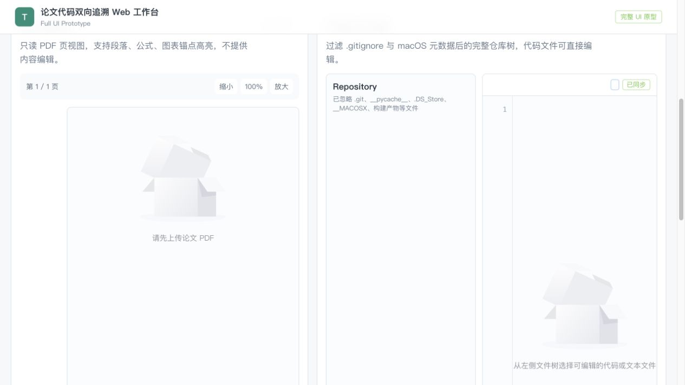

TraceLab · Iteration 01

# 让论文与代码 在同一工作区中对齐

面向深度学习论文复现的论文—代码双向追溯 Web 工作台

  第 1 次迭代验收展示组号 152026.07.06 — 07.12

<!--
开场：TraceLab 不是另一个 PDF 阅读器或 IDE，而是把论文证据、代码证据和人工判断放进同一个项目工作台。
-->

---
layout: default
---

本次评审

# 三个问题

本次迭代主要解决以下三个问题：

  <section>01<h2>有价值吗？</h2>
是否真正减少论文复现中“读论文、找代码、留证据”的反复切换问题？
</section>
  <section>02<h2>原型合理吗？</h2>
是否覆盖项目入口、材料导入、双栏阅读与追溯审阅等核心元素？界面是否友好？设计是否美观？
</section>
  <section>03<h2>进度如期吗？</h2>
计划、评估报告、原型代码与已知风险说明。
</section>

---
layout: default
---

问题与价值

# 复现的难点——论文与实现之间不容易追溯

  

    
<b>上下文被切碎</b>
论文 PDF、代码仓库、IDE 与个人笔记分散，需要反复来回切换，切不容易跟踪。

    
<b>实现定位靠猜测</b>
论文源码中函数/类的命名未必规范，模型描述、公式、训练脚本与具体类/函数之间缺少稳定的对应关系。

    
<b>结论难以复用</b>
即使找到了对应位置，也不容易保存、让协作者复核或进行修改。

  

  

    
论文片段 <small>章节 · 段落 · 页码</small>

    
代码片段 <small>文件 · 类 · 函数</small>

    
TraceLab <small>候选关系 + 匹配理由 + 人工确认</small>

    
可跳转、可审阅、可保存的复现记录

  

---
layout: default
---

迭代 1 的取舍

# 当前实现——可演示的最小闭环

  
01<b>创建项目</b>
统一组织一次论文复现任务

  <i>→</i>
02<b>导入材料</b>
论文 PDF 与代码仓库 / ZIP

  <i>→</i>
03<b>结构化处理</b>
论文解析与 Python 静态分析

  <i>→</i>
04<b>展示候选</b>
论文—代码关系及理由

  <i>→</i>
05<b>人工审阅</b>
确认、驳回或修正关系

  
<b>本轮交付重点</b>
项目管理、代码与论文导入、基础解析/分析、工作台原型与候选关系展示、前端流程图样式。

  
<b>后续迭代的任务</b>
复杂图文对齐、动态张量验证、流程图生成与交互逻辑、完整魔改影响和风险分析、Agent 接入。

---
layout: default
---

计划兑现

# 八项计划任务形成了分层成果

本轮不以“功能做全”为目标，而以“边界清楚、工程可接续、闭环可演示”为验收基准。

  
01<b>定位与技术选型</b><em>文档草案</em>
确定独立 Web 工作台主体，预留 IDE / VS Code 扩展入口。

  
02<b>协作环境与工程</b><em>已完成</em>
Git 规范、接口目录、Vue 3 + TypeScript 与 FastAPI 初始工程。

  
03<b>需求细化与原型</b><em>文档初步形成</em>
导入、解析、分析、追溯、管理、报告等模块完成拆分。

  
04<b>PDF 解析原型</b><em>初步实现</em>
提取标题、摘要、章节、段落与页码等论文侧信息。

  
05<b>代码导入与分析</b><em>初步实现</em>
导入 ZIP，扫描文件树、类、函数、导入和模型候选。

  
06<b>数据模型</b><em>设计草案</em>
围绕项目、片段、追溯、修正记录和报告记录完成拆分。

  
07<b>工作台前端骨架</b><em>已完成</em>
项目页、双栏阅读、文件树与追溯结果面板均已具备。

  
08<b>联调与展示材料</b><em>已完成</em>
最小流程可展示，演示文档与页面截图已汇集。

---
layout: default
---

界面原型演示

# 项目入口页面

  

    <h2>以项目为单位复现</h2>
    <ul>
      <li><b>项目列表：</b>以论文复现任务为单位查看状态和进入工作台。</li>
      <li><b>导入入口：</b>论文、代码与后续分析结果在同一项目下归档。</li>
      <li><b>界面设计：</b>基于 Element Plus 组织页面组件，功能入口清晰、操作路径直接。</li>
      <li><b>扩展方向：</b>从外部导入项目，项目搜索与批量管理，通过 Arxiv 和 GitHub 直接拉取分析等进阶功能。</li>
    </ul>
  

  <figure><figcaption>入口界面原型截图</figcaption></figure>

---
layout: default
---

界面原型演示

# 工作台页面

  

    <h2>一屏保留判断所需的上下文</h2>
    <ul>
      <li><b>论文侧：</b>页码、章节与结构化片段，为追溯关系提供可定位锚点。</li>
      <li><b>代码侧：</b>文件树、文件内容和符号信息，支持定位实现位置。</li>
      <li><b>审阅侧：</b>候选关系、理由、置信度与确认操作，避免黑盒链接。</li>
    </ul>
  

  <figure><figcaption>工作台界面原型截图</figcaption></figure>

---
layout: default
---

原型覆盖

# 当前可演示实现——工作区基本功能

  

    
项目入口
项目列表、创建/进入项目、状态概览

    
材料导入
论文 PDF、代码 ZIP / 仓库来源、导入状态

    
论文阅读
页码、章节、结构化片段与定位锚点

    
代码浏览
文件树、代码内容、类/函数等符号信息

    
追溯审阅
候选关系、理由、置信度、确认与修正入口

  

  <figure><figcaption>原型中的核心信息面板</figcaption></figure>

界面设计遵循“先材料、后分析、再审阅”的任务顺序，避免把进阶能力堆到首屏。

---
layout: default
---

工程基线

# 骨架搭建与最小实现

  
<b>Web 前端</b>
Vue 3 · TypeScript 项目页与工作台原型

  <i>→</i>
<b>FastAPI 接口</b>
统一 API · OpenAPI 前后端协作契约

  <i>→</i>
<b>解析与分析服务</b>
PDF 文本/页码提取 Python AST 静态分析

  <i>→</i>
<b>项目数据</b>
SQLite 开发数据库 上传材料与分析结果

  
<b>目前的最小能力实现</b>
基于 pypdf 提取论文文本和页码；基于 Python AST 产出文件树、类、函数、导入关系与 PyTorch 模型候选。工作区支持代码审阅与修改，论文保持只读。

  
<b>保留的可替换边界</b>
候选追溯当前以启发式/规则为基础；未来可引入向量检索、LLM 解释、动态运行追踪和流程图交互。它们只通过接口占位，不作为本轮后端算法交付。

---
layout: default
---

工程协作契约

# 用稳定接口连接可替换的分析能力

  

    <h2>统一 API 作为并行开发边界</h2>
    
<code>POST /projects</code>创建并管理复现项目

    
<code>POST /paper · /code</code>导入论文 PDF 与代码 ZIP

    
<code>GET/POST /trace-links</code>读取、创建候选追溯关系

    
<code>GET /workspace/*</code>支撑工作台、流程图、冲突与报告占位数据

  

  

    <h2>数据模型围绕追溯主链收敛</h2>
    
<b>项目</b><i>→</i><b>论文文档</b><i>→</i><b>论文片段</b>

    
<b>项目</b><i>→</i><b>代码仓库</b><i>→</i><b>代码片段</b>

    
<b>论文片段</b><i>⇄</i><b>追溯关系</b><i>⇄</i><b>代码片段</b>

    
人工修正、分析任务和报告记录围绕项目保存，便于后续审阅、复盘与扩展。

  

---
layout: default
---

迭代评估报告概要

# 交付物与验收证据已经汇集

  <section class="done"><h2>可运行的工程</h2>
前后端初始工程与协作规范

项目页、工作台与追溯面板

联调最小流程与展示材料
</section>
  <section class="progressing"><h2>可接续的设计</h2>
需求细化、模块拆分与技术选型

接口契约与数据库初版设计

论文解析、代码分析最小原型
</section>
  <section class="next"><h2>可核验的证据</h2>
运行截图与工作台样例

接口文档与核心 JSON 格式

测试记录、评估报告与迭代计划
</section>

---
layout: default
---

质量与风险

# 先验证“能运行”，再验证“匹配得准”

  

    <h2>本轮已有的验证证据</h2>
    
<b>前端构建</b>Vue 3 + TypeScript 生产构建通过

    
<b>后端测试</b>12 项 pytest 测试通过，覆盖核心 API / 工作台路径

    
<b>验收项</b>评估报告记录：项目创建、PDF 解析、代码导入与分析、候选关系展示、前端页面均可验证

  

  

    <h2>需要持续控制的风险</h2>
    
<b>复杂 PDF</b>
优先稳定标题、摘要、章节、段落与页码；公式/图表逐步增强。

    
<b>静态分析边界</b>
先定位 Python 文件、类、函数、导入和模型候选，不承诺完整跨文件调用图。

    
<b>候选准确性</b>
以规则匹配和人工确认保底，后续再引入向量检索与 LLM 辅助解释。

  

---
layout: default
---

验收矩阵

# 最小闭环已按六类验收项逐段验证

  
<b>项目创建</b>
项目名称、材料来源等基础信息可保存。
OK

  
<b>PDF 解析</b>
标题、摘要、章节、段落、页码可结构化展示。
OK

  
<b>代码导入</b>
接收 ZIP、展示过滤后的文件树并识别 Python 文件。
OK

  
<b>静态分析</b>
输出类、函数、import、nn.Module 与 forward 等信息。
OK

  
<b>关系展示</b>
论文片段、代码片段、理由或占位说明可并列审阅。
OK

  
<b>前端页面</b>
项目列表、上传页、双栏页面和追溯面板均可访问。
OK

配套证据：前端生产构建通过；后端 12 项 pytest 测试覆盖核心 API、文件过滤与工作台路径。

---
layout: default
---

范围变更与风险控制

# 主动收敛范围，避免智能功能阻塞迭代交付

  

    <h2>本轮必须可演示</h2>
    
导入论文与代码

结构化解析与静态分析

双栏阅读与候选追溯展示

人工确认/修正的结构与入口

  

  
范围 收敛

  

    <h2>后移到后续迭代</h2>
    
复杂图文代码对齐与真实张量验证

完整跨文件调用图与魔改影响分析

生产级多租户与完整 IDE 替代能力

大模型解释与向量检索的深度接入

  

<b>降级策略：</b>复杂 PDF 先保留页码与附近文本；复杂仓库先定位核心文件；自动匹配不可用时使用规则/关键词与人工链接；接口不稳定时以前端 mock 数据保障演示。

---
layout: default
---

经验沉淀

# 第一轮迭代留下四条可复用的原则

  
01<b>先控制范围</b>
先跑通材料导入、解析、展示与追溯，再逐步增加智能能力。

  
02<b>文档与接口先行</b>
项目、片段和追溯关系的 JSON 契约要先固定，减少并行返工。

  
03<b>解析分层实现</b>
先稳定基础结构，再增强公式、图表、算法框与跨文件关系。

  
04<b>演示保持可降级</b>
样例尽早固定，自动分析不稳定时仍能用规则和人工审阅完成闭环。

---
layout: default
---

下一步与评审请求

# 下一轮先补齐证据链，再提升追溯质量

  

    
高<b>补齐仓库证据与启动说明</b>
补充 Git 提交记录、运行样例和启动步骤。负责人：张朴、钱闵浩。

    
高<b>固定解析样例与核心 JSON</b>
补充 PDF/代码分析样例、截图和统一字段契约。负责人：俞冠廷、钱闵浩、秦浩翔。

    
中<b>完善原型与报告输出</b>
补充低保真页面证据、关系确认记录和可导出的复现报告。负责人：张朴、俞冠廷。

    
P2<b>增强追溯质量</b>
在可复核证据基础上逐步接入规则、向量检索、LLM 解释和动态验证。

  

---
layout: default
---

  
TraceLab

  <h1>让论文复现从反复搜索定位 走向易追溯，快定位，可迁移</h1>
  
第 1 次迭代：需求澄清与核心原型搭建

  <b>感谢聆听 · 欢迎提问与点评</b>

