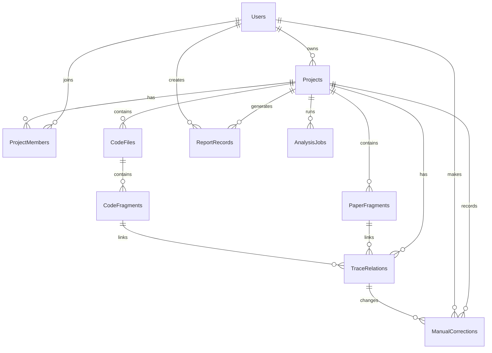

# TraceLab 数据库与数据模型初步设计

> 版本：v0.1 草案  **这里需要修改！**
> 适用迭代：第 1 次迭代「需求澄清与核心原型搭建」  
> 项目名称：论文代码双向追溯 Web 工作台 / TraceLab  
> 负责人建议：钱闵浩、秦浩翔  
> 文档用途：作为数据库初版设计文档和建表脚本草稿的基础，供前后端、解析模块、代码分析模块、追溯匹配模块联调时统一数据口径。

---

## 1. 设计依据与范围

### 1.1 设计依据

本方案依据当前项目上下文中已经明确的需求和迭代计划整理，主要覆盖以下内容：

1. 第一次迭代计划要求完成“用户、项目、论文片段、代码片段、追溯关系、人工修正记录和报告记录”的数据表设计。
2. 项目第一阶段需要打通“创建项目—上传论文/代码—显示解析结果—展示候选追溯关系”的最小流程。
3. 项目功能需求包括论文与代码导入、论文结构化解析、代码静态分析、论文—代码双向追溯、左右分栏查看、人工修正、复现报告导出。
4. 非功能需求中包括项目隔离存储、权限控制、能够处理中等规模 PyTorch 仓库，以及常规检索、跳转、静态分析结果查看的响应时间要求。

### 1.2 本次设计覆盖范围

本方案优先设计第一阶段需要落库的数据结构：

- 用户与权限相关数据；
- 论文复现项目元数据；
- 论文 PDF 解析后的结构化片段；
- 代码仓库导入后的文件与代码片段；
- 论文片段与代码片段之间的候选/确认追溯关系；
- 用户人工确认、修正、驳回追溯关系的记录；
- 复现分析报告或导出报告的记录。

以下内容作为后续扩展预留，不要求第一迭代全部实现：

- 多人实时协作；
- 细粒度角色权限；
- 动态运行追踪；
- 张量形状校验；
- 多模态图文代码对齐；
- VS Code 插件侧缓存与同步；
- 完整审计日志与操作回放。

---

## 2. 总体数据模型

### 2.1 核心实体

| 实体 | 表名 | 说明 | 第一迭代必要性 |
|---|---|---|---|
| 用户 | `users` | 保存登录用户、项目所有者、修正者、报告生成者等身份信息 | P0，可先用单用户模式简化 |
| 项目 | `projects` | 一个论文 PDF 与一个代码仓库/压缩包构成一个复现分析项目 | P0 |
| 项目成员 | `project_members` | 支持多人协作、权限控制 | P1，第一迭代可选 |
| 论文片段 | `paper_fragments` | 保存论文标题、摘要、章节、段落、公式上下文、图表标题等解析结果 | P0 |
| 代码文件 | `code_files` | 保存代码仓库文件树中的文件节点 | P0 |
| 代码片段 | `code_fragments` | 保存类、函数、方法、配置项、模型结构候选等静态分析结果 | P0 |
| 追溯关系 | `trace_relations` | 保存论文片段与代码片段之间的候选或确认关系 | P0 |
| 人工修正记录 | `manual_corrections` | 保存用户对追溯关系的确认、驳回、新增、修改记录 | P1，建议第一迭代保留表结构 |
| 报告记录 | `report_records` | 保存复现报告生成记录、导出路径和快照信息 | P1，第一迭代可先保存草稿记录 |
| 分析任务 | `analysis_jobs` | 记录 PDF 解析、代码分析、匹配、报告生成等后台任务状态 | P1，若异步任务较多建议提前建立 |

### 2.2 实体关系图



### 2.3 设计原则

1. **项目隔离优先**：论文片段、代码文件、代码片段、追溯关系、报告记录等核心表均包含 `project_id`，便于按项目隔离查询和删除。
2. **第一迭代先保存结构化结果**：不追求完整语义图谱，先把 PDF 解析 JSON、代码静态分析 JSON、候选追溯 JSON 稳定落库。
3. **追溯关系可修正**：系统自动匹配只生成候选关系，用户确认或驳回后通过状态字段和修正记录保留过程。
4. **保留后续扩展空间**：使用 `metadata` / `extra` / `evidence` 等 JSON 字段容纳解析器、代码分析器、向量检索、大模型解释等模块产生的补充信息。
5. **避免过早复杂化**：第一迭代不强制建立完整调用图、运行时张量图、版本控制历史，只保留必要字段和扩展表位。

---

## 3. 表设计总览

### 3.1 `users` 用户表

用于保存系统用户。第一迭代如果暂不实现完整登录，可以创建一个默认用户作为项目所有者和操作记录归属。

| 字段名 | 类型 | 约束 | 说明 |
|---|---|---|---|
| `id` | UUID | PK | 用户 ID |
| `username` | VARCHAR(64) | NOT NULL, UNIQUE | 用户名 |
| `email` | VARCHAR(128) | UNIQUE | 邮箱 |
| `password_hash` | VARCHAR(255) | 可空 | 密码哈希；第一迭代可暂不启用 |
| `display_name` | VARCHAR(64) | 可空 | 展示名 |
| `role` | VARCHAR(32) | NOT NULL | 用户角色，如 `user`、`admin` |
| `status` | VARCHAR(32) | NOT NULL | 用户状态，如 `active`、`disabled` |
| `created_at` | TIMESTAMP | NOT NULL | 创建时间 |
| `updated_at` | TIMESTAMP | NOT NULL | 更新时间 |
| `last_login_at` | TIMESTAMP | 可空 | 最近登录时间 |

建议索引：

- `idx_users_username`
- `idx_users_email`

---

### 3.2 `projects` 项目表

一个项目对应一次论文复现分析任务，通常包含一个论文 PDF 和一个 GitHub 仓库或本地代码压缩包。

| 字段名 | 类型 | 约束 | 说明 |
|---|---|---|---|
| `id` | UUID | PK | 项目 ID |
| `owner_user_id` | UUID | FK -> `users.id` | 项目创建者 |
| `name` | VARCHAR(128) | NOT NULL | 项目名称 |
| `description` | TEXT | 可空 | 项目说明 |
| `paper_title` | TEXT | 可空 | 从 PDF 解析得到或用户填写的论文标题 |
| `paper_file_name` | VARCHAR(255) | 可空 | 原始 PDF 文件名 |
| `paper_file_path` | TEXT | 可空 | PDF 在服务器中的存储路径 |
| `code_source_type` | VARCHAR(32) | NOT NULL | `github` / `upload_zip` / `local` |
| `code_repo_url` | TEXT | 可空 | GitHub 仓库地址 |
| `code_archive_path` | TEXT | 可空 | 代码压缩包存储路径 |
| `storage_root` | TEXT | 可空 | 项目隔离存储根目录 |
| `analysis_status` | VARCHAR(32) | NOT NULL | `created` / `imported` / `analyzing` / `ready` / `failed` |
| `visibility` | VARCHAR(32) | NOT NULL | `private` / `team` |
| `created_at` | TIMESTAMP | NOT NULL | 创建时间 |
| `updated_at` | TIMESTAMP | NOT NULL | 更新时间 |
| `deleted_at` | TIMESTAMP | 可空 | 软删除时间 |

建议索引：

- `idx_projects_owner_user_id`
- `idx_projects_analysis_status`
- `idx_projects_created_at`

---

### 3.3 `project_members` 项目成员表

用于后续协作与审阅。第一迭代如果暂不实现多人协作，可以暂时不在界面使用，但建议保留数据结构。

| 字段名 | 类型 | 约束 | 说明 |
|---|---|---|---|
| `id` | UUID | PK | 成员关系 ID |
| `project_id` | UUID | FK -> `projects.id` | 项目 ID |
| `user_id` | UUID | FK -> `users.id` | 用户 ID |
| `member_role` | VARCHAR(32) | NOT NULL | `owner` / `editor` / `viewer` / `reviewer` |
| `joined_at` | TIMESTAMP | NOT NULL | 加入时间 |
| `created_at` | TIMESTAMP | NOT NULL | 创建时间 |

建议唯一约束：

- `uniq_project_members_project_user`：`(project_id, user_id)`

---

### 3.4 `paper_fragments` 论文片段表

保存 PDF 解析后的结构化片段。第一版重点保存标题、摘要、章节、段落、页码；公式、图表、算法框可先保存所在页和附近文本，后续再增强坐标与类型识别。

| 字段名 | 类型 | 约束 | 说明 |
|---|---|---|---|
| `id` | UUID | PK | 论文片段 ID |
| `project_id` | UUID | FK -> `projects.id` | 所属项目 |
| `fragment_type` | VARCHAR(32) | NOT NULL | `title` / `abstract` / `section` / `paragraph` / `formula_context` / `figure_caption` / `table_caption` / `algorithm` / `other` |
| `section_title` | TEXT | 可空 | 所属章节标题 |
| `section_path` | TEXT | 可空 | 章节路径，如 `3.Method/3.1.Model` |
| `page_no` | INTEGER | 可空 | 页码 |
| `order_index` | INTEGER | NOT NULL | 在论文中的顺序 |
| `text_content` | TEXT | NOT NULL | 片段原文 |
| `normalized_text` | TEXT | 可空 | 清洗后的文本，用于检索和匹配 |
| `bbox` | JSONB | 可空 | PDF 坐标框，如 `{x0,y0,x1,y1}` |
| `metadata` | JSONB | 可空 | 解析器补充信息 |
| `embedding_id` | VARCHAR(128) | 可空 | 向量库中的向量 ID |
| `parse_version` | VARCHAR(32) | 可空 | 解析器版本 |
| `created_at` | TIMESTAMP | NOT NULL | 创建时间 |
| `updated_at` | TIMESTAMP | NOT NULL | 更新时间 |

建议索引：

- `idx_paper_fragments_project_id`
- `idx_paper_fragments_project_order`
- `idx_paper_fragments_type`
- `idx_paper_fragments_page_no`

---

### 3.5 `code_files` 代码文件表

保存仓库文件树信息。代码文件和代码片段拆开存储，便于前端先展示文件树，再按需加载片段。

| 字段名 | 类型 | 约束 | 说明 |
|---|---|---|---|
| `id` | UUID | PK | 文件 ID |
| `project_id` | UUID | FK -> `projects.id` | 所属项目 |
| `parent_file_id` | UUID | FK -> `code_files.id`，可空 | 父目录 ID；也可只用路径构建树 |
| `file_path` | TEXT | NOT NULL | 仓库内相对路径 |
| `file_name` | VARCHAR(255) | NOT NULL | 文件名 |
| `node_type` | VARCHAR(16) | NOT NULL | `file` / `directory` |
| `language` | VARCHAR(32) | 可空 | `python` / `yaml` / `json` / `markdown` / `other` |
| `file_role` | VARCHAR(32) | 可空 | `model` / `train_script` / `config` / `loss` / `dataset` / `unknown` |
| `size_bytes` | BIGINT | 可空 | 文件大小 |
| `checksum` | VARCHAR(128) | 可空 | 文件内容校验和 |
| `is_core` | BOOLEAN | NOT NULL | 是否为核心候选文件 |
| `metadata` | JSONB | 可空 | 静态分析补充信息 |
| `created_at` | TIMESTAMP | NOT NULL | 创建时间 |
| `updated_at` | TIMESTAMP | NOT NULL | 更新时间 |

建议唯一约束：

- `uniq_code_files_project_path`：`(project_id, file_path)`

建议索引：

- `idx_code_files_project_id`
- `idx_code_files_file_role`
- `idx_code_files_language`

---

### 3.6 `code_fragments` 代码片段表

保存 Python/PyTorch 静态分析产物，例如类、函数、方法、`nn.Module`、`forward` 方法、配置项等。

| 字段名 | 类型 | 约束 | 说明 |
|---|---|---|---|
| `id` | UUID | PK | 代码片段 ID |
| `project_id` | UUID | FK -> `projects.id` | 所属项目 |
| `code_file_id` | UUID | FK -> `code_files.id` | 所属文件 |
| `fragment_type` | VARCHAR(32) | NOT NULL | `class` / `function` / `method` / `import` / `module` / `forward` / `config` / `variable` / `other` |
| `name` | VARCHAR(255) | NOT NULL | 名称，如 `forward` |
| `qualified_name` | TEXT | 可空 | 完整限定名，如 `models.encoder.TransformerBlock.forward` |
| `parent_name` | TEXT | 可空 | 所属类或模块 |
| `start_line` | INTEGER | 可空 | 起始行 |
| `end_line` | INTEGER | 可空 | 结束行 |
| `signature` | TEXT | 可空 | 函数/方法签名 |
| `code_text` | TEXT | 可空 | 代码文本片段 |
| `docstring` | TEXT | 可空 | 文档字符串 |
| `metadata` | JSONB | 可空 | AST、调用关系、张量变量、模块类型等补充信息 |
| `embedding_id` | VARCHAR(128) | 可空 | 向量库中的向量 ID |
| `analyze_version` | VARCHAR(32) | 可空 | 静态分析器版本 |
| `created_at` | TIMESTAMP | NOT NULL | 创建时间 |
| `updated_at` | TIMESTAMP | NOT NULL | 更新时间 |

建议索引：

- `idx_code_fragments_project_id`
- `idx_code_fragments_file_id`
- `idx_code_fragments_type`
- `idx_code_fragments_qualified_name`
- `idx_code_fragments_lines`

---

### 3.7 `trace_relations` 追溯关系表

保存论文片段与代码片段之间的候选、确认或驳回关系。系统自动匹配生成的关系默认为 `candidate`，用户确认后变为 `confirmed`，驳回后变为 `rejected`。

| 字段名 | 类型 | 约束 | 说明 |
|---|---|---|---|
| `id` | UUID | PK | 追溯关系 ID |
| `project_id` | UUID | FK -> `projects.id` | 所属项目 |
| `paper_fragment_id` | UUID | FK -> `paper_fragments.id` | 论文片段 ID |
| `code_fragment_id` | UUID | FK -> `code_fragments.id` | 代码片段 ID |
| `direction` | VARCHAR(32) | NOT NULL | `paper_to_code` / `code_to_paper` / `bidirectional` |
| `relation_type` | VARCHAR(64) | NOT NULL | `formula_implementation` / `module_implementation` / `config_match` / `dimension_match` / `textual_similarity` / `manual_link` |
| `confidence` | NUMERIC(5,4) | 可空 | 置信度，范围建议 0 到 1 |
| `match_method` | VARCHAR(32) | NOT NULL | `rule` / `keyword` / `vector` / `llm` / `manual` |
| `reason` | TEXT | 可空 | 匹配理由摘要 |
| `evidence` | JSONB | 可空 | 匹配证据，如关键词、相似度、上下文 |
| `status` | VARCHAR(32) | NOT NULL | `candidate` / `confirmed` / `rejected` / `superseded` |
| `created_by` | VARCHAR(32) | NOT NULL | `system` / `user` |
| `created_by_user_id` | UUID | FK -> `users.id`，可空 | 人工创建者 |
| `created_at` | TIMESTAMP | NOT NULL | 创建时间 |
| `updated_at` | TIMESTAMP | NOT NULL | 更新时间 |

建议唯一约束：

- `uniq_trace_relation_pair_type`：`(project_id, paper_fragment_id, code_fragment_id, relation_type)`

建议索引：

- `idx_trace_relations_project_id`
- `idx_trace_relations_paper_fragment_id`
- `idx_trace_relations_code_fragment_id`
- `idx_trace_relations_status`
- `idx_trace_relations_confidence`

---

### 3.8 `manual_corrections` 人工修正记录表

保存用户对系统追溯结果的确认、驳回、修改、新增。该表用于保证追溯结果可审查、可回溯。

| 字段名 | 类型 | 约束 | 说明 |
|---|---|---|---|
| `id` | UUID | PK | 修正记录 ID |
| `project_id` | UUID | FK -> `projects.id` | 所属项目 |
| `trace_relation_id` | UUID | FK -> `trace_relations.id`，可空 | 被修正的追溯关系；新增关系时可为空 |
| `paper_fragment_id` | UUID | FK -> `paper_fragments.id`，可空 | 相关论文片段 |
| `code_fragment_id` | UUID | FK -> `code_fragments.id`，可空 | 相关代码片段 |
| `action_type` | VARCHAR(32) | NOT NULL | `confirm` / `reject` / `edit` / `create` / `delete` |
| `old_value` | JSONB | 可空 | 修改前快照 |
| `new_value` | JSONB | 可空 | 修改后快照 |
| `comment` | TEXT | 可空 | 用户说明 |
| `corrected_by_user_id` | UUID | FK -> `users.id` | 操作用户 |
| `created_at` | TIMESTAMP | NOT NULL | 创建时间 |

建议索引：

- `idx_manual_corrections_project_id`
- `idx_manual_corrections_trace_relation_id`
- `idx_manual_corrections_user_id`

---

### 3.9 `report_records` 报告记录表

保存复现分析报告的生成记录。第一迭代可以只保存报告草稿和导出路径，后续再加入完整报告模板和版本管理。

| 字段名 | 类型 | 约束 | 说明 |
|---|---|---|---|
| `id` | UUID | PK | 报告记录 ID |
| `project_id` | UUID | FK -> `projects.id` | 所属项目 |
| `generated_by_user_id` | UUID | FK -> `users.id` | 生成者 |
| `report_type` | VARCHAR(64) | NOT NULL | `reproduction_analysis` / `iteration_demo` / `summary` |
| `title` | VARCHAR(255) | NOT NULL | 报告标题 |
| `status` | VARCHAR(32) | NOT NULL | `draft` / `generated` / `exported` / `failed` |
| `content_snapshot` | JSONB | 可空 | 报告生成时的项目、片段、追溯关系快照 |
| `file_format` | VARCHAR(16) | 可空 | `md` / `docx` / `pdf` |
| `file_path` | TEXT | 可空 | 导出文件路径 |
| `trace_relation_count` | INTEGER | 可空 | 报告包含的追溯关系数量 |
| `issue_count` | INTEGER | 可空 | 报告包含的问题或不一致数量 |
| `metadata` | JSONB | 可空 | 模板版本、生成参数等 |
| `created_at` | TIMESTAMP | NOT NULL | 创建时间 |
| `updated_at` | TIMESTAMP | NOT NULL | 更新时间 |

建议索引：

- `idx_report_records_project_id`
- `idx_report_records_status`
- `idx_report_records_created_at`

---

### 3.10 `analysis_jobs` 分析任务表

用于记录后端异步任务状态，例如 PDF 解析、代码导入、代码静态分析、追溯匹配、报告生成。第一迭代如果使用同步接口，可以暂不启用；若前端需要展示“解析中/失败/重试”，建议尽早建立。

| 字段名 | 类型 | 约束 | 说明 |
|---|---|---|---|
| `id` | UUID | PK | 任务 ID |
| `project_id` | UUID | FK -> `projects.id` | 所属项目 |
| `job_type` | VARCHAR(32) | NOT NULL | `paper_parse` / `code_analyze` / `trace_match` / `report_generate` |
| `status` | VARCHAR(32) | NOT NULL | `pending` / `running` / `success` / `failed` / `cancelled` |
| `progress` | INTEGER | 可空 | 进度百分比，0 到 100 |
| `input_snapshot` | JSONB | 可空 | 任务输入参数快照 |
| `output_summary` | JSONB | 可空 | 输出结果摘要 |
| `error_message` | TEXT | 可空 | 失败原因 |
| `started_at` | TIMESTAMP | 可空 | 开始时间 |
| `finished_at` | TIMESTAMP | 可空 | 结束时间 |
| `created_at` | TIMESTAMP | NOT NULL | 创建时间 |
| `updated_at` | TIMESTAMP | NOT NULL | 更新时间 |

---

## 4. 第一迭代最小落库流程

### 4.1 创建项目

1. 前端提交项目名称、论文文件、代码来源。
2. 后端创建 `projects` 记录。
3. 若启用用户系统，则 `owner_user_id` 指向当前用户；若暂未启用，则指向默认用户。
4. 保存 PDF 和代码文件到项目隔离目录。
5. 更新项目状态为 `imported` 或 `analyzing`。

### 4.2 论文解析落库

1. 解析 PDF 标题、摘要、章节、段落、页码。
2. 对每个解析结果写入 `paper_fragments`。
3. 公式和图表第一版可先写为 `formula_context` / `figure_caption`，并通过 `metadata` 保存附近文本和页码。
4. 若解析失败，更新 `analysis_jobs` 或 `projects.analysis_status`。

### 4.3 代码分析落库

1. 解压或拉取代码仓库。
2. 扫描目录结构，写入 `code_files`。
3. 对 Python 文件进行静态分析，提取类、函数、导入关系、`nn.Module`、`forward` 等信息。
4. 写入 `code_fragments`。
5. 对复杂调用图不做强制要求，相关信息可先放入 `metadata`。

### 4.4 追溯关系落库

1. 基于关键词、规则或向量检索生成候选匹配。
2. 将候选关系写入 `trace_relations`，状态为 `candidate`。
3. 前端在追溯结果面板展示 `reason`、`confidence`、`evidence`。
4. 用户确认后更新 `status = confirmed`，并写入 `manual_corrections`。
5. 用户驳回后更新 `status = rejected`，并写入 `manual_corrections`。

### 4.5 报告记录落库

1. 用户触发报告生成。
2. 后端汇总项目、论文片段、代码片段、追溯关系、人工修正记录。
3. 写入 `report_records`。
4. 若导出为 Markdown / DOCX / PDF，保存 `file_format` 与 `file_path`。

---

## 5. 核心 JSON 数据格式草案

### 5.1 论文片段 JSON

```json
{
  "id": "paper-fragment-uuid",
  "project_id": "project-uuid",
  "fragment_type": "paragraph",
  "section_title": "Method",
  "section_path": "3.Method/3.1.Model Architecture",
  "page_no": 5,
  "order_index": 42,
  "text_content": "The attention module computes ...",
  "bbox": {
    "x0": 72.1,
    "y0": 120.4,
    "x1": 520.8,
    "y1": 180.2
  },
  "metadata": {
    "parser": "PyMuPDF",
    "nearby_formula": false,
    "source_block_id": "page5-block3"
  }
}
```

### 5.2 代码片段 JSON

```json
{
  "id": "code-fragment-uuid",
  "project_id": "project-uuid",
  "code_file_id": "code-file-uuid",
  "fragment_type": "method",
  "name": "forward",
  "qualified_name": "models.transformer.TransformerBlock.forward",
  "start_line": 85,
  "end_line": 126,
  "signature": "def forward(self, x, mask=None):",
  "metadata": {
    "is_nn_module": true,
    "parent_class": "TransformerBlock",
    "imports": ["torch", "torch.nn as nn"],
    "detected_ops": ["attention", "layer_norm", "dropout"]
  }
}
```

### 5.3 追溯关系 JSON

```json
{
  "id": "trace-relation-uuid",
  "project_id": "project-uuid",
  "paper_fragment_id": "paper-fragment-uuid",
  "code_fragment_id": "code-fragment-uuid",
  "direction": "bidirectional",
  "relation_type": "module_implementation",
  "confidence": 0.78,
  "match_method": "keyword",
  "status": "candidate",
  "reason": "论文片段和代码片段均出现 attention、mask、dropout 等关键词，且代码片段属于 TransformerBlock.forward。",
  "evidence": {
    "shared_terms": ["attention", "mask", "dropout"],
    "paper_page_no": 5,
    "code_file_path": "models/transformer.py",
    "code_lines": [85, 126]
  }
}
```

### 5.4 人工修正 JSON

```json
{
  "id": "correction-uuid",
  "project_id": "project-uuid",
  "trace_relation_id": "trace-relation-uuid",
  "action_type": "confirm",
  "comment": "该 forward 方法确实实现论文中的 Transformer Block。",
  "old_value": {
    "status": "candidate"
  },
  "new_value": {
    "status": "confirmed"
  }
}
```

---

## 6. PostgreSQL 建表脚本草案

> 说明：以下为 PostgreSQL 风格初稿。若第一迭代为了快速原型选择 SQLite，可保留字段设计，弱化 UUID、JSONB、部分约束与索引。

```sql
CREATE EXTENSION IF NOT EXISTS pgcrypto;

CREATE TABLE users (
    id UUID PRIMARY KEY DEFAULT gen_random_uuid(),
    username VARCHAR(64) NOT NULL UNIQUE,
    email VARCHAR(128) UNIQUE,
    password_hash VARCHAR(255),
    display_name VARCHAR(64),
    role VARCHAR(32) NOT NULL DEFAULT 'user',
    status VARCHAR(32) NOT NULL DEFAULT 'active',
    created_at TIMESTAMP NOT NULL DEFAULT CURRENT_TIMESTAMP,
    updated_at TIMESTAMP NOT NULL DEFAULT CURRENT_TIMESTAMP,
    last_login_at TIMESTAMP
);

CREATE TABLE projects (
    id UUID PRIMARY KEY DEFAULT gen_random_uuid(),
    owner_user_id UUID REFERENCES users(id),
    name VARCHAR(128) NOT NULL,
    description TEXT,
    paper_title TEXT,
    paper_file_name VARCHAR(255),
    paper_file_path TEXT,
    code_source_type VARCHAR(32) NOT NULL DEFAULT 'upload_zip',
    code_repo_url TEXT,
    code_archive_path TEXT,
    storage_root TEXT,
    analysis_status VARCHAR(32) NOT NULL DEFAULT 'created',
    visibility VARCHAR(32) NOT NULL DEFAULT 'private',
    created_at TIMESTAMP NOT NULL DEFAULT CURRENT_TIMESTAMP,
    updated_at TIMESTAMP NOT NULL DEFAULT CURRENT_TIMESTAMP,
    deleted_at TIMESTAMP
);

CREATE TABLE project_members (
    id UUID PRIMARY KEY DEFAULT gen_random_uuid(),
    project_id UUID NOT NULL REFERENCES projects(id) ON DELETE CASCADE,
    user_id UUID NOT NULL REFERENCES users(id) ON DELETE CASCADE,
    member_role VARCHAR(32) NOT NULL DEFAULT 'viewer',
    joined_at TIMESTAMP NOT NULL DEFAULT CURRENT_TIMESTAMP,
    created_at TIMESTAMP NOT NULL DEFAULT CURRENT_TIMESTAMP,
    CONSTRAINT uniq_project_members_project_user UNIQUE (project_id, user_id)
);

CREATE TABLE paper_fragments (
    id UUID PRIMARY KEY DEFAULT gen_random_uuid(),
    project_id UUID NOT NULL REFERENCES projects(id) ON DELETE CASCADE,
    fragment_type VARCHAR(32) NOT NULL,
    section_title TEXT,
    section_path TEXT,
    page_no INTEGER,
    order_index INTEGER NOT NULL,
    text_content TEXT NOT NULL,
    normalized_text TEXT,
    bbox JSONB,
    metadata JSONB,
    embedding_id VARCHAR(128),
    parse_version VARCHAR(32),
    created_at TIMESTAMP NOT NULL DEFAULT CURRENT_TIMESTAMP,
    updated_at TIMESTAMP NOT NULL DEFAULT CURRENT_TIMESTAMP
);

CREATE TABLE code_files (
    id UUID PRIMARY KEY DEFAULT gen_random_uuid(),
    project_id UUID NOT NULL REFERENCES projects(id) ON DELETE CASCADE,
    parent_file_id UUID REFERENCES code_files(id) ON DELETE SET NULL,
    file_path TEXT NOT NULL,
    file_name VARCHAR(255) NOT NULL,
    node_type VARCHAR(16) NOT NULL DEFAULT 'file',
    language VARCHAR(32),
    file_role VARCHAR(32),
    size_bytes BIGINT,
    checksum VARCHAR(128),
    is_core BOOLEAN NOT NULL DEFAULT FALSE,
    metadata JSONB,
    created_at TIMESTAMP NOT NULL DEFAULT CURRENT_TIMESTAMP,
    updated_at TIMESTAMP NOT NULL DEFAULT CURRENT_TIMESTAMP,
    CONSTRAINT uniq_code_files_project_path UNIQUE (project_id, file_path)
);

CREATE TABLE code_fragments (
    id UUID PRIMARY KEY DEFAULT gen_random_uuid(),
    project_id UUID NOT NULL REFERENCES projects(id) ON DELETE CASCADE,
    code_file_id UUID NOT NULL REFERENCES code_files(id) ON DELETE CASCADE,
    fragment_type VARCHAR(32) NOT NULL,
    name VARCHAR(255) NOT NULL,
    qualified_name TEXT,
    parent_name TEXT,
    start_line INTEGER,
    end_line INTEGER,
    signature TEXT,
    code_text TEXT,
    docstring TEXT,
    metadata JSONB,
    embedding_id VARCHAR(128),
    analyze_version VARCHAR(32),
    created_at TIMESTAMP NOT NULL DEFAULT CURRENT_TIMESTAMP,
    updated_at TIMESTAMP NOT NULL DEFAULT CURRENT_TIMESTAMP
);

CREATE TABLE trace_relations (
    id UUID PRIMARY KEY DEFAULT gen_random_uuid(),
    project_id UUID NOT NULL REFERENCES projects(id) ON DELETE CASCADE,
    paper_fragment_id UUID NOT NULL REFERENCES paper_fragments(id) ON DELETE CASCADE,
    code_fragment_id UUID NOT NULL REFERENCES code_fragments(id) ON DELETE CASCADE,
    direction VARCHAR(32) NOT NULL DEFAULT 'bidirectional',
    relation_type VARCHAR(64) NOT NULL,
    confidence NUMERIC(5,4),
    match_method VARCHAR(32) NOT NULL DEFAULT 'rule',
    reason TEXT,
    evidence JSONB,
    status VARCHAR(32) NOT NULL DEFAULT 'candidate',
    created_by VARCHAR(32) NOT NULL DEFAULT 'system',
    created_by_user_id UUID REFERENCES users(id),
    created_at TIMESTAMP NOT NULL DEFAULT CURRENT_TIMESTAMP,
    updated_at TIMESTAMP NOT NULL DEFAULT CURRENT_TIMESTAMP,
    CONSTRAINT uniq_trace_relation_pair_type UNIQUE (project_id, paper_fragment_id, code_fragment_id, relation_type)
);

CREATE TABLE manual_corrections (
    id UUID PRIMARY KEY DEFAULT gen_random_uuid(),
    project_id UUID NOT NULL REFERENCES projects(id) ON DELETE CASCADE,
    trace_relation_id UUID REFERENCES trace_relations(id) ON DELETE SET NULL,
    paper_fragment_id UUID REFERENCES paper_fragments(id) ON DELETE SET NULL,
    code_fragment_id UUID REFERENCES code_fragments(id) ON DELETE SET NULL,
    action_type VARCHAR(32) NOT NULL,
    old_value JSONB,
    new_value JSONB,
    comment TEXT,
    corrected_by_user_id UUID REFERENCES users(id),
    created_at TIMESTAMP NOT NULL DEFAULT CURRENT_TIMESTAMP
);

CREATE TABLE report_records (
    id UUID PRIMARY KEY DEFAULT gen_random_uuid(),
    project_id UUID NOT NULL REFERENCES projects(id) ON DELETE CASCADE,
    generated_by_user_id UUID REFERENCES users(id),
    report_type VARCHAR(64) NOT NULL DEFAULT 'reproduction_analysis',
    title VARCHAR(255) NOT NULL,
    status VARCHAR(32) NOT NULL DEFAULT 'draft',
    content_snapshot JSONB,
    file_format VARCHAR(16),
    file_path TEXT,
    trace_relation_count INTEGER,
    issue_count INTEGER,
    metadata JSONB,
    created_at TIMESTAMP NOT NULL DEFAULT CURRENT_TIMESTAMP,
    updated_at TIMESTAMP NOT NULL DEFAULT CURRENT_TIMESTAMP
);

CREATE TABLE analysis_jobs (
    id UUID PRIMARY KEY DEFAULT gen_random_uuid(),
    project_id UUID NOT NULL REFERENCES projects(id) ON DELETE CASCADE,
    job_type VARCHAR(32) NOT NULL,
    status VARCHAR(32) NOT NULL DEFAULT 'pending',
    progress INTEGER,
    input_snapshot JSONB,
    output_summary JSONB,
    error_message TEXT,
    started_at TIMESTAMP,
    finished_at TIMESTAMP,
    created_at TIMESTAMP NOT NULL DEFAULT CURRENT_TIMESTAMP,
    updated_at TIMESTAMP NOT NULL DEFAULT CURRENT_TIMESTAMP
);

CREATE INDEX idx_projects_owner_user_id ON projects(owner_user_id);
CREATE INDEX idx_projects_analysis_status ON projects(analysis_status);

CREATE INDEX idx_paper_fragments_project_id ON paper_fragments(project_id);
CREATE INDEX idx_paper_fragments_project_order ON paper_fragments(project_id, order_index);
CREATE INDEX idx_paper_fragments_type ON paper_fragments(fragment_type);
CREATE INDEX idx_paper_fragments_page_no ON paper_fragments(page_no);

CREATE INDEX idx_code_files_project_id ON code_files(project_id);
CREATE INDEX idx_code_files_file_role ON code_files(file_role);
CREATE INDEX idx_code_files_language ON code_files(language);

CREATE INDEX idx_code_fragments_project_id ON code_fragments(project_id);
CREATE INDEX idx_code_fragments_file_id ON code_fragments(code_file_id);
CREATE INDEX idx_code_fragments_type ON code_fragments(fragment_type);
CREATE INDEX idx_code_fragments_qualified_name ON code_fragments(qualified_name);

CREATE INDEX idx_trace_relations_project_id ON trace_relations(project_id);
CREATE INDEX idx_trace_relations_paper_fragment_id ON trace_relations(paper_fragment_id);
CREATE INDEX idx_trace_relations_code_fragment_id ON trace_relations(code_fragment_id);
CREATE INDEX idx_trace_relations_status ON trace_relations(status);
CREATE INDEX idx_trace_relations_confidence ON trace_relations(confidence);

CREATE INDEX idx_manual_corrections_project_id ON manual_corrections(project_id);
CREATE INDEX idx_manual_corrections_trace_relation_id ON manual_corrections(trace_relation_id);
CREATE INDEX idx_manual_corrections_user_id ON manual_corrections(corrected_by_user_id);

CREATE INDEX idx_report_records_project_id ON report_records(project_id);
CREATE INDEX idx_report_records_status ON report_records(status);
CREATE INDEX idx_report_records_created_at ON report_records(created_at);

CREATE INDEX idx_analysis_jobs_project_id ON analysis_jobs(project_id);
CREATE INDEX idx_analysis_jobs_status ON analysis_jobs(status);
CREATE INDEX idx_analysis_jobs_type ON analysis_jobs(job_type);
```

---

## 7. 前后端接口对数据模型的使用建议

### 7.1 项目列表页

主要读取：

- `projects`
- 聚合统计：`paper_fragments` 数量、`code_files` 数量、`code_fragments` 数量、`trace_relations` 数量

建议返回字段：

```json
{
  "id": "project-uuid",
  "name": "ResNet Paper Reproduction",
  "paper_title": "Deep Residual Learning for Image Recognition",
  "analysis_status": "ready",
  "created_at": "2026-07-09T10:00:00",
  "statistics": {
    "paper_fragment_count": 120,
    "code_file_count": 86,
    "code_fragment_count": 240,
    "trace_relation_count": 35
  }
}
```

### 7.2 项目详情页

主要读取：

- `projects`
- `analysis_jobs`
- 最近的 `report_records`

用途：展示项目基本信息、分析状态、任务进度、最近报告。

### 7.3 左右分栏工作台

左侧论文：

- 读取 `paper_fragments`，按 `page_no` 和 `order_index` 排序。

右侧代码：

- 读取 `code_files` 构建文件树。
- 点击文件后读取对应 `code_fragments`。

追溯面板：

- 读取 `trace_relations`。
- 根据 `paper_fragment_id` 或 `code_fragment_id` 查询关联项。

### 7.4 人工修正

操作流程：

1. 用户确认候选关系。
2. 更新 `trace_relations.status = confirmed`。
3. 写入 `manual_corrections`，记录 `old_value` 和 `new_value`。

### 7.5 报告生成

操作流程：

1. 后端读取 `projects`、`paper_fragments`、`code_fragments`、`trace_relations`、`manual_corrections`。
2. 生成报告快照。
3. 写入 `report_records`。
4. 返回导出文件路径或报告 ID。

---

## 8. 第一迭代实现优先级

### 8.1 必须实现 P0

| 表 | P0 目标 |
|---|---|
| `users` | 至少创建默认用户或简单登录用户 |
| `projects` | 支持创建项目、保存论文/代码路径和分析状态 |
| `paper_fragments` | 支持保存论文标题、摘要、章节、段落、页码 |
| `code_files` | 支持保存代码文件树 |
| `code_fragments` | 支持保存 Python 类、函数、导入关系、`nn.Module`、`forward` 候选信息 |
| `trace_relations` | 支持保存候选追溯关系，并能在前端展示 |

### 8.2 建议保留 P1

| 表 | P1 目标 |
|---|---|
| `manual_corrections` | 支持人工确认/驳回追溯关系 |
| `report_records` | 支持保存报告草稿或导出记录 |
| `analysis_jobs` | 支持展示解析中、分析中、失败、重试等状态 |

### 8.3 后续扩展 P2

| 扩展方向 | 可能新增表 |
|---|---|
| 一致性检查 | `consistency_issues`、`tensor_shape_records` |
| 动态运行追踪 | `runtime_traces`、`runtime_trace_nodes` |
| 团队协作评论 | `comments`、`review_records` |
| 大模型解释缓存 | `llm_explanations` |
| 多模态图文代码对齐 | `paper_visual_elements`、`visual_code_relations` |
| VS Code 插件入口 | `ide_query_logs`、`plugin_sessions` |

---

## 9. 风险与降级方案

| 风险 | 影响 | 降级方案 |
|---|---|---|
| PDF 解析结果不稳定 | 论文片段质量影响追溯匹配 | 第一版只要求标题、摘要、章节、段落、页码；公式和图表先保存附近文本 |
| 代码静态分析难以覆盖复杂仓库 | 调用关系和模型结构提取不完整 | 第一版只聚焦 Python 文件、类、函数、import、`nn.Module`、`forward` 和配置文件 |
| 前后端接口不统一 | 联调困难 | 以本数据模型中的 JSON 字段作为接口契约，前端先用 mock 数据开发 |
| 自动匹配效果不稳定 | 候选追溯关系质量不足 | 允许手工创建和修正追溯关系；自动匹配可暂缓为关键词/规则匹配 |
| 数据库实现时间不足 | 影响演示闭环 | 优先实现 P0 表；P1/P2 表可先只保留设计文档，不进入代码 |

---

## 10. 待项目组确认的问题

1. 第一迭代数据库采用 PostgreSQL 还是 SQLite？
   - PostgreSQL 更贴近最终设计，支持 JSONB 和更完整索引。
   - SQLite 更方便快速原型，但后续可能需要迁移。
2. 是否第一迭代就实现真实用户登录？
   - 若不实现，可以使用默认用户。
   - 若实现，需要补充密码、会话、权限相关接口。
3. 代码仓库导入优先支持 GitHub URL 还是本地 zip？
   - 本地 zip 更容易完成封闭演示。
   - GitHub URL 更贴近需求，但需要处理网络和拉取失败。
4. 追溯关系第一版是否允许纯手工创建？
   - 若自动匹配来不及，手工追溯可以保证演示闭环。
5. 报告记录第一版是否只生成 Markdown？
   - Markdown 便于实现和调试。
   - DOCX/PDF 可作为后续导出格式。

---

## 11. 第一迭代验收标准

数据库与数据模型部分建议按以下标准验收：

1. 能创建一个项目，并在 `projects` 中保存项目基本信息、论文路径、代码来源和分析状态。
2. 能将论文解析结果保存到 `paper_fragments`，至少包括标题、摘要、章节、段落、页码和顺序。
3. 能将代码仓库文件树保存到 `code_files`。
4. 能将 Python 类、函数、导入关系、`nn.Module`、`forward` 等候选信息保存到 `code_fragments`。
5. 能创建至少一条论文片段到代码片段的候选追溯关系，并保存到 `trace_relations`。
6. 能对候选追溯关系进行确认或驳回，并在 `manual_corrections` 中留下记录。
7. 能生成或保存一条报告记录到 `report_records`，即使第一版报告内容较简单。
8. 前端可通过接口读取项目、论文片段、代码片段和追溯关系，支撑左右分栏页面展示。

---

## 12. 结论

本初步方案将第一次迭代的数据模型收敛为“项目—论文片段—代码片段—追溯关系”的核心链路，并通过用户、人工修正记录和报告记录支撑项目管理、人工审阅和课程验收。第一迭代实现时建议优先保证 P0 表和最小流程跑通，P1/P2 表可以先完成设计和接口占位，避免因为过早追求完整协作、大模型解释、动态追踪等功能而影响核心演示闭环。
