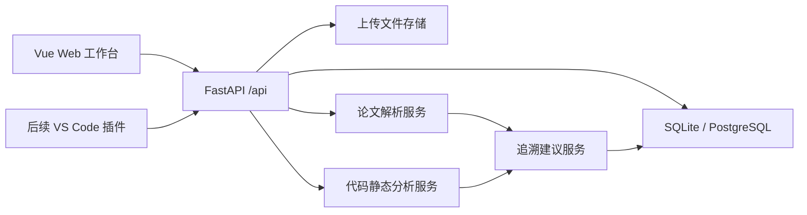

# 架构说明

## 模块划分

## 后端分层

- `api/routes`：HTTP 路由和接口模型绑定。
- `models`：数据库实体。
- `services`：业务逻辑、解析器、静态分析器和追溯建议。
- `storage`：上传文件存储。
- `db`：数据库会话和初始化。

## 核心领域对象

- Project：一个论文与代码追溯工作空间。
- PaperDocument：论文解析结果，包含章节、段落、页码。
- CodeRepository：代码静态分析结果，包含文件树、符号和依赖。
- TraceLink：论文片段与代码符号/文件之间的追溯关系。

## 第一迭代策略

第一迭代以“接口稳定、原型可跑通”为优先。解析和追溯算法只实现可替换的最小版本，避免把前后端开发阻塞在复杂算法细节上。

