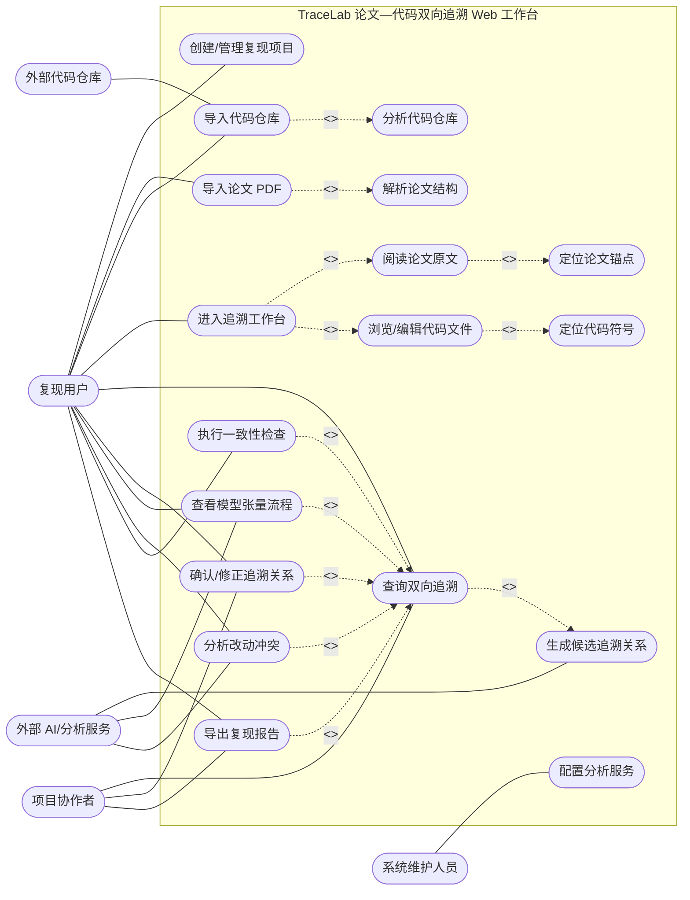
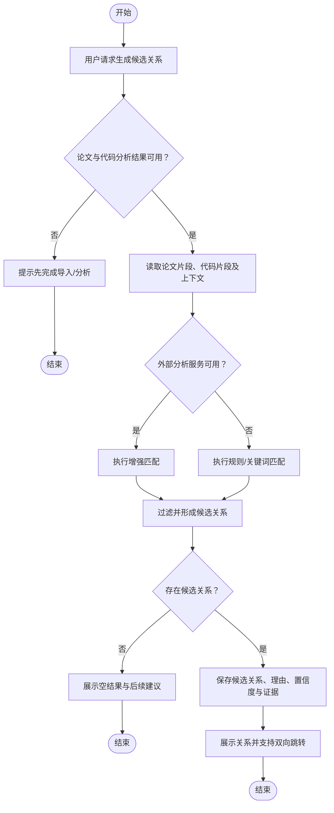
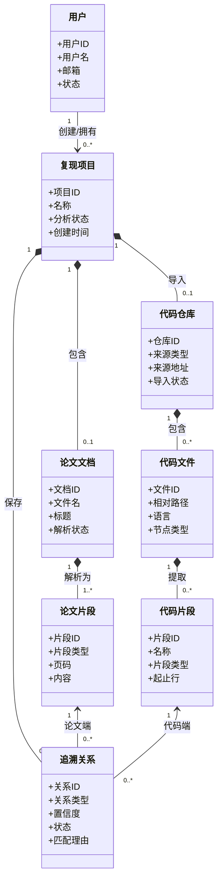
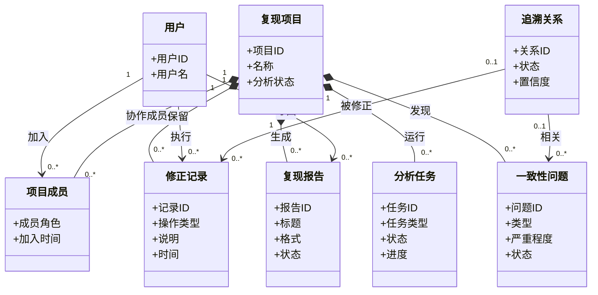

# TraceLab 需求分析建模

> 版本：1.0  
> 建模对象：TraceLab 面向深度学习论文复现的论文—代码双向追溯 Web 工作台  
> 依据：TraceLab_vision文档、迭代计划、接口与数据模型初步设计

## 1. 建模范围与约定

TraceLab 帮助用户在深度学习论文 PDF 与 Python/PyTorch 代码仓库之间建立可解释、可修正、可保存的双向追溯关系。第一阶段聚焦“创建项目—导入论文与代码—解析分析—查看并修正追溯—导出结果”的闭环；流程图、改动冲突分析和一致性检查在模型中保留为后续扩展用例。

用例图中的 `<<include>>` 表示每次执行源用例都需要执行被包含用例；`<<extend>>` 表示仅在用户触发进阶分析时发生。概念类图描述问题域中的业务概念，不等同于数据库表或程序实现类。

## 2. 用例模型

### 2.1 参与者

| 参与者 | 说明 |
|---|---|
| 复现用户 | 创建复现项目，导入材料，阅读论文和代码，审阅追溯结果的主要用户。 |
| 项目协作者 | 在项目中审阅、确认或修正追溯关系，并补充复现结论的协作用户。 |
| 系统维护人员 | 配置解析器、分析服务与存储策略，维护系统可用性的人员。 |
| 外部代码仓库 | GitHub 等提供远程仓库内容的外部系统。 |
| 外部 AI/分析服务 | 可选地为候选追溯、张量流程和冲突分析提供结果的外部服务。 |

### 2.2 Use Case 图

StarUML 源文件中的用例图采用分区布局，避免上述文本图在提交环境未启用 Mermaid 时失去可读性。

### 2.3 用例简述

| 编号 | 用例 | 简单描述 |
|---|---|---|
| UC01 | 创建/管理复现项目 | 用户创建、查看、更新或归档一次论文复现分析项目。 |
| UC02 | 导入论文 PDF | 用户上传论文 PDF，系统校验文件并保存原始材料。 |
| UC03 | 导入代码仓库 | 用户上传代码 ZIP 或填写仓库地址，系统导入并过滤忽略文件。 |
| UC04 | 解析论文结构 | 系统从论文中提取标题、章节、段落、页码和图表/公式上下文。 |
| UC05 | 分析代码仓库 | 系统扫描文件树并提取 Python 代码中的类、函数、导入和模型候选。 |
| UC06 | 进入追溯工作台 | 系统在同一工作区装载论文、代码和当前分析结果。 |
| UC07 | 阅读论文原文 | 用户只读查看论文页面和结构化片段，并可选择关注片段。 |
| UC08 | 浏览/编辑代码文件 | 用户在已过滤的完整文件树中定位、查看并修改代码文件。 |
| UC09 | 定位论文锚点 | 系统将关系准确定位到论文页码、章节和原文片段。 |
| UC10 | 定位代码符号 | 系统将关系准确定位到代码文件、符号与行号范围。 |
| UC11 | 查询双向追溯 | 用户从论文片段或代码片段查询对端候选关系、理由和置信度。 |
| UC12 | 生成候选追溯关系 | 系统依据论文与代码分析结果生成论文片段到代码片段的候选链接。 |
| UC13 | 确认/修正追溯关系 | 用户确认、驳回、编辑或新建追溯关系，系统保留修正记录。 |
| UC14 | 查看模型张量流程 | 用户查看由代码分析得到的可交互模型数据流，并可跳转至相关代码。 |
| UC15 | 分析改动冲突 | 用户选择拟修改代码后，系统提示可能影响的追溯关系、张量或配置。 |
| UC16 | 执行一致性检查 | 用户发起论文描述与代码实现之间的规则化一致性检查。 |
| UC17 | 导出复现报告 | 用户将项目、追溯关系、修正结论与检查结果导出为报告。 |
| UC18 | 配置分析服务 | 维护人员配置解析、静态分析和可选 AI 服务的接入参数。 |

## 3. 典型用例规约：UC12 生成候选追溯关系

| 项目 | 规约 |
|---|---|
| 用例名称 | 生成候选追溯关系 |
| 目标 | 在同一复现项目内，将论文片段与代码片段按规则、关键词或后续 AI 能力建立可解释的候选关联。 |
| 主要参与者 | 复现用户（发起分析或查询） |
| 次要参与者 | 外部 AI/分析服务（可选） |
| 触发条件 | 用户导入并分析完论文和代码后，在工作台选择“生成/刷新追溯关系”，或在查询追溯时系统发现尚无可用结果。 |
| 前置条件 | 项目存在；论文解析至少产生一个论文片段；代码分析至少产生一个代码片段；当前用户有项目查看权限。 |
| 后置条件 | 系统保存候选追溯关系及匹配理由、置信度、证据和生成方法；原有已确认或已驳回关系不会被自动覆盖。 |

### 基本流

1. 复现用户在项目工作台请求生成或刷新候选追溯关系。
2. 系统检查论文解析结果和代码分析结果是否可用。
3. 系统读取论文片段、代码片段及其上下文信息。
4. 系统按关键词、命名、结构特征或可选 AI 分析计算候选匹配及置信度。
5. 系统为每条候选关系生成关系类型、匹配理由和证据摘要。
6. 系统保存状态为“候选”的追溯关系，不改写用户已确认或已驳回的关系。
7. 系统在追溯工作台中展示候选关系列表，用户可从任一关系跳转到论文和代码位置。

### 备选流

**A1：论文或代码尚未完成分析。** 在基本流第 2 步，系统提示缺少可用的论文片段或代码片段，并引导用户先完成相应导入与分析；用例结束，不产生追溯关系。

**A2：仅部分材料分析成功。** 在基本流第 2 步，系统仅使用已成功的材料生成结果，并在结果区标注分析不完整及失败原因。

**A3：外部 AI/分析服务不可用。** 在基本流第 4 步，系统记录服务不可用信息，自动退回关键词和规则匹配；若回退成功，继续第 5 步。

**A4：没有达到阈值的候选关系。** 在基本流第 4 步，系统返回空候选集合，提示用户可以降低阈值、补充材料或手动创建关系；用例正常结束。

**A5：用户取消任务。** 在基本流第 3 至 6 步，用户取消尚未完成的分析任务；系统保留已提交的历史结果并将本次任务标记为已取消。

### 活动流程

## 4. 概念模型

### 4.1 核心内容与追溯关系

### 4.2 协作、分析与输出

### 4.3 关键关系说明

| 关系 | 业务含义 |
|---|---|
| 用户—复现项目 | 一个用户可拥有多个项目；一个项目由一个创建者拥有。 |
| 复现项目—论文文档/代码仓库 | 项目在当前阶段最多导入一份主论文和一个主代码仓库，后续可扩展多版本材料。 |
| 论文文档—论文片段 | 论文被解析成有顺序、页码和类型的结构化片段。 |
| 代码仓库—代码文件—代码片段 | 代码仓库包含文件树；静态分析从文件中提取类、函数、方法等可定位片段。 |
| 追溯关系—论文片段/代码片段 | 每条追溯关系连接一个论文片段和一个代码片段，记录类型、置信度、理由和状态。 |
| 修正记录—追溯关系 | 人工确认、驳回、编辑或新建关系必须留下修正记录，保证过程可追溯。 |
| 分析任务/一致性问题/复现报告 | 它们分别记录后台处理过程、分析发现和可导出的项目结果。 |

## 5. 与架构设计的衔接

后续架构可围绕概念模型划分项目管理、材料导入、论文解析、代码分析、追溯匹配、审阅修正、质量检查和报告导出模块。`复现项目` 是权限、存储和查询隔离边界；`论文片段—代码片段—追溯关系` 是检索、匹配和工作台双向跳转的核心聚合；`修正记录` 使自动分析结果可以被人工审阅并持续改进。
