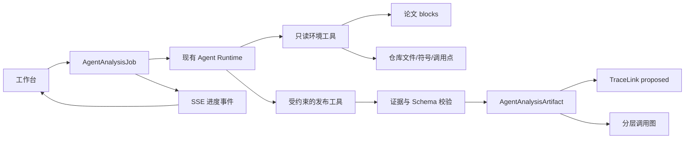

# Agent 接管的深层追溯与流程图实施方案

> 状态：已审查并实现  
> 分支：`docs/agentic-deep-tracing-plan`  
> 编写日期：2026-07-20

## 1. 结论先行

本轮建议把 TraceLab 的“语义分析”职责从本地规则迁移给现有 Agent Runtime：

- **Agent 是追溯关系、模型入口和调用流程的唯一语义决策者。**
- 本地代码仍负责安全读取、分页、轻量语法索引、精确行号、证据校验、任务调度、图布局和持久化；这些属于基础设施，不再根据关键词重叠或固定 AST 规则替 Agent 下结论。
- LLM 不可用时，不再生成新的静态追溯或规则流程图冒充结果。界面保留上一版结果并标记 stale，同时明确显示 `agent_not_configured`、`agent_timeout` 等原因。
- 自动分析复用已有 Agent 的 provider、tool registry、Skill、Run、SSE、重试、审计和能力快照，但使用独立的分析任务入口和受约束的结构化发布工具，不把普通聊天文本直接写入追溯或图数据。

本轮同时完成三个用户可见闭环：

1. 从追溯表、证据抽屉和 Agent 引用跳到论文的精确 block，并短暂高亮。
2. 流程图默认从模型函数继续展开一层：从入口函数到项目内调用，再到 `torch` / `nn` / 外部算子。
3. “生成追溯”改为启动 Agent 分析任务，实时显示取证与分析进度，完成后生成可审阅的 proposed 关系。

## 2. 当前实现诊断

### 2.1 追溯仍由本地算法主导

当前 `backend/app/services/tracing/static_candidates.py` 先用词元重叠生成候选，`tracing/service.py` 再让 LLM 解释这些候选。LLM 不能自主浏览完整论文和仓库，也不能发现静态算法没有召回的关系。

现有模式是：

```text
论文段落 + 符号索引
        ↓
本地关键词候选
        ↓
可选 LLM 解释/打分
        ↓
TraceLink
```

因此即使开启 LLM，实际的搜索空间和关系上限仍由本地算法决定。

### 2.2 流程图依赖 Python AST 规则

`backend/app/services/tensor_flow/architecture.py` 和 `semantic.py` 只处理 Python，并对 `forward`、`self.*`、`torch.*`、模块字段和“有意义调用”做固定判断。它能提供行号正确的初始图，但无法可靠理解：

- 非标准入口函数和跨文件封装；
- 项目自定义函数内部真正调用的 `nn` / `torch` 算子；
- 动态注册、配置驱动和工厂模式；
- 一个函数名背后的下一层语义。

这正是当前“从函数名到 nn 调用了什么，还要再追溯一层”的缺口。

### 2.3 Agent Runtime 已有基础，但分析接口不完整

现有 Agent 已经具备多轮 Run、SSE、工具调用、确认门禁、Skill、MCP、记忆和审计。主要缺口不是重写 Agent，而是补足其环境接口：

- `search_code` 主要搜索文件名和符号名，不能分页浏览仓库或查正文；
- `get_code_symbol` 只给索引元数据，不直接给完整符号源码和调用点；
- `get_architecture` 读取的仍是本地规则图，Agent 无法发布一版自己的图；
- `create_trace_link` 一次只能创建一条关系，且不适合作为批量自动分析的结构化出口；
- 普通会话没有“必须产出某个 schema 后才算完成”的任务约束。

### 2.4 论文只有章节跳转，没有 block 跳转

论文 block 已有稳定 ID（例如 `p3-b12`），但工作台 Markdown 只给标题设置 `section-*` DOM ID。追溯行只打开证据抽屉，Agent UI action 也只有 `open_code` 和 `focus_architecture`，所以论文证据无法落到原文位置。

## 3. 范围

### 3.1 本轮必须完成

- Agent 驱动的模型架构/调用分析，默认展开深度为 2。
- Agent 驱动的论文到代码追溯，不再调用静态候选算法。
- 分析结果必须有可验证的论文与代码双侧证据。
- 论文 block 精确跳转，以及追溯、Agent 引用、代码、图之间的双向导航。
- 分析任务的持久化状态、SSE 进度、失败原因、重试和 revision 失效处理。
- 对现有 accepted/rejected 追溯决策保持兼容，不由自动分析覆盖。

### 3.2 本轮不做

- 运行用户训练代码来探测真实 tensor shape。
- 自动修改代码或自动接受追溯关系。
- 向 Agent 暴露 shell、任意绝对路径或未受控文件系统。
- embedding/vector database。Agent 可以使用全文搜索和分页工具完成首版。
- 递归无限展开调用图。默认深度 2，硬上限 3。

## 4. 责任边界

“Agent 完全接管”指 Agent 完全接管语义判断，不等于删除所有本地解析代码。

| 能力 | 本地基础设施 | Agent |
| --- | --- | --- |
| ZIP 安全读取、忽略规则、文本解码 | 负责 | 不负责 |
| 文件/符号/调用点的索引和精确行号 | 提供可验证事实；索引失败时允许按文件读取 | 使用 |
| 选择模型入口 | 不做规则排名结论 | 负责并说明证据 |
| 判断函数/模块/论文概念的语义关系 | 不做 | 负责 |
| 决定追溯候选 | 不做关键词候选 | 负责 |
| 决定调用图节点与边 | 不做最终语义图 | 负责 |
| 校验引用、quote、行号、图完整性 | 负责 | 必须满足 |
| 图坐标布局 | 负责 | 只输出拓扑 |
| accepted/rejected 决策 | 负责状态机 | 不得代替用户 |

现有 AST 分析可继续作为 Agent 的可选索引来源，但 `static_candidates.py`、`architecture.py`、`semantic.py` 的结果不再作为新分析的最终产物或降级结果。

## 5. 目标架构



### 5.1 为什么不直接扩展普通聊天回答

分析任务和聊天的完成条件不同。聊天允许自然语言结束，自动分析必须：

- 固定任务类型和输入 revision；
- 使用特定 Skill 和工具子集；
- 发布符合 schema 的 artifact；
- 通过引用校验后才能变为 succeeded；
- 能被重试、缓存、标记 stale，并被 UI 稳定消费。

因此新增 `AgentAnalysisJob` 作为业务任务层，底层仍创建和复用现有 `AgentRun`。分析 Run 使用隐藏的 `kind=analysis` conversation，不混入用户普通会话列表，但保留完整审计记录。

## 6. 分析任务设计

### 6.1 任务类型

首版提供两个类型：

- `architecture`：分析指定或自动发现的模型入口，发布分层调用图。
- `trace`：分析论文 blocks 与当前代码 revision，发布追溯候选。

点击“生成追溯”时，如果当前 revision 没有有效架构 artifact，后台先运行 `architecture`，成功后再运行 `trace`。两个任务独立持久化，架构成功而追溯失败时仍可使用架构结果。

### 6.2 状态

```text
queued -> running -> validating -> succeeded
                   -> failed
                   -> stale
```

状态事件至少包含：

- `analysis.queued`
- `analysis.started`
- `analysis.progress`
- `analysis.tool.started/completed/failed`
- `analysis.validating`
- `analysis.completed`
- `analysis.failed`

`analysis.progress` 只显示可审计摘要，例如“正在读取 Encoder.forward 的调用点”，不透传模型隐藏思维链。

### 6.3 预算和边界

- interactive chat 保持现有默认 18 步。
- architecture 默认最多 48 步；trace 默认最多 64 步。
- 单次读取最多 40,000 字符，列表工具必须分页。
- 默认调用展开深度 `2`，最大 `3`。
- artifact 最大节点数 300、边数 600、追溯候选 100。
- 预算耗尽但未调用发布工具时任务失败为 `agent_output_incomplete`，不能把自然语言回答当结果。

## 7. Agent 工具扩展

### 7.1 新增只读工具

| 工具 | 用途 |
| --- | --- |
| `list_repository_files` | 按目录、语言和游标分页查看文件，不依赖符号索引 |
| `search_repository_text` | 在可读文本中查正文，返回 path、行号和短 quote |
| `list_code_symbols` | 按 path/kind 分页读取可用符号索引 |
| `get_symbol_source` | 返回一个符号的完整边界、带行号源码和内容 hash |
| `get_symbol_calls` | 返回符号内的调用点、callee 文本、行列和可解析目标 |
| `list_paper_blocks` | 按 section/kind/page 分页浏览论文 block |
| `get_paper_block` | 保留现有接口，补全 page、bbox、section_path 和 document_id |
| `get_analysis_artifact` | 读取当前 revision 已有图或追溯 artifact，支持增量复核 |
| `open_paper_location` | 普通会话中发出安全 UI action，定位论文 block |

所有工具继续执行项目边界校验、相对路径校验、字符上限和安全摘要。索引缺失时，Agent 仍可通过文件列表、全文搜索和分段读取工作，不把 AST 是否识别成功作为语义分析前提。

### 7.2 分析专用发布工具

新增：

- `publish_architecture_graph`
- `publish_trace_candidates`

它们只在对应 analysis Run 中可见，不出现在普通会话和外部 MCP 能力中。它们写入的是可重算的 derived artifact，不修改用户代码，也不接受追溯关系，因此无需逐次人工确认；运行时必须绑定 project、paper document、repository 和 revision，模型不能自行指定这些所有权字段。

发布前执行严格 schema 与证据校验。任何一条非法引用都会拒绝整次发布并把精确、无敏感信息的错误反馈给 Agent 修正。

## 8. 深一层流程图

### 8.1 展开语义

默认深度 2 定义为：

- depth 0：用户选择或 Agent 识别的入口，例如 `Model.forward`。
- depth 1：入口直接调用的项目模块、项目函数和关键算子。
- depth 2：对 depth 1 的项目内函数/模块继续读取实现，展示其调用的 `torch`、`torch.nn`、框架算子或下一层项目函数。

外部标准组件默认作为黑盒节点；项目内节点可继续手动展开，硬上限为 3。这样 UI 不会把完整仓库压成一张不可读的大图，同时满足“从函数名看到实际 nn 调用”的需求。

### 8.2 artifact schema

```json
{
  "schema_version": "architecture-agent-v1",
  "root_symbol": "models/net.py::Model.forward",
  "root_label": "Model.forward",
  "requested_depth": 2,
  "nodes": [
    {
      "id": "node-stable-id",
      "label": "self.encoder",
      "kind": "project_call",
      "depth": 1,
      "symbol_id": "models/encoder.py::Encoder.forward",
      "callee": "self.encoder",
      "source_path": "models/net.py",
      "line_start": 42,
      "line_end": 42,
      "component_symbol_id": "models/encoder.py::Encoder.forward",
      "expandable": true,
      "external": false,
      "evidence": [{"path": "models/net.py", "line_start": 42, "line_end": 42, "quote": "x = self.encoder(x)"}]
    }
  ],
  "edges": [
    {"id": "edge-stable-id", "source": "a", "target": "b", "kind": "call", "label": "x"}
  ],
  "unresolved": [
    {"callee": "factory[name]", "path": "models/net.py", "line": 55, "reason": "dynamic_dispatch"}
  ]
}
```

### 8.3 校验规则

- 每个项目内节点必须指向当前 repository revision 中存在的 path 和有效行范围。
- `quote` 必须能在对应行范围原文中精确匹配（只允许统一换行和空白）。
- `component_symbol_id` 若非空，必须能由符号索引或源码位置解析；无法解析时写入 `unresolved`，不能伪造。
- edge 两端必须存在，ID 唯一；循环调用由本地布局层压缩为 loop group，不丢失原 edge。
- Agent 输出拓扑和语义，本地 `layout.py` 继续计算坐标。

## 9. Agent 追溯

### 9.1 新流程

```text
Agent 分页读取论文结构和关键 blocks
        ↓
Agent 浏览仓库/架构 artifact，按需读取符号源码与调用点
        ↓
Agent 提出带双侧证据的候选
        ↓
本地逐条验证 ref、quote、行号和 revision
        ↓
写入 proposed TraceLink，等待用户接受/拒绝
```

本地不再生成关键词候选，也不融合 `static_confidence`。Agent 可以自主回看遗漏的论文 block、跨文件跟踪实现，并明确输出 `unresolved` 概念。

### 9.2 追溯输出要求

每条候选必须包含：

- `paper_block_id`、document ID、page、section path、原文 quote；
- `code_symbol_id` 或 path+行范围、代码 quote；
- `relation_type`；
- `rationale`，说明论文主张如何落到代码；
- `confidence` 和结构化 uncertainty；
- 生成模型、prompt/skill 版本、Agent Run ID；
- 可选 `graph_node_ids`，用于从追溯关系聚焦到流程图节点。

`source` 新值为 `agent`。`static_confidence` 保留为兼容旧数据的 nullable/deprecated 字段，新结果不再使用。现有 `accepted`、`rejected` 不被重新生成覆盖；revision 变化后继续按当前规则变为 stale。

## 10. 论文精确跳转

### 10.1 数据贯通

`WorkspacePaperDocument` 增加 blocks：

```json
{
  "id": "p3-b12",
  "kind": "paragraph",
  "page": 3,
  "bbox": [0.1, 0.2, 0.8, 0.3],
  "section_path": ["3 Method", "3.2 Encoder"],
  "text": "...",
  "render_anchor": "paper-block-p3-b12"
}
```

解析/标准化阶段为 Markdown 注入稳定的 block anchor。MinerU 原始 Markdown 与结构化 blocks 对不上的项必须被标记为 `anchor_unresolved`；前端回退到最近 section，并用 quote 在该 section 内定位，不能静默跳到错误段落。

### 10.2 前端交互

- `PaperReader` 暴露 `scrollToBlock(blockId, quote?)`。
- 命中后将目标 block 滚动到视口上方约 20%，高亮 1.5 秒。
- 点击追溯矩阵的论文单元格直接跳转；点击代码单元格直接跳到代码行。
- 证据抽屉的每条 evidence 都是可点击定位项。
- Agent citation 点击后，根据 side 触发 `open_paper`、`open_code`、`focus_architecture` 或打开 trace detail。
- `AgentUiAction` 增加 `{type: "open_paper", block_id, quote?}`。

## 11. API 调整

### 11.1 分析任务

```text
POST /api/v1/projects/{project_id}/agent/analysis-jobs
GET  /api/v1/projects/{project_id}/agent/analysis-jobs/{job_id}
GET  /api/v1/projects/{project_id}/agent/analysis-jobs/{job_id}/events
POST /api/v1/projects/{project_id}/agent/analysis-jobs/{job_id}/retry
```

创建请求：

```json
{
  "kind": "architecture",
  "root_symbol": null,
  "depth": 2,
  "force": false
}
```

或：

```json
{
  "kind": "trace",
  "paper_document_id": 3,
  "code_repository_id": 5,
  "force": false
}
```

同一 artifact fingerprint 已有 succeeded job 时复用；`force=true` 才重新分析。

### 11.2 兼容接口

现有 `POST /trace-links/suggest` 在前端迁移后标记 deprecated。过渡期它不再同步运行静态算法，而是创建 `trace` analysis job 并返回 `202`。前端改为订阅 job events，完成后调用现有 `GET /trace-links`。

`GET /workspace/tensor-flow` 保持响应结构兼容，数据源优先读取当前 revision 的 `architecture-agent-v1` artifact。没有有效 artifact 时返回空图和明确的 analysis status，不回退到规则语义图。

## 12. 数据模型与迁移

新增迁移（预计 `0009_agent_analysis.py`）：

### 12.1 `agent_analysis_job`

- `job_id`, `project_id`, `kind`, `status`
- `paper_document_id`, `code_repository_id`, `code_revision`
- `root_symbol`, `requested_depth`
- `agent_run_id`, `artifact_id`
- `fingerprint`（唯一）
- `progress_json`, `error_code`
- `created_at`, `updated_at`, `completed_at`

### 12.2 `agent_analysis_artifact`

- `artifact_id`, `job_id`, `project_id`, `kind`
- `schema_version`, `payload_json`
- `paper_document_id`, `code_repository_id`, `code_revision`
- `model_info_json`, `capability_snapshot_json`
- `fingerprint`, `is_current`
- `created_at`

### 12.3 现有表的最小变化

- `agent_conversation.kind`: `interactive | analysis`，API 默认只列 interactive。
- `trace_link.source` 允许 `agent`。
- `trace_link.static_confidence` 改为 nullable 或保留 0 作为兼容值，并在新契约中标为 deprecated。
- Agent 追溯的 run/artifact/evidence 元数据优先放入结构化字段；如迁移成本过高，首版可放 `model_info_json` 和 `evidence_json`，但 API schema 必须完整暴露。

## 13. 前端改动

### 13.1 追溯面板

- “生成候选”改为“Agent 分析”。
- 展示 queued/running/validating 状态和 SSE 进度。
- 去掉“静态分析 + 可选 LLM 增强”文案与 `useLlm` 开关。
- 失败时保留旧结果并显示 stale/失败原因，不显示伪造的降级候选。
- 论文列、代码列和证据项分别可直接跳转。

### 13.2 流程图

- 显示 depth 和节点来源，项目内函数节点提供展开按钮。
- depth 2 的 `nn` / `torch` 调用使用算子节点，外部组件明确标为黑盒。
- inspector 展示 callee、证据行、unresolved 原因和“定位代码”。
- 分析中显示稳定占位，不用 loading 文本改变画布尺寸。

### 13.3 Agent 面板

- citation 改为按钮式可定位引用。
- 支持 `open_paper` UI action。
- 分析任务不混入普通对话历史；用户仍可从 job 查看审计摘要和使用的模型/Skill。

## 14. 预计代码落点

后端新增或重点修改：

- `backend/app/services/agent/analysis_jobs.py`（新增）
- `backend/app/services/agent/analysis_tools.py`（新增）
- `backend/app/services/agent/builtin_skills/architecture-analysis/SKILL.md`
- `backend/app/services/agent/builtin_skills/trace-analysis/SKILL.md`
- `backend/app/services/agent/tools.py`
- `backend/app/services/agent/conversations.py`
- `backend/app/api/routes/agent.py`
- `backend/app/services/workspace_service.py`
- `backend/app/services/paper_markdown.py`
- `backend/app/schemas/agent.py`, `traces.py`, `papers.py`, `repositories.py`
- `backend/app/models/entities.py`
- `backend/app/db/migrations/versions/0009_agent_analysis.py`

前端新增或重点修改：

- `frontend/src/api/agent-api.ts`, `trace-api.ts`
- `frontend/src/types/agent.ts`, `tracing.ts`, `papers.ts`, `repositories.ts`
- `frontend/src/composables/useTrace.ts`, `useTensorFlow.ts`, `usePaper.ts`
- `frontend/src/features/papers/PaperReader.vue`
- `frontend/src/features/tracing/TraceMatrix.vue`, `EvidenceDrawer.vue`
- `frontend/src/features/tensor-flow/TensorFlowCanvas.vue`, `TensorFlowInspector.vue`
- `frontend/src/features/agent/AgentPanel.vue`
- `frontend/src/views/ProjectWorkspaceView.vue`

旧的 `tracing/static_candidates.py` 和规则图构建器先保留一版用于旧数据测试/迁移，不再被新 API 调用；确认新链路稳定后再单独删除，避免本轮同时扩大迁移风险。

## 15. 实施顺序

### 阶段 1：契约、迁移和论文跳转

- 增加 analysis job/artifact schema 与 migration。
- 增加 paper blocks/render anchors。
- 打通 Trace/Evidence/Agent citation 到论文和代码的跳转。
- 先用 fixture 验证跳转，不依赖真实 LLM。

### 阶段 2：Agent 分析运行时

- 增加 analysis profile、隐藏 conversation、预算和完成条件。
- 增加分页读取工具和两个发布工具。
- 复用现有 Run Event/SSE、provider retry、能力快照和安全日志。
- 使用 fake provider 覆盖完整状态机。

### 阶段 3：深层流程图

- 实现 `architecture-agent-v1` schema、校验和 artifact 读取。
- `GET /workspace/tensor-flow` 切换到 Agent artifact。
- 前端支持 depth 2、继续展开、证据定位和 unresolved。

### 阶段 4：Agent 追溯

- 实现 `trace-agent-v1` schema、双侧证据校验和 TraceLink 持久化。
- 将 suggest UI 切换到 analysis job + SSE。
- 验证 accepted/rejected/stale 与重复运行行为。

### 阶段 5：清理与文档

- 删除新链路对静态候选和规则语义图的调用。
- 更新 contracts、API 总览、架构文档和配置说明。
- 跑全量后端、前端 build 和关键工作台浏览器测试。

## 16. 测试策略

### 16.1 后端

- fake provider 能通过工具逐层读取 `forward -> helper -> nn.Linear` 并发布 depth 2 图。
- Agent 选错行号、伪造 quote、引用旧 revision、产生悬空 edge 时发布被拒绝。
- 非 Python fixture 在无 AST symbols 时仍能通过文件工具生成有证据的图/追溯。
- LLM 未配置、超时、限流、无效 JSON、预算耗尽均不会产生新 artifact。
- 同 fingerprint 幂等复用，force 才新建；revision 变化后旧 artifact 和追溯变 stale。
- 自动生成只创建 proposed，不覆盖 accepted/rejected。
- analysis conversation 不出现在普通会话列表。
- API key、绝对路径、完整私有工具参数不进入事件和响应。

### 16.2 前端

- 点击追溯论文单元格、paper evidence、Agent paper citation 都定位同一 block。
- block anchor 不存在时回退到最近 section，并显示“精确锚点不可用”。
- 点击 code evidence 定位正确文件和行。
- analysis SSE 断线后按 sequence 恢复，不重复追加进度。
- 旧 artifact 在新分析失败后仍可查看，但明确显示 stale。
- depth 2 图在桌面和窄屏无节点/工具栏重叠，节点 hover 不改变布局。

### 16.3 验收 fixture

固定准备一份小论文和仓库，至少包含：

```python
def forward(self, x):
    return self.encode(x)

def encode(self, x):
    return self.proj(self.norm(x))
```

验收图必须展示 `forward -> encode -> norm/proj`，每个节点能跳到正确行；论文对应 block 能直接跳转；Agent 至少生成一条具有精确双侧 quote 的 proposed trace，并能接受、拒绝和因 revision 变化而 stale。

## 17. 风险与处理

| 风险 | 处理 |
| --- | --- |
| 大仓库导致工具轮数和成本失控 | 分页、按 root 分析、硬预算、artifact 缓存、最大节点/候选数 |
| Agent 漏分析或幻觉 | 不做无证据持久化；展示 unresolved；每个 ref/quote/行号本地校验 |
| MinerU Markdown 与 block 顺序不一致 | 解析时生成稳定 anchor 映射；失败显式回退 section+quote |
| LLM 不可用时无新结果 | 保留旧 artifact 并标 stale；明确失败，不回退到错误语义算法 |
| 自动发布绕过人工确认 | 仅允许发布 derived artifact/proposed trace；代码写入和接受/拒绝仍走确认/用户操作 |
| 现有 Agent Runtime 被分析需求拖复杂 | analysis profile 与普通聊天共享底层循环，但工具目录、预算、完成条件和 conversation 可见性隔离 |

## 18. 需要审查确认的决策

建议按以下默认项实施：

1. **无语义降级**：LLM 不可用时不再生成静态候选或规则图，只保留 stale 旧结果。
2. **默认深度 2**：入口直接调用为第一层，再展开项目内调用到实际 `nn/torch` 为第二层；硬上限 3。
3. **自动保存 derived 结果**：Agent 发布的图和 proposed trace 无需逐条确认，但接受/拒绝和代码修改仍需用户决定。
4. **复用 Agent Runtime**：不另写第二套 LLM 调用器；用 analysis job/profile 约束现有 Run。
5. **先兼容后删除**：旧静态代码先退出调用链，稳定后再删除文件和旧字段。

本文档所列阶段 1 至阶段 4 已在本分支实现；旧规则实现仍按阶段 5 的兼容策略保留文件，但已退出工作台的新生成与展示调用链。
