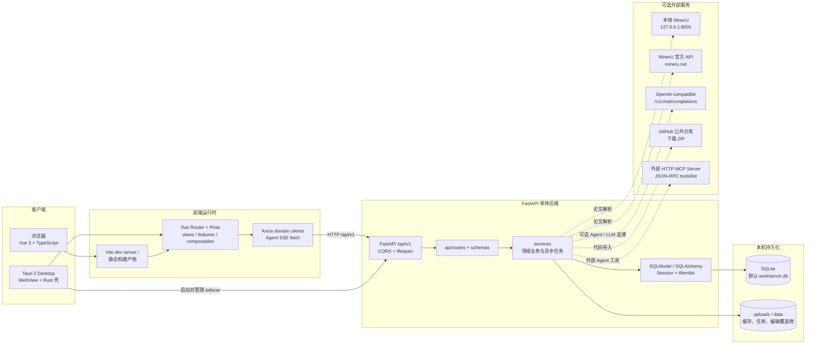
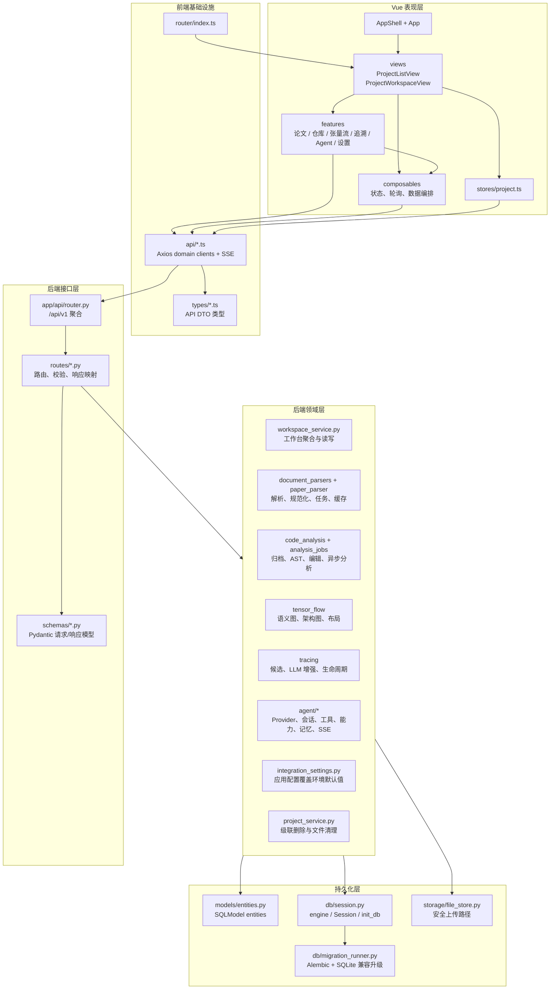
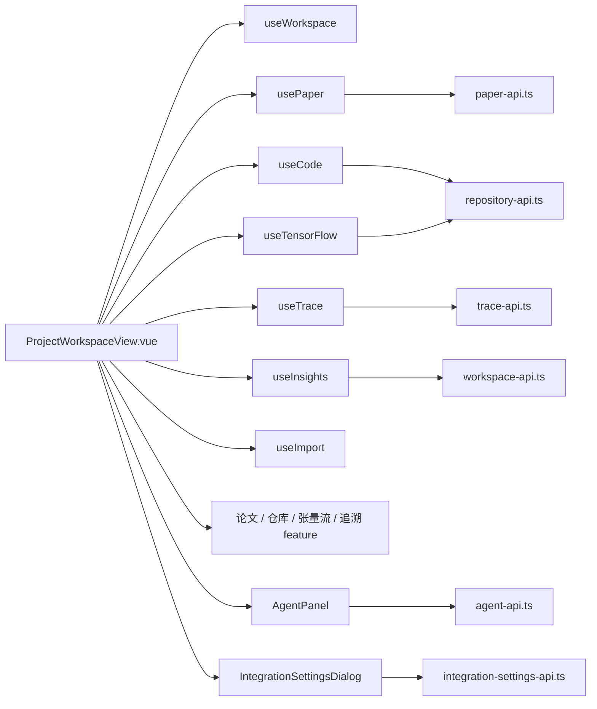
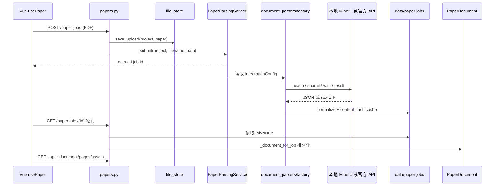
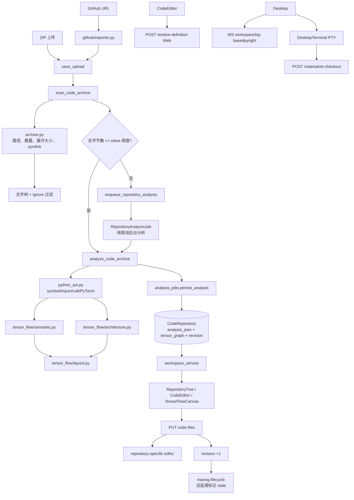
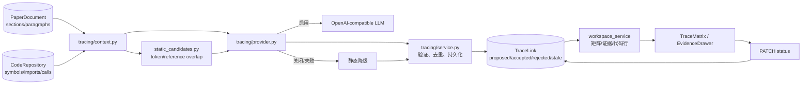
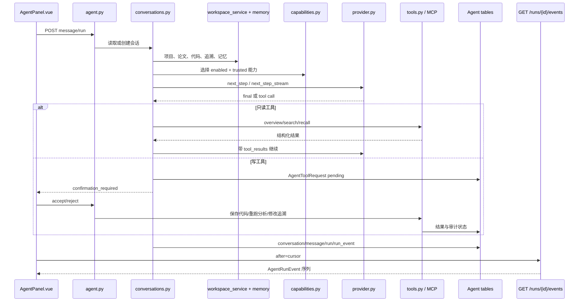
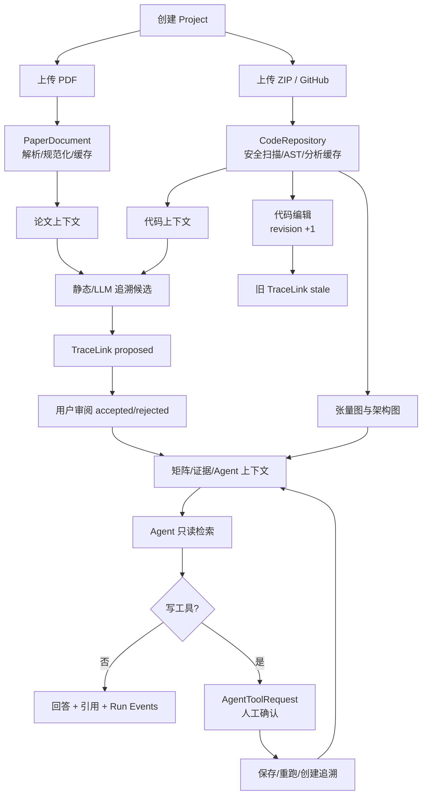
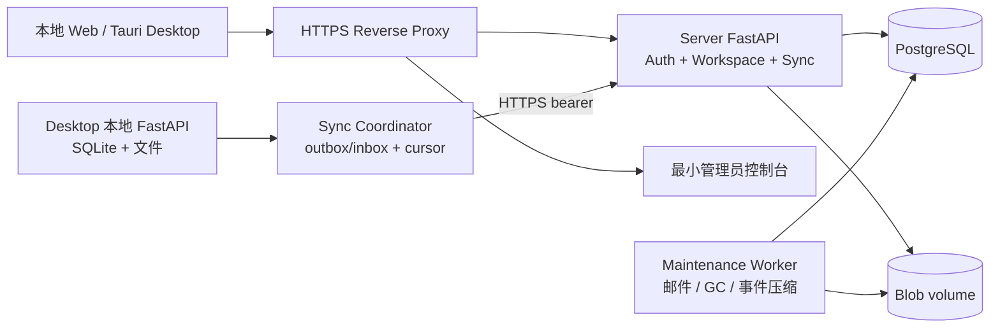

# TraceLab 当前软件架构

> 本文基于仓库当前源码整理，最后核对日期：2026-07-20。描述对象是本地应用
> `backend/`、`frontend/`，以及独立账号/同步产品 `server/`；`UIPrototype/` 与
> `workspace_placeholder.py` 属于原型/兼容层。

## 1. 架构结论

TraceLab 是一个本地优先、单体后端、双运行壳的论文—代码双向追溯工作台：

- Web 模式由 Vite 承载 Vue 3 页面，Vite 把 `/api` 代理到 FastAPI。
- Desktop 模式由 Tauri 2 承载同一套 Vue 前端；Tauri 启动随应用打包的 FastAPI/PyInstaller sidecar，前端访问 `127.0.0.1:8765`。
- FastAPI 以 `/api/v1` 统一暴露项目、论文、代码、张量流、追溯、Agent、工作台和集成设置接口。
- Local API 默认且只使用 SQLite；远程 PostgreSQL 由独立 `server/compose.yaml` 拥有，不进入 Desktop sidecar。
- PDF、代码 ZIP、代码编辑覆盖物、论文解析任务与 MinerU 缓存存放在本地文件系统；数据库存放项目元数据、结构化文档、代码分析、追溯关系、Agent 运行审计和配置。
- 论文解析可接本地 MinerU 或官方 MinerU API；追溯增强和 Agent 可接任意 OpenAI-compatible Chat Completions 服务；Agent 还可以发现外部 HTTP MCP 工具。
- 代码分析、张量流和静态追溯不依赖 LLM。LLM 不可用时，追溯降级为静态候选，Agent 不执行写操作。

## 2. 总体部署架构



### 2.1 Web 模式

`frontend/src/main.ts` 创建 Vue 应用并注册 Pinia、Vue Router、Element Plus；`frontend/vite.config.ts` 将 `/api` 转发至 `http://127.0.0.1:8000`；`frontend/src/api/http.ts` 在浏览器中使用 `/api/v1`。后端由 `uvicorn app.main:app` 启动。

### 2.2 Desktop 模式

`frontend/src-tauri/src/lib.rs` 创建应用数据目录，启动 `backend-runtime/tracelab-backend`，注入 `TRACELAB_APP_DATA_DIR`、`TRACELAB_BACKEND_PORT=8765` 和父进程 PID，等待 TCP ready 后显示窗口，退出时终止后端。`frontend/scripts/build-backend-sidecar.mjs` 使用 PyInstaller 打包 `backend/app`、迁移文件和内置 skills；`tauri.conf.json` 将 runtime 作为应用资源。

Desktop 集成 `tauri-plugin-pty` 与 `@xterm/xterm`：工作台底部「终端」在本机 spawn 用户 shell，`cwd` 为 `POST /workspace/materialize-checkout` 返回的项目检出路径（ZIP + 编辑覆盖层）。Web 模式不显示终端面板。

Desktop Python 编辑器接入 **basedpyright** LSP：经 `WS /workspace/lsp` 桥接到 sidecar 内语言服务，提供跳转、hover、补全、诊断等完整 IDE 能力（`@codemirror/lsp-client`）。Web 模式仍用 Cmd/Ctrl+点击 + `POST /workspace/resolve-definition`（AST 索引，非 LSP）。

## 3. 分层架构与源码关系



接口层主要负责路径、参数校验、项目存在性检查、异常映射和 DTO 转换；解析、分析、追溯、Agent 等业务集中在 `services`，再由 `models/db/storage` 提供持久化能力。

## 4. 项目文件结构

以下结构列出当前实现相关的源码与文档，省略 `node_modules/`、`frontend/dist/`、`UIPrototype/dist-iter1/`、构建缓存和图片资源。

```text
TraceLab/
├── README.md                         # 配置、启动、演示闭环、测试
├── Makefile                          # 根目录命令
├── .env.example                      # 环境变量模板
├── server/                           # 独立账号、同步、Blob、管理员与部署
├── database/
│   ├── schema.sql                    # 早期/兼容基础表快照
│   └── seed.sql                      # 种子脚本
├── backend/
│   ├── pyproject.toml, uv.lock       # Python 依赖与锁文件
│   ├── README.md                     # 后端与 Desktop sidecar 说明
│   ├── app/
│   │   ├── main.py                   # FastAPI、CORS、lifespan 恢复
│   │   ├── desktop.py                # PyInstaller 后端入口
│   │   ├── core/config.py            # Pydantic Settings
│   │   ├── api/router.py             # /api/v1 路由聚合
│   │   ├── api/routes/
│   │   │   ├── health.py             # 健康检查
│   │   │   ├── projects.py           # 项目 CRUD/批量删除
│   │   │   ├── papers.py             # PDF、解析任务、论文资源
│   │   │   ├── repositories.py       # ZIP/GitHub、文件、分析、张量流
│   │   │   ├── traces.py             # 追溯生成、审阅、矩阵
│   │   │   ├── agent.py              # Agent REST、SSE、确认、记忆、能力
│   │   │   ├── workspace.py          # 工作台聚合、冲突、报告、分析任务
│   │   │   ├── integration_settings.py # Agent/MinerU 设置
│   │   │   └── helpers.py            # 原型 project id 兼容解析
│   │   ├── schemas/                  # 按领域拆分的 Pydantic DTO
│   │   │   ├── common.py, projects.py, papers.py
│   │   │   ├── repositories.py, traces.py, agent.py
│   │   │   ├── workspace.py, integration_settings.py
│   │   ├── models/entities.py        # 全部 SQLModel 实体
│   │   ├── db/
│   │   │   ├── session.py            # engine、Session、init_db
│   │   │   ├── migration_runner.py   # Alembic/SQLite 双路径升级
│   │   │   └── migrations/versions/  # 0001 到 0005 迁移链
│   │   ├── storage/file_store.py     # 上传文件存储
│   │   ├── integrations/github/importer.py # GitHub 导入
│   │   └── services/
│   │       ├── project_service.py    # 级联删除与文件清理
│   │       ├── workspace_service.py  # 真实项目工作台读模型/编辑
│   │       ├── workspace_placeholder.py # 原型静态数据兼容层
│   │       ├── paper_parser.py       # pypdf 兼容回退解析
│   │       ├── paper_markdown.py     # Markdown 与章节转换
│   │       ├── document_parsers/
│   │       │   ├── base.py, models.py, factory.py
│   │       │   ├── jobs.py            # 线程池任务与内容寻址缓存
│   │       │   ├── mineru.py          # 本地 MinerU client/parser
│   │       │   ├── mineru_official.py # 官方 MinerU API client
│   │       │   ├── normalizer.py      # MinerU payload 规范化
│   │       │   ├── geometry.py        # middle.json 页面/行几何，句子级 PDF 高亮
│   │       │   └── stub.py            # 测试替身 parser
│   │       ├── code_analyzer.py      # 代码分析兼容入口
│   │       ├── code_analysis/
│   │       │   ├── analyzer.py        # 快速扫描/完整分析编排
│   │       │   ├── archive.py         # ZIP 安全、路径、大小和 symlink
│   │       │   ├── editor.py          # 编辑文件读写与覆盖目录
│   │       │   ├── python_ast.py      # Python symbol/import/call/PyTorch AST
│   │       │   ├── tree.py            # 文件树构造
│   │       │   ├── languages.py       # 语言识别与编辑白名单
│   │       │   ├── ignore_rules.py    # .gitignore/macOS 元数据过滤
│   │       │   └── constants.py       # 安全阈值
│   │       ├── analysis_jobs.py       # 大仓库后台分析、缓存、恢复
│   │       ├── tensor_flow/
│   │       │   ├── semantic.py        # 张量语义图
│   │       │   ├── architecture.py    # 模型架构图与下钻
│   │       │   └── layout.py          # 节点布局与边路径
│   │       ├── tracing/
│   │       │   ├── static_candidates.py # 静态候选
│   │       │   ├── context.py          # 论文/代码上下文
│   │       │   ├── provider.py         # 静态+LLM provider/降级
│   │       │   ├── service.py           # 生成、去重、持久化
│   │       │   └── lifecycle.py         # revision 变化与 stale
│   │       ├── trace_suggester.py     # 静态候选兼容入口
│   │       ├── integration_settings.py # 集成配置服务
│   │       └── agent/
│   │           ├── service.py           # query、确认、写工具、回调
│   │           ├── conversations.py     # 会话、Run、上下文、恢复
│   │           ├── provider.py          # OpenAI-compatible 与流式解析
│   │           ├── analysis_jobs.py     # 追溯/架构分析 job 父循环
│   │           ├── analysis_tools.py    # 分析工具白名单与证据校验
│   │           ├── subagents.py         # 并行区域子代理、事件总线、发布汇
│   │           ├── tools.py             # 内置只读/写工具
│   │           ├── capabilities.py     # Skill/Tool/MCP registry
│   │           ├── skills.py            # 兼容导出
│   │           ├── mcp.py               # HTTP JSON-RPC MCP 与 schema 校验
│   │           ├── memory.py             # 记忆存取与检索
│   │           ├── run_events.py         # Run Event 持久化
│   │           └── builtin_skills/       # 五类内置 SKILL.md
│   └── tests/                           # 按论文/仓库/追溯/Agent 等领域测试
├── frontend/
│   ├── package.json, pnpm-lock.yaml    # Vue/Vite/TypeScript/Tauri 依赖
│   ├── vite.config.ts                  # /api -> 8000 代理
│   ├── scripts/build-backend-sidecar.mjs
│   ├── src/
│   │   ├── main.ts, App.vue            # Vue 启动与根组件
│   │   ├── router/index.ts             # / 与 /projects/:id
│   │   ├── stores/project.ts           # 项目列表状态
│   │   ├── api/                         # http、project、paper、repository、trace、agent、workspace、settings
│   │   ├── types/                       # 与后端 schemas 对应的 TS DTO
│   │   ├── composables/                 # useWorkspace/usePaper/useCode/useTensorFlow/useTrace/useInsights/useImport/useDesktop
│   │   ├── views/
│   │   │   ├── ProjectListView.vue      # 项目入口
│   │   │   └── ProjectWorkspaceView.vue # 主工作台编排
│   │   ├── components/                 # AppShell 与旧/兼容组件
│   │   ├── features/
│   │   │   ├── agent/AgentPanel.vue
│   │   │   ├── papers/                  # 导入条、目录树、Markdown/PDF 阅读器、追溯高亮
│   │   │   ├── repository/              # RepositoryTree、CodeEditor（Cmd/Ctrl+点击跳转定义）
│   │   │   ├── terminal/                # DesktopTerminal（xterm + tauri-plugin-pty，仅 Desktop）
│   │   │   ├── tensor-flow/             # Canvas、Inspector
│   │   │   ├── tracing/                 # Matrix、Evidence、Conflict、Report 等
│   │   │   └── settings/                # IntegrationSettingsDialog
│   │   └── styles/base.css
│   └── src-tauri/                       # Rust 壳、权限、配置、sidecar 资源
├── docs/                                # 契约、数据库、架构和演示文档
└── UIPrototype/ TechPrototype/          # 需求、迭代、模型和协作材料
```

### 4.1 当前前端组合关系

`ProjectWorkspaceView.vue` 是当前真实工作台入口，它组合领域 composable 与 feature 组件；`frontend/src/components/` 下的 `CodeBrowser.vue`、`PaperReader.vue`、`TraceResultPanel.vue`、`UploadPanel.vue` 属于旧/兼容组件，不能据此判断当前主界面结构。



## 5. 后端接口与职责

所有接口均挂在 `/api/v1` 下。

| 模块 | 主要路径 | 核心依赖 | 作用 |
|---|---|---|---|
| `health.py` | `GET /health` | `core/config.py` | 健康检查 |
| `projects.py` | `/projects`、`/projects/{id}`、`/projects/batch-delete` | `Project`、`project_service` | 项目 CRUD；删除关联行、任务和上传物 |
| `papers.py` | `/projects/{id}/paper*`、`paper-jobs/*`、`workspace/paper-*`、`paper/assets/*` | `file_store`、`paper_parser`、`document_parsers` | PDF 保存、同步兼容解析、异步 MinerU、Markdown/页面/资源 |
| `repositories.py` | `/code`、`/code/github`、`code/analysis`、`workspace/code-*`、`workspace/tensor-flow` | `github`、`code_analysis`、`analysis_jobs`、`workspace_service` | 代码导入、安全分析、文件编辑、张量流 |
| `traces.py` | `/trace-links`、`/trace-links/suggest`、`/trace-links/{trace_id}/status`、`workspace/trace-matrix` | `tracing.service`、`workspace_service` | 生成、持久化、审阅和矩阵 |
| `workspace.py` | `/workspace`、`flow-graph`、`conflicts`、`report-summary`、`workspace/analyze` | `workspace_service`、`analysis_jobs` | 主工作台聚合读模型和分析入口 |
| `agent.py` | `/agent/capabilities`、`conversations`、`runs`、`events`、`memories`、`confirmations`、`query` | `agent/*` | Agent 对话、Run、SSE、工具、能力、记忆和确认 |
| `integration_settings.py` | `/settings/integrations` | `integration_settings`、`IntegrationConfig` | Agent/MinerU 地址、模型、开关和密钥配置 |

`main.py` 的 lifespan 启动顺序是：`init_db()` → 注册仓库分析回调 → 恢复仓库分析任务 → 恢复未结束 Agent Run。这样后台任务和 SSE 事件在进程重启后仍能从落盘状态继续。

## 6. 论文解析子系统



- `POST /paper` 使用 `paper_parser.parse_pdf()` 保留同步兼容路径；主流程是 `PaperParsingService` 的 `ThreadPoolExecutor`。
- `factory.py` 根据 `IntegrationConfig.mineru_provider` 选择本地 `MinerUClient` 或 `OfficialMinerUClient`。
- `normalizer.py` 把不同 MinerU payload 统一成 `ParsedDocument`，包括标题、摘要、页面、章节、段落和资源引用。
- 任务状态和解析结果采用 JSON/内容哈希缓存，成功后由 `papers.py` 延迟创建 `PaperDocument`；原始 PDF 仍由 `storage_path` 指向文件系统。

## 7. 代码导入、分析与张量流



`archive.py` 拒绝绝对路径、`..`、反斜杠路径和 ZIP symlink，限制文件数量与总未压缩大小；`ignore_rules.py` 处理 `.gitignore` 和 `.DS_Store`；`editor.py` 只允许规范化相对路径、文本白名单和大小限制内的文件。原始 ZIP 不被改写，保存内容写入覆盖目录。

小仓库在上传请求内完成完整分析；超过 `TRACELAB_ANALYSIS_INLINE_MAX_BYTES` 的仓库先返回文件树和 pending/queued 状态，再由 `analysis_jobs.py` 执行。`RepositoryAnalysisJob` 保存任务状态和目标 revision，`CodeRepository.analysis_json` 保存分析快照；保存代码会递增 `CodeRepository.revision` 并使旧追溯 stale。

## 8. 追溯子系统



`static_candidates.py` 以论文块、代码 symbol、模块名和 token 重叠生成低成本候选；`provider.py` 可用 LLM 补充 confidence、rationale、evidence 和 model 信息；`service.py` 负责 fingerprint 去重和写入 `TraceLink`。关系绑定 `paper_document_id`、`code_repository_id` 和 `code_revision`，默认 `proposed`，代码 revision 改变后标记 `stale`。

当前候选发现的主路径是 Agent 追溯任务（静态关键词候选写入已退役）：`agent/analysis_jobs.py` 的父循环在 SCOUT/MAP 之后可调用 `dispatch_trace_subagents`，由 `agent/subagents.py` 在独立有界线程池中并行运行区域子代理；所有发布经单写者发布汇（`TracePublishSink`）串行落库，事件经线程安全总线（`SharedRunEventBus`）保持 `(run_id, sequence)` 单调。详见 `docs/trace/agent-tracing-implementation.md`。

## 9. Agent 运行时



- `provider.py` 调用 OpenAI-compatible `/chat/completions`，支持原生 function calling、JSON fallback 和上游 SSE；模型由 `IntegrationConfig` 配置。
- `conversations.py` 负责上下文、同步 query、持久化异步 Run、循环预算和重启恢复。
- `tools.py` 的只读工具用于项目概览、论文/代码检索和记忆读取；保存代码、重跑分析、创建/更新追溯是写工具，必须经过 `AgentToolRequest` 人工确认。
- `capabilities.py` 扫描内置、工作区和用户目录 AgentSkills，并可通过 `mcp.py` 发现外部 HTTP MCP 工具；能力必须同时 enabled 和 trusted 才能进入模型工具目录。
- `memory.py` 保存全局/项目记忆，以 token overlap、重要性排序并更新 `last_used_at`。
- `run_events.py` 以 `(run_id, sequence)` 持久化事件；前端 `agent-api.ts` 使用 cursor 和重试消费 SSE。
- Provider 未配置、LLM 失败、未知工具或超过循环预算时返回 degraded，降级路径不执行写操作。

## 10. 数据库与文件存储

```mermaid
erDiagram
  PROJECT ||--o{ PAPER_DOCUMENT : contains
  PROJECT ||--o{ CODE_REPOSITORY : contains
  PROJECT ||--o{ TRACE_LINK : scopes
  PAPER_DOCUMENT o|--o{ TRACE_LINK : evidence
  CODE_REPOSITORY o|--o{ TRACE_LINK : evidence
  PROJECT ||--o{ AGENT_CONVERSATION : owns
  AGENT_CONVERSATION ||--o{ AGENT_MESSAGE : has
  AGENT_CONVERSATION ||--o{ AGENT_RUN : starts
  AGENT_RUN ||--o{ AGENT_RUN_EVENT : emits
  PROJECT ||--o{ AGENT_TOOL_REQUEST : scopes
  AGENT_CONVERSATION o|--o{ AGENT_TOOL_REQUEST : confirms
  PROJECT ||--o{ AGENT_MEMORY : scopes
  PROJECT ||--o{ REPOSITORY_ANALYSIS_JOB : schedules
  CODE_REPOSITORY ||--o{ REPOSITORY_ANALYSIS_JOB : analyzes
  PROJECT {
    int id PK
    string name
    text description
  }
  PAPER_DOCUMENT {
    int id PK
    int project_id FK
    string parser
    string content_hash
    json sections_json
    json paragraphs_json
    json pages_json
  }
  CODE_REPOSITORY {
    int id PK
    int project_id FK
    int revision
    string analysis_status
    json file_tree_json
    json analysis_json
    json tensor_graph_json
  }
  TRACE_LINK {
    string trace_id PK_like
    int project_id FK
    int paper_document_id FK
    int code_repository_id FK
    int code_revision
    string status
    json evidence_json
  }
  AGENT_CONVERSATION {
    string conversation_id PK
    int project_id FK
    string status
  }
  AGENT_MESSAGE {
    string message_id PK_like
    string conversation_id FK
    string role
    text content
  }
  AGENT_RUN {
    string run_id PK
    string conversation_id FK
    string status
    json trace_json
  }
  AGENT_RUN_EVENT {
    string event_id PK_like
    string run_id FK
    int sequence
    string event_type
    json payload_json
  }
  AGENT_TOOL_REQUEST {
    string confirmation_id PK_like
    string tool_name
    string status
    json private_arguments_json
  }
  AGENT_MEMORY {
    string memory_id PK
    int project_id FK
    string scope
    string kind
    text content
  }
  AGENT_CAPABILITY_SETTING {
    string capability_id PK
    boolean enabled
    boolean trusted
  }
  REPOSITORY_ANALYSIS_JOB {
    string job_id PK
    int project_id FK
    int repository_id FK
    int repository_revision
    string status
  }
  INTEGRATION_CONFIG {
    int id PK
    boolean agent_enabled
    string mineru_provider
    text agent_api_key
    text mineru_official_api_token
  }
```

迁移链为：

```text
0001_legacy_baseline -> ... -> 0007_cloud_consistency
  -> 0008_local_artifact_versions -> 0009_agent_analysis (head)
```

`backend/app/models/entities.py` 是当前实体来源，`db/session.py` 创建 engine 并注册 metadata，`migration_runner.py` 优先运行 Alembic；没有 Alembic 时只对 SQLite 使用兼容升级。`database/schema.sql` 只覆盖早期基础表，不能代表当前完整 schema。

文件系统的语义布局为：

```text
<app-data>/
├── data/workbench.db
├── uploads/<project_id>/paper/<uuid>-<filename>.pdf
├── uploads/<project_id>/code/<uuid>-<filename>.zip
├── uploads/<project_id>/edits/<repository>/...
└── data/paper-jobs/
    ├── jobs/<paper-job-id>.json
    └── cache/<sha>.normalized.json / <sha>.raw.json / <sha>.raw.zip
```

路径由 `DATABASE_URL`、`UPLOAD_ROOT`、`TRACELAB_PAPER_JOB_ROOT` 和 Desktop 注入的数据目录决定。删除项目时，`project_service.py` 同步清理数据库关联、分析任务、解析 job 元数据和上传目录。

## 11. 外部服务与配置

| 能力 | 默认状态 | 连接方式 | 配置 | 失败行为 |
|---|---|---|---|---|
| 本地 MinerU | 默认 provider | `http://127.0.0.1:8001/health|tasks|result` | `IntegrationConfig` 或 `.env` | 论文任务失败，其他本地能力不受影响 |
| 官方 MinerU | 可选 | `https://mineru.net/api/v4` 批量上传/轮询 | 应用设置 token 或环境变量 | 论文任务失败并保存错误 |
| OpenAI-compatible LLM | 默认关闭 | `POST {base_url}/chat/completions` | `IntegrationConfig` 或 `TRACELAB_LLM_*` | 追溯静态降级；Agent degraded 且不写入 |
| GitHub | 用户主动触发 | 下载公开仓库 archive | `POST /code/github`、clone timeout | 返回导入/归档校验错误 |
| 外部 MCP | 默认不启用/不可信 | HTTP JSON-RPC `initialize`、`tools/list` | Agent plugin roots + capability setting | 能力不可用或工具失败 |
| 远程账号/同步服务器 | 用户显式启用 | HTTPS `/api/v1` | `server/.env` | 不可用时本地工作台继续运行 |

应用设置优先于环境默认值：`integration_settings.py` 先读取数据库 `IntegrationConfig`，尚未保存时才构造环境默认值。读取接口只返回密钥是否已配置，不返回密钥正文。

追溯并行子代理由环境变量控制（不进应用设置）：`TRACELAB_TRACE_SUBAGENT_PARALLELISM`（默认 3，0/1 退化为顺序执行）与 `TRACELAB_TRACE_SUBAGENT_STEPS`（每区域步数预算，默认 14）。

## 12. 关键业务闭环



## 13. 独立账号与同步服务器

账号、Workspace、基础同步和 Blob 已从 Local API 移入独立 `server/`。完整应用前端和本地计算仍
只在用户设备运行；服务器不构建 `frontend/`，不执行 MinerU、代码分析、LLM 或 Agent。



账号采用 `user_account + auth_session + device + workspace_member`：密码使用 Argon2id；access
token 短期有效，refresh token 旋转且只保存哈希；Browser 使用 HttpOnly Secure Cookie，Desktop
使用系统凭据库；所有项目/Blob/同步接口通过 Workspace 成员角色授权。

同步不传输 SQLite 文件，通过 `sync_event`、`sync_receipt`、设备 cursor 和 tombstone 实现版本化
push/pull；只有 `cloud_enabled` 项目进入 outbox。项目/TraceLink 使用乐观锁，消息追加，文件使用
不可变 SHA-256 Blob 版本。详细约束见[账号与同步架构](cloud-sync-architecture.md)。

## 14. 当前实现边界

- `workspace_placeholder.py` 为早期 UI 原型保留；非数字 project id 会走演示 payload，真实数字 id 才进入数据库服务路径。
- `workspace/flow-graph`、冲突分析和报告卡片接口已稳定，但部分输出仍是演示或规则化聚合；“魔改冲突分析”和报告导出不应视为算法已完成。
- 代码分析以 Python AST/PyTorch 候选为核心，其他语言主要支持文件树和编辑器识别，并不代表同等深度的语义分析。
- `frontend/dist`、`UIPrototype/dist-iter1`、Tauri `resources/backend-runtime` 是构建产物，不是源码架构依据。
- `database/schema.sql` 与当前 ORM/迁移存在代际差异；新增实体/字段时应同时更新 `entities.py`、Alembic migration 和本文。
- `frontend/src/types/api.ts`、`frontend/src/api/projects.ts` 和 `frontend/src/components/*` 中的兼容层仍被少量旧入口引用，迁移完领域 API 后才能安全清理。

## 15. 相关文档

- [接口总览](api-contract.md)
- [论文解析契约](contracts/papers.md)
- [代码仓库、编辑与张量流契约](contracts/repositories.md)
- [追溯生命周期与 LLM 降级契约](contracts/traces.md)
- [Agent 与写操作确认契约](contracts/agent.md)
- [数据库设计](database-design.md)
- [云端服务器、账号与同步设计](cloud-sync-architecture.md)
- [根目录 README](../README.md)
