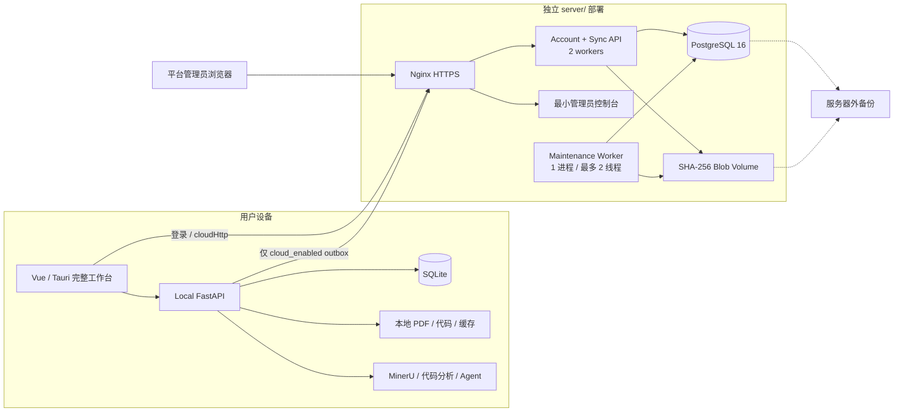

# TraceLab 本地工作台、账号服务器与基础同步架构

> 状态：独立服务器实现已落地，生产同步开关默认关闭。本文是当前账号与同步实现的权威边界；
> staging、SMTP、磁盘 quota 和外部备份恢复未验收前不得宣告生产就绪。
>
> 目标服务器：Linux，4 vCPU、16 GB RAM、50 GB 本地存储。

## 1. 目标和产品边界

TraceLab 保持本地优先：完整 Vue 工作台、Local FastAPI、SQLite、本地文件、MinerU、代码分析、
TraceLink 生成和 Agent/LLM 均运行在用户设备。Tauri Desktop 和本地 Web 可以登录远程账号，
但服务器故障或用户未登录时，本地工作台仍可使用。

远程服务器第一阶段只负责：

- 账号、邮箱验证、密码重置、设备会话；
- Workspace、成员和角色；
- 用户显式启用项目的基础版本同步；
- PDF、代码包、编辑快照和大型 Agent 结果的 Blob；
- 幂等、冲突、cursor、tombstone、审计和配额；
- 最小管理员控制台；
- 邮件、Blob/tombstone GC 和同步事件压缩。

服务器不构建或托管完整 TraceLab Vue 工作台，不运行 MinerU、论文解析、代码分析、张量图、
LLM 或 Agent 推理；不引入 Redis、MinIO、Kubernetes、向量数据库或独立认证中心。

新建和升级后的本地项目一律默认 `local_only`。只有用户明确确认同步范围并设置为
`cloud_enabled` 后，Local API 才能在同一 SQLite 事务写入源数据和 outbox。禁止自动上传旧项目。

## 2. 总体架构



源码所有权固定为：

- `frontend/`：应用 UI，只在本地 Web/Tauri 运行；
- `backend/`：Local API、SQLite、本地文件和本地计算；
- `server/`：远程账号/同步产品及全部部署文件；
- 双方不互相导入，只通过 HTTPS `/api/v1` 和固定 DTO 联动。

## 3. 存储、容量与部署

Compose 运行 Nginx、API、maintenance Worker、一次性 migrator、PostgreSQL 和可选 backup。
只有 Nginx 发布 80/443；API、PostgreSQL、Worker 和 Blob 目录不发布宿主端口。

| 区域 | 上限 | 内容 |
|---|---:|---|
| PostgreSQL + WAL | 约 8 GB | 账号、Workspace、项目副本、同步事件、任务、审计 |
| `/srv/tracelab/blobs` | 约 25 GB | SHA-256 内容对象 |
| `/srv/tracelab/tmp` | 约 4 GB | quarantine、备份临时文件和可清理缓存 |
| 系统/镜像/日志/余量 | 其余空间 | 日志轮转和故障恢复缓冲 |

这些上限必须用 LVM 或 project quota 实施，不能只写在文档中。80% 磁盘使用率主动告警；90%
拒绝新上传和新派生 Blob，但继续允许登录、pull、下载和删除。

默认账号配额 5 GB、单项目 2 GB、PDF 100 MB、ZIP 500 MB，均由环境变量调整。每晚把
PostgreSQL custom dump 和新增 Blob 写入服务器外备份，保留 7 个日备份和 4 个周备份。

## 4. 本地与服务器数据边界

Local 和 Server 拥有独立 SQLModel metadata、session 和 Alembic chain，物理 schema 不要求一致。
SQLite 文件、本地绝对路径、MinerU/LLM key、集成配置、UI 布局、分析缓存和临时任务数据永不
进入同步协议。

本地 SQLite 额外保存：

- Project/Paper/Repository/TraceLink/Agent 的 public UUID、version 和同步状态；
- Workspace 绑定、设备 UUID；
- `local_sync_outbox/inbox/state/conflict`；
- Blob 上传断点和本地不可变 artifact version。

服务器 PostgreSQL 保存：

| 域 | 表/职责 |
|---|---|
| 身份 | `user_account`、`auth_session`、`device`、`email_token`、`auth_rate_limit` |
| 管理会话 | `admin_web_session`，只存 opaque token/CSRF 哈希 |
| 租户 | `workspace`、`workspace_member`、`audit_log` |
| 项目 | `cloud_project`，保存 UUID、Workspace、元数据、版本、软删除时间 |
| 基础领域副本 | `cloud_entity`，entity type 白名单并由领域校验层验证 payload |
| 文件 | `blob_content`、`blob_object`、`blob_reference`、`artifact_version`、`upload_session` |
| 同步 | `sync_event`、`sync_receipt`、`sync_device_cursor`、`entity_tombstone`、`device_project_binding` |
| 维护 | `background_job`，租约、幂等键、重试和下次执行时间 |

服务器初始 migration 必须显式写表、索引、外键和约束，禁止从当前 ORM metadata 动态
`create_all`。普通启动只执行向前 migration，不自动 drop/rebuild；重建只能由停服后的显式维护
命令完成。

## 5. 账号、安全和权限

- 第一版仅邮箱/密码，不实现 OIDC。
- 密码使用 Argon2id：64 MB、3 iterations、parallelism 2。
- access token 15 分钟；refresh token 30 天、逐次旋转，数据库只保存哈希。
- refresh token 复用时撤销对应设备的全部会话。
- Browser refresh 使用 `Secure; HttpOnly; SameSite=Lax` Cookie，access 只在内存；Cookie
  认证请求校验可信 Origin 和双提交 CSRF。
- Desktop refresh 由 Tauri 原生命令写入系统凭据库，不进入 SQLite、localStorage 或日志。
- 未验证账号可登录和查看状态，但不能创建/同步云端项目。
- 注册、登录、刷新、找回密码按 IP 和规范化邮箱限流；找回密码和重复注册使用统一外部响应。
- 邮箱验证/重置 token 单次、短时有效，数据库只存哈希；链接 token 放 URL fragment。

Workspace 角色：owner 管理成员/配额内项目并可删除云端项目；editor 读写；viewer 只读/pull/download。
所有云端资源都经过 `current_user -> workspace_member -> workspace_id`，不能只凭对象 UUID 授权。

`platform_admin` 只能管理账号状态、配额、项目元数据、指标、审计和维护任务，默认没有读取
PDF、代码、TraceLink 正文或 Agent 内容的接口。首个管理员由一次性 CLI 创建，不提供默认密码。

## 6. 同步协议和状态机

固定端点：

```text
GET  /api/v1/sync/bootstrap
GET  /api/v1/sync/pull?workspace_id=<uuid>&after=<seq>&limit=<1..500>
POST /api/v1/sync/push
POST /api/v1/sync/ack
POST /api/v1/blobs/upload-init
PUT  /api/v1/blobs/{blob_id}/chunks/{index}
POST /api/v1/blobs/{blob_id}/complete
GET  /api/v1/blobs/{blob_id}/download
```

每个 push operation 使用真实 UUID：

```json
{
  "workspace_id": "uuid",
  "device_id": "uuid",
  "client_operation_id": "uuid",
  "supersedes_operation_id": null,
  "entity_type": "project|paper_document|code_repository|code_edit|trace_link|agent_*",
  "entity_public_id": "uuid",
  "operation": "upsert|delete|select_version",
  "base_version": 1,
  "payload": {}
}
```

每个操作独立事务写实体、版本、锁定递增的 workspace sequence、`sync_event`、不可变 receipt 和
审计。结果为 `applied`、`duplicate` 或 `conflict`。解决冲突必须使用新 operation UUID，并以
`supersedes_operation_id` 指向原 conflict receipt。

规则：

- Project 元数据和 TraceLink 人工决定使用乐观锁，版本不一致不得静默覆盖。
- 文件不可变；冲突保留两个 `artifact_version`，切换当前版本只更新指针。
- Agent Message/Run Event 和审计追加写，不修改历史内容。
- 单 event 最大 64 KB；PDF、ZIP、源码、长 Agent 内容和大 Run 结果只能引用 Blob UUID。
- `ack` 不能超过 workspace 当前 sequence；客户端仅在实体和所需 Blob 全部持久化后推进 cursor。
- tombstone 至少保留 30 天；事件压缩必须低于全部有效 Desktop cursor 且满足保留期。
- 成员和权限以服务器为准，并产生轻量事件。

同步状态：

| 状态 | 行为 |
|---|---|
| `local_only` | 默认；零上传、零业务 outbox |
| `cloud_enabled` | 当前设备 push/pull |
| `cloud_paused` | 当前设备只 pull，不消费普通 outbox；不影响其他设备 |
| `cloud_detached` | 当前设备解除绑定并在本地恢复 `local_only`；不删除云端项目 |

### 设备身份与自适配（device adoption）

每个 push operation 都携带 `device_id`，服务器要求 `operation.device_id == 认证设备`（否则 403
"Invalid sync device"），blob `upload-init` 也要求当前设备已绑定项目（否则 409）。因此本地
`LocalSyncState.device_id`（每次 outbox 入队时写入 op）必须与**当前登录设备**一致。

云端「单设备账号」会在登录时复用客户端回传的 `device_id`；客户端把它持久化（`localStorage`
的 `tracelab_device_id`，见 [auth.ts](../frontend/src/stores/auth.ts)），使刷新失败后的重新登录
仍复用同一设备，避免 device_id 漂移。若 device_id 仍发生变化（换机、被其他设备单点登录顶下线
后重登），`synchronizeWorkspace` 会先调用 `POST /local-sync/device/adopt` 把该 workspace 的
`LocalSyncState.device_id` 及所有 pending outbox 重指向当前设备，再对每个 `cloud_enabled` 项目
`PATCH /projects/{public_id}/device-sync` 重建云端绑定，然后才 push/upload。`enable` 与云端项目
导入遇到旧 device_id 时同样自适配而非报 409，因为该状态是**单个安装本地**的，重指向当前设备
永远安全。

云端项目删除是 owner 的独立操作，生成 30 天 tombstone 并影响所有设备。关闭 Agent 历史同步时，
本地同一事务停止新 Agent outbox，并 suppress 尚未发送的 Agent operation；既有云端历史不会隐式
删除。

> **禁用字段剥离**：Agent operation 的 payload 内嵌任意运行时数据（run event payload、message
> metadata、memory source），可能带 `storage_path` / `api_key` 等键。服务端对含这些键的 push
> 直接 422 且整批失败，会阻塞整个工作区同步。本地后端在 `record_local_operation`（入队）与
> `read_outbox`（读取，可自愈历史脏行）两处用 `scrub_forbidden_keys` 递归剥离，键集合镜像服务端
> `cloud_sync.FORBIDDEN_SYNC_KEYS`。详见 [contracts/cloud-sync.md](contracts/cloud-sync.md#禁用字段forbidden-keys)。

## 7. Blob 和维护 Worker

上传先进入 `/srv/tracelab/tmp/quarantine`，校验 Workspace/项目配额、磁盘阈值、声明大小、扩展名、
MIME/文件签名、ZIP 路径穿越和解压炸弹风险，再核对 SHA-256 并原子移动到：

```text
/srv/tracelab/blobs/sha256/aa/bb/<hash>
```

`blob_content` 负责全局物理去重，不向客户端暴露；每个 Workspace 只看到独立 `blob_object` UUID，
下载时重新校验 Workspace 权限，禁止跨租户推断或复用授权。Workspace/项目按首次引用计费。只有
所有 Workspace 句柄和引用消失且宽限期结束后，GC 才能删除物理文件。

Worker 使用 PostgreSQL `FOR UPDATE SKIP LOCKED`、15 分钟租约、幂等键和最多 5 次指数退避，
单进程最多并发 2 个任务。允许的任务仅为：邮件、Blob/tombstone GC、同步事件压缩。解析、代码
分析和 Agent 任务继续使用 Local API 的本地执行链。

## 8. 管理员控制台

`/admin-console` 位于 `server/tracelab_server/admin/`，使用 FastAPI + Jinja2 和少量原生 JS，
不属于 `frontend/src/**`。

第一版只显示账号、验证/状态、Workspace/成员/配额、项目 UUID/名称/版本/删除状态、存储用量、
维护任务和脱敏审计；支持账号启停、强制下线、配额、项目软删除/恢复、排队 GC/事件压缩。
所有写操作校验独立 CSRF、要求二次确认并写审计。

管理员 opaque session 数据库只存哈希，Cookie 使用
`Secure; HttpOnly; SameSite=Strict; Path=/admin-console`。管理员页面和 API 不提供任意文件下载、
正文预览、SQL 或 Shell。

## 9. 运维和验收

- Nginx 对认证路径使用不含 query 的脱敏日志格式并限流；所有容器启用日志轮转。
- 下载、上传、删除、版本选择、同步写和成员变化写脱敏审计；日志不记录 token、密钥、正文或
  服务器绝对路径。
- 备份恢复必须在独立空数据库和空 Blob 目录演练，核对账号、Workspace、引用和每个 ready Blob。
- staging 必须运行真实 PostgreSQL 16 migration、并发 sequence 和 `SKIP LOCKED`；CI 缺少
  `TEST_POSTGRES_URL` 时直接失败。
- 前端 `frontend/src/**` 在本次服务器重构中不改变页面、Store、路由、请求/响应或交互。

生产开启 `CLOUD_SYNC_FEATURE_ENABLED=true` 前的最终场景：Desktop A 显式启用项目并同步 PDF、
代码、TraceLink 决定和 Agent 记录；Desktop B 下载后继续工作；两端离线产生冲突后保留文件双
版本并人工解决决定冲突；paused 只影响当前设备；重试、断网、GC 和备份恢复均不丢失人工决定
或 Blob。SMTP、HTTPS、90% 停传和外部恢复必须同时通过。
