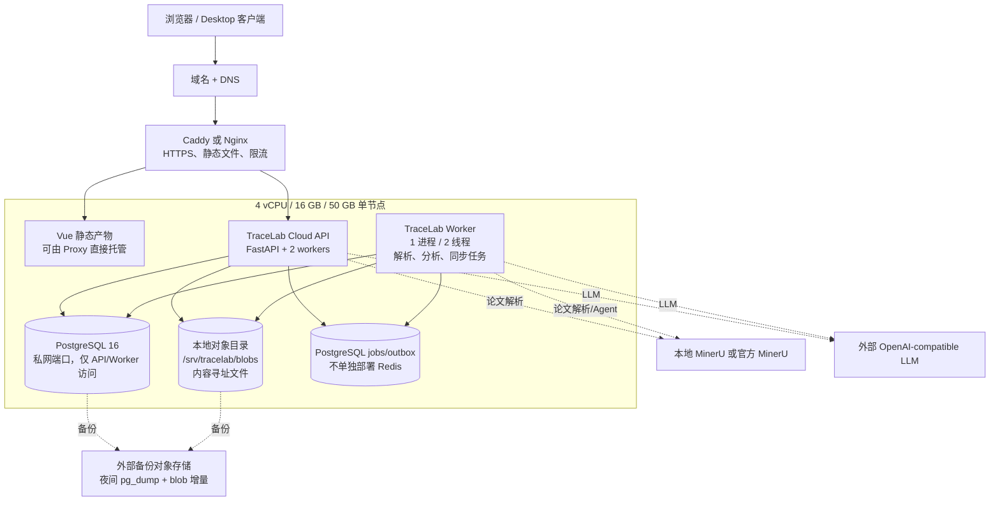
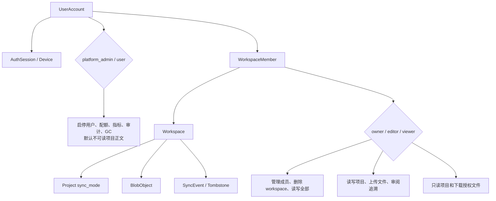
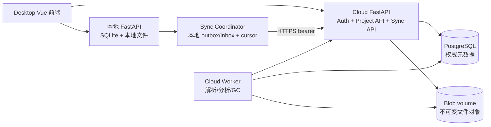
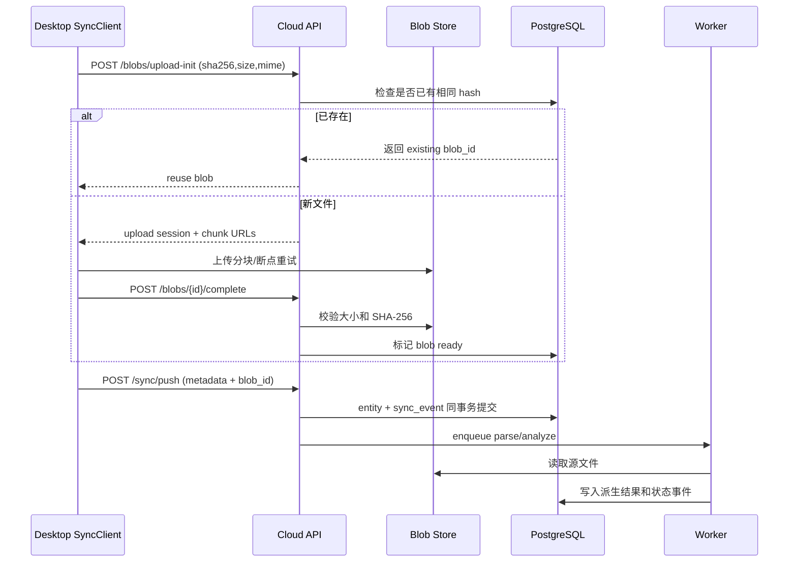

# TraceLab 云端服务器、账号与同步设计

> 状态：设计稿，基于当前代码整理，尚未实现。目标设备：4 vCPU、16 GB RAM、50 GB 本地存储。推荐先以单节点 Docker Compose 交付 MVP，再根据用户量把数据库、对象存储和任务队列外置。  
> 实施计划与模块拆分见 [plan.md 第 13 节](plan.md#13-账号登录项目云端同步与分布式架构计划)。

## 1. 设计目标与边界

本阶段要解决三个问题：

1. 用户可以注册、登录、退出、管理登录设备，并拥有自己的项目；平台提供管理员账户做用户启停、配额与运维，默认不可读项目正文。
2. 用户可以在 Web、Tauri Desktop 和不同设备之间同步**已显式启用云端同步**的项目元数据、论文、代码、追溯关系和 Agent 工作记录。
3. 云端服务器可以集中保存这些项目，并执行需要服务器资源的论文解析、代码分析和同步任务；交互流量与重任务隔离。

有三个重要边界：

- 不同步 SQLite 数据库文件。客户端 SQLite 与服务器 PostgreSQL 的物理 schema 不要求相同，双方通过领域对象和版本事件同步。
- 不把所有派生数据当作用户源数据同步。原始 PDF、原始代码包、用户编辑和追溯审阅结果是源数据；分析 JSON、张量图、论文解析缓存和任务临时文件可以由服务器重新生成。
- **按项目可选同步。** 新建项目默认 `local_only`；只有用户对某一项目选择启用云端同步（`cloud_enabled`）后，该项目才进入 push/pull。未启用的项目不得上传。

## 2. 推荐的单节点架构

在 4 核 16G、50G 的约束下，第一版不引入 Kubernetes、独立认证中心、独立 Redis、MinIO 或向量数据库。使用一个 Linux 服务器运行 Docker Compose：



### 2.1 为什么第一版不部署 Redis、MinIO 和 Kubernetes

- 当前任务状态已经以数据库实体和本地文件保存，任务可靠性优先于极低延迟队列；PostgreSQL 的 `job`/`outbox` 表足以支撑 MVP。
- 50G 磁盘下，MinIO 会增加一套对象存储服务和运维面；使用受限的本地 content-addressed blob 目录即可。备份必须放到服务器之外。
- 单节点资源不足以从 Kubernetes 的控制面和多副本中获益；Compose + systemd/容器重启更适合当前阶段。
- 当任务吞吐、用户数或可用性要求上升时，再引入 Redis/BullMQ/Celery、S3/OSS、独立 Worker 和托管 PostgreSQL，而不是提前把它们作为必选依赖。

## 3. 资源分配与容量策略

以下是 50G 本地磁盘的规划上限，不是可无限增长的配额：

| 区域 | 建议上限 | 内容 | 策略 |
|---|---:|---|---|
| 系统、Docker、镜像 | 8 GB | OS、镜像层、容器日志基础空间 | 定期清理旧镜像，日志轮转 |
| PostgreSQL + WAL | 8 GB | 账号、项目元数据、JSON、同步事件、任务 | 限制事件保留期，定期 vacuum |
| 用户 blob | 25 GB | PDF、代码 ZIP、编辑快照、论文资源 | 按用户/项目配额，内容哈希去重 |
| 临时文件和缓存 | 4 GB | MinerU raw cache、解压临时目录、分析临时结果 | TTL 清理；禁止无限保留派生缓存 |
| 日志和监控 | 1 GB | 应用、访问、审计日志 | 7–14 天本地保留，异常上传外部存储 |
| 可用余量 | 4 GB | 数据库膨胀、升级、故障恢复缓冲 | 达到 80% 告警，90% 禁止新上传 |

建议初始配额：每个账号 5 GB、单项目 2 GB、单个 PDF 100 MB、单个 ZIP 500 MB；具体值通过环境变量配置。服务器磁盘不用于保存备份副本，备份必须写入外部对象存储或另一台机器。

CPU/RAM 建议：

- Caddy/Nginx：低于 0.25 CPU，128–256 MB。
- FastAPI：2 个 worker，每个限制并发请求；约 1.5–2 CPU、2–3 GB。
- Worker：1 个进程、最多 2 个分析线程；约 1.5 CPU、4–6 GB，并限制单任务内存。
- PostgreSQL：约 1 CPU、2–4 GB；根据实际数据调整 `shared_buffers`，不与分析任务争抢全部内存。
- 预留至少 2 CPU 和 4 GB 的峰值缓冲，避免 PDF/ZIP 分析拖垮登录和同步接口。

服务器不托管模型推理；MinerU 和 LLM 默认使用外部服务或独立本地服务。若把 VLM/MinerU 模型也放在这台 4 核服务器，会直接破坏 Web、数据库和同步的稳定性。

## 4. 服务器需要存什么

### 4.1 必须持久化到 PostgreSQL 的数据

| 数据域 | 服务器保存内容 | 说明 |
|---|---|---|
| 账号 | 规范化邮箱、Argon2id 密码哈希、显示名、状态、验证时间 | 不保存明文密码 |
| 登录安全 | refresh token 哈希、设备、过期时间、撤销时间、IP/UA 摘要 | 支持单设备/全设备退出 |
| 租户 | workspace、成员、角色、项目归属 | 所有项目查询必须带 workspace 权限条件 |
| 项目 | 项目公开 UUID、名称、描述、创建者、版本、删除墓碑 | 当前本地整数 ID 不直接暴露给云端客户端 |
| 论文 | 文档公开 UUID、解析元数据、结构化章节/段落/页面、源 blob 引用 | 解析结果可作为可重建派生数据保存 |
| 代码 | 仓库公开 UUID、revision、文件清单、源 blob 引用、编辑版本 | 不把服务器绝对路径同步给客户端 |
| 追溯 | TraceLink、证据、置信度、审阅状态、代码 revision | 用户决策属于源数据，不能被后台重算覆盖 |
| Agent | 会话、消息、Run、Run Event、记忆、人工确认 | 供多设备恢复和审计；可按用户选择关闭云端 Agent 历史 |
| 同步 | workspace 递增序列、事件、幂等操作收据、删除墓碑 | 支撑离线 push/pull 和断点续传 |
| 任务 | 解析、代码分析、blob 清理、事件压缩任务 | Worker 从数据库领取，重启可恢复 |
| 审计 | 登录、密码修改、成员变更、删除、下载和写操作摘要 | 不记录密码、token、第三方 API key |

### 4.2 必须保存到 blob 目录的文件

```text
/srv/tracelab/blobs/
├── sha256/aa/bb/<sha256>              # 不可变内容对象
├── manifests/<object-id>.json         # 可选调试元数据
└── quarantine/                        # 上传校验前的临时文件，短 TTL
```

数据库中的 `blob_object` 保存 `object_id`、SHA-256、字节数、MIME、存储 key、创建者、状态和引用计数；业务表只保存 `blob_id`，不保存用户提交的绝对路径。

需要保存的文件类型：

- 原始论文 PDF 和 MinerU 需要的原始资源包。
- 原始代码 ZIP/GitHub archive。
- 用户编辑产生的代码版本或 patch；建议以不可变版本对象保存，当前版本由元数据指向。
- 用户明确导出的报告或其他项目附件。

不应长期保存的内容：

- MinerU 临时 job JSON、重复 raw cache、解压临时目录。
- 可从源文件和分析器版本重建的 `analysis_json`、张量流图中间文件；可保存结果快照，但必须有 TTL/版本号。
- UI 布局、窗口宽度、当前选中节点等设备私有状态。
- `.env`、Agent API key、MinerU token、refresh token 明文。

### 4.3 内容寻址与去重

上传文件先写入 quarantine，完成扩展名、MIME、大小、ZIP 安全检查和 SHA-256 计算后，原子移动到 `sha256/<prefix>/<hash>`。相同内容只保存一份，业务引用通过 `project_blob` 或各领域表关联。删除项目先删除引用，后台垃圾回收任务在宽限期后删除无引用 blob。

## 5. 账号与权限模型

### 5.1 账号实体

建议新增以下实体，命名与现有 SQLModel 风格保持一致：

| 表 | 关键字段 | 作用 |
|---|---|---|
| `user_account` | `user_id`、`email_normalized`、`password_hash`、`status`、`email_verified_at` | 用户身份 |
| `auth_session` | `session_id`、`user_id`、`device_id`、`refresh_token_hash`、`expires_at`、`revoked_at` | 旋转 refresh token，支持设备撤销 |
| `device` | `device_id`、`user_id`、`name`、`platform`、`client_version`、`last_seen_at` | 设备列表和同步来源 |
| `workspace` | `workspace_id`、`name`、`created_by`、`plan`、`storage_limit_bytes` | 多租户边界 |
| `workspace_member` | `workspace_id`、`user_id`、`role` | `owner/editor/viewer` 权限 |
| `email_token` | `user_id`、`purpose`、`token_hash`、`expires_at`、`used_at` | 邮箱验证和找回密码 |
| `audit_log` | `actor_id`、`workspace_id`、`action`、`target`、`metadata_json` | 安全与合规审计 |

现有 `project` 增加 `workspace_id`、`public_id`、`created_by`、`updated_by`、`version`、`deleted_at`、`sync_mode`；论文、代码、追溯、Agent 会话等实体增加 `public_id` 和 `version`。本地整数主键可以保留，但 API 和同步协议使用 UUID public id。

`sync_mode` 取值：

| 值 | 含义 |
|---|---|
| `local_only` | 默认；不上云 |
| `cloud_enabled` | 用户已启用同步 |
| `cloud_paused` | 保留云端副本，暂停上传或仅 pull |
| `cloud_detached` | 已解除绑定，本地回到 local_only，云端副本进入宽限期清理 |

权限关系：



所有项目、文件、追溯和 Agent 路由都必须通过 `current_user -> workspace_member -> workspace_id` 校验。不能只根据 URL 中的 project id 读取数据；不能把 `project_id` 当作权限边界。同步客户端只能对 `sync_mode=cloud_enabled`（及协议允许的 paused pull）的项目调用 push。

### 5.2 登录方式与凭据策略

第一版实现邮箱/密码登录：

- 密码使用 Argon2id 哈希，推荐 memory 64 MB、iterations 3、parallelism 2–4；服务端永远不保存明文密码。
- 注册后发送一次性邮箱验证链接；未验证账号可以登录，但不能创建或同步云端项目。
- 登录成功签发短期 access token（建议 15 分钟）和长期 refresh token（建议 30 天，旋转使用）。
- refresh token 只以哈希形式存入 `auth_session`；每次刷新都撤销旧 token 并生成新 token，检测到复用时撤销整个设备会话。
- 浏览器把 refresh token 放在 `Secure; HttpOnly; SameSite=Lax` cookie，access token 只放内存；状态变更接口校验 `Origin`/CSRF token。
- Desktop 不把 token 放进 localStorage；refresh token 放入 macOS Keychain、Windows Credential Manager 或 Linux Secret Service，access token 只放内存。
- 找回密码和邮箱验证 token 只保存哈希、短时有效且单次使用；邮件发送通过外部 SMTP/邮件服务，不在本机落盘正文。

后续可以接 OIDC（学校统一身份、GitHub、Google 等），但不应在第一版同时维护多个身份源。OIDC 用户仍映射到 `user_account`，第三方 subject 必须唯一。

### 5.3 账号接口

建议新增 `/api/v1/auth`：

| 方法 | 路径 | 作用 |
|---|---|---|
| `POST` | `/auth/register` | 创建未验证账号并发送验证邮件 |
| `POST` | `/auth/login` | 邮箱/密码登录，设置 refresh cookie 或返回 Desktop refresh token |
| `POST` | `/auth/refresh` | 旋转 refresh token，返回新的短期 access token |
| `POST` | `/auth/logout` | 撤销当前设备会话 |
| `POST` | `/auth/logout-all` | 撤销用户全部设备会话 |
| `GET` | `/auth/me` | 返回当前用户、设备和默认 workspace |
| `GET` | `/auth/devices` | 列出登录设备和最近活动 |
| `DELETE` | `/auth/devices/{device_id}` | 撤销指定设备 |
| `POST` | `/auth/verify-email` | 消费邮箱验证 token |
| `POST` | `/auth/password/forgot` | 创建找回密码请求，不泄露邮箱是否存在 |
| `POST` | `/auth/password/reset` | 消费一次性 token 并撤销旧会话 |
| `GET/POST/PATCH/DELETE` | `/workspaces/*` | workspace 和成员管理 |
| `GET/PATCH/POST` | `/admin/*` | 仅 `platform_admin`：用户、配额、强制下线、指标、审计、维护任务 |

登录、注册、刷新、找回密码必须有 IP + email 维度限流、统一错误信息和审计事件。API 响应不能返回 `password_hash`、refresh token 哈希、邮件 token 哈希或第三方密钥。

## 6. 本地优先与云端同步的关系

Desktop 仍保留本地 FastAPI/SQLite，用于读写本地文件、代码编辑、离线分析和 Tauri 文件选择；云端 API 是独立的 HTTPS 地址。前端应拆成两个 client：

- `localHttp`：访问 `127.0.0.1:8765`，处理本地工作台和文件路径。
- `cloudHttp`：访问 `https://tracelab.example.com/api/v1`，处理登录、workspace、blob 和同步。

浏览器云端模式可以直接连接 Cloud API；浏览器本地开发模式继续连接本机 API。Desktop 的同步协调器读取本地 SQLite 中的待同步操作，上传到 Cloud API，再把远端事件应用到本地数据库。



### 6.1 同步内容分类

| 类型 | 同步策略 | 备注 |
|---|---|---|
| Project、Workspace、成员 | 必须同步 | 以云端权限和版本为准 |
| PDF、代码 ZIP、编辑版本 | 必须同步 | 先 blob，再提交元数据引用 |
| 论文结构化结果 | 同步快照或云端重算 | 记录 parser/version/content hash |
| 代码符号、imports、张量图、analysis JSON | 云端重算为主 | 可缓存，但不能作为唯一源数据 |
| TraceLink 和用户 accepted/rejected 决策 | 必须同步 | 决策不可被自动分析覆盖 |
| Agent conversation、message、memory | 默认同步，可按用户关闭 | 消息中可能包含代码/论文敏感信息 |
| MinerU/LLM API key | 不同步 | 仅保存于本地或单独加密的服务器密钥区 |
| UI 布局、窗口状态、临时 job/cache | 不同步 | 设备本地数据 |

## 7. 同步协议

### 7.1 版本与事件

每个 workspace 有单调递增的 `workspace_seq`。每次成功的领域变更在同一个 PostgreSQL 事务中完成：

1. 校验用户和 workspace 角色。
2. 校验 `base_version` 和 `client_operation_id`。
3. 写入实体并递增实体 `version`。
4. 写入一条 `sync_event`，分配新的 workspace sequence。
5. 写入 `sync_receipt`，记录客户端操作幂等结果。
6. 提交事务后返回新版本和 sequence。

推荐的核心表：

| 表 | 关键字段 | 作用 |
|---|---|---|
| `sync_event` | `event_id`、`workspace_id`、`workspace_seq`、`entity_type`、`entity_public_id`、`operation`、`entity_version`、`payload_json` | 远端变更日志 |
| `sync_receipt` | `client_operation_id`、`device_id`、`result_json`、`created_at` | push 幂等，避免重试重复写入 |
| `sync_device_cursor` | `device_id`、`workspace_id`、`last_pulled_seq` | 设备同步进度和回收依据 |
| `entity_tombstone` | `entity_type`、`entity_public_id`、`deleted_version`、`expires_at` | 删除也能被离线设备拉取 |

事件只保存小型元数据和变更字段，不把 PDF、ZIP、论文 Markdown 或完整 analysis JSON 塞进事件表。大字段通过 blob id 引用。

### 7.2 Push/Pull API

```text
GET  /api/v1/sync/bootstrap?workspace_id=<uuid>
GET  /api/v1/sync/pull?workspace_id=<uuid>&after=<seq>&limit=500
POST /api/v1/sync/push
POST /api/v1/sync/ack
POST /api/v1/blobs/upload-init
POST /api/v1/blobs/{blob_id}/complete
GET  /api/v1/blobs/{blob_id}/download
```

`POST /sync/push` 的每个操作至少包含：

```json
{
  "workspace_id": "ws-uuid",
  "device_id": "device-uuid",
  "client_operation_id": "op-uuid",
  "entity_type": "trace_link",
  "entity_public_id": "trace-uuid",
  "operation": "upsert",
  "base_version": 7,
  "payload": {
    "status": "accepted",
    "rationale": "user reviewed"
  }
}
```

服务器返回 `applied`、`duplicate` 或 `conflict`。客户端必须先 pull 再重试冲突操作；服务端不能用“最后写入覆盖一切”的方式静默丢失用户决定。

### 7.3 冲突策略

| 数据类型 | 冲突处理 |
|---|---|
| 项目名称、描述、设置 | `base_version` 不一致返回 409，前端展示本地/云端 diff 后选择保留；不静默覆盖 |
| PDF/ZIP/代码文件 | 文件对象不可变；冲突产生两个版本，用户选择当前版本，保留另一版本可回退 |
| TraceLink 状态 | 采用乐观锁；`accepted/rejected` 决策冲突必须人工确认 |
| Agent 消息、事件、审计 | 追加写，按 server sequence 合并，不修改历史消息 |
| 成员和权限 | 云端权威；权限冲突拒绝本地操作并重新拉取 |
| 删除 | 生成 tombstone，保留至少 30 天；离线设备拉取 tombstone 后删除本地副本 |
| 分析结果 | 派生数据，按 source content hash + analyzer version 重算；不与用户源数据竞争 |

### 7.4 大文件同步时序



第一版可以由 API 通过流式 multipart 接收文件；文件较大或需要断点续传时，再切换到 Nginx/Caddy 上传端点或 S3 presigned URL，协议层不改变。

## 8. 账号和同步对当前代码的改造位置

建议按以下边界改造，不把认证代码散落到每个业务路由：

```text
backend/app/
├── auth/
│   ├── password.py       # Argon2id hash/verify
│   ├── tokens.py         # access JWT、refresh rotation
│   ├── dependencies.py   # get_current_user、require_role
│   └── service.py        # register/login/logout/verify/reset
├── api/routes/auth.py
├── api/routes/sync.py
├── api/routes/blobs.py
├── schemas/auth.py
├── schemas/sync.py
├── services/sync_service.py
└── storage/blob_store.py # quarantine、hash、GC、range/download
```

现有改造点：

- `api/routes/projects.py`、`papers.py`、`repositories.py`、`traces.py`、`workspace.py`、`agent.py` 全部注入 `current_user`，通过 workspace member 做授权。
- `db/session.py` 在云端使用 PostgreSQL URL；本地 Desktop 继续使用 SQLite。两种模式共用 schemas 和领域服务，但文件存储实现不同。
- `storage/file_store.py` 抽象成 `LocalFileStore` 与 `BlobStore`；云端实体保存 `blob_id`，不能把本地绝对路径返回给客户端。
- `analysis_jobs.py` 和 `document_parsers/jobs.py` 的进程内线程池改为 Worker 可领取的数据库任务；本地模式可以保留现有线程池。
- `frontend/src/api` 增加 `auth-api.ts`、`sync-api.ts`、`blob-api.ts`；新增 `stores/auth.ts`、`services/sync-client.ts` 和登录/设备管理页面。
- Desktop 将 cloud access token 交给云端请求，local API 只绑定 `127.0.0.1`；云端同步失败时不阻塞本地工作台，操作进入本地 outbox 等待重试。

## 9. 安全、运维与备份

- 只对外开放 80/443；PostgreSQL、blob 目录和 Worker 管理端口只在 Docker 私网可见。
- Caddy/Nginx 负责 HTTPS、请求体大小、登录限流、下载限速和安全响应头；生产 CORS 只允许正式 Web 域名。
- 登录、刷新、注册、找回密码和 blob 下载都记录审计摘要；日志中对邮箱、IP、token 和文件路径脱敏。
- 每晚执行 PostgreSQL `pg_dump` 或物理备份，每日同步新增 blob 到外部对象存储；保留 7 个日备份和 4 个周备份。
- 每月至少做一次恢复演练；不能把“服务器本地备份”当作灾备，50G 磁盘损坏会同时丢失数据库和 blob。
- 达到 80% 磁盘使用率告警，达到 90% 时暂停新 blob 上传但允许登录、下载和删除；后台优先清理缓存和无引用对象。
- Agent、论文和代码内容可能含有敏感信息；云端同步必须在设置中明确展示同步范围，并允许关闭 Agent 历史同步。

## 10. 实施顺序

与 [plan.md](plan.md) Cloud Phase C0–C5 对齐：

1. **C0 ADR / 容量**：按项目 `sync_mode`、管理员边界、4 核资源表与契约草案。
2. **C1 云端基础运行**：PostgreSQL、BlobStore、Cloud API、Worker、HTTPS、健康检查和备份脚本。
3. **C2 账号与管理员**：`user_account`、邮箱/密码、refresh rotation、设备管理、workspace/member、`platform_admin` 与路由授权。
4. **C3 按项目同步闭环**：`sync_mode`、本地 outbox、push/pull cursor、sync_event、幂等 receipt、删除 tombstone；首批同步 Project/Paper/Repo/TraceLink。
5. **C4 文件与 Worker**：quarantine、SHA-256 去重、分块上传、下载授权、GC；Worker `SKIP LOCKED` 领取解析/分析。
6. **C5 冲突 UX 与运维硬化**：本地/云端 diff、版本选择、设备撤销、恢复演练、配额 UI、与高可信轨道联合发布。

## 11. 后续扩展触发条件

满足以下任一条件再拆分服务：并发用户超过 50、单节点 CPU 长时间超过 70%、任务队列等待超过 1 分钟、blob 超过 25G、需要多节点高可用或需要跨区域部署。届时优先外置 PostgreSQL 和对象存储，再引入 Redis/专用队列，最后才考虑 API 多副本和独立认证服务。
