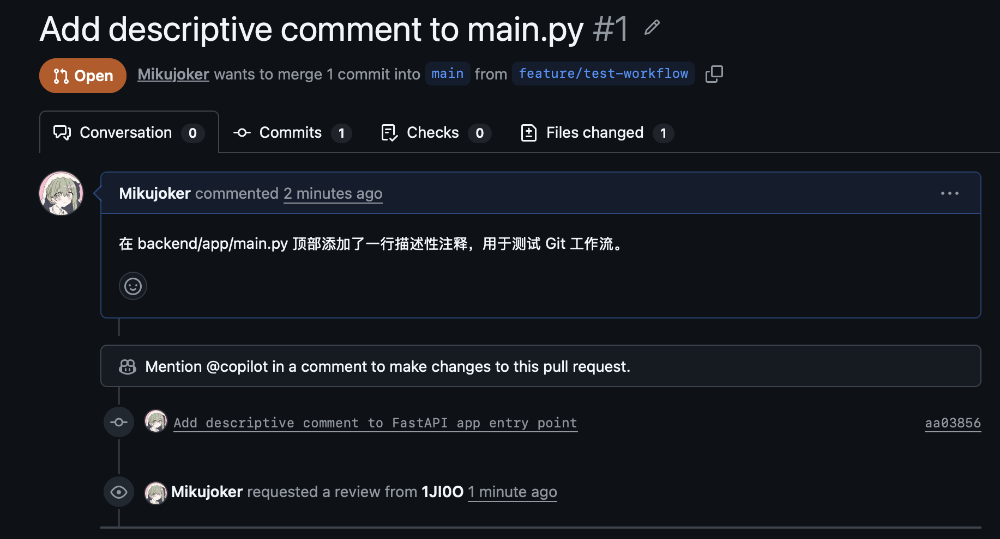
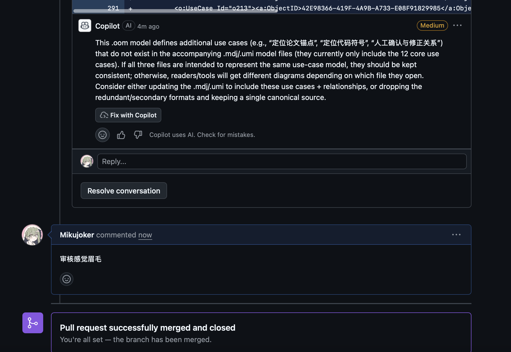
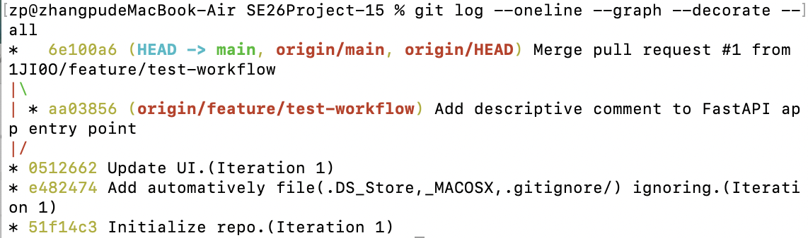

# Git 工作流实践报告

**姓名**：Mikujoker  
**组号**：15  
**日期**：2026-07-07

---

## 1. 任务目标

学习并实践 GitHub Flow 工作流，包括：
- 创建 feature 分支
- 在分支上进行代码修改
- 通过 `add → commit → push` 提交代码
- 创建 Pull Request 并指定 reviewer
- 审查通过后合并 PR
- 删除 feature 分支

---

## 2. 操作过程

### 2.1 克隆远程仓库

```bash
gh repo clone 1JI0O/SE26Project-15
cd SE26Project-15
```

### 2.2 创建 feature 分支

```bash
git checkout -b feature/test-workflow
```

创建并切换到 `feature/test-workflow` 分支。

### 2.3 修改代码

在 `backend/app/main.py` 文件顶部添加了一行描述性注释：

```python
# Paper-code bidirectional trace workbench - FastAPI backend
app = FastAPI(
```

### 2.4 提交并推送

```bash
git add backend/app/main.py
git commit -m "Add descriptive comment to FastAPI app entry point"
git push origin feature/test-workflow
```

### 2.5 创建 Pull Request

```bash
gh pr create --title "Add descriptive comment to main.py" --body "在 backend/app/main.py 顶部添加了一行描述性注释，用于测试 Git 工作流。" --base main
```

**PR 链接**：https://github.com/1JI0O/SE26Project-15/pull/1

### 2.6 指定 Reviewer

```bash
gh pr edit 1 --add-reviewer 1JI0O
```

将小组成员 `1JI0O` 添加为 reviewer。

### 2.7 合并 PR

Reviewer 审查通过后，在 GitHub 上点击 "Merge pull request" 完成合并。

### 2.8 删除 feature 分支

```bash
git checkout main
git pull
git branch -d feature/test-workflow
```

本地分支已删除，远程分支在 PR 合并时由 GitHub 自动删除。

---

## 3. PR 界面截图




对应的审核merge

---

## 4. Git Log 截图

执行命令：

```bash
git log --oneline --graph --decorate --all
```

输出结果：

```
*   6e100a6 (HEAD -> main, origin/main, origin/HEAD) Merge pull request #1 from 1JI0O/feature/test-workflow
|\  
| * aa03856 (origin/feature/test-workflow) Add descriptive comment to FastAPI app entry point
|/  
* 0512662 Update UI.(Iteration 1)
* e482474 Add automatively file(.DS_Store,_MACOSX,.gitignore/) ignoring.(Iteration 1)
* 51f14c3 Initialize repo.(Iteration 1)
```

> 请在此处粘贴终端截图


**图形说明**：
- `main` 分支在 `0512662` 处创建了 `feature/test-workflow` 分支
- 在 feature 分支上完成了一次提交 `aa03856`
- PR 合并后形成了分叉-合并的图形结构 `6e100a6`

---

## 5. 总结

通过本次实践，完成了 GitHub Flow 工作流的完整流程：

| 步骤 | 命令/操作 | 状态 |
|------|----------|------|
| 克隆仓库 | `gh repo clone` | ✅ |
| 创建 feature 分支 | `git checkout -b` | ✅ |
| 修改代码 | 编辑 `main.py` | ✅ |
| 提交代码 | `git add + commit` | ✅ |
| 推送分支 | `git push origin` | ✅ |
| 创建 PR | `gh pr create` | ✅ |
| 指定 Reviewer | `gh pr edit --add-reviewer` | ✅ |
| 合并 PR | GitHub 网页操作 | ✅ |
| 删除分支 | `git branch -d` | ✅ |

---

## 6. 遇到的问题及解决

### 问题 1：GitHub CLI 认证失败

**现象**：`gh auth status` 显示未登录

**解决**：设置代理后执行 `gh auth login`，选择 HTTPS + Web 浏览器方式完成认证

### 问题 2：远程分支删除报错

**现象**：`git push origin --delete feature/test-workflow` 报错 "remote ref does not exist"

**原因**：PR 合并时 GitHub 已自动删除远程分支

**解决**：该报错不影响流程，本地分支已成功删除
