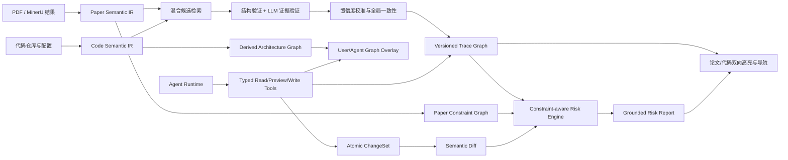
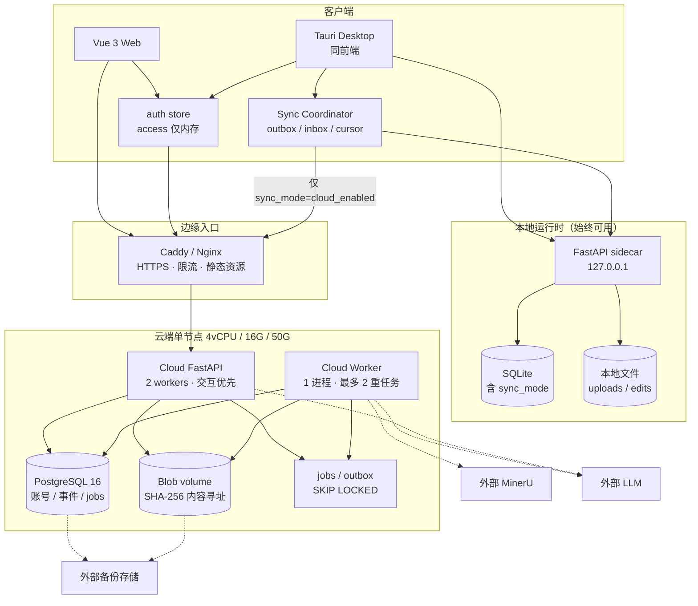
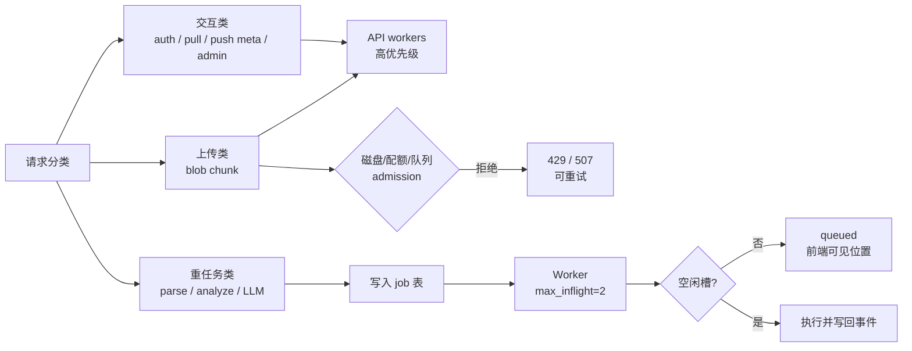

# TraceLab 最终产品实施计划

> 审计日期：2026-07-17  
> 计划对象：当前 `main` 工作区中的 Web、Tauri、FastAPI、MinerU、代码分析、追溯与 Agent 实现  
> 目标：从“可演示的本地论文/代码工作台”演进为“高可信论文复现与修改风险分析环境”，并在 **4 vCPU / 16 GB / 50 GB** 单节点上具备账号体系与**按项目可选**的云端同步能力  
> 相关详细设计：[云端服务器、账号与同步设计](cloud-sync-architecture.md)

## 1. 最终产品定义

TraceLab 的核心价值不应只是同时展示论文、代码和模型图，而应建立一条可验证、可导航、可修改、可审计的证据链：

1. 将论文中的公式、变量、算法步骤、实验约束、结构约束和结论识别为稳定的语义对象。
2. 将代码中的文件、符号、表达式、配置项、张量操作、调用链和测试识别为稳定的语义对象。
3. 自动建立两类对象之间的高精度多对多追溯关系，并明确证据、置信度、反证和适用版本。
4. 将可信追溯投影回论文和代码视图，使用户可以直接点击跳转，而不是在候选列表中逐条寻找。
5. 让 Agent 通过受控工具读取和修改代码、追溯关系及流程图展示层，并保留预览、确认、回滚和审计记录。
6. 在代码修改时自动分析其对论文约束、模型语义、实验协议和结论有效性的潜在影响。
7. 提供账号登录与可选云端同步，使用户可在 Web / Desktop / 多设备间恢复已选择同步的项目，同时保留完全本地的项目。

### 1.1 对原始期待的必要补充

以下补充是保证产品可靠性所必需的：

- **自动验证不等于用户接受。** 新增 `auto_verified` 状态表示系统达到校准后的高可信门槛；`accepted` 仍表示用户或团队作出的明确决策。这样可以减少逐条审批，同时避免系统伪造人工结论。
- **低置信结果应主动弃权。** 默认只在论文中突出 `auto_verified` 和 `accepted` 关系；中等置信关系进入紧凑的批量复核队列；低置信候选默认隐藏，而不是用数量制造覆盖率假象。
- **偏离论文不一定是错误。** 项目必须记录当前意图：`faithful_reproduction`、`adaptation` 或 `ablation`。同一改动在忠实复现中可能是高风险，在迁移适配中可能只是需要记录的合理偏离。
- **风险分析不是实验结论。** LLM 和静态分析只能给出“违反了什么证据约束、可能影响什么”的判断；最终科学结论仍需要测试、训练日志和指标对比验证。
- **追溯对象必须版本化。** 论文解析版本、代码仓库修订、配置、模型图、追溯、风险报告和 Agent 修改都必须可重放，不能只保存当前快照。
- **先聚焦 Python/PyTorch。** 第一条可靠产品链应明确支持 Python、PyTorch、常见 YAML/TOML/JSON/Hydra 配置。多语言和任意框架应在该链路达到指标后再扩展。

### 1.2 分布式与云端同步补充

以下补充定义“从本地工作台到分布式系统”的产品边界：

- **本地优先，云端可选。** Desktop / 本地 Web 继续可在无账号、无网络时使用全部核心工作台能力；云端不是强制依赖。
- **按项目显式开启同步。** 默认新建项目为 `local_only`；用户必须对某个项目明确选择“启用云端同步”后，该项目的源数据才会上云。未开启的项目永不进入同步协议。
- **不同步 SQLite 文件。** 客户端 SQLite 与云端 PostgreSQL schema 可不同；双方通过领域对象、`public_id`、`version` 与 `sync_event` 交换状态。
- **派生数据可重建。** PDF/代码包/编辑版本/追溯审阅决策是源数据；分析 JSON、张量图、解析缓存等优先云端重算或带 TTL 缓存，不作为唯一真相源。
- **账号分层。** 区分平台管理员（`platform_admin`）与普通用户；workspace 内再区分 `owner` / `editor` / `viewer`。管理员不自动拥有读取用户项目内容的权限，除非走受审计的支持流程。
- **单节点务实部署。** 第一版在 4 核 16G 50G 上用 Docker Compose 交付；交互请求与重计算任务隔离调度，避免解析/分析拖垮登录与同步。

## 2. 当前实现审计结论

### 2.1 已具备的可复用基础

| 领域 | 当前可复用实现 | 结论 |
| --- | --- | --- |
| 论文导入 | MinerU 本地/官方 API、异步任务、结构化 Markdown、图片/表格/公式渲染和缓存 | 可作为输入层，但不是语义追溯层 |
| 代码工作区 | 完整过滤后文件树、CodeMirror 编辑、代码保存、版本递增 | 可作为交互壳层 |
| 代码分析 | Python AST 符号、调用、导入、PyTorch 候选、张量图与架构图缓存 | 可作为第一阶段候选生成基础 |
| 追溯持久化 | 双侧证据、静态/LLM 置信度、状态、版本失效、指纹去重 | 数据生命周期已有雏形 |
| Agent | 多会话、持久化消息、SSE 流、记忆、Skill、Tool、HTTP MCP、失败恢复、写确认 | 运行时基础较完整，应扩展工具而非重写 |
| 写安全 | 代码修改需 patch、风险分析、内容哈希和用户确认 | 可扩展为统一 ChangeSet 事务 |
| 图交互 | 架构/调试两级图、后台分析、持久化缓存、缩放和代码跳转 | 可作为派生图层 |
| 桌面端 | Tauri App、内置 FastAPI sidecar、设置窗口 | 可承载本地文件和本地模型能力 |

### 2.2 与目标之间的核心差距

#### A. 论文语义层不足

当前 `PaperDocument` 主要保存 `sections_json`、`paragraphs_json` 和页面数据。MinerU 规范化器虽然能构造公式、表格、图片等 `PaperBlock`，但公式、表格和图片没有进入当前追溯引擎使用的 `paragraphs_json`。实际追溯输入因此主要是普通段落和标题。

当前还缺少：

- Markdown 字符区间、页码 bbox、公式 LaTeX、公式编号之间的统一稳定锚点。
- 公式内部变量、运算符、输入输出、维度约束和依赖关系。
- 算法步骤、结构约束、训练约束、数据约束、评估协议、假设和结论等独立实体。
- 对图、表、caption 和正文引用的关联。
- 解析版本变化后的锚点迁移机制。
- 可供论文 DOM 直接使用的 `data-paper-anchor-id`。

#### B. 代码语义层粒度不足

当前 Python AST 分析集中在类、函数、方法和调用，追溯粒度通常只能落到一个完整符号。它不能稳定表达公式到代码表达式、变量到参数、约束到配置项的关系。

当前还缺少：

- 赋值、返回值、算术表达式、张量操作和参数默认值的精确行列区间。
- 跨文件符号解析、别名解析、继承、动态分发和配置传播。
- YAML/TOML/JSON/Hydra/argparse 中的超参数与代码消费点。
- 数据预处理、损失函数、训练循环、指标计算和实验脚本的语义角色。
- 静态分析失败时的动态补充，例如 `torch.fx`、`torch.export` 和 shape propagation。
- 编辑后的稳定锚点重定位。当前代码修改会把旧追溯整体标记 stale，但不会尝试可靠迁移。

#### C. 追溯算法仍是演示级

当前 `static_candidates.py` 的核心是论文文本与代码名称、注释、调用名称和路径之间的词元重合，输入截取前 80 个论文块和前 500 个符号，最终只保留 30 个候选。公式本身基本不参与候选生成。

当前 LLM 只验证静态算法已经选出的候选，不能：

- 主动发现静态检索漏掉的真实关系。
- 对公式结构、变量角色、配置值和数据流进行推理。
- 比较多个候选并做全局一致性选择。
- 给出明确的反证和弃权理由。

置信度目前是固定权重分数与 LLM 自报分数的线性混合，没有在标注数据上做校准。因此 `0.9` 目前不是可解释的“90% 正确概率”。所有结果默认是 `proposed`，产品仍要求用户逐条处理。

#### D. 论文与代码中没有追溯投影

- `PaperReader.vue` 只为标题生成 `section-N`，没有为公式、段落、变量和算法步骤生成稳定 DOM 锚点或高亮层。
- `CodeEditor.vue` 只能跳到并选中整行，没有持久化 CodeMirror Decoration、追溯 gutter、悬停证据或多目标选择器。
- 当前追溯 UI 是底栏矩阵，只支持单条接受/拒绝，没有筛选、分页、全选、批量状态修改、删除、合并、导出和重算。
- 点击追溯行只打开证据抽屉，尚未形成“论文高亮 -> 代码精确区间”的主交互。

#### E. Agent 还不能修改完整环境

当前 Agent 可以保存代码、重跑分析、创建单条追溯、接受/拒绝单条追溯，并可要求 UI 打开代码或聚焦架构图。这是良好的基础，但还不能：

- 批量创建、合并、替换、隐藏或重算追溯。
- 创建、修改和删除论文约束。
- 修改流程图节点分组、标签、可见性、边和布局。
- 将多个写操作组成原子 ChangeSet 并统一预览、确认和撤销。
- 在图重新生成后重放或解决 Agent 的展示修改冲突。

流程图目前是代码分析的派生结果。直接让 Agent 改写派生图会在下一次分析时丢失，因此需要独立的 `GraphOverlay`，而不是修改缓存 JSON。

#### F. 魔改风险分析尚未实现产品目标

当前冲突接口和前端 `ConflictPanel` 明确使用占位数据。Agent 的 `analyze_change_risk` 是本地启发式计算：改动行数、调用者数量、受影响追溯数量和文件路径先验。它没有调用 LLM，也没有读取论文约束。

此外，用户在编辑器中点击“保存编辑”会直接保存文件，不经过风险分析。只有 Agent 发起代码写入时才强制先运行现有风险工具。

当前还缺少：

- 论文约束库及约束之间的依赖图。
- 基线参数、模型组成、张量形状、训练协议和评估指标快照。
- 对代码差异的语义分类，而不仅是改动行数。
- 约束影响传播、LLM 有证据复核、风险报告持久化和历史比较。
- 高风险保存策略、离线降级策略以及验证建议。
- Agent 自动复现与用户手工修改使用同一风险门禁。

#### G. 缺少可证明“高可靠”的评估体系

当前测试主要验证 API、状态机、降级和证据格式，尚无真实论文/代码标注集，也没有追溯准确率、约束提取准确率、风险召回率或置信度校准指标。没有基准集就无法判断算法升级是否真的更可靠。

#### H. 无账号、无云端、非分布式

当前实现是单机本地优先：无用户注册/登录，无管理员控制台，无 workspace 权限，无跨设备同步。项目使用本地整数 ID 与本地文件路径；Desktop sidecar 与 Web 后端均绑定本机 SQLite。要变成“可选上云的分布式系统”，需要新增：

- 云端 PostgreSQL、BlobStore、Auth、Admin、Sync API 与 Worker。
- 前端双 HTTP client（`localHttp` / `cloudHttp`）与按项目同步开关。
- 实体 `public_id` / `workspace_id` / `version` / `sync_mode` / `blob_id`。
- 在 4 核 16G 上把交互流量与重计算任务隔离，并建立配额、限流与备份。

协议、配额与冲突细节见 [云端服务器、账号与同步设计](cloud-sync-architecture.md)；实施计划见本文第 13 节。

## 3. 目标架构



### 3.2 分布式部署与同步目标架构

领域算法架构（上图）运行在两种运行时之上：**本地运行时**（Desktop sidecar / 本机 FastAPI + SQLite）与 **云端运行时**（Cloud API + Worker + PostgreSQL + Blob）。二者通过 Sync Coordinator 交换已启用同步的项目。



### 3.1 目标数据模型

#### PaperSemanticNode

用于替代“所有内容都是 paragraph”的扁平结构：

- `node_id`：内容寻址 ID，包含文档内容哈希、规范化位置和节点类型。
- `kind`：`section`、`paragraph`、`formula`、`variable`、`algorithm`、`algorithm_step`、`constraint`、`claim`、`metric`、`figure`、`table`、`caption`。
- `text`、`latex`、`normalized_expression`。
- `markdown_start/end`、`page_number`、`bbox`、`parent_id`、`section_path`。
- `aliases`、`references`、`metadata`、`parser_version`。

#### CodeSemanticNode

- `node_id`、`kind`：文件、类、函数、表达式、参数、配置项、张量操作、数据管线、损失、指标、测试。
- `path`、`line_start/end`、`column_start/end`、`source_hash`。
- `qualified_name`、`normalized_expression`、`type/shape`、`role`。
- `defines`、`reads`、`writes`、`calls`、`dataflow_predecessors/successors`。
- `repository_id`、`revision`、`analysis_version`。

#### PaperConstraint

- `constraint_id`、`category`：结构、维度、数值、训练、数据、损失、评估、假设、复现协议。
- `modality`：`must`、`should`、`assumption`、`reported_setting`。
- `subject`、`predicate`、`value/range/unit`、`scope`。
- `paper_anchor_ids`、逐字证据、置信度、提取模型、验证状态。
- `severity_if_violated`、`depends_on`、`related_trace_ids`。

#### TraceGroup 与 TraceEdge

一个论文对象可以对应多个代码位置，因此以组承载一对多关系：

- `TraceGroup`：论文锚点、关系意图、覆盖说明、总体状态。
- `TraceEdge`：单个代码锚点、关系类型、证据和评分分量。
- 状态：`auto_verified`、`proposed`、`accepted`、`rejected`、`suppressed`、`stale`。
- 评分：静态结构、检索、执行/形状、LLM 验证、反证、校准后概率。
- 证据必须是可定位的论文与代码区间，不能只存无法复查的摘要。

#### GraphOverlay

派生架构图保持只读，用户和 Agent 的修改存入覆盖层：

- 隐藏/显示节点、折叠分组、重命名展示标签、补充说明。
- 添加语义分组和经过确认的补充边。
- 保存布局位置、视图层级和焦点。
- 记录基础 `analysis_revision`，重新分析后执行自动 rebase，无法映射时生成冲突。

#### ChangeSet 与 RiskReport

- `ChangeSet` 保存一个或多个文件补丁、基础哈希、修改意图、发起者和状态。
- `RiskReport` 保存语义差异、受影响追溯、受影响约束、LLM 结论、验证建议和模型信息。
- 每条 `RiskFinding` 必须引用代码差异和论文约束，包含严重度、置信度、可能影响、反证与缓解措施。

## 4. 关键实现方案

### 4.1 论文语义抽取

1. 保留 MinerU ZIP 中 Markdown、`content_list`、图片和坐标的原始对应关系，不再只从 Markdown 文本二次猜测位置。
2. 使用 Markdown AST 建立稳定 block tree，在渲染前为每个块注入 `data-paper-anchor-id`。
3. 对公式保留原始 LaTeX，先进行变量/运算符词法归一化；能被 SymPy 安全解析的公式再生成表达式树，解析失败时保留 token tree，不丢弃原文。
4. 用规则识别公式编号、`where` 变量解释、Algorithm 环境、表格 caption 和正文引用。
5. 使用结构化 LLM 输出抽取约束、假设、算法步骤和结论。所有对象必须附带原文逐字证据及已有 anchor ID；证据不能回指原文时直接丢弃。
6. 将论文语义索引持久化并按 `content_hash + extractor_version` 缓存。

### 4.2 代码语义分析

1. 保留当前 Python AST 管线，扩展赋值、返回、二元运算、比较、索引、参数默认值和配置读取节点。
2. 引入 LibCST 维护稳定行列区间并支持后续安全编辑；使用 Pyright 或 Jedi 补充跨文件符号和类型解析。
3. 解析 Hydra/OmegaConf、argparse、YAML、TOML 和 JSON，将配置定义、覆盖和消费点连接起来。
4. 对 PyTorch 提供可选动态分析：优先 `torch.export`，其次 `torch.fx`；动态执行必须使用隔离进程、资源限制和显式用户授权。
5. 将静态调用图、配置流、张量流和实验入口统一为 Code Semantic IR；无法可靠解析的动态代码明确标记 `unresolved`。
6. 代码保存后进行增量重分析，并用内容哈希、AST 路径和上下文窗口迁移未受影响的锚点。

### 4.3 高精度追溯引擎

采用“静态/符号分析 + 检索 + LLM 验证 + 校准”的混合方案，而不是二选一。

#### 候选召回

- BM25/关键词：名称、别名、论文术语、注释、配置键。
- 向量检索：论文语义节点与代码摘要/表达式摘要。
- 结构规则：公式运算符、参数值、shape、调用链、张量图、配置传播。
- 角色先验：损失公式优先召回 loss/criterion；评估公式优先召回 metric/eval；结构描述优先召回 Module/forward。
- 论文引用与代码命名反向提示，例如模块名、算法缩写和论文中的专有名词。

#### 候选验证

1. 确定性验证器检查引用存在、源码逐字证据、类型、shape、参数和值是否一致。
2. LLM 只在候选和邻域上下文上执行结构化比较，输出支持证据、反证、遗漏组件和弃权原因。
3. 对同一论文节点的候选做全局一致性选择，允许一对多，但避免互相冲突或重复覆盖。
4. 使用第二个轻量验证步骤检查 LLM 输出是否能由输入证据推出；模型自报置信度不能直接作为最终概率。

#### 置信度与自动展示

- 在人工标注集上训练或拟合校准器，输入静态、检索、结构和验证特征。
- 目标不是最大化候选数量，而是让自动展示集合达到至少 95% precision。
- 初始门槛可设为：校准概率 `>= 0.93` 且通过全部证据门禁时进入 `auto_verified`；最终阈值必须按验证集选择。
- 中间区间进入 `proposed` 批量队列；低于门槛进入 `suppressed`，默认不打扰用户。
- 每次模型、提示、分析器或阈值变化都生成新的 `trace_run`，保留可比较结果。

### 4.4 论文与代码双向交互

#### 论文侧

- Markdown renderer 依据 Paper Semantic IR 为块、公式和算法步骤生成稳定 DOM 属性。
- 使用独立 highlight layer，不把追溯状态写回原始 Markdown。
- 单击高亮：若只有一个代码目标，直接打开文件并定位范围；若一对多，弹出紧凑目标选择器。
- 悬停：显示代码目标、关系类型、置信度、状态和一句证据摘要。
- 颜色只表达状态/关系，不用颜色区分置信度的细微数值；保留键盘导航和无障碍标签。

#### 代码侧

- 使用 CodeMirror `StateField + DecorationSet` 绘制行内范围、高亮 gutter 和悬停 tooltip。
- 支持由论文跳转后暂时聚焦对应范围，同时保留所有已接受/自动验证关系的弱高亮。
- 点击代码高亮可反向定位论文，多个论文锚点使用同样的选择器。
- 当编辑导致锚点迁移失败时，显示 stale 标记而不是高亮错误位置。

#### 批量管理

- 支持按状态、关系类型、论文章节、代码路径、置信度、来源和版本筛选。
- 支持多选后接受、拒绝、隐藏、删除、重算、导出和标记需复核。
- 支持对一个 TraceGroup 调整主目标、合并重复目标和拆分错误的一对多组。
- 所有批量写操作使用 revision precondition 和幂等 request ID。

### 4.5 Agent 环境修改

保留当前 Agent loop、SSE、memory、Skill 和确认机制，新增以下工具族：

| 工具 | 类型 | 作用 |
| --- | --- | --- |
| `search_paper_nodes` / `get_paper_node` | 只读 | 读取公式、变量、算法和约束 |
| `list_constraints` / `get_constraint` | 只读 | 获取结构化论文约束及证据 |
| `preview_trace_changes` | 只读预览 | 校验批量追溯增删改及影响 |
| `apply_trace_changes` | 写入 | 原子应用批量追溯变更 |
| `preview_graph_overlay` | 只读预览 | 展示分组、标签、边和布局变化 |
| `apply_graph_overlay` | 写入 | 修改可重放的图覆盖层 |
| `preview_change_set` | 只读预览 | 汇总多文件 patch 和基础版本 |
| `analyze_change_set_risk` | 只读分析 | 运行静态与 LLM 约束风险分析 |
| `apply_change_set` | 写入 | 确认后原子保存多文件修改 |
| `undo_change_set` | 写入 | 按审计记录撤销 Agent 修改 |

工具设计约束：

- 读取、预览、执行三阶段分离，预览结果含哈希，执行时必须重新校验。
- 多文件代码、追溯和图覆盖可以绑定到同一 ChangeSet，避免半成功状态。
- 低风险 UI 操作可自动执行；数据写入需要确认；高风险代码修改必须展示风险报告。
- 外部 Skill 不能扩大权限，外部 Tool 继续遵循启用、信任、schema 和确认策略。
- 每个 Agent 回答中的关键结论应能展开到工具证据，而不是只展示自然语言。

### 4.6 论文约束感知的魔改风险分析

#### 约束离线构建

论文解析后立即运行一次约束抽取和验证，生成 Paper Constraint Graph。约束至少覆盖：

- 模块组成、连接关系、残差/共享权重等结构不变量。
- 输入输出、张量维度、归一化和数值范围。
- 损失函数、权重、正则项和优化目标。
- 数据预处理、采样、增强、训练轮数、学习率和 batch size。
- 推理流程、后处理、阈值和评估指标。
- 论文明确声明的适用条件与假设。

#### 保存时分析链

1. 编辑器保存不再直接覆盖文件，而是创建 ChangeSet。
2. 本地语义 diff 识别“参数变化、结构变化、数据流变化、损失变化、训练协议变化、仅重命名/格式化”等类别。
3. 通过 Code IR 和 Trace Graph 找到受影响的论文节点及约束。
4. LLM 只读取差异、相关代码邻域、相关约束和逐字论文证据，输出结构化 RiskFinding。
5. 确定性校验器验证所有引用和 diff 范围，删除无证据结论。
6. 依据项目意图和约束严重度计算最终风险，不把模型自报分数直接作为结果。
7. 保存策略：
   - 低风险：允许保存并在后台生成完整报告。
   - 中风险：保存前显示简短摘要，用户确认后执行。
   - 高风险：展示被违反约束、可能影响和验证建议，明确确认后才能执行。
   - LLM 不可用：运行静态降级，不得显示“安全”，而应标记“分析不完整”。
8. 保存成功后增量重分析、迁移追溯并将无法迁移的关系标为 stale。

#### 风险报告内容

- 改动摘要与修改意图。
- 被满足、被削弱、被违反或无法判断的论文约束。
- 对模型行为、训练稳定性、计算复杂度、指标可比性和结论有效性的可能影响。
- 每条结论的论文证据、代码 diff、置信度和反证。
- 推荐测试、实验对照和可回滚点。
- “静态/LLM 判断”与“已经通过实验验证”必须显式区分。

Agent 自动复现必须走同一 ChangeSet 和风险链，不能拥有绕过风险门禁的特殊保存接口。

## 5. API 与持久化改造

建议新增而不是继续扩张当前扁平 JSON 字段：

### 5.1 数据表

- `paper_semantic_node`
- `paper_constraint`
- `code_semantic_node`
- `trace_run`
- `trace_group`
- `trace_edge`
- `graph_overlay`
- `change_set`
- `change_set_file`
- `risk_report`
- `risk_finding`

大型 IR 可继续使用内容寻址 JSON artifact，数据库只保存索引、版本和摘要；需要筛选、关联和状态更新的数据必须正规化。

### 5.2 主要接口

```text
GET  /projects/{id}/paper/nodes
GET  /projects/{id}/paper/nodes/{node_id}
GET  /projects/{id}/constraints
PATCH /projects/{id}/constraints/{constraint_id}

POST /projects/{id}/trace-runs
GET  /projects/{id}/trace-runs/{run_id}
GET  /projects/{id}/trace-groups
GET  /projects/{id}/trace-projections
POST /projects/{id}/trace-groups/batch-actions

GET  /projects/{id}/graph-overlays
POST /projects/{id}/graph-overlays/preview
POST /projects/{id}/graph-overlays/apply

POST /projects/{id}/change-sets
POST /projects/{id}/change-sets/{change_set_id}/analyze
POST /projects/{id}/change-sets/{change_set_id}/apply
POST /projects/{id}/change-sets/{change_set_id}/undo
GET  /projects/{id}/risk-reports
```

耗时的论文语义抽取、追溯生成、动态代码分析和风险分析均使用持久化 job + SSE/轮询，不占用普通请求线程。旧 `/trace-links` 接口在 UI 全量切换后保留一个迁移周期。

## 6. 分阶段实施计划

以下工期按 4 人团队估算。工作分两条可并行轨道：

- **轨道 A（高可信追溯）**：语义锚点 → 追溯校准 → 双向投影 → 约束风险链（Phase 0–8）。
- **轨道 B（账号与云同步）**：云端底座 → 账号/管理员 → 按项目同步 → 冲突与运维硬化（Cloud Phase C0–C5）。

两条轨道共享 `public_id` / `version` / 文件抽象等基础设施，但**不得互相阻塞演示**：本地高可信能力可在无云端时验收；云同步可先同步现有 TraceLink/项目元数据，再适配未来 IR 表。完整产品化预计 14 至 18 周；不应把“接口存在”视为阶段完成。

### Phase 0：基准、范围与架构决策（第 1 周）

**工作**

- 选取至少 6 个开放论文/代码项目，覆盖 CNN、Transformer、损失函数、训练约束和配置驱动项目。
- 先精标其中 2 个项目：公式/算法/约束、代码区间和一对多追溯。
- 建立错误分类：漏召回、错误锚点、语义误判、版本失效、LLM 无证据、动态代码不可解。
- 编写 ADR：Paper IR、Code IR、Trace Graph、Graph Overlay、ChangeSet 和 LLM 信任边界。
- 固定 Python/PyTorch v1 支持矩阵和性能预算。

**验收门**

- 标注格式、评测脚本和首批 gold data 进入仓库。
- 每个“高可信”指标均有可运行的计算方式。
- 未完成本阶段前，不开始用提示词主观调高置信度。

### Phase 1：稳定论文语义锚点（第 2 至 3 周）

**工作**

- 新增 Paper Semantic IR 与迁移。
- 对齐 MinerU Markdown、content list、bbox、公式、图片和表格。
- 实现 Markdown AST 注入锚点及论文节点查询接口。
- 实现公式、变量、算法步骤的规则提取；接入受证据约束的 LLM 语义抽取。
- 为旧文档提供重解析任务，不静默伪造旧 anchor。

**验收门**

- gold paper 中至少 95% 的目标公式/算法块具有稳定可点击锚点。
- 同一输入重复解析时 anchor ID 稳定率达到 99%。
- 每个公式保留可渲染 LaTeX、原文位置和页码/bbox 中至少一种源定位。

### Phase 2：细粒度 Code IR（第 2 至 4 周，可与 Phase 1 后半并行）

**工作**

- 扩展 AST/LibCST 语义节点和精确区间。
- 引入跨文件符号解析和配置流。
- 将架构图/张量图节点映射到 Code IR。
- 添加隔离的可选 `torch.export/fx` 动态分析原型。
- 实现代码修改后的增量分析与锚点迁移。

**验收门**

- gold code 中至少 95% 的目标实现具有准确文件、行和列范围。
- 配置值能够追踪到至少 Hydra/YAML/argparse 的主要消费点。
- 不可解析动态行为必须标记 unresolved，不生成虚假精确位置。

### Phase 3：混合追溯与置信度校准（第 4 至 7 周）

**工作**

- 实现混合召回、结构特征、向量索引和角色先验。
- 实现 LLM 候选比较、反证、弃权和证据校验。
- 实现 TraceGroup、多目标关系和全局一致性选择。
- 建立 trace run、版本、模型、提示和特征快照。
- 在标注集上校准置信度并确定 auto-verified 阈值。

**验收门**

- `auto_verified` 集合 precision 至少 95%，且 95% Wilson 下置信界不低于 90%。
- 公式/算法目标的 Top-3 recall 至少 85%。
- 所有持久化关系都有可定位的双侧证据；LLM 伪造引用持久化率为 0。
- 关闭 LLM 时系统可降级运行，但不能把未校准静态分数标成 auto-verified。

### Phase 4：双向高亮与批量管理（第 6 至 8 周）

**工作**

- 实现论文 highlight layer、CodeMirror Decoration 和 hover target picker。
- 实现论文到代码、代码到论文双向定位。
- 重构追溯底栏为可筛选、分页、虚拟滚动的管理器。
- 实现批量接受、拒绝、隐藏、删除、重算、合并和导出。
- 对 stale、迁移失败和多目标关系提供清晰视觉状态。

**验收门**

- 有效追溯点击后准确定位目标区间的成功率至少 99%。
- 一对多目标不需要打开追溯矩阵即可选择。
- 5000 条追溯下列表滚动和筛选不阻塞主线程，交互 p95 小于 200 ms。
- 所有批量写操作可幂等重试并有审计记录。

### Phase 5：论文约束图（第 6 至 9 周，可与 Phase 4 并行）

**工作**

- 定义约束分类、模态、作用域、严重度和证据 schema。
- 实现规则 + LLM 约束抽取、去重、合并和反证校验。
- 将约束连接到论文节点、代码节点和追溯组。
- 增加约束浏览、筛选、批量确认和纠错 UI。
- 记录项目复现意图与基线实验配置。

**验收门**

- 关键约束 precision 至少 90%，recall 至少 80%。
- 每条约束都有逐字论文证据；无证据约束不得进入风险门禁。
- 约束修改和人工纠错均版本化。

### Phase 6：ChangeSet 与风险分析（第 9 至 11 周）

**工作**

- 将用户保存与 Agent 保存统一为 ChangeSet。
- 实现多文件语义 diff、影响传播和约束匹配。
- 接入结构化 LLM 风险分析、证据校验和持久化报告。
- 替换 `/workspace/conflicts` 占位接口和 ConflictPanel。
- 实现低/中/高风险保存策略、LLM 离线降级和撤销。
- 构造参数、结构、损失、数据和评估协议的 mutation benchmark。

**验收门**

- 对人工植入的关键论文约束违背，风险召回率至少 85%。
- 高风险结论证据准确率至少 95%，无论文/代码证据的 finding 持久化率为 0。
- 普通格式化和纯重命名的高风险误报率低于 5%。
- 用户和 Agent 的所有代码写入均经过同一风险链。

### Phase 7：Agent 写工具与图覆盖层（第 10 至 12 周）

**工作**

- 实现批量追溯、约束、GraphOverlay、ChangeSet 和 undo 工具。
- 将多工具写操作绑定为原子事务并支持断线恢复。
- 实现图覆盖层预览、确认、版本 rebase 和冲突处理。
- 为 Agent 增加“忠实复现检查”“解释追溯”“调整架构视图”“安全修改代码”等组合 Skill。
- 扩展前端 UI action，使 Agent 可聚焦论文节点、追溯组、风险 finding 和图 overlay。

**验收门**

- 工具 harness 中预览/执行一致率达到 100%，重复执行不产生重复写入。
- 未确认写入、越权外部 Skill 写入和基础版本不一致写入成功率为 0。
- Agent 中途失败时 ChangeSet 要么未应用，要么完整应用，不出现半修改。
- 图重新分析后可自动重放大多数 overlay，无法重放时给出可解决冲突。

### Phase 8：产品硬化与发布门禁（第 13 至 16 周）

**工作**

- 扩充到至少 10 个真实项目的 benchmark，并隔离训练/调阈值集与最终测试集。
- 加入 provider 失败、限流、无网络、MinerU 失败、动态分析超时、App 重启等故障注入。
- 完成数据库迁移、缓存清理、项目导入导出、备份和恢复。
- 完成隐私模式、本地模型模式、API 成本预算和调用审计。
- 对 Web 与 macOS App 做完整交互、性能、安全和安装验证。
- 与轨道 B 联合验收：登录、按项目同步、管理员运维、备份恢复（见 Cloud Phase C5）。

**验收门**

- 第 7 节中的产品级指标全部达到或明确降级。
- 无 P0/P1 数据丢失、越权写入或错误定位缺陷。
- App 重启后任务、追溯、风险报告、Agent 会话和 overlay 可恢复。
- README、接口契约、数据迁移和故障排查文档完整。

### Cloud Phase C0：云端 ADR 与容量基线（第 1 周，与 Phase 0 并行）

**工作**

- 固化 ADR：本地优先、按项目 `sync_mode`、不传 SQLite、交互/重任务隔离、管理员权限边界。
- 确认服务器规格落地方案：Docker Compose 拓扑、50G 分区、外部备份目标、域名与 HTTPS。
- 估算并发基线：同时在线用户、同步 push/pull QPS、同时重任务数（默认 ≤ 2）。
- 输出契约草案：`docs/contracts/auth.md`、`docs/contracts/sync.md`、`docs/contracts/admin.md`。

**验收门**

- ADR 与容量表进入仓库；未完成前不开始写生产数据迁移。

### Cloud Phase C1：云端底座与部署（第 2 至 3 周）

**工作**

- Compose：Caddy/Nginx、Cloud API、Worker、PostgreSQL、blob volume、健康检查。
- `BlobStore`（quarantine → SHA-256 → GC）与 PostgreSQL Alembic 云端迁移。
- 资源限制：API/Worker/Postgres 的 CPU/内存 cgroup；磁盘 80%/90% 策略。
- 夜间 `pg_dump` + blob 增量到外部存储；一次恢复演练。

**验收门**

- 空载与压测脚本可启动全栈；杀 Worker/API 容器后任务与会话可恢复；备份可还原到空机。

### Cloud Phase C2：账号、会话与管理员（第 3 至 5 周）

**工作**

- `user_account`、Argon2id、邮箱验证、refresh 旋转、设备撤销、限流与审计。
- workspace / member（owner/editor/viewer）与全部云端路由授权。
- `platform_admin`：用户启停、配额、强制下线、系统指标、审计查询；默认不可读项目正文。
- 前端登录/注册/设备页、auth store；Desktop 钥匙串存 refresh token。

**验收门**

- 未授权访问项目 API 成功率为 0；管理员操作全审计；密码/token 永不回传明文。

### Cloud Phase C3：按项目同步最小闭环（第 5 至 8 周）

**工作**

- Project 增加 `sync_mode`（`local_only` | `cloud_enabled`）、`public_id`、`workspace_id`、`version`。
- 仅 `cloud_enabled` 项目进入 outbox；提供“启用同步 / 暂停同步 / 解除云端副本”流程。
- push/pull、`sync_event`、`sync_receipt`、tombstone、设备 cursor。
- 首批同步实体：Project、Paper 元数据+blob、Repository 元数据+blob、TraceLink 审阅状态。
- 前端项目卡片同步开关、同步状态条、冲突列表骨架。

**验收门**

- `local_only` 项目在抓包/服务端审计中零上传。
- 两台设备对同一已同步项目可 pull 到一致审阅状态；断网操作进 outbox，恢复后幂等成功。
- 冲突返回 409，不静默覆盖 `accepted/rejected`。

### Cloud Phase C4：文件断点、云端任务与派生重算（第 7 至 10 周）

**工作**

- 分块上传、SHA-256 去重、下载授权、引用计数 GC。
- 云端 Worker 领取解析/分析 job（`FOR UPDATE SKIP LOCKED`）；本地模式保留线程池。
- 派生结果写回并产生 sync event；客户端可选择“用云端结果”或“本地重算”。
- Agent 历史默认同步但可关闭；API key 不同步。

**验收门**

- 500MB ZIP 可断点续传；相同内容秒级去重复用。
- 重任务并发不超过配置上限时，登录/pull p95 仍满足第 13.6 节指标。

### Cloud Phase C5：冲突 UX、运维硬化与联合发布（第 11 至 14 周，可与 Phase 8 重叠）

**工作**

- 本地/云端 diff、版本选择、设备管理、配额用尽提示、管理员运维页。
- 故障注入：磁盘满、Worker 堆积、refresh 复用、权限变更中的同步。
- 与轨道 A 联合回归；更新 README、部署手册与 `cloud-sync-architecture.md` 落地差异。

**验收门**

- 第 7 节云同步相关指标与第 13.9 节验收表全部通过。
- 恢复演练成功；无跨用户数据泄漏；管理员越权读正文路径关闭或强审计。

## 7. 产品级验收指标

| 维度 | 最低发布标准 |
| --- | --- |
| 自动追溯精度 | `auto_verified` precision >= 95%，测试集独立 |
| 追溯召回 | 公式/算法目标 Top-3 recall >= 85% |
| 证据可靠性 | 持久化 LLM 关系和风险 finding 的引用可验证率 100% |
| 导航准确性 | 有效 anchor 双向跳转成功率 >= 99% |
| 约束抽取 | 关键约束 precision >= 90%，recall >= 80% |
| 风险检测 | 关键 mutation recall >= 85%，纯格式化高风险误报 < 5% |
| Agent 写安全 | 未确认、越权、过期版本写入成功率 0 |
| Agent 工具稳定性 | 内置工具 harness 成功率 >= 98%，重复写入率 0 |
| 批量交互 | 5000 条追溯筛选/滚动 p95 < 200 ms |
| 可恢复性 | 任务/App 中断后状态恢复率 100%，不重复应用写操作 |
| 降级诚实性 | LLM/MinerU/动态分析不可用时明确标注不完整，不显示虚假“安全”或“已验证” |
| 按项目同步边界 | `local_only` 项目云端上传次数 = 0；关闭同步后无新事件 |
| 账号与授权 | 跨用户/跨 workspace 读写成功率为 0；管理员默认不可读项目正文 |
| 同步正确性 | 幂等 push 不重复写入；冲突不静默覆盖用户审阅决策 |
| 交互隔离 | 存在 2 个重任务时，登录/refresh/pull p95 仍 < 500 ms（同机空载基线的可接受倍数内） |
| 容量护栏 | 磁盘 90% 时拒绝新上传但允许登录、下载、删除与 pull |

## 8. 四人协作建议

为减少冲突，按领域所有权分工，不按“前端/后端”简单切割：

| 成员 | 主责 | 稳定边界 |
| --- | --- | --- |
| A：论文与约束 | MinerU 对齐、Paper IR、公式/算法/约束抽取、论文锚点 API | `document_parsers`、`paper_semantics`、`constraints` |
| B：代码与图 | Code IR、配置流、动态分析、GraphOverlay、增量重分析；云端 Worker 重任务适配 | `code_analysis`、`tensor_flow`、`graph_overlays`、Worker job handlers |
| C：追溯与评估 | 候选召回、LLM 验证、校准、Trace Graph、benchmark；同步实体中的 Trace 冲突策略 | `tracing`、`evals`、追溯迁移、`sync` 中 trace 映射 |
| D：交互与 Agent | 双向高亮、批量 UI、ChangeSet/Risk UI、Agent 工具编排；登录/同步/管理员前端 | `frontend/features`、`agent`、`change_sets`、`auth`/`sync` UI |
| 轮值 / 共同主责：云平台 | 账号、Admin API、BlobStore、Compose 部署、配额与备份（建议由 B 或 D 兼任，Phase C 期间提升为第一优先） | `backend/app/auth`、`services/sync_*`、`storage/blob_store`、`deploy/` |

跨域 schema 先在 `docs/contracts` 评审并由领域 owner 合并。数据库迁移按编号预约，避免多人修改同一 migration。每个阶段应至少保留一个端到端薄切片，而不是四个长期不集成的分支。轨道 A 与轨道 B 的合并点优先放在：`public_id`/`version` 字段、文件存储抽象、以及 TraceLink 同步映射三处。

## 9. 测试与评估体系

### 9.1 数据集

- 每个项目标注 PaperSemanticNode、CodeSemanticNode、TraceGroup、Constraint 和典型 mutation。
- 标注者至少两人独立标注，分歧经复核解决，并记录一致性。
- 训练/调阈值项目与最终测试项目按项目隔离，防止同仓库泄漏。
- 保留困难负例：术语相似但不实现、代码中存在未使用模块、论文公式只用于解释、配置被覆盖。

### 9.2 自动测试层

- 单元测试：解析、anchor、schema、评分特征、状态机、重定位。
- Golden test：MinerU 样例、Markdown DOM、Code IR、追溯和风险报告快照。
- Property test：路径、区间、版本、幂等和批量操作不变量。
- Contract test：LLM 输出、外部 Tool、SSE、ChangeSet 和降级错误码。
- Mutation test：系统性改变参数、结构、损失、预处理和指标，测风险召回。
- E2E：论文高亮点击代码、反向跳转、Agent 修改、风险确认、撤销与重启恢复。
- 性能测试：大论文、大仓库、5000 追溯、复杂流程图和并发 Agent run。

### 9.3 LLM 评估纪律

- 固定模型、温度、prompt/schema 版本和输入 artifact hash。
- 缓存调用结果以支持回归，线上真实调用只作为额外 smoke test。
- 记录 token、耗时、失败原因和降级路径，不记录密钥。
- 任何 prompt 改动必须跑完整 benchmark；不能只用一个演示项目判断改进。

## 10. 主要风险与缓解

| 风险 | 影响 | 缓解 |
| --- | --- | --- |
| MinerU 输出或版本变化 | anchor 漂移、图片/公式丢失 | 原始 artifact 留存、parser version、内容寻址、迁移测试 |
| Python 动态行为不可静态解析 | 漏追溯或错误图 | 静态 + 隔离动态分析 + unresolved/abstain |
| LLM 幻觉和自信分数 | 错误自动高亮、虚假风险 | 封闭 schema、逐字证据、反证、校准、独立验证器 |
| 为追求 recall 降低 precision | 用户被大量候选淹没 | auto-verified/review/suppressed 分层，发布指标优先 precision |
| 代码修改导致锚点漂移 | 点击跳错位置 | revision、内容哈希、AST 重定位、失败即 stale |
| 每次保存调用 LLM 太慢或昂贵 | 编辑体验卡顿 | 本地静态预检、diff 缓存、异步完整报告、按风险分级阻塞 |
| 图修改与重新分析冲突 | Agent 调整丢失 | 派生图与 GraphOverlay 分离、rebase 和冲突记录 |
| 风险分析把合理适配判成错误 | 产品误导用户 | 项目修改意图、约束模态、允许记录已知偏离 |
| 外部 Skill/Tool 越权 | 代码或数据被非预期修改 | 保留现有信任门、能力快照、schema、确认和审计 |
| 缺乏真实标注 | 无法证明可靠性 | Phase 0 先建 benchmark，所有阈值由数据决定 |
| 4 核节点被重任务占满 | 登录/同步超时，表现为“云端不可用” | 交互与 Worker 进程隔离、重任务并发 ≤ 2、admission control、外部 MinerU/LLM |
| 50G 磁盘被 PDF/ZIP 打满 | 全站只读或崩溃 | 用户/项目配额、去重、90% 禁上传、外部备份、GC |
| 默认同步或同步范围不清 | 敏感论文/代码意外上云 | 默认 `local_only`、启用前确认清单、可关闭 Agent 历史 |
| 多设备冲突静默覆盖 | 用户审阅决策丢失 | 乐观锁 + 409 + 强制人工选择；禁止 LWW |
| 管理员权限过大 | 隐私与合规风险 | 默认不可读正文；支持操作强审计；紧急访问单独开关 |
| SQLite 与 PG 双写不一致 | 同步抖动、重复实体 | 只同步领域事件；本地 outbox 幂等；以 server seq 为云端权威 |

## 11. 关键路径与近期两周任务

关键路径仍为轨道 A：**稳定语义锚点 -> 标注集 -> 细粒度 Code IR -> 混合追溯 -> 校准 -> 双向投影 -> 约束风险链**。Agent 写工具应依赖这些稳定领域接口，不应先通过更多 prompt 绕过缺失的数据模型。

轨道 B 的关键路径为：**容量 ADR -> Compose 底座 -> 账号/管理员 -> 按项目 sync_mode -> push/pull 最小闭环 -> 文件与 Worker -> 冲突 UX / 备份**。轨道 B 不阻塞轨道 A 的本地演示，但应尽早冻结 `public_id`/`version`/`sync_mode` 字段，避免二次迁移。

近期两周建议完成以下工作（A/B 可并行）：

1. 完成 PaperSemanticNode、CodeSemanticNode、TraceGroup 和 PaperConstraint 的 ADR 与 schema。
2. 选择 2 个项目制作首批 gold traces 和 constraints，建立可运行评测脚本。
3. 修改 MinerU 规范化存储，使公式、算法、表格和图片具有稳定 anchor，但暂不替换现有 UI。
4. 扩展 Python 分析以输出表达式、赋值、参数和精确列范围。
5. 做一个端到端薄切片：单个公式 -> 两个代码表达式 -> 论文高亮 -> 一对多选择 -> CodeMirror 精确高亮。
6. 测量该薄切片的锚点稳定性和追溯准确率，再决定向量模型、LLM prompt 和校准方式。
7. 完成云端 ADR：`sync_mode`、账号角色、4 核资源分配表、Compose 拓扑与备份目标（Cloud Phase C0）。
8. 起草 `auth` / `sync` / `admin` 契约，并在 `project` 模型设计中预留 `public_id`、`workspace_id`、`sync_mode`、`version` 字段（先迁移、先不启用同步）。

## 12. 最终完成定义

只有同时满足以下条件，才能认为 TraceLab 达到本计划中的最终效果：

- 真实论文项目导入后，公式、算法和关键约束可被定位并形成稳定语义对象。
- 高可信追溯无需逐条审批即可作为 `auto_verified` 高亮展示，且独立测试集 precision 达标。
- 用户可在论文和代码间直接双向跳转，一对多关系可在原位置选择。
- 追溯可筛选、分页、批量修改、导出、重算和版本追踪。
- Agent 能通过受控工具修改代码、追溯和流程图覆盖层，支持预览、确认、事务和撤销。
- 用户或 Agent 保存代码时都会产生约束感知的风险报告，并明确论文证据、可能影响及验证建议。
- LLM、MinerU 或动态分析失败时系统诚实降级，不伪造高置信关系或“安全”结论。
- 核心质量由可复现 benchmark 和自动化测试证明，而不是由单个演示案例或模型自报置信度证明。
- 用户可注册登录；**每个项目可独立选择是否云端同步**；未开启同步的项目数据不上云。
- 已同步项目可在另一台已登录设备上恢复论文、代码、追溯审阅状态，并正确处理冲突。
- 平台管理员可管理用户启停、配额与系统健康，但不能默认浏览用户项目正文。
- 4 核 16G 50G 单节点在配额与重任务限流下可稳定提供登录、同步与有限并发分析；备份可恢复。

---

## 13. 账号登录、项目云端同步与分布式架构计划

> 本章是轨道 B 的详细设计与实施说明。协议级细节、表字段与上传时序以 [cloud-sync-architecture.md](cloud-sync-architecture.md) 为准；若本章与该文档冲突，以**按项目 `sync_mode` 显式开启**、**管理员默认不可读正文**、**交互/重任务隔离**三条产品决策为准并回写设计文档。  
> **本章只规划，不在本阶段实现。**

### 13.1 目标与非目标

**目标**

1. 邮箱/密码账号体系：注册、验证、登录、刷新、退出、设备管理、找回密码。
2. 平台管理员与普通用户分离；workspace 内 owner/editor/viewer 协作（第一版可先单人 workspace，预留成员接口）。
3. **用户按项目选择是否同步**；支持启用、暂停、解除云端副本。
4. Web 与 Desktop 多设备间同步项目源数据（元数据、PDF/代码 blob、追溯审阅、可选 Agent 历史）。
5. 云端可代执行论文解析/代码分析等重任务，但不得拖垮认证与同步。
6. 在给定服务器规格下可运维：配额、限流、审计、备份、监控告警。

**非目标（第一版明确不做）**

- Kubernetes、服务网格、多区域多活。
- 独立 Redis/MinIO/认证中心（可后续外置）。
- 服务器内托管大模型或 MinerU VLM 权重。
- 默认同步全部本地项目，或同步 SQLite 文件本身。
- 实时 CRDT 协作编辑同一文件（先做同步 + 冲突确认，不做 Google Docs 式共编）。

### 13.2 技术栈

| 层级 | 选型 | 说明 |
| --- | --- | --- |
| 云端 API | Python 3.11+、FastAPI、Uvicorn、Pydantic v2、SQLModel/SQLAlchemy | 与现有后端同栈，最大化复用领域服务 |
| 云端 DB | PostgreSQL 16 | 账号、权限、sync_event、jobs；不用 SQLite 做多用户权威库 |
| 本地 DB | SQLite（现有） | Desktop/离线继续使用；增加同步游标与 outbox 表 |
| 对象存储 | 本地 content-addressed 目录 `/srv/tracelab/blobs` | 50G 约束下不引入 MinIO；接口预留 S3 适配 |
| 任务队列 | PostgreSQL `job` 表 + `FOR UPDATE SKIP LOCKED` | 第一版不部署 Redis |
| 反向代理 | Caddy 或 Nginx | HTTPS、静态资源、上传大小、限流、安全头 |
| 部署 | Docker Compose + systemd 重启策略 | 单节点 MVP |
| 密码 | Argon2id | memory 64MB、iterations 3、parallelism 2 |
| Token | 短期 JWT access（~15min）+ 旋转 refresh（~30d，只存哈希） | Browser：HttpOnly cookie；Desktop：OS 钥匙串 |
| 前端 | Vue 3、Pinia、Vue Router、现有 Axios 客户端拆分 | `localHttp` / `cloudHttp` |
| Desktop | Tauri 2 + 本地 FastAPI sidecar | 同步协调器跑在本地，云端失败不阻断编辑 |
| 邮件 | 外部 SMTP / 事务邮件服务 | 验证与找回密码；正文不落服务器磁盘 |
| 观测 | 结构化日志 + 基础指标（队列深度、磁盘、任务耗时） | 第一版可不上完整 Prometheus，但需可 scrape 或可文件导出 |
| 备份 | `pg_dump` + blob 增量到**外部**对象存储 | 本地盘不做唯一灾备 |

### 13.3 服务器架构与资源规划（4C / 16G / 50G）

#### 13.3.1 进程拓扑

```text
[Internet]
    │
 Caddy/Nginx  (HTTPS, / → Vue static, /api → Cloud API)
    │
 ┌─────────────── Docker Compose 单节点 ───────────────┐
 │  cloud-api     uvicorn 2 workers   交互/同步/鉴权     │
 │  cloud-worker  1 process           解析/分析/GC/压缩   │
 │  postgres:16   私网端口            元数据与 job 队列   │
 │  blob volume   bind mount          SHA-256 对象       │
 └─────────────────────────────────────────────────────┘
          │ 夜间
          ▼
   外部备份（另一台机器或对象存储）
```

#### 13.3.2 CPU / 内存建议配额

| 组件 | CPU | 内存 | 并发策略 |
| --- | ---: | ---: | --- |
| Caddy/Nginx | 0.25 | 256 MB | 连接限流；上传/下载限速 |
| Cloud API（2 workers） | 1.5–2.0 | 2–3 GB | async I/O；重 CPU 工作禁止在 API 进程内执行 |
| Cloud Worker | 1.5 | 4–6 GB | **全局最多 2 个重任务**；单任务内存上限 |
| PostgreSQL | 1.0 | 2–4 GB | `shared_buffers` 适中；连接池限制 |
| 峰值预留 | ≥ 2.0 | ≥ 4 GB | 防解析尖峰饿死登录 |

原则：**交互路径（auth / sync pull-push / 项目列表）与重计算路径（MinerU 调度、AST 全库分析、可选 LLM）进程级隔离**。API 只负责入队；Worker 用 `SKIP LOCKED` 抢任务。

#### 13.3.3 磁盘 50G 规划

| 区域 | 上限 | 策略 |
| --- | ---: | --- |
| 系统与镜像 | 8 GB | 定期剪镜像；日志轮转 |
| PostgreSQL + WAL | 8 GB | 事件保留期、vacuum |
| 用户 blob | 25 GB | 账号 5GB / 项目 2GB 初始配额；内容去重 |
| 临时与缓存 | 4 GB | TTL；禁止无限 raw cache |
| 日志监控 | 1 GB | 7–14 天 |
| 余量 | 4 GB | 80% 告警，90% 禁新上传 |

服务器**不托管**模型权重；MinerU/LLM 走外部服务。若强行同机跑 VLM，应视为容量规划失败。

#### 13.3.4 并发与并行模型



具体数字（可配置，实施前用压测定稿）：

| 维度 | 初值 | 说明 |
| --- | --- | --- |
| 同时登录活跃用户（目标） | 20–50 | 超出后先扩外置 DB/对象存储，不先上 K8s |
| 单用户同步 pull 频率 | ≤ 1 次/2s（有变更时） | 长轮询或带 `after=seq` 的增量 pull |
| 全站重任务 inflight | 2 | 解析与分析合计 |
| 每用户重任务排队 | ≤ 3 | 防止单用户占满 |
| 登录/注册限流 | 每 IP+email 滑动窗口 | 防爆破 |
| API 最大请求体（非分块） | 与代理一致，建议 ≤ 32 MB | 大文件走分块会话 |

并行点：

- **请求级并行**：Uvicorn 多 worker 处理大量短请求。
- **任务级并行**：Worker 内最多 2 个重任务线程/子进程；CPU 密集用进程隔离避免 GIL。
- **I/O 并行**：blob 上传校验与 DB 事务流水线化；下载支持 Range。
- **禁止的伪并行**：在 API worker 内同步跑 MinerU/全仓 AST；在未限流情况下扇出无限后台线程。

### 13.4 账号、角色与管理员

#### 13.4.1 身份模型

| 角色 | 范围 | 能力 |
| --- | --- | --- |
| `user` | 自己的账号与所属 workspace | 注册登录、管理自己的项目与同步开关、管理自己的设备 |
| `workspace.owner` | 单个 workspace | 成员管理、删除 workspace、全部读写 |
| `workspace.editor` | 单个 workspace | 读写已授权项目、上传、审阅追溯 |
| `workspace.viewer` | 单个 workspace | 只读与授权下载 |
| `platform_admin` | 整站 | 用户启停、重置锁定、配额调整、强制下线、查看系统指标与审计、触发 GC；**默认不能打开用户论文/代码正文** |

第一版每个注册用户自动拥有个人 workspace（`plan=free`）。课程演示可种子一个 `platform_admin`。

#### 13.4.2 安全策略

- 密码 Argon2id；响应永不包含 `password_hash` / refresh 明文。
- refresh 旋转；检测到 reuse 则撤销该设备全部会话。
- 未验证邮箱：可登录，不可启用云同步、不可创建云端项目。
- 所有项目 API：`current_user → workspace_member → workspace_id` 强制过滤；禁止只靠 URL 中的 id。
- 管理员“紧急只读”若未来需要，必须二次确认 + 工单号 + 全量审计，且默认关闭。

#### 13.4.3 账号与管理员 API（规划）

```text
# 用户认证
POST /api/v1/auth/register
POST /api/v1/auth/login
POST /api/v1/auth/refresh
POST /api/v1/auth/logout
POST /api/v1/auth/logout-all
GET  /api/v1/auth/me
GET  /api/v1/auth/devices
DELETE /api/v1/auth/devices/{device_id}
POST /api/v1/auth/verify-email
POST /api/v1/auth/password/forgot
POST /api/v1/auth/password/reset

# Workspace
GET/POST/PATCH /api/v1/workspaces
GET/POST/PATCH/DELETE /api/v1/workspaces/{id}/members

# 管理员（要求 platform_admin）
GET  /api/v1/admin/users
PATCH /api/v1/admin/users/{id}          # status / quota
POST /api/v1/admin/users/{id}/force-logout
GET  /api/v1/admin/metrics              # 磁盘、队列、会话、错误率
GET  /api/v1/admin/audit-logs
POST /api/v1/admin/maintenance/gc
POST /api/v1/admin/maintenance/compact-events
```

### 13.5 按项目可选同步（核心产品决策）

#### 13.5.1 `sync_mode` 状态机

| 状态 | 含义 | 云端行为 |
| --- | --- | --- |
| `local_only` | 默认；纯本地 | 不同步、不上传 blob、不出现在云端项目列表 |
| `cloud_enabled` | 用户显式开启 | 参加 push/pull；源数据上云 |
| `cloud_paused` | 暂时不同步 | 保留云端副本，本地变更进 outbox 但不上传，或仅 pull |
| `cloud_detached` | 解除绑定 | 本地回到 `local_only`；云端副本按策略保留宽限期后删除或由用户手动删 |

启用同步前 UI 必须展示确认清单：将上传的数据类型、配额占用、Agent 历史是否同步、可随时暂停。

#### 13.5.2 同步内容

| 数据 | `cloud_enabled` 时 | 备注 |
| --- | --- | --- |
| 项目元数据 | 同步 | 名称、描述、意图、版本 |
| PDF / 代码 ZIP / 编辑版本 | 同步 | 先 blob 后元数据 |
| TraceLink 与用户审阅决策 | 同步 | 不可被重算覆盖 |
| 论文/代码结构化快照 | 可选同步或云端重算 | 记录 content hash + analyzer version |
| Agent 历史 | 默认开，可关 | 含敏感信息 |
| MinerU/LLM API Key | **永不同步** | 本地或服务器侧独立密钥区 |
| UI 布局 / 本地 cache | 不同步 | 设备私有 |

#### 13.5.3 同步协议要点

- 每 workspace 单调 `workspace_seq`；变更与 `sync_event` 同事务提交。
- `client_operation_id` 幂等；重复 push 返回 `duplicate`。
- `base_version` 冲突返回 `conflict`（HTTP 409），客户端 pull 后人工解决。
- 大文件：`upload-init → chunks → complete(sha256)`；命中去重则秒复用。
- 删除发 tombstone，保留 ≥ 30 天供离线设备拉取。

```text
GET  /api/v1/sync/bootstrap?workspace_id=
GET  /api/v1/sync/pull?workspace_id=&after=&limit=
POST /api/v1/sync/push
POST /api/v1/sync/ack
POST /api/v1/projects/{public_id}/sync/enable
POST /api/v1/projects/{public_id}/sync/pause
POST /api/v1/projects/{public_id}/sync/detach
POST /api/v1/blobs/upload-init
POST /api/v1/blobs/{blob_id}/complete
GET  /api/v1/blobs/{blob_id}/download
```

冲突策略摘要：项目设置与 Trace 审阅必须人工确认；文件不可变多版本并存；Agent 消息追加合并；权限以云端为准；分析结果作派生数据重算。详见 cloud-sync 文档第 7 节。

### 13.6 前后端模块设计

#### 13.6.1 后端模块（云端与可复用库）

```text
backend/
├── app/                          # 现有本地领域服务，逐步与云端共享
│   ├── auth/                     # 新建：password, tokens, dependencies, service
│   ├── api/routes/
│   │   ├── auth.py               # 新建
│   │   ├── admin.py              # 新建
│   │   ├── sync.py               # 新建
│   │   ├── blobs.py              # 新建
│   │   └── ...                   # 现有路由注入 current_user（云端模式）
│   ├── services/
│   │   ├── sync_service.py       # push/pull、收据、tombstone
│   │   ├── sync_mapper.py        # 本地实体 ↔ 云端 DTO
│   │   └── quota_service.py      # 账号/项目/磁盘配额
│   ├── storage/
│   │   ├── file_store.py         # 抽象
│   │   ├── local_file_store.py   # Desktop
│   │   └── blob_store.py         # 云端内容寻址
│   └── workers/
│       ├── runner.py             # SKIP LOCKED 循环
│       ├── handlers_parse.py
│       ├── handlers_analyze.py
│       └── handlers_gc.py
├── deploy/                       # 新建：compose, Caddyfile, backup scripts
└── app/db/migrations/            # SQLite 与 Postgres 双目标或分支迁移策略
```

运行模式：

| 模式 | 入口 | DB | 鉴权 | 同步 |
| --- | --- | --- | --- | --- |
| `local` | Desktop sidecar / 本机 uvicorn | SQLite | 无（本机信任）或可选本地 profile | Sync Coordinator 作出站客户端 |
| `cloud` | Compose `cloud-api` | PostgreSQL | 强制 Bearer/Cookie | 权威端 |
| `worker` | Compose `cloud-worker` | PostgreSQL | 无对外端口 | 消费 job |

领域服务（papers/repos/traces/agent）保持纯业务；鉴权与存储通过依赖注入切换，避免复制整份业务代码。

#### 13.6.2 前端模块

```text
frontend/src/
├── api/
│   ├── http.ts                   # 拆分 localHttp / cloudHttp
│   ├── auth-api.ts               # 新建
│   ├── sync-api.ts               # 新建
│   ├── blob-api.ts               # 新建
│   └── admin-api.ts              # 新建
├── stores/
│   ├── auth.ts                   # 新建：用户、access、设备
│   └── sync.ts                   # 新建：cursor、outbox 计数、冲突
├── services/
│   └── sync-client.ts            # 新建：协调本地 API 与云端
├── views/
│   ├── auth/LoginView.vue
│   ├── auth/RegisterView.vue
│   ├── auth/DevicesView.vue
│   ├── sync/ConflictResolveView.vue
│   └── admin/AdminConsoleView.vue
└── features/projects/
    └── ProjectSyncControls.vue   # 每项目启用/暂停/解除
```

UX 要点：

- 项目列表区分本地 / 已同步 / 暂停 / 冲突。
- 同步失败不阻断打开本地项目。
- 管理员控制台独立路由，普通用户不可见。

#### 13.6.3 Desktop 特有模块

- 钥匙串存 refresh；access 仅内存。
- Sync Coordinator 定时/指数退避重试 outbox。
- 本地 API 仅监听 `127.0.0.1`；云端 token 永不注入本地未鉴权接口的“等价管理员”逻辑。

### 13.7 数据模型增量（规划）

需新增或扩展的核心表（云端 PostgreSQL；本地 SQLite 保留子集）：

| 表/字段 | 用途 |
| --- | --- |
| `user_account` | 用户身份与状态 |
| `auth_session` / `device` | 刷新令牌与设备 |
| `workspace` / `workspace_member` | 租户与角色 |
| `email_token` / `audit_log` | 验证找回与审计 |
| `blob_object` / `project_blob` | 内容寻址与引用 |
| `sync_event` / `sync_receipt` / `sync_device_cursor` / `entity_tombstone` | 同步协议 |
| `job` | Worker 队列 |
| `project.sync_mode` / `public_id` / `workspace_id` / `version` / `deleted_at` | 按项目同步与墓碑 |
| 论文/代码/追溯等 | `public_id`、`version`、`blob_id`（如适用） |

本地增加：`sync_outbox`、`sync_inbox_cursor`、`cloud_binding`（local project id ↔ cloud public id）。

### 13.8 安全、隐私与运维

- 仅暴露 80/443；Postgres/Worker/blob 在私网。
- CORS 仅正式 Web 域名；Desktop 走原生 HTTPS 客户端。
- 审计：登录、配额变更、管理员操作、删除、同步 enable/detach；日志脱敏。
- 备份：每日 DB + blob 增量至外部；保留 7 日 + 4 周；每月恢复演练。
- 隐私：同步确认文案；可关 Agent 历史；支持导出与删除账号（实现可放 C5 后半）。

### 13.9 验收指标（轨道 B）

| 维度 | 标准 |
| --- | --- |
| 默认同步 | 新项目 `local_only`；未确认启用前网络侧零项目上传 |
| 多设备一致 | 两设备同一 `cloud_enabled` 项目审阅状态最终一致 |
| 幂等 | 同一 `client_operation_id` 重复 push 不产生重复实体 |
| 冲突 | Trace `accepted/rejected` 冲突必须人工解决 |
| 授权 | 跨用户读取成功率为 0 |
| 管理员边界 | 无紧急开关时管理员读正文成功率为 0 |
| 隔离 | 2 重任务运行时 pull/login 可用 |
| 配额 | 超配额上传被拒且错误可理解 |
| 灾备 | 备份可还原并成功登录拉取项目列表 |

### 13.10 与轨道 A 的集成顺序

1. **先字段后协议**：在本地实体迁移中尽早加入 `public_id`/`version`/`sync_mode`，即使暂不启用云端。
2. **先同步现有 TraceLink**：不要等待 Paper/Code IR 完成再做同步 MVP。
3. **IR 表就绪后加 mapper**：Cloud Phase C3+ 迭代增加 `paper_semantic_node` 等同步映射。
4. **风险/ChangeSet**：作为源数据同步；派生 risk 缓存可重算。
5. **联合发布**：Phase 8 + Cloud Phase C5 共用发布门禁。

### 13.11 扩展触发条件

出现以下任一情况再拆分基础设施（仍不必上 K8s）：

- 并发活跃用户稳定 > 50，或 API CPU 长期 > 70%。
- 任务排队等待 > 1 分钟成为常态。
- blob 占用 > 25G 或需要多机共享文件。
- 需要跨校区/跨区域部署。

优先顺序：外置 PostgreSQL → 外置对象存储 → Redis/专用队列 → API 多副本 → 独立认证服务。
