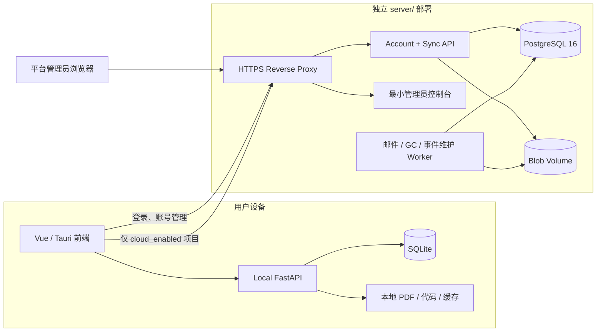

# TraceLab 服务器端部署重构计划（审查稿）

> 状态：已按审查结论实施；生产 staging 与外部恢复验收待执行
> 编写日期：2026-07-20
> 目标：保留当前 Desktop/本地 Web 前端功能和本地优先能力，把服务器端重构为独立、可部署、API 优先的账号与基础同步服务。

## 1. 本次重构的范围

本次不继续建设 Cloud Web 在线工作台。TraceLab 的完整项目工作台、论文阅读、代码浏览、追溯审阅和 Agent 交互仍运行在用户本机：

- Vue 前端运行在 Tauri Desktop 或本地 Web 开发环境。
- Local FastAPI、SQLite、本地文件、解析和分析能力继续随 Desktop 在本机运行。
- Desktop 在未登录或服务器不可用时仍可完整使用本地项目。
- 用户登录后，只同步明确设置为 `cloud_enabled` 的项目。
- 服务器第一阶段只负责账号、Workspace、项目同步、Blob、审计和最小运维。

服务器不再构建或托管完整 TraceLab Vue 工作台，也不运行 MinerU、代码分析、LLM 或 Agent 推理。服务器唯一允许存在的界面是用途明确的最小管理员控制台。

### 1.1 “前端不改”的具体边界

本计划实施期间：

- 不修改桌面版 app 前端的页面、组件、Store、路由或交互行为。
- 不改变 `localHttp`、`cloudHttp` 已使用的请求和响应结构。
- 不改变 Desktop 中登录、账号、云端项目、启用/暂停/解除同步、冲突中心和现有管理员入口的行为。
- 允许移走或删除仅用于服务器构建的 `frontend/Dockerfile.cloud`、`frontend/deploy/**` 和 Cloud Web 部署示例；这些文件不是应用 UI 源码。
- 当前未被 Desktop 运行模式使用的 Cloud Web 页面先保留，不在本次重构中顺带删除；是否清理应单独评审。

## 2. 当前仓库审计结论

### 2.1 Git 演进

服务器代码主要由以下提交引入：

| 提交 | 内容 | 影响 |
|---|---|---|
| `279a346` | `feat: add cloud accounts and project sync` | 一次加入 130 个文件、约 1.18 万行，把 Cloud API、Worker、PostgreSQL、部署脚本和 Cloud Web 一并放进现有 `backend/`、`frontend/` 和仓库根目录。 |
| `92a6c36` | 合并 PR #23 | 将上述实现合入 `main`。 |
| `0b96688` | `Update server. (Iteration 2)` | 继续修改共享后端中的账号、项目、同步、Worker 和配置，并把邮箱验证、运维门禁改为默认关闭。 |
| `d0250a8` | `Update server. (Iteration 2)` | 在应用前端中继续扩充 `AdminView`，并把固定服务器 IP 写入 Desktop 构建配置。 |
| `700bcf0` | 合并 PR #24 | 将服务器适配再次合入 `main`。 |

问题不是某一个页面写得简陋，而是一次提交同时改变了本地应用、服务器产品、部署方式和前端运行形态，没有先建立源码所有权和部署边界。

### 2.2 当前耦合问题

1. **部署文件散落。** 服务器 Compose 位于仓库根目录，镜像位于 `backend/Dockerfile` 和 `frontend/Dockerfile.cloud`，Nginx 位于 `frontend/deploy/`，备份脚本位于根 `deploy/`，环境示例又位于根目录。
2. **服务器会构建完整应用前端。** Compose 的 `web` 服务构建整个 `frontend/`，以 `VITE_RUNTIME_MODE=cloud` 启动另一套项目工作台；这与“前后端均在 Desktop 本地运行”的当前目标冲突。
3. **本地与服务器 Python 包混用。** `backend/app` 同时包含 `app.main:app`、`app.cloud:app` 和 `app.worker`。本地 sidecar 因此携带账号、PostgreSQL、Blob、云端 Worker 等无关代码和依赖。
4. **数据库所有权不清晰。** `backend/app/db/session.py` 同时导入本地和云端模型；`cloud_entities.py` 中又包含本地 outbox/inbox 模型；本地迁移链中存在名为 `0006_cloud_accounts_sync`、`0007_cloud_consistency` 的迁移。
5. **迁移基线不可维护。** Cloud baseline 通过运行时模型 metadata 动态建表，历史迁移会随当前 ORM 变化，不是稳定、可审计的 PostgreSQL schema 记录。
6. **云端 Worker 反向依赖本地业务。** `cloud_jobs.py` 直接导入本地代码分析器和本地实体时间函数，导致服务器镜像必须包含完整应用后端。
7. **安全门禁发生回退。** 后续提交将 `cloud_require_email_verification` 和 `cloud_require_ops_gates` 默认设为 `false`，但原架构文档仍把邮箱验证、SMTP 和外部备份作为生产要求。
8. **部署目标写入应用源码配置。** 当前 Desktop 默认绑定 `https://10.119.5.94/api/v1`。固定 IP、证书、staging 和生产环境的责任没有独立的发布配置层。
9. **CI 没有分离本地与服务器。** 单个后端环境同时测试 SQLite 和 PostgreSQL。当前基线中前端类型检查通过，但后端测试为 `122 passed, 1 failed, 1 skipped`；失败用例由 `0b96688` 引入，注册响应断言与真实 API schema 不一致。本地执行 CI 中的 `uv run pytest` 还暴露了包导入路径不稳定问题。

### 2.3 值得保留的能力

以下设计与当前目标一致，应通过兼容迁移保留，而不是推倒重写协议：

- 本地项目默认 `local_only`，显式启用后才产生 outbox。
- SQLite 与 PostgreSQL 不传输数据库文件，使用 UUID、版本和同步事件交换数据。
- access token 短期有效，refresh token 旋转且数据库只存哈希。
- Workspace 范围权限和 `owner/editor/viewer` 角色。
- `bootstrap/push/pull/ack`、幂等 receipt、workspace sequence、冲突和 tombstone。
- Blob 分块上传、SHA-256、Workspace 授权、Range 下载和引用计数。
- Desktop refresh token 存系统凭据库，不进入 SQLite 或 localStorage。
- 平台管理员默认只能看到账号、项目元数据、配额、存储摘要和审计，不读取 PDF、代码、追溯正文或 Agent 内容。

## 3. 目标架构



### 3.1 服务器第一阶段职责

- 注册、登录、刷新、退出、设备撤销、密码重置和可配置的邮箱验证。
- Workspace、成员和角色。
- 项目元数据、设备绑定状态和软删除。
- Project、Paper、Repository、TraceLink、Agent 工作记录的基础版本同步。
- PDF、代码包和大 Agent 结果的 Blob 上传、下载和引用。
- 幂等、冲突、cursor、tombstone、审计和配额。
- 最小管理员控制台与管理员 API。
- 邮件、Blob GC、tombstone GC 和同步事件压缩。

### 3.2 明确不做

- 不部署完整 Cloud Web 项目工作台。
- 不在服务器解析论文、分析代码、生成张量图或执行 Agent/LLM。
- 不引入 Redis、MinIO、Kubernetes、向量数据库或独立认证中心。
- 不同步 SQLite 文件、本地路径、MinerU/LLM 密钥、UI 布局或分析缓存。
- 不自动上传升级前的本地项目。

## 4. 目标目录结构

```text
frontend/                         # 保持现有应用前端，不作为服务器镜像构建上下文
backend/                          # 仅 Local API、SQLite、本地文件与分析能力
  app/
    api/routes/local_sync.py
    models/sync.py                # 本地 outbox/inbox/cursor/conflict
    services/local_sync.py
server/                           # 新的独立服务器产品根目录
  README.md
  pyproject.toml
  uv.lock
  Dockerfile
  compose.yaml
  .env.example
  tracelab_server/
    main.py
    config.py
    db/
      session.py
      models/
      migrations/
    auth/
    workspaces/
    projects/
    sync/
    blobs/
    admin/
      api.py
      web.py
      templates/                  # 仅管理员控制台
      static/
    jobs/
    audit/
  tests/
    contract/
    integration/
    security/
  deploy/
    nginx.conf
    backup.sh
    restore-verify.sh
    systemd/
docs/
  contracts/cloud-sync.md         # 人类可读契约
  contracts/cloud-sync.openapi.json
```

硬性依赖规则：

- `server/` 不得导入 `backend/app` 或复制 `frontend/`。
- `backend/` 不得导入 `server/`。
- 服务器 Docker build context 必须为 `server/`。
- Desktop 与服务器只通过 HTTPS 和冻结的 API 契约联动。
- 本地同步 DTO 如需 Python 复用，优先由 OpenAPI/固定 JSON fixture 验证兼容，不建立两个运行时之间的源码依赖。

## 5. API 兼容策略

为了实现“前端不改”，新服务器必须兼容当前 Desktop 已调用的 `/api/v1` 契约。

### 5.1 必须兼容的端点

- `/auth/register|login|refresh|logout|logout-all|me|devices|verify-email|password/*`
- `/workspaces` 及成员管理
- `/projects`、项目删除和 `/projects/{id}/device-sync`
- `/sync/bootstrap|push|pull|ack`
- `/blobs/upload-init`、分块、complete 和 download
- 当前 `AdminView` 使用的 `/admin/users|workspaces|metrics|audit|jobs|maintenance/*`

Cloud Web 专用的直接领域编辑端点可先保留兼容壳，但不再作为服务器第一阶段产品能力扩张。确认 Desktop 和本地 Web 没有运行时调用后，再单独决定是否移除。

### 5.2 契约冻结方法

1. 从当前 `app.cloud:app` 导出 OpenAPI，存为审查基线。
2. 为前端实际请求保存脱敏 request/response fixture。
3. 新服务器跑同一套黑盒契约测试，字段、状态码、Cookie、错误结构和分页行为必须一致。
4. 兼容性测试通过前，不切换 Desktop 当前配置的服务器地址。
5. 新增字段必须可选；删除或改名必须进入单独的前端版本升级，不混入本次服务器重构。

## 6. 服务器数据设计

服务器是同步副本和账号权威源，不是完整领域计算引擎。建议保留以下最小表域：

| 数据域 | 表/职责 |
|---|---|
| 身份 | `user_account`、`device`、`auth_session`、`email_token`、`auth_rate_limit` |
| 租户 | `workspace`、`workspace_member` |
| 项目 | 显式 `project` 表，保存 UUID、Workspace、名称、描述、版本、删除时间 |
| 同步实体 | `sync_entity`，限定允许的 entity type，并对 Project/Paper/Repository/TraceLink/Agent payload 分类型校验 |
| 文件 | `blob_content`、`blob_object`、`blob_reference`、`upload_session` |
| 同步日志 | `sync_event`、`sync_receipt`、`sync_device_cursor`、`entity_tombstone`、`device_project_binding` |
| 运维 | `background_job`、`audit_log` |

基础同步服务不需要把论文、代码和 Agent 重新实现成可在线编辑的完整业务 ORM。它只需要验证协议、版本、租户和 Blob 引用。大字段仍必须放入 Blob，单个 event 保持 64 KB 上限。

### 6.1 迁移要求

- 新 `server/` 使用独立 PostgreSQL Alembic chain。
- 初始迁移必须显式写出表、索引、外键和约束，禁止从当前 ORM metadata 动态 `create_all`。
- 本地 `backend/` 只保留 SQLite migration chain。
- `LocalSyncOutbox/Inbox/State/Conflict` 移入本地模型模块，不再放在云端实体文件。
- 服务器 schema 是否需要继承现有数据必须在实施前完成数据盘点；普通启动绝不自动 drop 或 rebuild。

## 7. 最小管理员控制台

管理员控制台放在 `server/tracelab_server/admin/`，不放入应用层 `frontend/`，也不引入第二套完整 Vue 项目。

推荐使用 FastAPI + Jinja2 服务端模板和少量原生 JavaScript：

- `/admin-console/login`：仅允许 `platform_admin`。
- 管理员会话使用独立的随机 opaque token，数据库只存哈希；Cookie 设置 `Secure; HttpOnly; SameSite=Strict; Path=/admin-console`。
- 所有写操作使用 CSRF token、二次确认和审计。
- 可选在 Nginx 增加管理网段/VPN allowlist，但不能代替应用权限。

第一版页面只包含：

1. 账号列表、状态、验证状态、最近活动、启停和强制下线。
2. Workspace 列表、所有者、成员数、项目数、存储用量和配额。
3. 项目元数据列表：UUID、名称、Workspace、同步状态、Blob 用量、更新时间和删除状态；不提供正文预览或文件下载。
4. 项目软删除/恢复或进入宽限期清理，必须有明确确认和审计。
5. Blob/数据库/磁盘用量摘要、失败任务和最近审计记录。
6. 手工触发 GC/事件压缩；不提供任意 SQL、任意文件浏览或服务器 Shell。

现有 Desktop `AdminView` 所依赖的管理员 API 保持兼容；新控制台和 API 调用同一 Admin Service，不复制权限与业务规则。

## 8. 代码迁移映射

| 当前路径 | 处理方式 |
|---|---|
| `backend/app/api/routes/auth.py`、`workspaces_cloud.py` | 按契约移植到 `server/`，清除本地依赖 |
| `backend/app/api/routes/cloud_projects.py`、`sync.py`、`blobs.py` | 按 Desktop 使用面重写并做黑盒兼容测试 |
| `backend/app/api/routes/admin.py` | 拆为 Server Admin Service、REST API 和管理员模板路由 |
| `backend/app/auth/**` | 移入 `server/`，保留 Argon2、refresh rotation、限流和审计 |
| `backend/app/models/cloud_entities.py` | 拆为 server models 与本地 sync models，不直接整体移动 |
| `backend/app/services/cloud_sync.py` | 提炼为 server sync command service |
| `backend/app/services/cloud_jobs.py` | 只保留邮件、GC、tombstone 和事件压缩；删除解析/分析导入 |
| `backend/app/cloud.py`、`worker.py` | 由 `server/tracelab_server/main.py` 和 maintenance worker 替代 |
| `backend/app/db/cloud_migrations/**` | 用显式 server baseline 替代 |
| `backend/app/api/routes/local_sync.py`、`services/local_sync.py` | 留在本地 backend，并移除对 cloud models 的导入 |
| 根 `docker-compose.yml`、`.env.cloud.example`、`deploy/**` | 移入 `server/` 并统一相对路径 |
| `backend/Dockerfile` | 移入 `server/`，只安装 server 依赖 |
| `frontend/Dockerfile.cloud`、`frontend/deploy/**` | 新服务器稳定后删除；服务器不再构建应用前端 |
| `frontend/src/**` | 本次不修改 |

不建议直接对现有 cloud 文件批量 `git mv`。应先在新包中建立测试和边界，再按能力逐项移植；否则会把当前跨模块导入和动态 migration 一起带入新结构。

## 9. 分阶段实施

### R0：冻结行为与数据盘点

- 修复当前失败的云端测试和 pytest 入口，得到可信基线。
- 导出当前 OpenAPI、前端请求清单和同步 fixture。
- 盘点现有服务器 PostgreSQL、Blob 和真实账号数量，决定是重建还是迁移。
- 明确生产域名/证书、SMTP、备份目标和当前 `10.119.5.94` 的兼容策略。

验收：当前 Desktop 的登录、项目启用、push/pull、下载、退出和管理员操作都有可重复的黑盒测试。

### R1：建立独立 server 骨架

- 创建 `server/` 独立依赖、配置、日志、health、Dockerfile 和 Compose。
- 建立显式 PostgreSQL baseline 和一次性 migrator。
- Compose 只包含 proxy、api、maintenance worker、postgres 和按 profile 启动的 backup。
- 不构建 `frontend/`，API/DB/Worker 不发布宿主端口。

验收：仅复制 `server/` 到空 Linux 主机即可构建和启动；根应用目录不是构建依赖。

### R2：账号和基础同步兼容

- 移植账号、Workspace、Project、sync receipt/event/cursor/tombstone 和 Blob。
- 保持现有 Desktop JSON/HTTP 契约。
- 删除服务器解析、代码分析和 Agent 推理任务。
- Worker 只处理邮件与维护任务。

验收：Desktop A 显式启用项目后可上传，Desktop B 可 bootstrap/pull；`local_only` 项目零上传。

### R3：最小管理员控制台

- 建立独立 `/admin-console` 登录和会话。
- 实现账号、Workspace、项目元数据、配额、用量、任务和审计页面。
- 保持现有 `/api/v1/admin/*` 兼容。

验收：管理员不能通过 UI 或 API 下载 PDF、代码、TraceLink/Agent 正文；所有写操作有审计。

### R4：解除 Local Backend 耦合

- 从 `backend/` 删除云端 API、auth、cloud worker、cloud models 和 PostgreSQL 专用配置。
- 将本地 sync models 收口到本地模块。
- 拆分依赖和 lockfile，确保 Desktop sidecar 不包含 psycopg、云端管理员或服务器密钥配置。
- 保持 Local SQLite migration 无损升级和 `local_only` 默认值。

验收：断开网络后 Desktop 全部本地回归通过；`backend/` 不导入 `server/`，反向亦然。

### R5：staging、数据迁移与切换

- 在独立 staging PostgreSQL/Blob 上跑契约、安全、多设备和恢复测试。
- 若当前服务器无保留数据，使用带显式确认的重建流程；若有数据，执行只读导出、ETL、数量/哈希核对后切换。
- 保持 Desktop 当前 API 地址可达，优先通过 DNS/反向代理切换，不发布需要前端配合的新路径。
- 保留旧服务镜像和只读备份，验证期结束后再下线。

验收：切换和回滚演练通过；备份能恢复账号、项目、Blob 引用和可下载文件。

### R6：清理旧部署资产和文档

- 删除根目录旧 Compose、旧 cloud backend 文件和 `frontend/` 下服务器构建文件。
- 更新 README、架构文档和运维手册，明确完整 UI 仅在本地运行。
- 将现有 Cloud Web 代码标记为未部署/废弃；是否删除另开任务评审。

验收：仓库中所有服务器部署入口都位于 `server/`；不存在构建完整应用前端的服务器流水线。

## 10. 测试与 CI 拆分

CI 至少拆成三个独立 Job：

1. `local-backend`：SQLite migration、本地项目/论文/代码/追溯/Agent、outbox 原子性和 Desktop sidecar。
2. `application-frontend`：现有 typecheck/build，不使用 Cloud Web 服务器构建模式。
3. `server`：真实 PostgreSQL 16、显式 migration、账号安全、同步并发、Blob 和管理员权限。

必须覆盖：

- 注册/登录/刷新复用、设备撤销、密码哈希、限流、枚举防护和 CSRF。
- Workspace 越权、跨租户 UUID/Blob 越权、管理员无正文权限。
- applied/duplicate/conflict receipt、并发 sequence、cursor 上界和 30 天 tombstone。
- `local_only` 零上传、paused 当前设备只 pull、detach 不删除云端项目。
- Project、Paper、Repository、TraceLink、Agent 工作记录双设备同步。
- 分块续传、哈希/MIME/ZIP 安全、Range、配额、GC 和 90% 磁盘停传。
- 管理员账号、Workspace 和项目元数据操作的 CSRF、确认和审计。
- Compose 仅开放 80/443、migrator 单次执行、备份和恢复。
- 当前前端 request/response fixture 对新旧服务器均通过。

## 11. 最终验收标准

- 服务器部署不读取、复制或构建 `frontend/`。
- 服务器端所有源码、迁移、镜像、Compose、脚本和测试均位于 `server/`。
- Desktop 未登录、断网或服务器故障时，本地工作台仍可使用。
- 新项目默认 `local_only`；未显式启用时服务器没有该项目数据和 Blob。
- 登录后可在两台 Desktop 之间同步项目元数据、论文、代码、TraceLink 和 Agent 工作记录。
- 服务器不运行论文解析、代码分析、LLM 或 Agent 推理。
- 管理员只能管理账号、Workspace、项目元数据、配额、存储和维护任务，不能读取项目正文。
- PostgreSQL 不保存明文密码、refresh token、邮箱 token 或第三方 API key。
- 普通启动不自动重建数据库；外部备份恢复演练通过。
- `frontend/src/**` 在本次重构中没有行为性修改。

## 12. 已落实的决策与上线前外部条件

代码层已落实：生产默认要求邮箱验证；管理员只操作账号、Workspace、配额、项目元数据和生命
周期；服务器停止部署完整 Cloud Web，但未改动现有 `frontend/src/**`；域名、SMTP 和备份均由
`server/.env` 注入。

上线前仍需由运维确认：现有服务器是否有必须迁移的真实 PostgreSQL/Blob 数据、正式域名与 TLS
证书、SMTP 发件配置、服务器外 rclone 目标和 LVM/project quota。没有完成只读盘点前不得执行
重建命令。经本次明确确认，旧混合实现及其迁移归档已删除；当前唯一服务器实现和部署入口为
`server/`。

## 13. 推荐实施切分

建议用多个可回滚提交完成，而不是再次提交一个跨 100 多个文件的大合并：

1. `test: freeze desktop-cloud compatibility contract`
2. `chore(server): scaffold standalone deployment`
3. `feat(server): add account and workspace services`
4. `feat(server): add sync and blob services`
5. `feat(server): add minimal admin console`
6. `refactor(backend): isolate local sync models`
7. `chore(server): switch compose and operations`
8. `docs: retire cloud web deployment path`

每个提交都应保持 Local API 与现有前端检查通过；在 R5 验收前不删除旧服务器实现，以便逐阶段比较和回滚。
