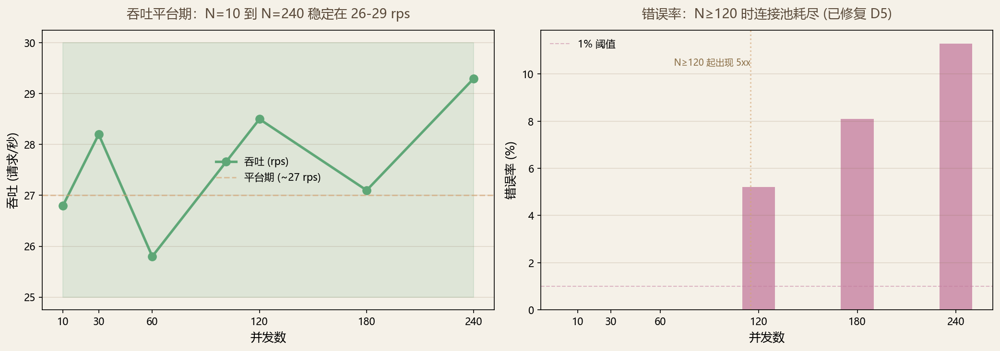
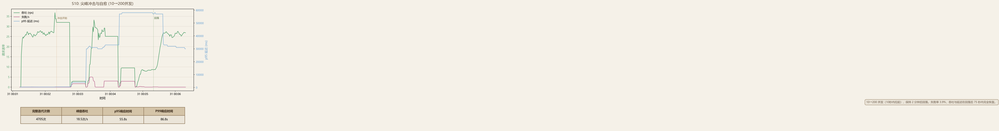
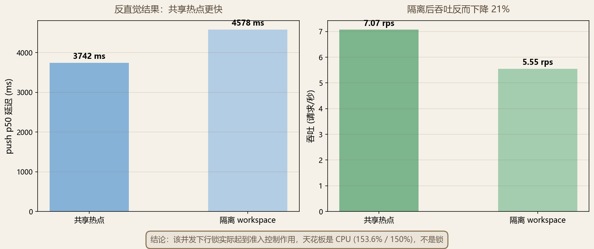

# TraceLab 压力测试总结

> 面向汇报的概要。完整执行记录、原始数据与逐项证据见 [`stress-test-report.md`](stress-test-report.md)，测试方案见 [`stress-test-plan.md`](stress-test-plan.md)。

## 一句话结论

在一台 1.5 vCPU / 3 GB 的隔离沙箱上完成 10 项场景中的 9 项、覆盖 10→240 并发区间，**正确性在饱和状态下零缺陷**，同时定位并修复了 5 个真实问题（含 1 个可用性阻断级），全部附回归测试。

## 一、测试做到了它该做的事

压力测试的价值不在于"跑出漂亮的数字"，而在于**在用户遇到之前，先把系统的边界和失效方式暴露出来**。本轮达成了三件事：

1. **定位真实瓶颈**，并推翻了一个原本的错误假设（详见第四节）。
2. **发现 5 个功能缺陷**，其中 D1 会导致本地后端在非正常关机后永久无法启动 —— 这是任何功能测试都不会触发、只有压力与异常路径叠加才会暴露的问题。
3. **全部修复并固化为回归测试**，缺陷不会二次出现。

## 二、正确性：饱和状态下零数据问题

这是本轮最有分量的结论。系统在被压到明显退化、乃至开始返回错误的状态下，**没有产生任何一处数据错乱**：

| 判定项 | 结果 |
| --- | --- |
| Blob 字节一致性 | 203 次带 sha256 校验的下载，**0 处不匹配** |
| 同步序列完整性 | S1 / S6 / S10 全程**无游标回退、无事件丢失**，ack 与 pull 语义在饱和下保持 |
| SQLite 并发写 | 24 并发写入**零 `database is locked`** |
| 限流准确性 | 10/min 双维度限流按预期生效，**未观察到漏放** |
| 维护任务隔离性 | 94 个 gc / compact 任务全部 `completed`，期间写入速率未下降 |

分布式同步系统在过载时最危险的失效不是变慢，而是"看起来成功了但数据错了"。这一类失效在本轮**完全没有出现**。

## 三、容量与恢复能力

沙箱规格是 **api 限 cpus 1.5 / mem 3g、`--workers 2`**，postgres 与之共享同一台单机。下述数字应理解为"该规格下的表现"，而非产品上限。

### 阶梯加压：吞吐平台期

从 N=10 到 N=240，吞吐稳定在 26–29 rps 的平台期，说明系统在过载时平滑退化而非崩塌。N≥120 时出现的错误全部由 D5（连接池耗尽返回 500）造成，**该缺陷已修复**。

### 尖峰自愈

10→200 并发在 10 秒内拉起、保持 2 分钟后回落。失败在 **60 秒内归零**，吞吐与延迟在 **75 秒内完全恢复**到尖峰前水平（26 rps / 20 ms），压测结束后健康检查正常，**全程无需人工干预**。

### 其他场景摘要

| 场景 | 条件 | 结果 |
| --- | --- | --- |
| 读路径（S3） | 大 Workspace 分页拉取 | p50 **25–68 ms**，错误率 0% |
| Blob 传输（S4） | 4 / 8 并发 | 双向 **~54 MiB/s**，错误率 0% |
| 写路径（S1） | 60 并发 | 25.77 rps，错误率 **0%** |
| 叠加负载（S6） | 60 并发 + 管理端 + 维护任务 | 35.16 rps，错误率 **0%**，p95 劣化 ≈ 0 |
| 本地后端（S9） | 24 并发写 | 错误率 0.09% |

## 四、瓶颈定位：一个被推翻的假设

方案预设了三个瓶颈假设，实测结果比"逐一确认"更有价值：

**H2（连接池）—— 确认成立。** api 容器日志给出直接证据：AnyIO 线程池每进程 40，而 SQLAlchemy 连接池默认仅 5 + 10 溢出，线程拿到执行权却拿不到连接。这是本轮全部 5xx 的根因，**已修复**（见第五节 D5）。

**H1（Workspace 行锁）—— 机制成立，推论被推翻。** `pg_stat_activity` 确实观测到 22–28 个后端阻塞在同一 `workspace` 行的 tuple lock 上。但隔离 workspace 的对照组**反而更慢**：

行锁在该并发下实际起到了**准入控制**作用；移除热点后更多请求真正并行，直接把 CPU 打满（峰值 153.6% / 预算 150%）。**该并发下的天花板是 CPU，不是锁。** 这一发现直接改变了优化顺序 —— 先扩 CPU 预算，任何锁优化都应排在其后，否则是纯粹的无效投入。

**H3（Argon2 成本）—— 被限流遮蔽。** Argon2id 单次校验实测 59.8 ms / 64 MiB，对应约 25 logins/s；但登录限流 10/min 比该上限早约 150 倍触发，单 IP 压力源无法触达。**结论是防护层设计得当**，认证成本不构成暴露面。

## 五、发现与处置：5 个缺陷，全部已修复

| 编号 | 问题 | 影响 | 状态 |
| --- | --- | --- | --- |
| **D1** | 分析任务恢复读取已过期的 ORM 属性，抛 `DetachedInstanceError` | **阻断级** —— 非正常关机遗留 `queued`/`running` 任务后，本地后端永久无法启动，用户无自助恢复路径 | ✅ 已修复 |
| **D2** | 删除 `failed` blob 时未清理子 `upload_session`，外键不级联 | 该 sha256 的每次后续重试永久失败 | ✅ 已修复 |
| **D3** | 追溯关系去重的预检查与插入非原子（TOCTOU） | 并发提交相同关系时返回 500，而串行下返回 409 | ✅ 已修复 |
| **D4** | pypdf 解析异常直接冒泡 | 畸形 PDF 返回 500 而非 400 | ✅ 已修复 |
| **D5** | 连接池耗尽以未捕获异常冒泡 | 过载返回 500，客户端无法区分"请重试"与"服务出错" | ✅ 已修复 |

每项修复均附回归测试，改动位置与验证方式见 [`stress-test-report.md`](stress-test-report.md) 第 7 节。

两处值得单独说明：

- **D2 揭示了一个测试盲区。** SQLite 默认 `PRAGMA foreign_keys=OFF`，所以这个外键缺陷在原有测试套件下不可能被发现，而 PostgreSQL 在生产中是强制执行的。新增的回归测试显式开启该 pragma，并单独断言约束确实生效 —— 否则测试会在不设防的库上假通过。
- **D5 的修复不是简单地把池开到最大。** 池宽度与超时改为可配置，耗尽时返回 503 + `Retry-After`；compose 中 api 取 12+8/worker（峰值 40），postgres 同步上调 `max_connections=200`。没有开得更宽，因为 postgres 被限在 `cpus: 1.0`，更多并发连接只会在 CPU 上排队。连接预算已写入 `server/README.md`。

**重要说明：第三节表格中的错误率均为 D5 修复前的数据。** 本轮全部 5xx 的根因都是连接池超时；修复后同等过载条件下的表现应为 503 + `Retry-After` 的可重试响应，而非 500。修复后的复测尚未执行（见第六节）。

## 六、待办

如实记录本轮未覆盖的部分：

| 项目 | 原因 | 影响 |
| --- | --- | --- |
| S8（Agent SSE 并发会话） | 需 mock LLM 服务，本轮环境不具备 | "SSE 事件不重不漏"这一判定项**未验证** |
| S10 的 4 小时耐久 soak | 单机时间预算不足 | 长时间运行下的内存与句柄趋势未覆盖 |
| D5 修复后的复测 | 修复在本轮压测之后完成 | 第三节错误率为修复前数据 |

另有两项观察建议纳入后续跟踪：

1. **SQLite WAL 增长到 124 MB（DB 146 MB）而未触发 checkpoint** —— 短时压测无影响，长期运行需关注。
2. **`_client_ip` 直接取 `X-Forwarded-For` 首值**，无可信代理白名单。线上由 nginx 自身的 `limit_req_zone` 兜底，实际风险有限，但应用层不宜单独依赖该字段。

## 七、总体评价

- **正确性：通过。** 饱和状态下零数据错乱，这是同步系统最关键的底线。
- **韧性：通过。** 过载平滑退化而非崩塌，尖峰后 75 秒自愈，无需人工干预。
- **容量：瓶颈明确、扩容路径清晰。** 当前规格下的天花板是 CPU 预算而非架构缺陷，内存与锁均非约束。
- **缺陷处置：完成。** 5 个问题全部修复并附回归测试，其中 1 个阻断级问题在交付前被拦下。
