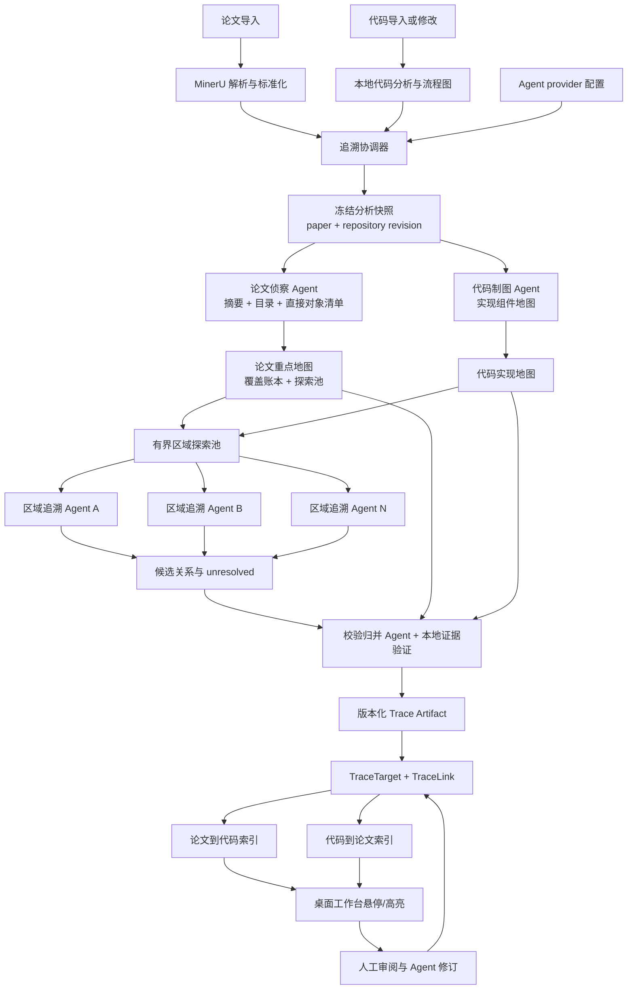

# Agent 驱动的论文—代码双向追溯架构

> 状态：唯一实施计划（本文件为该功能的权威计划，不依赖其他追溯文档）
>
> 编写日期：2026-07-21，修订日期：2026-07-23
>
> 适用范围：Tauri 桌面端复用的 `frontend/src` 与 `backend/app`
>
> 实施状态（2026-07-22，V1 聚焦切片）：已落地——`PaperTarget`/`CodeTarget`/`TraceReviewEvent` 表与迁移 `0010_trace_targets`；`TraceLink` 新增 `paper_target_id`/`code_target_id`/`relevance`/`score_basis_json`/`provenance_json`/`supersedes_trace_id`；发布 schema 升级为 `trace-agent-v2`（occurrence + target_type/role + salience/relevance/confidence），校验升级为“指定 occurrence 处 quote 命中 + 内容 hash 计算”；单 Agent 四阶段 prompt 与对齐后的 `trace-analysis` skill；导入后自动后台协调器（`services/tracing/coordinator.py`）；下线 `static_candidates` 写入路径（`/suggest` 恒 `static_candidates_retired`）；前端双向 hover/高亮（论文 `<mark>` 锚点装饰 + CodeMirror6 Decoration + 共享双向索引 `useTraceIndex` + 相关度浮层 + 点击固定/Esc）。**暂缓**：§11.3 跨 reparse 重锚算法、§12 固定样例集/指标质量门、V2 并发 subagent、图内 bbox 热区与算法 step 级分解。
>
> 可靠性修订（2026-07-23，`analysis_jobs.py`）：主循环每 5 步检测 job 是否被外部置为 `failed`（手动中止），若是则立即收尾、释放 `ThreadPoolExecutor` worker 槽，避免后续任务永久停在“等待 Agent 分析”；`AgentRun.trace_json` 改为内存累积、仅在 job 终结时一次性写回（`trace_entries`），减少每步大 JSON 写入；`RunEventEmitter` 仍逐事件 commit 以驱动 SSE 实时进度。
>
> 根因修订（2026-07-23，迁移 `0012_trace_link_repair`）：`analysis_internal_error:OperationalError` 的真正根因是**迁移漂移**，不是 SQLite 锁。早期 `0010_trace_targets` 只给 `trace_link` 加了 `paper_target_id`/`code_target_id`/`relevance`，且用旧原型 schema（整型 `id` 主键 + `is_interactive`）建了 `paper_target`/`code_target`/`trace_review_event`；该脚本后来被扩写补齐列，但已 stamp 过 0010 的库不会重跑，导致 `trace_link` 缺 `artifact_id`/`score_basis_json`/`provenance_json`/`supersedes_trace_id`、target 表缺 `target_id`/`event_id` 等。首次 `publish_trace_candidates` 落库即抛 `no such column: trace_link.artifact_id` / `paper_target.target_id`，追溯“到中途”零输出。修复：新增幂等迁移 `0012_trace_link_repair` 补齐 `trace_link` 缺列并 drop+重建漂移的三张 target 表；无 Alembic 的打包后端走 `_run_sqlite_compatibility_upgrade` 兜底路径，同样在 `create_all` 前 drop 漂移 target 表。外层异常处理改为记录完整 traceback + 底层错误消息（类名不足以定位）。NeRF/HaMeR 用真实 DeepSeek key 实测端到端成功，分别产出 16/11 条 `proposed` agent 追溯关系，平均置信度约 0.94/0.88。

## 1. 结论

TraceLab 的追溯系统采用“论文驱动、代码地图辅助、证据校验收口”的 Agent 架构。

本文档同时约定分期落地：**V1 用单个追溯 Agent 的两轮流程跑通完整的证据、覆盖、双向管线；多区域并发 subagent 编排是 V2，且仅在 V1 实测证明单 Agent 质量不足时才启动。** 先建可靠性地基（片段级锚点、occurrence、内容一致性校验），再建 Agent 语义层；先证明追溯可靠，再扩展并发规模。第 3.5 节给出分期原则，第 5 至 9 节按“V1 必做 / V2 扩展”标注每个组件的落地边界。

- 论文决定“哪些内容值得追溯”。核心公式、变量、约束、算法/伪代码图和方法设计是主目标，背景、相关工作和一般性描述默认不进入追溯范围。
- 代码 Agent 先建立面向追溯的实现地图，说明仓库中哪些组件承担模型、损失、数据流、训练/推理循环、约束和关键算子等职责。该地图是导航依据，不直接等于追溯结论。
- 论文侧 Agent 从摘要和全文目录中提炼核心贡献，再把相关章节放入一个有界探索池。区域 Agent 一次只读取一个章节区域及必要上下文，并借助代码地图寻找、核对候选实现。
- 所有候选关系都由独立的校验与归并阶段检查双侧原文、定位、版本和语义解释。没有可靠证据时必须输出 `unresolved`，不得为了覆盖率猜测代码。
- 一条关系只连接一个精确论文目标和一个精确代码目标。一对多、多对一通过多条边表达，每条边分别拥有相关度、置信度、理由和证据。
- 双向追溯不是分别生成两套结果，而是从同一个关系图建立“论文目标 -> 代码目标”和“代码目标 -> 论文目标”两个索引。两边永远共享同一事实来源。
- 论文和代码都准备好后自动在后台启动。没有可用 Agent provider 时进入等待状态，不使用关键词或本地规则生成替代关系。

本架构只描述追溯系统。流程图继续由本地静态分析生成和展开；追溯 Agent 可以把本地代码索引和流程图当作导航资料，但不得接管流程图。远程 `server/` 不执行 MinerU、代码分析或 Agent 任务。

## 2. 目标与非目标

### 2.1 目标

1. 找出少量、真正有实现意义的论文目标，而不是给全文制造密集链接。
2. 为公式、变量、约束、算法步骤/图和核心方法描述找到可验证的代码实现。
3. 支持一对多和多对一关系，并让用户理解每条边的重要程度及可信程度。
4. 从论文悬停可定位和高亮代码，从代码悬停可定位和高亮论文。
5. 导入或更新后自动分析；结果可审阅、可修正、可失效、可重算、可同步。
6. 所有用户可见关系都能回到当前论文与代码 revision 中的精确证据。

### 2.2 非目标

- 不追溯所有段落、每个标识符或一般工程代码。
- 不执行用户仓库，不依赖运行时张量值，也不推断无法从证据确认的行为。
- 不要求每个重要论文目标都必须存在代码实现；“已检查但未找到”是合法且重要的结论。
- 不让单个超长上下文调用一次性把整篇论文和完整仓库塞进去、并在一轮里完成重点识别、全仓库理解、关系生成和最终验收。V1 的单 Agent 仍是分轮、分区域、按需取证，且最终发布必须经过独立的本地事实校验（第 12 节），不是“一次大调用包办”。
- 不在本阶段修改本地流程图生成，不把追溯任务迁移到 `server/`。

## 3. 核心设计原则

### 3.1 语义由 Agent 判断，事实由本地工具验证

Agent 负责识别核心思想、理解公式和代码职责、判断两侧是否对应。本地基础设施负责提供稳定 block、源码范围、符号与调用索引，并验证 quote、路径、行列、内容 hash 和 revision。

本地索引可以缩小搜索范围，但关键词重叠、AST 调用关系或本地流程图都不能自行写入追溯关系。

### 3.2 先建立地图，再按区域取证

DeepSeek V4 系列即使拥有约 1M 上下文，也不应默认一次输入整篇论文和完整仓库。大上下文解决“装得下”，并不解决注意力稀释、输出遗漏、成本、失败重试和证据审计问题。

论文侦察 Agent 的首轮上下文只使用：

- 论文摘要；
- 完整章节目录及页码范围；
- MinerU 直接识别出的公式、算法、图和图注清单；
- 论文版本与解析信息。

代码制图 Agent 同期从仓库目录、基础索引和按需源码建立实现地图。后续区域追溯才同时接收论文区域与代码地图摘要。只有跨章节消歧或最终复核需要时，才补充相邻章节或全局摘要。

### 3.3 核心对象必须被处理，但不能被强行关联

“保证核心公式和伪代码被 trace”定义为覆盖保证，而不是强制制造关系：

- 每个必查对象必须进入覆盖账本；
- 每个对象最终必须是 `linked`、`unresolved` 或 `excluded_with_reason`；
- `linked` 必须至少有一条双侧证据有效的关系；
- `unresolved` 必须记录已经搜索的代码区域和未能确认的原因；
- 算法/伪代码图不能仅因图片文字提取不完整而被静默跳过。

这样既能保证系统不会漏看核心内容，也不会在仓库未实现某个算法步骤时虚构目标。

### 3.4 双向浏览，共享一份关系事实

系统持久化的是一个有向但可双向查询的二部关系图：

```text
PaperTarget  <--- TraceLink --->  CodeTarget
```

正向和反向展示只是索引方向不同。关系状态、证据、相关度和人工决策只有一份，避免两套 Agent 分别分析后产生矛盾。

### 3.5 分期交付与可靠性地基优先

本架构的最终形态是“父 job + 多区域并发 subagent + 独立归并校验”。但落地必须分期，且顺序由风险和可靠性决定，不由架构完整度决定。

**V1（先跑通、先可靠）**：

- Agent 侧使用**单个追溯 Agent 的两轮流程**：第一轮筛出少量高价值论文目标与核心代码目标，第二轮逐条取证发布。它复用现有单 Run 循环，不引入并发 subagent。
- 论文侦察、代码制图、区域取证、归并校验四个语义职责作为**同一个 Agent 内的阶段 Skill 段落**存在，先把职责边界和输出 schema 定清楚，但不拆成独立并发 run。
- 覆盖账本、双侧证据校验、片段级锚点、双向索引、协调器自动触发、revision 失效，全部在 V1 落地并作为质量门被度量。

**V2（在 V1 可靠的前提下扩展规模）**：

- 把四个职责升级为独立的父子 Agent run，接入有界区域探索池和并发 worker pool（第 5.4、9.2 节）。
- 触发条件是明确的：**V1 在固定样例集上出现“单 Agent 因上下文过载导致重点召回不足或错误高亮偏高”，且已排除是锚点/校验缺陷**。若单 Agent 质量达标，V2 的并发编排可以不做。

**贯穿两期的硬顺序**：先建“事实层”（片段锚点、occurrence、内容 hash、重锚算法、证据校验），再建“语义层”（Agent 选重点、判断关系）。事实层不可靠时，任何 Agent 拓扑都只会把错误定位放大。因此第 6.2、7.2、11.3、12 节描述的锚点与校验能力属于**最先交付、最先度量**的部分，而不是补充项。

本文与流程图相关的表述只把本地流程图当作 Agent 只读导航资料；本地静态分析生成的流程图不在本计划范围内改动。

## 4. 总体架构

> 下图是 V2 的目标形态（多个并发区域 Agent + 独立归并）。V1 把 `PaperScout`、`CodeMapper`、`RegionA/B/N`、`Verify` 折叠进**同一个追溯 Agent 的两轮顺序流程**：第一轮完成侦察 + 制图 + 选重点，第二轮逐区域取证并在同一 Run 内自校后发布，再交由本地事实校验收口。协调器、快照、覆盖账本、双向索引在两期一致。



追溯协调器是确定性的任务基础设施，只负责条件检查、去重、调度、重试和版本失效。所有“什么重要”“代码做什么”“两侧是否对应”的语义结论都由 Agent 完成。

## 5. 分阶段分析流程

### 5.1 阶段 0：冻结分析快照

一次追溯必须绑定不可变输入：

- 项目；
- 当前论文文档及解析版本；
- 当前代码仓库及 revision；
- 本地分析器版本；
- 追溯 Skill/schema 版本；
- provider 与模型标识。

运行期间若代码 revision 或论文版本变化，本次任务不把结果发布成 current。新输入会生成新的任务指纹，旧任务可以完成审计，但结果只能标记 stale。

### 5.2 阶段 1A：论文侦察

论文侦察 Agent 不读完整正文，先根据摘要和目录形成 `PaperFocusMap`：

- 论文声称解决的问题；
- 3 到 8 个核心贡献或实现组件；
- 每个核心点最可能对应的章节；
- 每个核心点的同义词、缩写、数学符号和预期实现行为；
- 需要探索的章节区域及优先级；
- 明确应排除的背景/实验/相关工作区域。

与此同时，本地从 MinerU 结构化结果生成“直接对象清单”，至少包括：

- 块级公式及其附近定义文字；
- 算法/伪代码 block；
- 模型结构图、算法图及图注；
- 含约束、目标函数、更新规则的候选 block；
- 目录中方法章节内无法分类但可能重要的图像对象。

论文侦察 Agent 将直接对象与核心贡献合并去重，形成覆盖账本。处于方法相关章节的公式和算法对象默认是 `must_inspect`；普通实验表格、结果图不自动进入追溯范围。

算法/伪代码图需要生成独立证据包，包含图片资产或裁剪区域、图注、MinerU/OCR 提取文本、所在章节和相邻解释。provider 支持视觉输入时可以补充读取原图；仅支持文本时使用结构化提取结果。能够可靠恢复步骤时，将算法整体和关键步骤分别登记；无法可靠恢复时仍保留图级目标并标记 `unresolved_extraction`，不能只分析图注后宣称算法已经覆盖。

### 5.3 阶段 1B：代码制图

代码制图 Agent 与论文侦察可并行运行。它读取仓库目录、README/配置入口、本地符号和调用索引，并按需查看源码，产出 `CodeImplementationMap`。

地图按职责组织，而不是照抄文件树：

- 模型与核心模块；
- 损失、目标和正则项；
- 数据表示与关键张量变换；
- 训练、推理、采样或优化主循环；
- 约束、更新规则和状态管理；
- 与论文概念相关的配置参数；
- 测试、脚手架、日志和通用工具等低优先级区域。

每个地图项包含稳定符号或文件范围、职责摘要、入口/调用关系、代表性证据和用于后续搜索的术语。它是追溯专用 Agent artifact，与本地流程图分离：本地图仍负责 UI 流程图，代码地图只服务于 Agent 搜索和解释。

### 5.4 阶段 2：构建有界探索池

协调器将 `PaperFocusMap` 转成有限数量的 `ExplorationRegion`。区域通常对应一个方法子章节，也可以是跨邻近 block 的一个公式组或一张算法图及其说明。

每个区域包只包含：

- 区域目标和对应核心贡献；
- 该章节的结构化 blocks；
- 必要的前后定义、图注和符号表；
- 直接对象覆盖项；
- 代码地图摘要；
- 全局论文术语表，但不包含整篇正文。

V1 中这些区域由单个 Agent 在一个 Run 内顺序处理，受该 Run 的工具调用与 token 预算约束即可。**并发 worker pool 属于 V2**：届时桌面端使用固定上限的 worker pool，建议默认同时运行 2 个区域 Agent，并限制单个任务的总区域数、工具调用数和 token 预算。区域 Agent 不允许递归创建不受控子 Agent；只有协调器能从池中调度已登记区域。

优先级顺序为：

1. 算法/伪代码图和核心公式；
2. 摘要明确声称的核心组件；
3. 方法章节中的约束、变量定义和设计描述；
4. 为消歧所需的补充区域。

### 5.5 阶段 3：区域追溯

每个区域 Agent 使用统一的追溯 Skill 完成以下闭环：

1. 从区域内提取少量精确 `PaperTarget`，并给出其重要性和类型。
2. 把论文语义转成代码搜索意图，例如“计算归一化注意力权重”，而不只是搜索原词。
3. 先查代码地图，再按需读取符号、调用者/被调用者和精确源码。
4. 对候选实现进行反证检查：同名是否只是配置、封装或测试，关键步骤是否真的发生。
5. 发布带双侧证据的候选边，或对未找到的必查目标发布 `unresolved`。

区域 Agent 可以从论文主动关联代码，但不能只凭代码地图摘要发布关系；发布前必须读取实际代码范围。它也可以发现代码中的关键实现拆成多个位置，从而自然产生一对多关系。

### 5.6 阶段 4：校验与归并

区域结果不能直接成为工作台高亮。收口阶段包含两层：

1. 本地事实校验：验证论文 block/quote、公式或图锚点、代码路径、行列、quote、内容 hash、repository revision 和所有权。
2. 校验归并 Agent：检查语义关系是否得到两侧证据支持，消除跨区域重复，识别互相矛盾的解释，并补齐覆盖账本。

高影响或低置信候选可以要求第二个 Agent 独立复核。最终发布必须满足：

- 每条关系有且只有一个论文目标和一个代码目标；
- 双侧证据均通过本地验证；
- 每个 `must_inspect` 项有明确终态；
- 重复边已合并，相关度和置信度有可解释来源；
- 未解决项和失败原因被保留，不能在发布时丢弃。

## 6. 论文重点识别

### 6.1 两类来源的合并

来源一是可直接扫描的结构对象：公式、算法、图、图注和表格。来源二是需要理解的核心思想与组件。二者不应形成两条互不相干的流水线。

论文侦察阶段先从摘要和目录得到“核心贡献 -> 章节”映射，再用该映射给直接对象清单定级。例如，方法章节中的算法图默认高优先级，而实验章节中的指标图默认不追溯。区域 Agent 随后把公式、算法对象与附近的解释段落作为一个语义包共同分析。

### 6.2 论文目标粒度

`PaperTarget` 不等于整个 paragraph block。目标可以是：

- `formula`：一个公式或公式中的关键项；
- `variable`：有明确算法语义的变量、张量或参数；
- `constraint`：约束、边界或不变量；
- `algorithm`：伪代码整体或具体步骤；
- `figure`：模型/算法图及图注；
- `method_text`：直接描述核心设计或算法行为的短语句。

一个目标至少记录 block ID、精确 quote/公式源、出现序号、目标类型和可用的字符范围。图像首版可锚定整张图与图注；MinerU 提供可靠区域时再增加图片内部 bbox 热区。不能稳定定位的内容可以保留在覆盖账本中，但不能成为可悬停目标。

**occurrence 与 char_range 是 V1 必做项，不是可选补充。** 当前 MinerU 归一化只产出 block 级 `id`、`kind`、`text`、`section_path`、`bbox`，没有块内 occurrence，也没有字符偏移。这会造成一个直接的可靠性缺陷：当一段 quote（例如变量名 `α`、短语 `attention`、公式中的某一项）在同一 block 内多次出现时，仅凭 block ID + quote 无法确定指向哪一处，hover 高亮会指到错误位置。因此每个可悬停论文目标必须记录：

- `quote`：原文或公式源的精确文本（规范化前的原样片段）；
- `occurrence`：该 quote 在所属 block 内的第几次出现（从 1 计）；
- `char_start` / `char_end`：能稳定获得时记录 block 文本内的字符范围；
- `quote_hash`：`sha256(规范化 quote)`，用于跨重解析的一致性校验（见第 12 节）。

**block ID 只是导航提示，不是身份。** 现有 block ID 形如 `p{page}-b{index}`，其中 index 是全文条目的全局递增序号，依赖 MinerU 输出顺序。MinerU 版本或非确定性输出导致顺序变化时，同一 ID 可能指向不同 block。因此追溯目标的真正身份是 `(section_path 粗定位 + quote + occurrence + quote_hash)`；block ID 仅用于加速定位。重解析后必须按第 11.3 节的重锚算法重新校验并绑定，不能假设 block ID 恒等。

### 6.3 控制重点密度

区域 Agent 必须为论文目标给出 `salience`。只有满足以下条件之一的目标进入可交互结果：

- 属于核心贡献；
- 是 `must_inspect` 公式/算法对象；
- 定义了后续多个核心目标依赖的变量或约束；
- 有直接且重要的实现关系。

一般解释、重复描述和仅用于上下文的变量不会单独高亮。相邻且语义相同的目标应合并，避免一段文字出现多层重叠标记。

## 7. 代码理解与关联策略

### 7.1 为什么采用论文主导

代码通常更具体，但仓库中大量内容与论文贡献无关。若从代码端逐个符号反查论文，容易把工具函数、训练脚手架和配置噪声放大。论文目标先定义搜索意图，能让 Agent 把注意力集中在作者声称的创新点上。

代码制图仍然必要，因为论文术语和实现命名经常不同，同一概念也可能散布在多个函数中。地图为论文 Agent 提供跨命名、跨文件的候选区域，而不是让论文 Agent 从仓库根目录盲搜。

### 7.2 代码目标粒度

`CodeTarget` 优先锚定能独立说明实现行为的最小连续范围：表达式、语句组、分支、循环或函数中的关键片段，而不默认高亮整个函数。

目标至少包含：

- repository 与 revision；
- path；
- 起止行，能够稳定获得时附带起止列；
- 精确 quote 与内容 hash；
- 所属 symbol；
- `model_component`、`loss`、`tensor_transform`、`update_rule`、`constraint`、`algorithm_step` 等职责类型。

同一论文目标若由“配置定义 + 核心计算 + 调用接线”共同实现，应创建三条关系，而不是用一个超大代码范围把它们包起来。

**代码侧内容 hash 当前完全缺失，需在 V1 补齐。** 现有实现没有任何 per-file / per-symbol / per-fragment 内容 hash，完整性校验只做“quote 是否出现在行切片中”的包含匹配。这对常见代码行（`return x`、`x = self.norm(x)`）会匹配到错误位置。V1 必须为每个代码目标记录 `code_quote_hash = sha256(规范化 quote)` 与 `occurrence`（同一 quote 在文件或行范围内的第几次），并把校验从“包含匹配”升级为“指定 occurrence 处的 quote_hash 一致”。列范围目前只有 `calls` 具备（`column_start/end`），symbol 与 architecture 节点只有行范围；因此列级锚点是“能取到则记录”的增强项，不作为 V1 硬门槛。

### 7.3 搜索与确认顺序

区域 Agent 按以下顺序定位代码：

1. 用代码地图的职责和入口缩小目录/符号范围；
2. 用论文术语、同义词、变量形状、数学操作和数据流生成搜索查询；
3. 查看候选符号完整源码和直接调用关系；
4. 必要时沿调用链向上一层确认使用语境，向下一层确认实际计算；
5. 对重复命名、死代码、仅测试使用和外部依赖进行排除；
6. 读取最终精确范围并提交证据。

动态分派、生成代码、外部闭源算子或仓库缺失实现无法确认时，保留 `unresolved`，并说明是索引限制、动态行为、外部实现还是证据不足。

## 8. 关系图与评分

### 8.1 一对多和多对一

一条 `TraceLink` 是一条原子边。一对多通过多个共享 `paper_target_id` 的边表示，多对一通过多个共享 `code_target_id` 的边表示。前端按目标分组，数据层不引入包含多个端点的复合边。

推荐的关系类型包括：

- `implements`：代码实现论文方法或算法步骤；
- `computes`：代码计算公式、变量或损失项；
- `defines`：代码定义论文中的参数、结构或常量；
- `constrains`：代码施加论文约束或不变量；
- `updates`：代码执行论文更新规则；
- `configures`：配置选择或参数化论文组件；
- `invokes`：代码调用承载该论文概念的实现。

`mentions` 不应默认成为核心追溯关系，除非产品需要把它作为低优先级辅助信息单独展示。

### 8.2 相关度、置信度和重要性分开

三个分数表达不同问题：

- `salience` 属于目标：它在论文贡献或核心代码中的重要程度。
- `relevance` 属于边：这个代码片段在多大程度上承担该论文目标的实现。
- `confidence` 属于边：Agent 对“这条关系判断正确”的把握。

例如，某个训练调用点与损失公式高度相关但只负责接线，可以有较高 `confidence`、中等 `relevance`；真正计算损失的函数则同时具有高 `confidence` 和高 `relevance`。UI 的一对多列表优先按 `relevance` 排序，并显示置信度或不确定性，不能把两者混成一个模糊百分比。

分数由结构化 rubric 产生，至少考虑语义覆盖、数据流/调用证据、命名支持、反证结果和证据完整度。它们用于排序和审阅，不替代原文理由。

## 9. Agent 框架设计

### 9.1 角色

| 角色 | 输入 | 产物 | 语义职责 |
| --- | --- | --- | --- |
| 追溯协调器 | 版本与任务状态 | 快照、队列、状态 | 无，只做确定性编排 |
| 论文侦察 Agent | 摘要、目录、直接对象清单 | 重点地图、覆盖账本、探索区域 | 识别核心贡献和必查区域 |
| 代码制图 Agent | 仓库索引与按需源码 | 代码实现地图 | 理解代码职责与候选入口 |
| 区域追溯 Agent | 单个论文区域、代码地图 | 论文目标、候选边、unresolved | 从论文主动寻找代码实现 |
| 校验归并 Agent | 全部区域结果与覆盖账本 | 最终候选集 | 语义复核、去重、冲突处理 |
| 交互修订 Agent | 当前 artifact、用户指令 | 关系变更提案 | 辅助用户修正既有产物 |

这些角色复用同一 Agent Runtime 的 provider、Run、事件、工具注册、Skill、审计和预算控制，但拥有不同 Skill、工具白名单和发布 schema。

**分期实现（对应第 3.5 节）**：

- **V1**：上表六个角色中，论文侦察、代码制图、区域追溯、校验归并**在同一个追溯 Agent job 内以两轮、多阶段的方式顺序执行**，复用现有单 Run 循环（`analysis_jobs.py` 的 `for step in range(budget)` 结构，trace 预算 64）。第一轮完成侦察 + 制图 + 选重点，第二轮完成逐区域取证 + 归并发布。它们共享上下文，不并发，不派生子 run。交互修订角色按第 14 节实现。
- **V2**：当 V1 在固定样例集上暴露单 Agent 上下文过载问题时，才把这些阶段升级为“一个追溯 job 下包含多个有父子关系的 Agent run”，接入第 9.2 节的有界 subagent 模型；绝不在普通聊天里模拟 subagent。

现有 Agent Runtime 完全没有父子 run、subagent、worker pool 或编排层（代码中零实现），因此 V2 是一项独立的基础设施工程，必须在 V1 验证追溯可靠后单独立项，不与 V1 混在一起交付。

### 9.2 有界 subagent 模型（V2）

本节整体属于 V2。V1 不实现并发 subagent，其“区域”只是单 Agent 内的顺序处理段落，天然受单 Run 预算约束。V2 引入真正的并发 subagent 时遵循以下约束，并需额外解决 per-worker 数据库 session、SSE 多路复用、区域级重试与 job 级 token 硬上限等工程问题：

- subagent 由协调器创建，绑定一个登记过的 `ExplorationRegion`。
- subagent 不能自行无限派生；补充探索必须作为请求返回协调器，由协调器按剩余预算决定。
- 并发、区域数、调用数、上下文字符数和总 token 都有 job 级硬上限。
- 相同区域、输入 revision 和 Skill 版本可缓存；失败只重试该区域，不重跑整篇论文。
- 任何 worker 的自然语言回答都不是业务产物，必须调用结构化发布工具才算该区域完成。

### 9.3 Skill 设计重点

当前只有一个 12 行、包办一切的 `trace-analysis` Skill，正是本节要改的对象。**V1**：把论文侦察、代码制图、区域追溯、归并校验四种职责写成同一追溯 job 内的四个阶段指令段落，各自有明确输入、输出 schema 和禁止事项，但仍在单 Agent 单 Run 中顺序执行。**V2**：随并发 subagent 拆成四个独立 Skill 文件 + 独立工具白名单。无论 V1 还是 V2，区域追溯段落/ Skill 都应明确：

- 只选择对实现有意义的论文目标；
- 优先处理随任务下发的 `must_inspect` 对象；
- 先形成代码搜索意图，再使用地图和工具取证；
- 每条边必须说明“论文要求什么、代码具体做了什么、为何相符”；
- 主动寻找反证和替代候选；
- 无证据则 unresolved，不把关键词重合当结论；
- 完成前回报覆盖账本中每个分配项的状态。

### 9.4 工具边界

分析 Agent 只获得受项目边界约束的工具：

- 读取论文目录、区域、block、公式/图片元数据与邻接上下文；
- 读取仓库文件树、符号、调用关系、本地流程图和精确源码范围；
- 搜索论文与仓库文本；
- 读取上游阶段 artifact；
- 发布阶段专属结构化 artifact。

工具负责分页、字符上限、安全路径、revision 绑定和证据验证。分析任务不获得 shell、任意文件系统访问、代码执行或无确认写工具。

## 10. 自动后台生命周期

### 10.1 触发条件

以下事件都会让协调器重新评估项目：

- MinerU 论文解析成功并落库；
- 代码导入后的本地分析完成；
- 代码保存后新 revision 的本地分析完成；
- 用户更换当前论文或代码仓库；
- Agent provider 从不可用变为可用；
- 桌面 sidecar 启动并恢复未完成任务。

无论先导入论文还是代码，只要当前论文、当前代码 revision、本地代码索引和 Agent provider 都 ready，就自动创建或复用追溯 job。打开工作台或反复轮询不得重复创建任务。

### 10.2 状态机

```text
waiting_for_inputs
  -> waiting_for_code_analysis
  -> waiting_for_provider
  -> queued
  -> scouting_and_mapping
  -> exploring
  -> validating
  -> succeeded | partial | failed | stale
```

- `waiting_*` 是稳定状态，不做无限重试。
- `partial` 只允许在部分区域失败但已发布关系仍全部通过验证时使用，并必须展示缺失的覆盖范围。
- provider 瞬时失败按退避策略有限重试；认证或配置错误直接回到 `waiting_for_provider`。
- 任何新 revision 都立即使旧结果 stale；旧结果可供审计，但不参与正文默认高亮。

任务指纹至少包含论文版本、repository revision、代码索引版本、各阶段 Skill/schema 版本和分析配置。更换模型是否强制重算由产品策略决定，但模型信息必须记录在 artifact 中。

### 10.3 后台资源策略

桌面端应限制并发，避免 Agent 分析影响论文阅读、代码编辑和本地流程图。后台 job 可以分区域暂停和恢复；用户交互式 Agent 请求优先级高于自动探索。SSE/轮询只展示“正在建立代码地图”“正在分析方法章节”“正在校验候选”等可审计进度，不暴露模型思维链。

## 11. 数据与版本模型

### 11.1 主要产物

建议将阶段产物显式版本化：

- `TraceAnalysisJob`：整个自动追溯生命周期和输入快照；
- `AgentRun`：某一角色/区域的实际模型运行与工具审计；
- `PaperFocusMap`：核心贡献、章节映射和探索池；
- `CoverageLedger`：必查对象及处理终态；
- `CodeImplementationMap`：面向追溯的代码职责地图；
- `RegionTraceDraft`：单区域候选和 unresolved；
- `TraceArtifact`：校验归并后的不可变结果；
- `PaperTarget` / `CodeTarget`：可交互的精确锚点；
- `TraceLink`：两类目标之间的原子边；
- `TraceReviewEvent`：接受、拒绝、修改、合并、拆分和恢复等人工事件。

现有 `AgentAnalysisJob`、`AgentAnalysisArtifact`、`AgentRun` 和 `TraceLink` 可作为迁移基础，但当前 block/symbol 级端点和单一 `confidence` 不足以完整表达片段级锚点、覆盖账本、相关度与多阶段 provenance。

### 11.2 关系最小信息

每条最终关系至少记录：

- 稳定公共 ID 与版本；
- `paper_target_id`、`code_target_id`；
- relation type、relevance、confidence；
- 简短 rationale 与结构化 uncertainty；
- 双侧 evidence；
- paper/repository/revision 快照；
- job、各来源 run、模型、Skill 与 schema 版本；
- `proposed`、`accepted`、`rejected`、`stale` 等状态；
- 创建时间和人工决策历史。

目标与关系使用稳定 public ID，派生产物不可变，用户决策使用追加事件记录。这样后续云同步可以同步版本和操作，不需要把本机数据库行号当作跨设备身份。

### 11.3 重算与人工结果

自动重算不能覆盖用户已经接受或拒绝的历史判断：

- 相同 revision 和相同端点的候选复用既有审阅状态；
- 新 revision 中能够通过锚点重定位的关系生成新版本并提示复核；
- 无法重定位的旧关系变为 stale；
- Agent 与用户的修改均形成事件，保留修改前后内容和理由。

**重锚算法（论文侧，V1 必做）。** 因为 block ID 会随 MinerU 输出顺序漂移（第 6.2 节），重解析后不能假设旧 block ID 仍指向同一内容。旧目标按以下顺序重新绑定：

1. 用 `quote_hash` 在新解析的所有 block 中查找完全匹配；命中唯一 → 直接重锚，占用对应 occurrence。
2. hash 未命中（内容被编辑）时，在 `section_path` 相同或最接近的 block 内做规范化 quote 匹配；命中唯一 → 重锚并标记 `content_changed` 提示复核。
3. 命中多处 → 用旧 `occurrence` 和 `char_range` 就近择一，仍不唯一则标记 `ambiguous_reanchor` 并降级为需复核，不自动高亮。
4. 完全无法定位 → 旧关系变为 `stale`，保留证据供审计，不参与正文高亮。

代码侧重锚同理，用 `code_quote_hash + occurrence` 在新 revision 的目标文件内定位，行号仅作为初始搜索窗口而非身份。任何自动重锚都不得改写用户已 accepted/rejected 的决策，只能生成新版本候选并提示复核。

## 12. 证据校验与质量门

本地发布工具在写入可交互结果前执行：

- paper target 属于快照中的当前论文；
- quote/公式源在指定 block 的**指定 occurrence** 中存在，且 `quote_hash` 与该处内容一致；
- 图片目标引用现存 asset、图注或可靠 bbox；
- code target 路径位于仓库内，行列范围有效；
- code quote 在指定 revision、指定 occurrence 处存在，且 `code_quote_hash` 与该处内容一致；
- 关系两端没有引用被忽略、不可读或超限文件；
- 同一边不存在互斥 relation type 或自相矛盾 rationale；
- relevance/confidence 在允许范围内且带评分依据；
- accepted/rejected 历史没有被自动任务覆盖。

> 说明：现有校验只做“规范化 quote 是否出现在行切片中”的包含匹配，既无 occurrence 也无内容 hash。上面两条 hash 校验依赖第 6.2、7.2 节新增的 `quote_hash` / `code_quote_hash` 与 `occurrence` 字段，属于 V1 必须先落地的事实层能力；在这些字段落地前，校验只能达到“包含匹配 + occurrence 计数”，必须在计划与验收中如实标注，不能声称已做到内容 hash 一致。

Job 级质量门包括：

- 所有 `must_inspect` 对象都有终态；
- 每个发布关系都有双侧证据；
- 区域失败和未覆盖范围对 UI 可见；
- 无关系不是失败，但必须有经过探索的 coverage/unresolved 记录；
- 校验失败的候选不能局部漏过并静默发布。

**固定样例集是 V1 的质量门，不是最后才做的评估。** 从 V1 阶段开始就必须建立 2 到 3 个“论文 + 仓库 + 人工标注 ground-truth 关系”的 fixture，并在每次改动追溯管线时度量：重点召回率、关系准确率、锚点有效率（quote/occurrence/hash 命中率）、无关高亮率、跨 revision 稳定性。没有这组指标，“可靠性提升”无法被证明，也无法作为第 3.5 节 V2 启动条件的判据。不能只统计生成了多少条关系。

## 13. 双向悬停与高亮

### 13.1 常驻标记

只有当前 revision 的 `proposed` 和 `accepted` 关系参与正文标记：

- `proposed` 使用较浅、克制的底色或下划线；
- `accepted` 使用更清楚的标记；
- `rejected`、`stale`、`unresolved` 不在正文常驻高亮；
- 普通论文内容和普通代码不添加装饰。

论文侧按精确 target 锚点装饰文本、公式或图像容器。代码侧使用 CodeMirror decoration 标记行列范围，不修改源码。

### 13.2 论文到代码

鼠标在论文目标上短暂停留后：

- 工作台定位并高亮 relevance 最高的代码目标；
- 浮层列出所有相关代码目标，按 relevance 排序；
- 每项显示文件、符号、关系类型、相关度、置信度和一句理由；
- 鼠标移到列表其他项时，代码高亮跟随切换；
- 点击可固定当前关系，避免阅读时不断跳转。

### 13.3 代码到论文

代码侧使用同一组关系的反向索引执行对称行为：定位最相关论文目标，展示公式、变量、图或短语句，并允许在多目标之间切换。不能再运行一次模型来生成反向关系。

### 13.4 交互稳定性

- 使用短进入延迟和离开宽限，鼠标从目标移到浮层时保持状态；
- 相同目标不重复打开文件或滚动；
- 点击固定后，hover 只预览，不替换已固定上下文；
- Escape 或点击空白取消固定；
- 后台分析不会遮罩论文和代码工作区；
- 目标存在多个重叠范围时，UI 合并标记并在浮层分组，不堆叠多层底色。

前端一次加载当前追溯映射后建立两个内存索引，并在 artifact/revision 更新时原子替换，避免悬停期间读到一半新、一半旧的数据。

## 14. 通过 Agent 修订追溯关系

普通 Agent 对话框未来承担“解释和修订已有产物”，不直接绕过追溯状态机写数据库。交互流程为：

1. 用户指出关系错误、缺失、粒度过粗或相关度不合理。
2. 交互 Agent 读取当前 Trace Artifact、双侧证据和审阅历史。
3. Agent 使用只读工具重新取证，形成结构化 patch：新增、修改、拆分、合并或失效关系。
4. 后端用与自动分析相同的锚点和证据规则校验 patch。
5. 用户确认后才应用；结果写入 `TraceReviewEvent` 并生成新版本。

自动任务可以发布 `proposed` 候选，因为它写入的是可重算派生产物；修改 accepted 关系、改变用户决策或编辑代码仍必须确认。对话、任务和修订事件共享稳定关系 ID，便于将来跨设备同步和审计。

## 15. 降级、安全与隐私

- 没有 API Key、provider 不可达或模型不兼容时，任务等待或失败，保留上一版结果但明确标记 stale；不运行本地关键词追溯作为替代。
- **必须下线现有的关键词候选生成路径。** 当前 `backend/app/services/tracing/service.py` + `static_candidates.py` 会先用 token 重叠生成候选、再让 LLM 仅“解释”这些候选，这与“论文驱动、Agent 判断关系、无 provider 不产结果”的原则直接冲突。V1 必须停用这条路径：候选发现由 Agent 完成，`static_candidates` 不再写入 `TraceLink`；否则“没有 provider 时不产生静态规则伪装的结果”这条验收自相矛盾。若保留 token 重叠，只能作为 Agent 的只读检索提示，绝不能成为关系来源。
- MinerU 无法提供公式/图片内部文字时，保留图/公式对象及图注级覆盖，必要时标记 `unresolved_extraction`。
- 代码动态行为无法静态确认时标记 `unresolved_dynamic_behavior`，不执行仓库代码。
- 所有 Agent 工具绑定当前项目和快照，只返回所需区域，并限制长度、路径和文件类型。
- 使用远程 DeepSeek/OpenAI-compatible provider 时，选中的论文区域和代码片段会离开本机。设置界面与任务状态必须明确这一点；默认的分区取证也减少了不必要的数据外发。
- **成本与降级模型。** V1 单 Agent 单 Run 的成本约等于一次预算 64 步的对话，可控且易度量，应作为成本基线先测出来。V2 多区域会把单次追溯的调用量放大为“侦察 + 制图 + N 区域 + 归并”，因此 V2 必须设 job 级 token/调用硬上限；区域超预算或失败时按第 10.2 节降级为 `partial` 并展示缺失覆盖，不无限重试、不静默丢弃。是否值得为 V2 的并发付费，由 V1 基线成本与固定样例集质量共同决定。
- Agent 运行日志保留工具名、受控参数、证据引用、模型与版本，不保存或展示隐式思维链。

## 16. 与现有系统的衔接

可以直接复用的基础包括：

- MinerU 的稳定 block ID、section path、bbox、Markdown anchor 与论文资产；
- 本地代码文件树、符号、调用关系、源码读取和 revision；
- 纯本地流程图作为 Agent 的只读导航信息；
- Agent provider、Run、SSE、Skill/tool registry、能力快照和审计；
- analysis job/artifact 的持久化与恢复思路；
- TraceLink 的 proposed/accepted/rejected/stale 生命周期；
- 论文 block 定位和 CodeMirror 编辑器基础。

需要演进的部分，按分期与依赖排序：

**V1 事实层（最先做，决定可靠性）**：

- 从 block/symbol 粗粒度引用升级为独立的 PaperTarget/CodeTarget，并新增 `occurrence`、`char_range`、`quote_hash` / `code_quote_hash` 字段；
- 实现第 11.3 节的重锚算法与内容一致性校验，明确 block ID 只作导航提示；
- 下线 `static_candidates` 关键词候选写入路径（第 15 节）；
- 建立固定样例集与可靠性指标质量门（第 12 节）。

**V1 语义与交互层**：

- 把 `trace-analysis` 单一 Skill 拆成侦察/制图/区域/归并四段阶段指令，仍在单 Agent 单 Run 内顺序执行；
- 增加覆盖账本、代码实现地图和区域草稿等中间 artifact；
- 将 relevance、confidence 和 salience 分开；
- 从手动“生成追溯”改为导入完成后的协调器自动运行；
- 增加双向 hover 索引、常驻装饰和确认式 Agent 修订（前端 CodeMirror 6 已具备 Decoration 能力但当前未使用，追溯状态需从裸数组重构为按 target 双向索引 + revision 绑定的原子快照替换）。

**V2 规模层（仅在 V1 可靠后按需启动）**：

- 从单 Agent 一次发布升级为父 job + 多阶段/多区域并发 run，接入有界 subagent 与 worker pool；
- 图片内部 bbox 热区与算法 step 级分解。

这些变化全部位于本地桌面应用复用的 `backend/app` 与 `frontend/src`。`server/` 仅在未来同步稳定 ID、版本化 artifact 和审阅事件，不参与分析。

## 17. 推荐落地顺序

顺序原则：先事实层、再语义层、后规模层；每一步都能被固定样例集度量后才进入下一步。

### 17.1 V1 · 事实层（可靠性地基）

1. 稳定 TraceTarget、TraceLink、覆盖账本和版本/provenance 契约；新增 `occurrence`、`char_range`、`quote_hash` / `code_quote_hash`。
2. 实现内容一致性校验与第 11.3 节重锚算法；下线 `static_candidates` 关键词候选写入路径。
3. 建立 2–3 个 ground-truth fixture 与可靠性指标，作为后续每一步的质量门。

### 17.2 V1 · 语义与自动化层

1. 实现自动协调器、论文侦察与代码制图（单 Agent 内阶段化），使输入顺序、provider 等待和 revision 失效闭环成立。
2. 用单 Agent 两轮流程接入区域取证与归并校验，先跑通并用 fixture 评估重点召回与无关高亮率。

### 17.3 V1 · 交互层

1. 完成论文/代码两侧常驻装饰、双向 hover、一对多切换和点击固定（CodeMirror Decoration + 双向内存索引原子替换）。
2. 扩展普通 Agent 的修订工具和审阅事件，保证人工结果可追踪、可同步。

### 17.4 V2 · 规模层（gated）

1. 仅当 17.2 第 2 步在 fixture 上暴露单 Agent 上下文过载、且已排除锚点/校验缺陷时，才升级为父 job + 多区域并发 subagent，并补图内 bbox 热区与算法 step 级分解。

## 18. 架构验收标准

### 18.1 V1 验收（事实层 + 语义 + 交互）

1. 论文与代码准备完成且 provider 可用后，无需点击按钮便开始后台追溯。
2. 没有 provider 时不产生静态规则伪装的 Agent 结果；`static_candidates` 关键词路径已不再写入 `TraceLink`。
3. 每个可交互目标都带 `occurrence` 与内容 hash；同一 quote 在 block/文件内多次出现时能精确定位到正确一处，不发生错位高亮。
4. 重解析或新 revision 后，旧关系按第 11.3 节重锚算法重新绑定或降级为 stale，不会因 block ID 漂移而静默指向错误内容。
5. 存在 2–3 个 ground-truth fixture，且锚点有效率、错误高亮率、must_inspect 覆盖率、跨 revision 稳定性有可复现的度量结果。
6. 核心公式、算法/伪代码图和核心贡献均进入覆盖账本，最终有 linked 或明确 unresolved 结论；算法/图首版以整块为目标，提取不全时标 `unresolved_extraction`。
7. 代码地图由 Agent 建立，但所有最终关系仍需读取并验证实际源码。
8. 只有核心论文目标和核心代码目标常驻标记，不出现全文大面积高亮。
9. 一对多、多对一关系保留逐边 relevance、confidence、salience 与双侧证据。
10. 论文到代码与代码到论文来自同一关系图，悬停均能精确定位和高亮；前端用双向内存索引，revision 更新时原子替换，不出现半新半旧。
11. 新论文版本或代码 revision 不会继续展示旧关系为有效结果。
12. 用户通过 Agent 修订关系时必须形成可确认、可校验、可审计的版本化变更。

### 18.2 V2 验收（规模层，仅在启动 V2 时适用）

1. 摘要与目录驱动探索区域，区域 subagent 不默认接收整篇论文。
2. 多区域并发在 job 级 token/调用硬上限内运行；区域失败降级为 `partial` 并展示缺失覆盖，不无限重试、不静默丢弃。
3. V2 在同一 fixture 上的重点召回率与错误高亮率相对 V1 有可度量的改善，否则不合并 V2。
